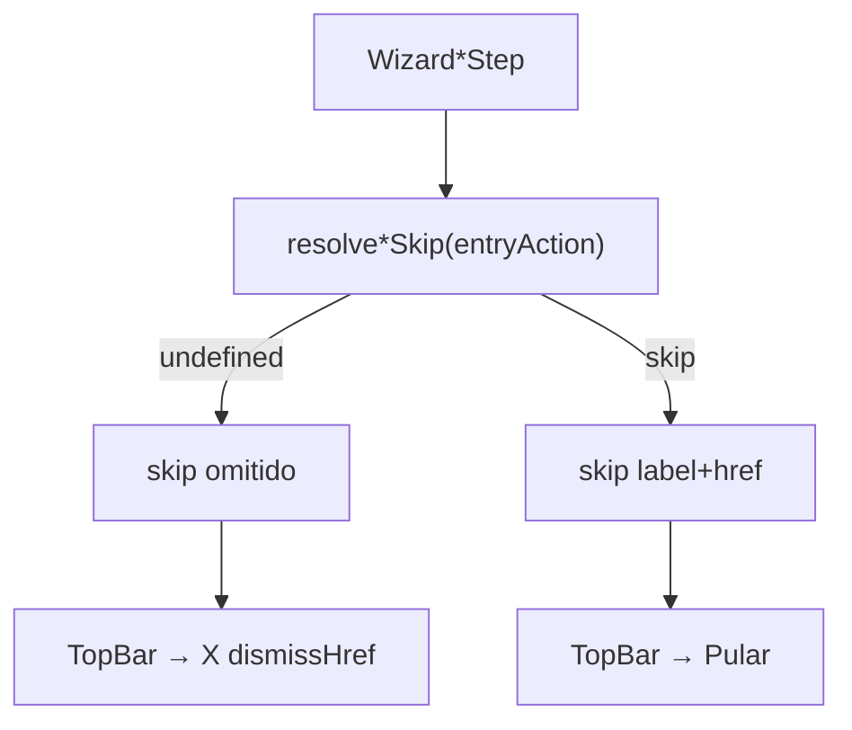

# Header do wizard — X na config principal, “Pular” só nas encadeadas

Status: rascunho
Atualizado em: 2026-08-01
Issue: —
Priority: P1
Model: composer-2.5
Impeccable: B — chrome direito do `CampaignMobileTopBar` / prop `skip` do shell
Appetite: ~0,5–1d eng; alinhar resolvers de skip (tendência + parity sinal/liderança); sem migration
Responsável: —

## Design (Impeccable)

Âncoras: `PRODUCT.md` / `DESIGN.md` · B75 header Mandate Red · tema `campaign`.

Na implementação: craft compacto → critique → polish.

Brief compacto:

- **Persona:** CG/assessor no meio do ritual; acabou de escolher o município.
- **Job principal:** sair da ação **sem** executar a config principal = **X**; pular um ajuste **opcional** depois da principal = **“Pular …”**.
- **Estratégia de cor:** inalterada (ghost no header vermelho).
- **Edit where you see:** não — chrome.
- **Anti-goals:** X e Pular juntos; “Pular” quando ainda não houve commit da ação disparada; mudar copy do fluxo no centro do header.

### Wireframe (texto)

```text
Ação disparada = Mudar tendência (standalone)
┌─ header ────────────────────────────────────────────┐
│ [Voltar?]   Mudar tendência · Cairu              [X]│  ← X (ainda sem salvar tendência)
└─────────────────────────────────────────────────────┘

Depois de Ajustar votos (principal OK) → encadeada tendência
┌─ header ────────────────────────────────────────────┐
│ [Voltar]    Mudar tendência · Cairu     [Pular … →] │  ← Pular (votos já gravados)
└─────────────────────────────────────────────────────┘
```

## Dados → decisão → apresentação

Dados: N/A — chrome de fluxo.

## Contexto

**B75 ✓** definiu: slot direito = **X** (`dismissHref`) **exceto** quando `skip` está setado → aí vira “Pular &lt;fluxo&gt;”.

Hoje:

| Fluxo | Skip quando? | Comportamento |
| ----- | ------------ | ------------- |
| Sinal | `entryAction` ≠ `register-signal` | Correto (standalone = X) |
| Liderança | `showLeadershipWizardSkip(entryAction)` | Alinhado ao sinal |
| **Tendência** | `resolveWizardTrendSkip()` **sempre** | **Errado** — standalone mostra “Pular mudança de tendência →” |

Pedido de produto (2026-08-01): na **primeira configuração** da ação disparada (após município), o direito é **X** (sair sem executar a config principal). Configurações **encadeadas** (após a principal concluída) recebem **“Pular”**. Vale para **todos** os fluxos até a principal fechar.

## Objetivos

- `resolveWizardTrendSkip(entryAction)` espelha o sinal: **só** retorna skip quando a tendência é encadeada (`entryAction` presente e ≠ `change-trend`); standalone → `undefined` → header mostra X.
- Auditar votos / demanda / stubs: main config **sem** `skip` até B98 passar `entryAction` nas encadeadas.
- Unit: tendência standalone = sem skip; com `entryAction: 'update-votes'` = skip label + href.
- Guardrails: sem migration; dismiss continua Início; não inventar segundo botão.

## Decisões travadas

- **Regra canônica: skip iff o passo atual é subfluxo encadeado (origem ≠ ação dona do passo).** Fonte: produto 2026-08-01 + B75 + precedente B63 sinal. **Rejeitado:** skip sempre na tendência (B64 as-written — supersedido); X+Pular juntos.
- **Corrigir tendência agora; wiring de cadeia completa = B98.** Este item só alinha o chrome quando `entryAction` já existe (sinal/liderança/tendência embutidos). **Rejeitado:** implementar toda a matriz de encadeamento aqui (explode appetite).
- **Label de skip permanece específica do subfluxo** (“Pular mudança de tendência →”, etc.). **Rejeitado:** “Pular” genérico sem nome (B75 pede nome do fluxo).
- **i18n:** `entryAction`, `resolveWizardTrendSkip`; copy existente.

## Questões em aberto

- **Href do skip encadeado: Início vs próximo da cadeia?** **Opções:** A Início (hoje) | B próximo passo / fim da cadeia (B98). **Recomendação:** **A neste item**; B98 redefine o destino do Pular quando houver fila. _(assumido)_

## Abordagem proposta



Componentes:

- **`src/lib/politicalTrendWizardUi.ts`**: `resolveWizardTrendSkip(entryAction?)` no padrão de `resolveWizardSignalSkip`; `shouldShowWizardTrendSkip`.
- **`WizardTrendChoiceStep` / `WizardTrendNoteStep`**: passar `entryAction` ao resolver; `trailingAction` só se skip.
- **Parity check** em `wizardSignalUi` / leadership skip helpers (já ok) — pin unit compartilhado se extrair predicado `isChainedWizardStep(entry, owner)` com 3º call site; senão duplicar o predicado de uma linha.
- **Migration:** Sem migration.

## Dependências

- Soft: B75 ✓, B63/B64/B70. Dura para ver Pular “de verdade” após votos: **B98**.
- Não bloqueia **B97** (fechar no Salvar).

## Não escopo

- Orquestrar cadeia de passos → **B98**.
- Fechar wizard no Salvar da tendência → **B97**.
- Skip no desktop no header vermelho (já adiado em B75).

## Rabbit holes

- **State machine global de “fase principal vs encadeada”.** **Mitigação:** `entryAction` query já é o sinal; B98 só popula.
- **Renomear todos os labels de Pular.** **Mitigação:** fora.

## Adiado com gatilho

- **Destino do Pular = próximo da fila.** Revisitar em **B98**.

## Referências

- `src/lib/politicalTrendWizardUi.ts` · `src/lib/wizardSignalUi.ts`
- `src/components/campaign/municipality/WizardTrendChoiceStep.tsx` / `WizardTrendNoteStep.tsx`
- `src/components/campaign/shell/CampaignMobileTopBar.tsx`
- [header-mobile-wizard-campanha.md](header-mobile-wizard-campanha.md) (B75) · [wizard-mudar-tendencia.md](wizard-mudar-tendencia.md) (B64 — skip sempre, supersedido aqui)
- `PRODUCT.md` / `DESIGN.md`

Qualidade de decisão: 5/5
