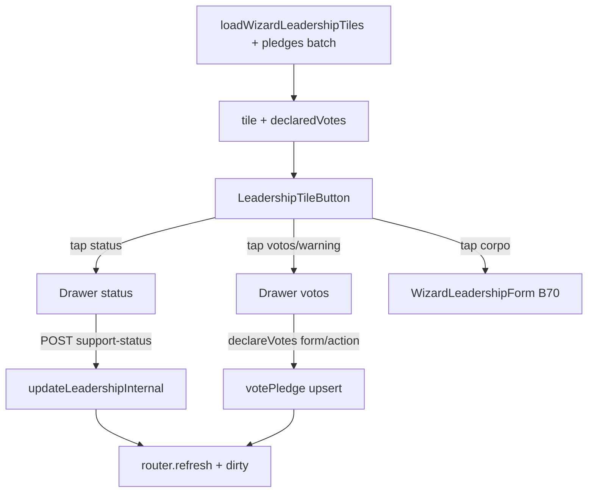

# Wizard atualizar liderança — edição rápida (status + votos declarados)

Status: registrado
Atualizado em: 2026-08-01
Issue: #209
Priority: P1
Model: composer-2.5
Impeccable: C — drawers de edição rápida nos tiles do grid B70 (`WizardLeadershipStep`)
Appetite: ~1–1,25 dia eng; estender VM/loader + 2 drawers no grid; reusar `support-status` + `declareVotes`; sem migration
Responsável: —

## Premissas

1. Superfície = **grid** do wizard “Atualizar liderança” (`/campanha/acoes/atualizar-lideranca` e embutido na cadeia A1) — não a lista `/campanha/liderancas` nem o dossiê do município.
2. Votos = `declaredVotes` do `votePledge` **liderança × município corrente** do wizard. **Estimativa nunca** neste fluxo (assimétrico staff/liderança).
3. Clique no chip de status ou no bloco de votos **abre só o drawer** — não o formulário completo do tile. Toque no corpo do tile (nome/contato) continua abrindo o form curto B70.
4. Staff-only (já é o wizard); access e actions existentes; sem Consent novo.
5. Drawer em **todos** os viewports do wizard (ritual mobile-first; sem variante Popover desktop neste item). _(assumido)_
6. `declaredVotes === 0` **ou** ausência de pledge → leitura `0` + chip amarelo “Declarar votos”. _(assumido — validar com produto se “sem pledge” deve diferir de “declarou 0”)_
→ Corrija no gate ou o implementador segue com estas.

## Design (Impeccable)

Âncoras: `PRODUCT.md` (Edit where you see; Auto-save; Feel the action; Clarity under pressure) / `DESIGN.md` · tema `data-theme='campaign'` · `Drawer` shadcn · `SupportStatusBadge` · B32 lista · B70 grid · `DeclareVotesForm` (precedente de copy/campos).

Na implementação (`work-issue`): shape compacto → craft → critique → polish.

Brief compacto:

- **Persona / contexto:** CG/assessor no polegar, pacote de município; veio de “Atualizar liderança”; precisa marcar status e declarar votos **sem** abrir a ficha completa para cada pessoa.
- **Job principal:** no grid, corrigir status e votos declarados da cidade atual com um toque + drawer curto, e seguir.
- **Estratégia de cor:** Restrained — badge de status existente; chip “Declarar votos” = **único** amarelo/warning (alerta de lacuna, não decoração).
- **Edit where you see:** sim — affordance no chip/número do card; writes reusam actions/routes já existentes.
- **Anti-goals:** spreadsheet no grid; segundo form longo; mostrar `estimatedVotes`; Popover desktop paralelo; abrir `/liderancas/[id]`; Salvar no drawer de status (opções discretas = auto-save).

### Wireframe (texto)

```text
┌─ Wizard · Atualizar liderança · <Município> ─────────┐
│ ┌─ tile ─────────────┐  ┌─ tile ─────────────┐       │
│ │ [Engajado]     (i) │  │ [A abordar]    (i) │       │
│ │                    │  │                    │       │
│ │ Maria Silva        │  │ João Santos        │       │
│ │ 120                │  │ [⚠ Declarar votos] │       │
│ │ 71 9…              │  │ 71 9…              │       │
│ └────────────────────┘  └────────────────────┘       │
│ ┌─ Adicionar ────────┐                               │
│ │        +           │                               │
│ └────────────────────┘                               │
└──────────────────────────────────────────────────────┘

Drawer status (tap no chip):
┌─ sheet ─────────────────────────────────────────────┐
│ Status de apoio                                     │
│ Maria Silva · Cairu                    ← discreto   │
│ ○ Engajado                                          │
│ ● A abordar          ← atual                        │
│ ○ Em disputa                                        │
│ ○ Negativo                                          │
│ (tap = grava + fecha; pending no item)              │
└─────────────────────────────────────────────────────┘

Drawer votos (tap no nº / warning):
┌─ sheet ─────────────────────────────────────────────┐
│ Votos declarados                                    │
│ Maria Silva · Cairu                    ← discreto   │
│ [ 120          ]  (inputMode numeric)               │
│              [ Salvar ]                             │
└─────────────────────────────────────────────────────┘
```

Fora do frame: chrome B59/B114 do wizard; form completo do tile inalterado; Continuar dirty no canto.

## Dados → decisão → apresentação

- **Vou apresentar dados?** Sim, superfície neste item — `declaredVotes` por tile (liderança × município do passo).
- **Decisões desbloqueadas:**
  - Staff: “esta liderança já tem votos declarados nesta cidade — preciso declarar agora?”
  - Staff: “qual o número a registrar / corrigir sem abrir a ficha?”
- **Forma escolhida:** **número + contexto** (inteiro abaixo do nome) + chip warning quando `0`. **Rejeitado:** KPI strip; % da meta estadual; sparkline; estimativa ao lado.
- **Profile:** 1 inteiro absoluto por tile; N típico ≪ 20; granularidade liderança×município.
- **Anti-goals de dado:** sem `estimatedVotes`; sem % estadual; sem vanity de contagem de tiles.

## Contexto

B70 ([wizard-atualizar-lideranca.md](wizard-atualizar-lideranca.md), entregue) entregou grid + form curto e **adiou** explicitamente “Ramo anotar votos declarados” e pledge no ritual. B32 ([autosave-status-lista-liderancas.md](autosave-status-lista-liderancas.md)) já faz auto-save de status na **lista** (Popover), não no wizard.

Pedido de produto (2026-08-01): no mobile, nos **cards** do wizard de atualizar liderança:

1. Chip de status → drawer com opções + atual selecionada; topo discreto com liderança + cidade.
2. Abaixo do nome → votos declarados da cidade selecionada; se 0, chip amarelo com warning “Declarar votos”; toque no número ou no warning → drawer com input.

Estado atual: `WizardLeadershipStep` / `LeadershipTileButton` (`src/components/campaign/leadership/WizardLeadershipStep.tsx`) — badge de status **só leitura** dentro do botão do tile; VM sem votos (`wizardLeadershipContract.ts`); loader `loadWizardLeadershipTiles` sem join em `votePledge`. Writes prontas: `POST /campanha/liderancas/support-status` + `declareVotes` / `declareVotesFormAction`.

## Objetivos (critérios de aceite)

- [ ] Toque no chip de status do tile abre Drawer (não o form); lista as 4 opções de `leadershipSupportStatuses` com a atual marcada; trocar grava (auto-save) com pending/erro; topo discreto `{nome} · {município}`.
- [ ] Abaixo do nome: número de `declaredVotes` da liderança×município do wizard; se `0` (sem pledge ou declarado 0), chip amarelo com ícone warning + “Declarar votos”.
- [ ] Toque no número ou no chip warning abre Drawer com input numérico pré-preenchido; Salvar chama `declareVotes`; pending/erro honestos; mesmo topo discreto.
- [ ] Toques nesses controles **não** abrem o form completo; corpo do tile (nome/área neutra) e “Adicionar” seguem B70.
- [ ] Após gravação bem-sucedida de status ou votos, o tile reflete o valor e o grid marca **dirty** (Continuar aparece como após Salvar do form).
- [ ] Loader inclui `declaredVotes` no VM (batch de pledges do município; ausente → `0`). Sem `estimatedVotes` no contrato.
- Guardrails: sem migration; sem Consent; `overrideAccess: false` com `user` nas queries; staff-only; líder não vê esta superfície.

## Boundaries (desta entrega)

- **Always:** reusar `declareVotes` / route `support-status` (ou thin wrappers); queries com `user` + `overrideAccess: false`; pin unit do mapeamento tile↔pledge e do stop de navegação tile→form; Feel the action nos drawers.
- **Ask first:** endpoint JSON novo se o route de status não couber no wizard; mudar semântica de dirty/Continuar além do descrito.
- **Never:** expor estimativa; Consent/PII novo; Neon; `as never`; abstrair “QuickEditTile” genérico (&lt;3 call sites).

## Decisões travadas

- **Drawers no grid do wizard (não Popover B32; não form completo).** Mobile-first; um par de drawers no nível do step (como o Drawer de notes), não N mounts por tile. **Rejeitado:** só Popover (pedido = drawer); abrir `WizardLeadershipForm` só para status/votos (atrito); reusar `CampaignCellEditOverlay` + list sheet provider (superfície errada).
- **Status = auto-save no tap da opção; votos = Salvar explícito no drawer.** Opções discretas espelham B32; número + teclado virtual pede commit deliberado (e create-or-update de pledge). **Rejeitado:** Salvar no status; auto-save a cada keystroke nos votos; debounce sem CTA no drawer de votos.
- **Estender `WizardLeadershipTileViewModel` com `declaredVotes: number` (0 se sem pledge).** Batch load no `loadWizardLeadershipTiles`. **Rejeitado:** fetch client por tile; segundo loader paralelo na page; nullable `null` vs `0` na UI v1 (unificar em 0 + warning).
- **Clicks de status/votos como siblings com `stopPropagation` (padrão do botão info).** **Rejeitado:** nestar controles dentro do `<button>` do tile sem stop (abre form); tornar o tile inteiro não-navegável.
- **i18n:** ids `declaredVotes`, `WizardLeadershipStatusDrawer`, `WizardLeadershipVotesDrawer`; copy pt-BR (“Declarar votos”, “Votos declarados”, “Status de apoio”).

## Questões em aberto

- **Ausência de pledge vs declarado 0 — mesmo chip?** **Opções:** A unificar em 0 + warning (simples) | B copy “Sem declaração” vs “0 votos”. **Recomendação:** A neste item; B só se a mesa pedir. _(assumido — validar com produto)_
- **Fechar o drawer de status após gravar?** **Opções:** A fecha ao confirmar | B permanece aberto. **Recomendação:** A — um campo, um toque, seguir o grid.
- **Desktop no wizard: Drawer ou Popover?** **Opções:** A Drawer sempre | B Popover em `md+`. **Recomendação:** A — um chrome; wizard é ritual de campo.

## Abordagem proposta



Componentes:

- **`WizardLeadershipTileViewModel`** (`src/lib/wizardLeadershipContract.ts`): + `declaredVotes: number`.
- **`loadWizardLeadershipTiles`** (`src/utilities/leadership/leadershipData.ts`): após docs de leadership, `payload.find` em `votePledge` filtrado por `municipality` + `leadership in ids`, `user`/`overrideAccess: false`, mapear para o VM (ausente → 0).
- **`WizardLeadershipStep`**: estado `statusTile` / `votesTile` (ou um discriminated union); dois Drawers; `onStatusSaved` / `onVotesSaved` → `setDirty(true)` + `router.refresh()`; passar `municipalityName` / id aos tiles.
- **`LeadershipTileButton`**: chip status clicável (stopPropagation); bloco votos/warning clicável; corpo abre form.
- **Writes:** reusar `POST /campanha/liderancas/support-status` (fetch no client como B32) **ou** thin form action wizard se preferir `useActionState` — preferir o endpoint já pinado. Votos: casca `declareVotes` em `wizardLeadershipFormActions.ts` (revalidate path do wizard / refresh client) — **não** depender só de `revalidatePath` do dossiê município.
- **Copy:** constantes em `campaignWizardCopy.ts`.
- **Migration:** Sem migration, sem collection, sem Consent.
- **Docs de framework:** na implementação, confirmar contrato Local API `find`/`update` do Payload na versão de `package.json` se tocar access do route (já existente).

## Fases verificáveis

### Fase 1 — Tracer: status chip → drawer → save

- **Quota:** ~0,4d
- **Entrega:** chip clicável + Drawer de opções + POST support-status + dirty + refresh; stopPropagation.
- **Aceite:**
  - [ ] Tap status abre drawer com atual marcada; tap outra opção grava e atualiza o badge.
  - [ ] Tap status não abre o form; topo mostra liderança · município.
- **Verify:** `pnpm gate:fast`; unit/smoke do handler de open vs form; check manual no wizard.
- **Files:** `WizardLeadershipStep.tsx`, copy, talvez thin client control; `tests/unit/…`
- **Tamanho:** M

### Fase 2 — Votos no VM + readout/warning + drawer

- **Quota:** ~0,5d
- **Entrega:** batch pledges no loader; número / chip warning; Drawer input + `declareVotes`; dirty.
- **Aceite:**
  - [ ] Tile com pledge &gt; 0 mostra o número; 0/ausente mostra warning.
  - [ ] Salvar no drawer persiste e o tile atualiza após refresh.
- **Verify:** `pnpm gate:fast`; unit do merge pledge→tile; int opcional se já houver fixture de pledge.
- **Files:** `wizardLeadershipContract.ts`, `leadershipData.ts`, step/tile, form action wizard, tests.
- **Tamanho:** M

### Fase 3 — Polish de feedback e a11y

- **Quota:** ~0,25d
- **Entrega:** pending/erro nos drawers; `aria-label`s; foco inicial no título do drawer / input de votos; critique curto.
- **Aceite:**
  - [ ] Erro de rede/access não fecha mentindo sucesso; live region ou Alert no drawer.
- **Verify:** `pnpm gate:fast`; check manual teclado/virtual.
- **Files:** mesmos do step + copy.
- **Tamanho:** S

### Checkpoint

- [ ] Aceites F1–F3; Continuar dirty após status **ou** votos; sem estimativa no contrato; sistema verde.

## Dependências

- Dura de código: B70 ✓ (grid), B32 ✓ (endpoint status), `declareVotes` ✓.
- Nenhuma Issue aberta bloqueante. Soft: B114/B113 chrome mobile do wizard (já no main ou paralelo — não bloqueia).

## Não escopo

- Edição rápida de status/votos na lista `/liderancas` além do B32 (status já existe; votos na lista → outro item se pedido).
- Estimativa / cenários no wizard → B61/B77 família `atualizar-votos`.
- Form completo B70 (nome/celular/e-mail/exclusive/notes) — permanece.
- Busca/filtro no grid (adiado B70).
- Extrair tile genérico compartilhado.

## Rabbit holes

- **Quick-edit framework / `EditableTile` genérico.** **Mitigação:** controles nomeados no step; 3º call site = gatilho.
- **Optimistic multi-tile sem refresh.** **Mitigação:** optimistic só no controle do drawer; grid reconcilia com `router.refresh`.
- **Distinção rica null vs 0 + histórico de pledge.** **Mitigação:** unificar em 0; Adiado.
- **Reusar `DeclareVotesForm` inteiro no drawer.** **Mitigação:** ok se couber sem chrome duplicado; senão input mínimo + mesma action — não forçar DRY &lt;3.

## Adiado com gatilho

- **Copy distinta “Sem declaração” vs “0”.** Revisitar se a mesa confundir warning em quem declarou zero de propósito.
- **Popover `md+` no wizard.** Revisitar se desktop do ritual virar uso diário de mesa (hoje mobile-first).
- **Edição rápida de votos na lista de lideranças / dossiê.** Revisitar com pedido explícito (painel município já tem `DeclareVotesForm`).

## Referências

- GitHub Issue #209 (spec + frontmatter `id/depends/serializes/priority/model`)
- [wizard-atualizar-lideranca.md](wizard-atualizar-lideranca.md) (B70 — adiados que este item cumpre)
- [autosave-status-lista-liderancas.md](autosave-status-lista-liderancas.md) (B32 — endpoint status)
- `src/components/campaign/leadership/WizardLeadershipStep.tsx`
- `src/lib/wizardLeadershipContract.ts`
- `src/utilities/leadership/leadershipData.ts` (`loadWizardLeadershipTiles`)
- `src/app/(campaign)/campanha/(app)/liderancas/support-status/route.ts`
- `src/app/(campaign)/campanha/actions/votePledge.ts` (`declareVotes`)
- `src/components/campaign/votePledge/DeclareVotesForm.tsx`
- AGENTS.md — overrideAccess; pledge assimetria; Feel the action
- `PRODUCT.md` — Edit where you see / Auto-save
