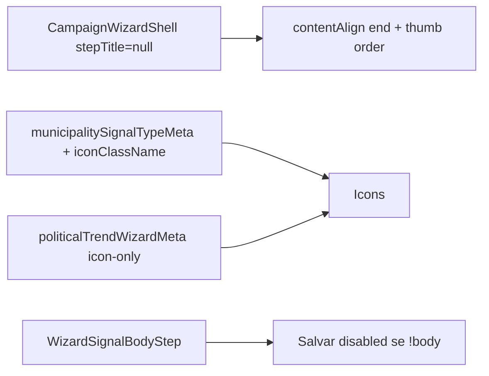

# Wizard mobile — zona do dedão, títulos e cores nos ícones

Status: registrado
Atualizado em: 2026-08-01
Issue: #194
Priority: P1
Model: composer-2.5
Impeccable: C — passos dos wizards `/campanha/acoes/*` (sinal, tendência, votos, liderança)
Appetite: ~1–1,5d eng; layout thumb-zone + copy/títulos + cores de ícone; sem migration
Responsável: —

## Premissas

1. Escopo = **UI dos passos** listados abaixo; **não** o sistema de Voltar/Android back (→ **B114**).
2. “Baixo→cima e direita→esquerda” = zona do **dedão direito**: opções primárias no canto inferior direito; grid preenche a partir daí (`contentAlign="end"` + ordem visual RTL/col-reverse — craft escolhe o CSS estável).
3. Cores de sinal/tendência aplicam-se **só aos ícones**, não ao fill/borda colorida do tile inteiro.
4. Card “Atual” na tendência ocupa **2 colunas** do grid (equivalente a dois quadrados) + chip “Atual”.
5. Bullets na liderança = `list-style` default do `<ul>` sem `list-none` (já corrigido nos grids de sinal/tendência).
→ Corrija no gate ou o implementador segue com estas.

## Design (Impeccable)

Âncoras: `PRODUCT.md` (Clarity under pressure; Feel the action) / `DESIGN.md` · B59/B63/B64/B70 · tema `campaign`.

Na implementação (`work-issue`): craft → critique → polish (viewport ~390, polegar direito).

Brief compacto:

- **Persona / contexto:** assessor no celular com uma mão (direita); ritual de ação no wizard.
- **Job principal:** escolher tipo/tendência/liderança sem esticar o polegar; reconhecer tipo pela cor do ícone; menos chrome de título.
- **Estratégia de cor:** Restrained no tile; **exceção justificada** — cor semântica **só no ícone** (ameaça/frio/oportunidade/…), contraste AA no ícone vs fundo.
- **Edit where you see:** não — fluxo linear do wizard.
- **Anti-goals:** tile rainbow; redesenhar desktop; stack de navegação (B114); spreadsheet.

### Wireframe (texto)

**Registrar sinal — tipo (mobile):**

```text
┌─ header vermelho (fluxo) ──────────────────────┐
│ [Voltar]     Registrar sinal      [X]          │
├─ main (sem h1; pt curto) ──────────────────────┤
│                                                │
│           [outro] [broker]                     │
│     [visita] [esfria] [invasão]  ← ícones      │
│                         ↑ zona dedão           │
└────────────────────────────────────────────────┘
```

**Tendência — escolha:**

```text
┌─ main ─────────────────────────────────────────┐
│ ┌─ card 2 colunas ──────────────┐ [chip Atual] │
│ │ ícone + label tendência atual │              │
│ └───────────────────────────────┘              │
│                                                │
│              [opt] [opt]   ← sem título h1     │
│                    ↑ dedão                     │
└────────────────────────────────────────────────┘
```

**Sinal — detalhar:** textarea + Salvar (disabled visual até body não-vazio).  
**Votos:** sem `stepTitle` “Ajustar votos estimados”.  
**Liderança grid:** sem título “Quem coordena…”; `list-none`; thumb-zone.

## Dados → decisão → apresentação

Dados: N/A — metadados de enum já existentes; sem KPI novo.

## Contexto

Wizards B63/B64/B70+ usam `CampaignWizardShell` com `stepTitle` + grids `aspect-square`. Pedido de produto (2026-08-01): densificar o mobile para o polegar, remover títulos redundantes (o fluxo já está no header vermelho B75), e usar cor só no ícone.

Estado atual relevante:

- Sinal tipo: `stepTitle={WIZARD_SIGNAL_TYPE_STEP_TITLE}`, `contentAlign="end"`, ícones `text-foreground`, sem cor por tipo.
- Sinal body: título “Detalhar sinal: …”; Salvar `disabled` só em `isPending` (HTML `required` bloqueia submit, mas o botão **parece** ativo).
- Tendência: `tileClassName` colore borda/texto do tile inteiro; título via `wizardTrendChoiceStepTitle`.
- Votos: `stepTitle={wizardNextStepTitle}` → “Ajustar votos estimados”.
- Liderança: `WIZARD_LEADERSHIP_GRID_TITLE`; `<ul>` **sem** `list-none`.

## Objetivos (critérios de aceite)

### Registrar sinal

- [ ] Passo tipo: **sem** `stepTitle`; espaçamento de header reduzido (`pt` curto do shell sem título).
- [ ] Grid alinhado à zona do dedão (baixo→cima, dir→esq).
- [ ] Cor **somente no ícone** por tipo (ver Decisões); tile neutro.
- [ ] Passo detalhar: sem título; Salvar com aspecto **disabled** até `body` trim não-vazio (e pending).

### Mudar tendência

- [ ] Sem título de passo; no lugar, card 2-colunas do status atual + chip “Atual” (omitir card se `currentStatus == null`).
- [ ] Opções de mudança na zona do dedão; cor **só no ícone** (remover colorização de borda/texto do tile).

### Ajustar votos

- [ ] Sem `stepTitle` “Ajustar votos estimados” (fluxo continua no header).

### Atualizar liderança (UI)

- [ ] Sem bullets no grid (`list-none` / role list sem marcadores).
- [ ] Sem título “Quem coordena por aqui?”; pt curto; grid na zona do dedão.
- Guardrails: sem migration / Consent; access intacto; Android back da form → **B114** (não neste item).

## Boundaries (desta entrega)

- **Always:** contraste AA nos ícones coloridos; `list-none` nos grids de tiles; pin unit das classes/meta de cor se extrair helper puro.
- **Ask first:** mudar tokens de tema globais além das classes de ícone.
- **Never:** Neon; alterar `previousHref` / history (B114); Consent.

## Decisões travadas

- **Thumb-zone = ordem visual a partir do canto inferior direito no mobile; desktop mantém leitura LTR/top.** **Rejeitado:** só `justify-end` sem reordenar; espelhar desktop.
- **Cores de sinal (ícone only) — mapa sentimento × intenção (produto 2026-08-01):**

  | Tipo | Sentimento | Cor (token/classe craft) |
  | ---- | ---------- | ------------------------ |
  | `invasao` | ameaça / urgência | destructive / vermelho |
  | `esfriamento` | frio / retração | azul/ciano muted (`text-sky-…` ou token se existir) |
  | `visita_adversario` | cautela / adversário | âmbar/laranja |
  | `proposta_broker` | oportunidade / troca | verde/teal (positivo controlado) |
  | `outro` | neutro | `text-muted-foreground` |

  **Rejeitado:** colorir o tile inteiro; inventar 5 fills saturados de fundo.
- **Tendência:** reusar semântica atual (`favoravel` verde, `neutra` neutro, `desfavoravel` destructive) **só no ícone**; tile `border-border` + texto foreground. **Rejeitado:** manter `tileClassName` no container.
- **Card “Atual”:** substitui o título; 2 colunas; chip “Atual”. **Rejeitado:** título + card; chip sem card.
- **Salvar sinal:** disabled visual + `disabled` real enquanto body vazio. **Rejeitado:** só `required` HTML com botão “ativo”.
- **i18n:** ids `iconClassName` / `currentTrendCard`; copy “Atual” pt-BR.

## Questões em aberto

- **Ordem dos tipos de sinal na zona do dedão?** **Opções:** A) ordem do catálogo atual, só espelhada | B) priorizar `invasao`/`esfriamento` no canto do dedão. **Recomendação:** **B** — urgência mais alcançável. _(assumido — validar com produto)_
- **Card Atual clicável?** **Opções:** A) só readout | B) abre info drawer. **Recomendação:** **A**.

## Abordagem proposta



Componentes:

- **`municipalitySignalTypeMeta.ts`:** campo `iconClassName` (ou mapa paralelo puro).
- **`politicalTrendWizardMeta.ts`:** separar `iconClassName` de `tileClassName` (tile neutro).
- **`WizardSignalTypeStep` / `WizardTrendChoiceStep` / `WizardLeadershipStep`:** sem título; layout thumb; `list-none`.
- **`WizardTrendChoiceStep`:** card atual 2-col + chip.
- **`WizardSignalBodyStep`:** controlled/uncontrolled body length → Salvar disabled; `stepTitle` null.
- **`WizardExpectedVotesStep` + `wizardNextStepTitle`:** não passar título neste passo (ou `stepTitle={null}`).
- **Helper CSS opcional** `wizardThumbTileGrid` se 3+ call sites — senão classes repetidas até o 3º.
- **Migration:** Sem migration.

## Fases verificáveis

### Fase 1 — Tracer: sinal tipo (título off + thumb + ícone cor)

- **Quota:** ~0,35d
- **Entrega:** um passo ponta a ponta com o padrão visual.
- **Aceite:**
  - [ ] Sem h1; ícones coloridos; zona dedão no mobile.
- **Verify:** `pnpm gate:fast` + check manual ~390px
- **Files:** meta + `WizardSignalTypeStep` + shell spacing
- **Tamanho:** M

### Fase 2 — Sinal body + tendência + votos + liderança UI

- **Quota:** ~0,75–1d
- **Entrega:** restantes aceites desta Issue.
- **Aceite:**
  - [ ] Checklist Objetivos completo (exceto Android back).
- **Verify:** `pnpm gate:fast` + unit meta cores se houver
- **Files:** steps listados
- **Tamanho:** M

### Checkpoint

- [ ] Critique mobile: contraste ícones; Salvar disabled; card Atual.

## Dependências

- Soft: B63/B64/B70 ✓, B75 chrome.
- Soft: **B114** para Android back da form de liderança (não bloqueia UI).

## Não escopo

- Voltar header / Android back / history stack → **B114**.
- Drawer bottom → **B112**.
- Encadear ações / Pular → já B96/B98/B104.

## Rabbit holes

- **Design system de “semantic icon colors” repo-wide.** **Mitigação:** mapas só nos metas de wizard.
- **Reordenar catálogo de sinais no schema.** **Mitigação:** só ordem de render no passo.

## Adiado com gatilho

- **Mesmo thumb-grid no desktop.** Revisitar se mesa pedir paridade.

## Referências

- GitHub Issue #194 (spec + frontmatter `id/depends/serializes/priority/model`)
- [`WizardSignalTypeStep.tsx`](../../src/components/campaign/municipality/WizardSignalTypeStep.tsx)
- [`WizardSignalBodyStep.tsx`](../../src/components/campaign/municipality/WizardSignalBodyStep.tsx)
- [`WizardTrendChoiceStep.tsx`](../../src/components/campaign/municipality/WizardTrendChoiceStep.tsx)
- [`WizardExpectedVotesStep.tsx`](../../src/components/campaign/shared/WizardExpectedVotesStep.tsx)
- [`WizardLeadershipStep.tsx`](../../src/components/campaign/leadership/WizardLeadershipStep.tsx)
- [`CampaignWizardShell.tsx`](../../src/components/campaign/shared/CampaignWizardShell.tsx)
- `docs/plans/wizard-registro-sinal.md` · `wizard-mudar-tendencia.md` · `wizard-atualizar-lideranca.md`
- AGENTS.md — naming pt-BR/en
- `PRODUCT.md` / `DESIGN.md`
