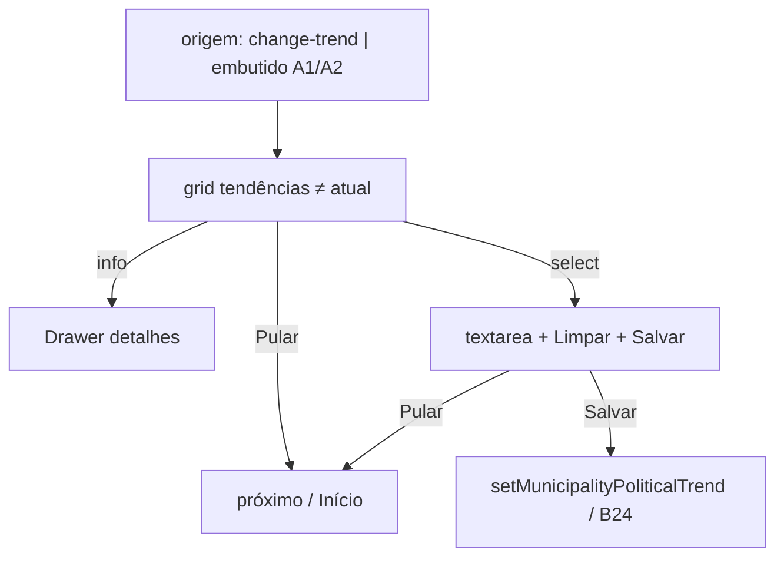

# Wizard mudar tendência — escolher destino + justificativa

Status: entregue (2026-07-30)
Atualizado em: 2026-07-30
Item do roadmap: [docs/roadmap.md](../roadmap.md) (Trilha B, item B64 — UX-1 wizards)
Impeccable: C — UI nova (grid de tendências coloridas + Drawer de info + passo de justificativa)
Appetite: ~1–1,25 dia eng; 2 etapas no B59; write via `POST /campanha/municipios/political-trend` / action B24 ✓
Responsável: —

## Design (Impeccable)

Âncoras: `PRODUCT.md` / `DESIGN.md` · `Drawer` shadcn · tema `campaign` · badges `politicalTrendBadgeVariant` / tokens `estimate-confirmed` · sibling visual **B63**.

Na implementação: shape → craft → critique → polish.

Brief compacto:

- **Persona:** CG/assessor no polegar; acabou de registrar sinal ou ajustar votos e precisa fechar a leitura de tendência — ou veio direto do botão “Mudar tendência” do Início.
- **Job principal:** escolher a **nova** tendência (não a atual) em 1 toque, justificar o porquê (pré-preenchido quando veio de outro fluxo), ou pular a mudança sem travar o fluxo pai.
- **Estratégia de cor:** tiles com **fundo branco** + borda/ícone/título na cor da tendência (favorável → verde `estimate-confirmed-foreground`; neutra → neutro/`secondary`; desfavorável → `destructive`). Diferente do B63 (transparente + borda cinza): aqui a cor **é** o significado.
- **Edit where you see:** não — fluxo com **Salvar** explícito no passo de justificativa (exceção de nota/confirmação).
- **Anti-goals:** select nativo; oferecer a tendência atual como opção; auto-save silencioso estilo B24 neste wizard; cards elevados / Signal Red decorativo no idle; forçar mudança quando o fluxo veio de votos/sinal.

## Dados → decisão → apresentação

Dados: N/A como métrica — status categórico + texto livre. Decisão = mover a tendência política do município e gravar o porquê, ou pular.

## Contexto

Ação **A3** do Início ([fluxos-acao-primeiro-inicio.md](fluxos-acao-primeiro-inicio.md)) e passo “Quer mudar a tendência?” embutido em A1. Catálogo B45 ✓ já tem `change-trend`. Escrita já existe (**B24 ✓**): `MunicipalityListTrendControl` → `POST /campanha/municipios/political-trend` + `municipalityPoliticalTrendSchema` (`status` + `note`).

Pedido (2026-07-29):

**Etapa 1 — escolher tendência**

- Título da tela = estado atual, ex. **“Tendência Favorável”** (se `status` nulo: **“Tendência não registrada”**).
- Botões = mesmo chassis de tile do **B63** (quadrado grande, cantos arredondados, ícone canto superior esquerdo, **Info** canto superior direito → bottom Drawer), mas:
  - fundo **branco**;
  - cor e borda relativas à tendência alvo;
  - título = label (`Favorável` / `Neutra` / `Desfavorável`);
  - descrição abaixo do título = **“Mudar tendência para X”** (X = mesmo label).
- Mostrar **apenas** tendências **≠ atual** (se atual nula, mostrar as três).
- Topo direito: **“Pular mudança de tendência →”** (sempre — nas duas etapas).

**Etapa 2 — justificativa**

- Textarea; se o wizard veio embutido de outro fluxo, **pré-preencher** a nota, ex.:
  - `"Sinal de invasão: <descrição do sinal>"`
  - `"Ajuste de votos: <valor anterior> → <novo valor>"`
  - (outros orquestradores: mesma fábrica de string)
- Botão **“Limpar”** zera o texto de uma vez.
- Botão **“Salvar”** grava a mudança (status escolhido + nota).
- “Pular mudança de tendência →” permanece no topo direito.

Município: já escolhido (**B60**) ou pré-preenchido se veio embutido de A1/A2.

## Objetivos

- Duas telas/passos no shell **B59**: `WizardTrendChoiceStep` + `WizardTrendNoteStep`.
- Catálogo de tiles: mapear `politicalTrendStatuses` → ícone Lucide + label (`politicalTrendLabels`) + `infoContent` (o que significa / quando usar) + classes de borda/texto por status.
- Info: botão `Info` com `stopPropagation` (não seleciona a tendência).
- Select de tendência = avança para o passo de nota (sem CTA intermediário).
- Skip: trailing do B59 → próximo bloco do fluxo pai ou Início; **sempre visível** (diferente do B63, que esconde skip no entry `register-signal`).
- Prefill: helper puro client-safe `buildPoliticalTrendNotePrefill(source)` em `lib/` (discriminated union: `signal` | `voteAdjustment` | `custom` | `none`).
- Limpar: `setNote('')` imediato (sem confirm).
- Salvar: reusar `setMunicipalityPoliticalTrend` / endpoint B24 com `overrideAccess: false`; pending no botão (Feel the action); nota **obrigatória** se o status muda (alinhar ao rascunho A3 — “por quê obrigatório se mudou”).
- Sem migration / Consent (campos já existem).
- Unit: filtra tendência atual; prefill templates; Limpar; skip sempre montado; info não seleciona.

## Decisões travadas

- **Duas etapas (escolha → justificativa), um item de roadmap.** **Rejeitado:** IDs separados; quatro passos do rascunho A3 antigo (município = B60; commit = Salvar nesta etapa).
- **Skip sempre visível nas duas etapas.** **Rejeitado:** espelhar regra do B63 (esconder no entry `change-trend`) — aqui “pular” = abandonar a mudança, o que o pedido pede explicitamente também no fluxo standalone.
- **Tiles brancos + cor da tendência**, não transparentes como B63. **Rejeitado:** mesma skin do sinal (perderia o mapeamento visual favorável/desfavorável); fill sólido primary.
- **Só opções ≠ status atual.** **Rejeitado:** listar as três sempre (ruído; “salvar” a mesma tendência).
- **Prefill quando origem ≠ standalone vazio.** **Rejeitado:** sempre textarea vazia (pede re-digitação do contexto que o fluxo pai já tem).
- **Salvar explícito** (não auto-save B24). **Rejeitado:** gravar ao escolher o tile (nota obrigatória).
- **i18n:** `status`, `entryAction`, `skipTrendChange`, `notePrefillSource`; copy “Pular mudança de tendência →” / “Limpar” / “Salvar” / “Tendência {label}”.

## Questões em aberto

- **Extrair tile compartilhado com B63 agora?** **Opções:** A componente compartilhado `WizardChoiceTile` com variant `neutral | trend` | B duplicar leve e extrair no 3º call site. **Recomendação:** B se B63 ainda não landou; A se B63 já estiver no branch — depth check, não classitis. _(assumido)_
- **Após Salvar no standalone A3: Início ou “Ir ao município”?** **Opções:** A Início + toast | B pós-commit padrão UX-1 (Fazer outra / Ir ao município / Início). **Recomendação:** B quando o orquestrador A1/A3 existir; A no tracer deste item. _(assumido)_

## Abordagem proposta

Componentes:

- **`WizardTrendChoiceStep`** + **`WizardTrendNoteStep`** em `components/campaign/municipality/` (ou `shared/` se extrair tile com B63).
- **`politicalTrendWizardMeta`** + **`buildPoliticalTrendNotePrefill`** em `lib/` — client-safe.
- Reuso: `Drawer`, `Button`, `Textarea`, B59 trailing slot + `contentAlign`, labels/`politicalTrendBadgeVariant` tokens, endpoint/action **B24 ✓**.
- **Migration:** Sem migration (campos já existem).

## Dependências

- Dura: **B59**. Soft: **B60** (município no standalone). Soft: **B24 ✓** (write path). Soft: **B61** / **B63** (prefill de votos/sinal quando embutido). Soft: B45 ✓ (`change-trend`).

## Não escopo

- Busca de município → **B60**.
- Wiring “quer também?” / orquestração A1 completa → fatia posterior UX-1.
- Trocar o Popover B24 da lista pelo grid de tiles → Adiado.
- Wizard de liderança (A4) / demanda (A5).

## Rabbit holes

- **Unificar visual B63+B64 num design system de “choice tiles” antes do 2º call site.** **Mitigação:** sibling + extrair só com 2 implementações no branch.
- **CMS / Lexical nos textos de Info.** **Mitigação:** constantes em `lib/` até R6/assessoria.
- **Recalcular sugestões E11 ao salvar tendência.** **Mitigação:** write path atual; E11 reavalia no próximo load.

## Adiado com gatilho

- **Grid de tendência no Popover B24.** Revisitar se o select da lista continuar gerando dúvida de classificação em campo.
- **Copy longa dos Drawers revisada pela assessoria.** Revisitar no R6.
- **Prefills adicionais** (nível E14, troca de assessor). Revisitar quando esses passos embutirem A3.

## Referências

- [fluxos-acao-primeiro-inicio.md](fluxos-acao-primeiro-inicio.md) · [wizard-registro-sinal.md](wizard-registro-sinal.md) · [chassis-wizard-campanha.md](chassis-wizard-campanha.md) · [autosave-tendencia-lista-municipios.md](autosave-tendencia-lista-municipios.md) · [ajuste-votos-wizard.md](ajuste-votos-wizard.md)
- `src/lib/campaignHomeActions.ts` (`change-trend`) · `MunicipalityListTrendControl.tsx` · `municipalityPoliticalTrendSchema` · `politicalTrendLabels` / `politicalTrendBadgeVariant`
- AGENTS.md — Local API `overrideAccess: false`
- `PRODUCT.md` / `DESIGN.md` · Drawer B42/B34 · tokens `estimate-confirmed`
