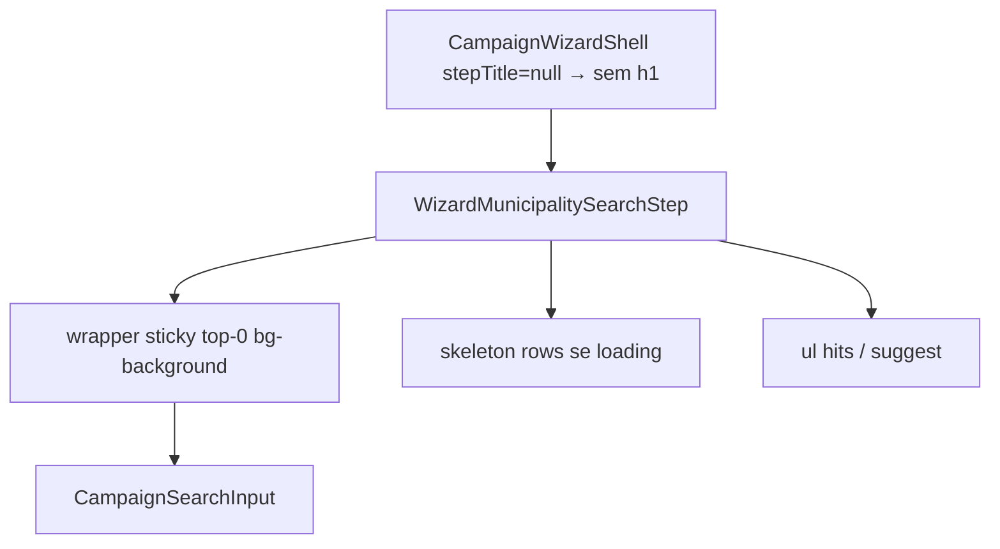

# Wizard município — sem título + busca sticky + skeleton

Status: registrado
Atualizado em: 2026-08-01
Issue: #142
Priority: P1
Model: composer-2.5
Impeccable: B — encaixe em `WizardMunicipalitySearchStep` + `CampaignWizardShell` (título opcional)
Appetite: ~0,5–0,75d eng; markup/CSS + shell opt-out do h1 + skeleton idle; sem migration
Responsável: —

## Design (Impeccable)

Âncoras: `PRODUCT.md` (Clarity under pressure) / `DESIGN.md` · B60/B75/B95 · tema `campaign`.

Na implementação: craft compacto → critique → polish (teclado aberto + lista longa).

Brief compacto:

- **Persona / contexto:** CG/assessor no passo 1 do wizard no celular; o header vermelho já diz o fluxo (“Ajustar votos”); o placeholder é “Nome do município…”.
- **Job principal:** cair direto na busca (sem h1 “Em qual município?”); ao rolar hits, a barra de busca **permanece** logo abaixo do header; enquanto suggest/search carrega, skeleton shimmer na região de resultados.
- **Estratégia de cor:** inalterada; sticky com `bg-background` para não transparizar hits; skeleton `bg-muted` / `animate-pulse`.
- **Edit where you see:** não — layout do passo.
- **Anti-goals:** sticky do header vermelho (já fora do scroll); redesign da hit row; mudar ranking B92–B94.

### Wireframe (texto)

```text
┌─ header wizard (Mandate Red) ───────────────────────┐
│            Ajustar votos                        [X] │
└─────────────────────────────────────────────────────┘
┌─ scroll content ────────────────────────────────────┐
│ ┌─ Buscar município (sticky) ────────────────────┐  │  ← cola sob o header
│ │ Nome do município…                             │  │
│ └────────────────────────────────────────────────┘  │
│ ░░░ skeleton · skeleton · skeleton ░░░  (loading)   │
│ Cairu · Baixo Sul                   (após success)  │
│ (rola; busca sticky fica)                           │
└─────────────────────────────────────────────────────┘
  Sem h1 “Em qual município?”. Gap shell→busca mínimo no mobile.
```

## Dados → decisão → apresentação

Dados: N/A — layout/chrome; hits inalterados.

## Contexto

**B95 ✓** aproxima o título do header e remove bullets; o h1 **“Em qual município?”** (`WIZARD_MUNICIPALITY_STEP_TITLE`) permanece. `CampaignWizardShell` sempre renderiza o `h1` e foca nele no mount.

No mobile, a busca + lista rolam juntos dentro de `CampaignContentScroll` — a barra sobe e some sob o header ao escanear sugestões/hits.

Pedido de produto (2026-08-01): remover o título; diminuir gap ao header; busca sticky/fixed sempre sob o header; skeleton enquanto o empty/suggest (ou search) carrega — se tem load, tem load indicator.

## Objetivos

- Passo município **sem** `h1` “Em qual município?” (copy pode permanecer no módulo para sr-only/`aria-label` da região se útil; UI visível some).
- Gap visual header→busca no mobile menor que o stack atual (sem h1 + `pt` já `pt-3` do B95; critique pode `pt-2` / `gap` só neste passo).
- Barra de busca **sticky** no scrollport do conteúdo (`sticky top-0 z-10` + fundo opaco + padding-bottom curto), sempre visível sob o top bar vermelho.
- Lista de resultados rola por baixo da busca sticky.
- Enquanto `results.status === 'loading'` / `resultsBusy` sem hits: 3 rows skeleton (paridade B106), `aria-busy` mantido; sumir em `success`/`error`.
- Sem migration / mudança de ranking / autofocus (autofocus → **B108**).
- Pin: unit/RTL se classes sticky/`stepTitle` opcional forem pináveis; e2e não obrigatório.

## Decisões travadas

- **`stepTitle` opcional no shell (`string | null`): omitir `h1` quando vazio/null.** Passo município passa `null`. Outros passos inalterados. **Rejeitado:** CSS `hidden` no h1 (ainda no a11y tree / foco); fork de shell só para município.
- **Sticky da busca, não `position: fixed` no viewport.** Sticky relativo ao `CampaignContentScroll` alinha sob o header sem calcular `env(safe-area)` + altura do top bar à mão. **Rejeitado:** `fixed` + spacer mágico (frágil com teclado).
- **Skeleton no idle/loading deste passo (produto 2026-08-01).** Paridade com B106; reutilizar o mesmo bloco de rows se B106 extrair helper — 2º call site justifica shared mínimo. **Rejeitado:** só `aria-busy` sem visual; spinner centrado.
- **Item novo (B107), não reabrir B95.** B95 manteve o título de propósito; produto agora remove. **Rejeitado:** editar só o as-built B95 sem Issue.
- **i18n:** `WIZARD_MUNICIPALITY_STEP_TITLE` pode virar sr-only / aria da região; identificadores ingleses intactos.

## Questões em aberto

- **Título some só no mobile ou em todo breakpoint?** **Opções:** A some sempre | B some só `md:hidden` (desktop mantém h1). **Recomendação:** **A** — contexto do fluxo já está no chrome/desktop trailing; placeholder basta. _(assumido — gate: aprovado implícito no lote)_

## Abordagem proposta



Componentes:

- **`CampaignWizardShell.tsx`:** `stepTitle?: string | null`; se ausente, não renderiza `h1` / não foca título; `aria-labelledby` cai para id do flow no chrome ou `aria-label` no `main` via `flowTitle`.
- **`WizardMunicipalitySearchStep.tsx`:** `stepTitle={null}`; envolver input (e label) em container sticky; lista fora do sticky; render skeleton quando busy sem hits.
- **Skeleton rows:** reusar helper/componente nascido em **B106** (`HomeSearchSuggestSkeleton` ou equivalente em `shared`/`dashboard`) — se B107 landar antes, inline 3× `Skeleton` e B106 extrai no polish.
- **`campaignWizardCopy.ts`:** título pode permanecer exportado para aria; documentar.
- **Migration:** Sem migration.

## Dependências

- Soft: B60 ✓, B75 ✓, B95 ✓. Nenhuma dura.
- Coordenar com **B108** (autofocus): sem h1, o shell não deve “roubar” foco — B108 formaliza; neste item, ao omitir h1, **não** chamar `titleRef.focus()` (já coberto pela ausência do nó).

## Não escopo

- Autofocus do input → **B108**.
- Destaque de cenários de votos → **B108**.
- Voltar + skeleton do **Início** → **B106** (shared de rows ok).
- Ranking/geo/continuity → B92–B94.

## Rabbit holes

- **Sticky + teclado virtual (iOS) empurra visualViewport.** **Mitigação:** sticky simples v1; se critique mostrar jump, medir — não `visualViewport` polyfill neste appetite.
- **Tornar todo passo “title-less”.** **Mitigação:** só município; outros passos mantêm pergunta no h1.

## Adiado com gatilho

- **`position: sticky` no dock do Início.** Só se produto pedir paridade (hoje a busca já está no fundo).

## Referências

- GitHub Issue #142
- `src/components/campaign/shared/WizardMunicipalitySearchStep.tsx`
- `src/components/campaign/shared/CampaignWizardShell.tsx`
- `src/lib/campaignWizardCopy.ts`
- [polimento-busca-municipio-wizard.md](polimento-busca-municipio-wizard.md) (B95) · [busca-municipio-wizard.md](busca-municipio-wizard.md) (B60) · [header-mobile-wizard-campanha.md](header-mobile-wizard-campanha.md) (B75)
- `PRODUCT.md` / `DESIGN.md`

Qualidade de decisão: 5/5
