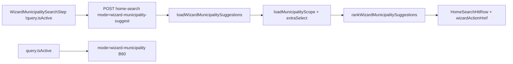

# Empty state do wizard — chassis + ranking de esquecidos

Status: ready
Atualizado em: 2026-08-01
Issue: #92
Priority: P1
Model: composer-2.5
Impeccable: B — encaixe em `WizardMunicipalitySearchStep` (passo 1 dos wizards `/campanha/acoes/<slug>`)
Appetite: ~1–1,5 dia eng; modo suggest no home-search + rank puro + lista no idle; sem migration
Responsável: —

## Design (Impeccable)

Âncoras: `PRODUCT.md` (Clarity under pressure; ação→local) / `DESIGN.md` (register `product`) · tema `data-theme='campaign'` · B60 `WizardMunicipalitySearchStep` · B68 `HomeSearchHitRow` / suggest · B59 `CampaignWizardShell`.

Na implementação (`work-issue`): craft compacto → critique → polish.

Brief compacto:

- **Persona / contexto:** assessor ou CG abre “Ajustar votos” / “Registrar sinal” no Início e cai no passo “Em qual município?” ainda sem digitar — hoje a região abaixo do input é deserto.
- **Job principal:** com zero teclas, ver municípios **prováveis** (esquecidos / frios no escopo) e avançar com um toque; digitar continua refinando via B60.
- **Estratégia de cor:** Restrained — mesmos hits do wizard; título de seção discreto; sem card.
- **Edit where you see:** não — descoberta/navegação de fluxo (select = auto-avanço B60).
- **Anti-goals:** mapa no empty; command palette; misturar hits de busca tipada com sugestões na mesma lista; motor E11 / `allocationDecision` neste passo; hero de KPI.

### Wireframe (texto)

```text
┌─ /campanha/acoes/<slug> (sem ?municipio=) ──────────────┐
│ [←]  Ajustar votos                         [✕]         │
│ Em qual município?                                     │
│ ┌─ Buscar município ─────────────────────────────────┐ │
│ │ Nome do município…                                 │ │
│ └────────────────────────────────────────────────────┘ │
│ · Cairu · Baixo Sul · 2022 …              [alta?]      │
│ · Valença · …                                          │
│ · … (até ~8; select = avança com ?municipio=)          │
└────────────────────────────────────────────────────────┘
  Sem título de seção — mesma região de resultados da busca.
  Continuity (B93) e geo (B94) entram depois como linhas prefixadas.
```

## Dados → decisão → apresentação

- **Vou apresentar dados?** Sim — lista curta de municípios do escopo do ator, ranqueados por frescor + desempates operacionais.
- **Decisões desbloqueadas:**
  - Assessor/CG: “em qual município desta carteira/estado eu executo **esta** ação agora, sem digitar o nome?”
  - Implicação: atacar primeiro quem está **frio** (sem sinal) e, empate, quem a campanha já investiu mais / tem tendência / classe / volume de votos mais relevante.
- **Forma escolhida:** lista ranqueada (mesmo degrau B48/B60/B68 — `HomeSearchHitRow`) — **por quê** a decisão é “qual abrir”. **Rejeitado:** mapa; `CampaignMetricStrip`; chart; chips sem readout (perda de contexto 2022 já no hit).
- **Profile:** até ~8 itens (`HOME_SEARCH_SUGGEST_LIMIT` / paridade B68); scoped ao access; relativo/local (nome + TI + readout 2022 opcional); **dias sem sinal** como chave primária (não % estadual).
- **Anti-goals de dado:** sem % estadual absoluto; sem gauge; sem inventar métrica nova além de reusar `lastSignalAt`, E14, tendência, E10, votos 2022 já no scope/artifact.

## Contexto

**B60 ✓** entrega a etapa de busca de município nos wizards (`WizardMunicipalitySearchStep` + `POST /campanha/home-search` `mode: 'wizard-municipality'`). Com query inativa a região fica **idle vazia** — B60 adiou explicitamente “chips de recentes/prioritários”.

**B68 ✓** resolveu o empty da busca do **Início** (`mode: 'suggest'`, rank por papel: assessor = carteira fria; CG = prioritários `alta` × déficit). O wizard **não** consome esse modo: precisa de política própria (ação-primeiro, não omnibox) e de desempates que o pedido de produto (2026-08-01) nomeou: envolvimento (E14), tendência política, classe territorial (E10), número de votos.

Este item é o **chassis + ranking server de esquecidos**. Continuity (visitados / última ação) e geo ficam em **B93** / **B94**.

## Objetivos

- Quando `!query.isActive` no passo de município do wizard: preencher a **mesma região de resultados** com hits sugeridos (sem título de seção — decisão de produto 2026-08-01), não o deserto.
- Novo modo tipado no `home-search` (recomendação: `mode: 'wizard-municipality-suggest'`) distinto de `suggest` (B68) e de `wizard-municipality` (B60 search) — política e payload próprios; staff-only (layout `acoes/` já gateia).
- Rank puro client-safe em `src/lib/` (irmão de `homeSearchSuggest.ts`), pinado em unit:
  1. **Primário:** mais dias sem sinal primeiro (`lastSignalAt` via `resolveMunicipalityLastSignalAt`; `null` = mais frio).
  2. **Desempates (nesta ordem):** envolvimento E14 (maior `engagementLevelRank` primeiro; `null`/`Sem nível` por último) → tendência (`desfavoravel` > `neutra` > `favoravel` > `null`) → classe E10 (`territorialClassSortWeight` desc; `sem_base`/`null` por último) → votos 2022 do candidato no município (maior primeiro; sem série = por último) → nome `pt-BR`.
- Cap ~8; access `overrideAccess: false`; assessor nunca vê fora da carteira.
- Digitar (≥ limiar B47) **substitui** sugestões pelos hits B60 (não misturar).
- Select = `wizardActionHref` (auto-avanço intacto).
- Sem migration / Consent / collection nova.

## Decisões travadas

- **Modo dedicado `wizard-municipality-suggest`, não reusar `suggest` do Início.** Wizard é ritual ação→local; B68 filtra CG a `priority === 'alta'` e usa déficit — aqui o pedido é **esquecidos do escopo inteiro** com desempates E14/tendência/classe/votos. **Rejeitado:** chamar `loadHomeSearchSuggestions` no wizard (política errada); search com `q=""` (contradiz B66/B68).
- **Primário = frescor (`lastSignalAt`), não só `lastUpdateAt`.** Mesma semântica E9/B68 (max update × pledge). **Rejeitado:** só `municipality.updatedAt` do Payload (ruído de admin); só `lastUpdateAt` (ignora pledges).
- **Desempates na ordem do pedido de produto** (envolvimento → tendência → classe → votos), com pesos já existentes (`engagementLevelRank`, ordem de tendência acima, `territorialClassSortWeight`, votos nominais 2022 do artifact/scope). **Rejeitado:** déficit de meta como desempate neste item (B68 já cobre no Início; misturar duas “inteligências” no mesmo empty confunde); LQ contínuo no lugar da classe.
- **Lista flat na região de resultados, sem título de seção** (produto 2026-08-01). Reason labels por linha ficam para B93/B94 (neste slice todas as linhas são “esquecidos”). **Rejeitado:** heading “Prováveis”/“Sugestões”; cards; multi-grupo neste appetite.
- **CG = escopo completo frio-primeiro** (não filtrar a `priority === 'alta'`). Prioridade alta continua só como indicador na linha. **Rejeitado:** copiar filtro B68 (política de omnibox, não de ritual).
- **Votos de desempate = nominais 2022 do candidato (artifact).** **Rejeitado:** estimado central (live/cache).
- **i18n / naming:** identificadores `wizardMunicipalitySuggest`, `rankWizardMunicipalitySuggestions`, `loadWizardMunicipalitySuggestions`; copy de empty tipado permanece a de B60.

## Questões em aberto

- Nenhuma após gate 2026-08-01.

## Abordagem proposta



Componentes:

- **`src/lib/wizardMunicipalitySuggest.ts`** (puro): input tipado (`slug`, `name`, `lastSignalAt`, `engagementLevel`, `politicalTrend`, `territorialClass`, `votes2022`) + `rankWizardMunicipalitySuggestions(inputs, limit)` + constantes de ordem de tendência; unit-pinned.
- **`src/utilities/homeSearch/loadWizardMunicipalitySuggestions.ts`** (`server-only`): `loadMunicipalityScope` com `extraSelect` (`lastUpdateAt`, `engagementLevel`, `politicalTrend`, …); classe via helper E10 já usado na lista/map; votos 2022 do artifact/`bahiaElectionAggregates` (ou campo já no scope se existir); `overrideAccess: false`.
- **Rota** `home-search/route.ts` + schema zod discriminado: ramificar o novo mode; resposta no shape `WizardMunicipalitySearchSuccessResponse` (ou irmão com `resultKind: 'wizard-suggest'`).
- **`WizardMunicipalitySearchStep`**: fetch suggest no idle; cancelar ao digitar; render hits na região de resultados (sem heading); empty tipado só quando search ativo e 0 hits.
- **Reuse:** `HomeSearchHitRow`, `HomeSearchMunicipalityVoteTrailing`, `postCampaignJson`, `useHomeSearchQuery`, copy em `campaignWizardCopy.ts`.
- **Migration:** Sem migration, sem collection, sem Consent.

## Dependências

- Duras: nenhuma aberta (B59 ✓, B60 ✓).
- Soft: B68 ✓ (padrão suggest ≠ search); E9/E10/E14 ✓ (sinais de desempate); artifact TSE para votos 2022.

## Não escopo

- Visitados recentes / última ação do ator → **B93**.
- Município mais próximo (geo) → **B94**.
- Empty da busca do Início (já **B68**); unificar políticas B68↔wizard.
- Motor E11 / fila de alocação no wizard.
- Leader (wizards são staff-only).

## Rabbit holes

- **Unificar `rankHomeSearchSuggestMunicipalities` e o rank do wizard num “suggest engine” genérico.** Se alguém “só completar”: API parametrizada prematura. **Mitigação:** dois módulos puros até 3º call site (precedente depth check).
- **Carregar coverage/déficit/E11 no loader do wizard.** Explode latência do idle. **Mitigação:** só campos de desempate listados; déficit fica no B68.
- **Reason chips + multi-fonte neste PR.** Mistura continuity/geo sem contrato de merge. **Mitigação:** B93/B94.

## Adiado com gatilho

- **Comparator compartilhado de frescor** entre B68 e wizard. Revisitar no 3º call site (ledger O0+/DRY).
- **RSC embed do suggest** (evitar POST no mount do passo). Revisitar se latência idle for P1 em campo.
- **Reason label “Sem atualização há N dias” na linha.** Revisitar se craft/B93 pedir diferenciação visual além da ordem.

## Referências

- GitHub Issue #92
- [`WizardMunicipalitySearchStep.tsx`](../../src/components/campaign/shared/WizardMunicipalitySearchStep.tsx)
- [`homeSearchSuggest.ts`](../../src/lib/homeSearchSuggest.ts) / [`loadHomeSearchSuggestions.ts`](../../src/utilities/homeSearch/loadHomeSearchSuggestions.ts)
- [`busca-municipio-wizard.md`](busca-municipio-wizard.md) (B60 — adiados)
- [`sugestoes-busca-vazia-inicio.md`](sugestoes-busca-vazia-inicio.md) (B68)
- [`engagementLevel.ts`](../../src/lib/engagementLevel.ts) · [`territorialClassSortWeight.ts`](../../src/lib/territorialClassSortWeight.ts)
- AGENTS.md — access advisor; `overrideAccess: false`; naming EN / copy pt-BR
- `PRODUCT.md` / `DESIGN.md` — Clarity under pressure; Field Desk
