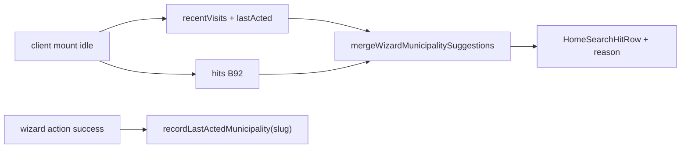

# Empty state do wizard — continuity (visitados + última ação)

Status: ready
Atualizado em: 2026-08-01
Issue: #93
Priority: P2
Model: composer-2.5
Impeccable: B — prefixo client no empty de `WizardMunicipalitySearchStep` (após B92)
Appetite: ~0,75–1 dia eng; merge client de recentVisits + last-acted localStorage; sem migration
Responsável: —

## Design (Impeccable)

Âncoras: `PRODUCT.md` (Feel the action; Clarity under pressure) / `DESIGN.md` · tema `campaign` · B92 chassis · `recentVisits.ts` · Quadro `RecentlyVisitedCard`.

Na implementação: craft compacto → critique → polish.

Brief compacto:

- **Persona:** staff que **acabou** de mexer num município ou voltou ao ritual no mesmo aparelho — quer repetir o local sem re-digitar.
- **Job principal:** no idle do passo 1, ver no topo “onde eu estava / onde eu agi” antes dos esquecidos server.
- **Estratégia de cor:** Restrained; secondary discreto na linha (“Visitado”, “Última ação”).
- **Edit where you see:** não.
- **Anti-goals:** sync multi-dispositivo; POST de histórico ao servidor; misturar continuity com hits tipados; redesign do card do Quadro.

### Wireframe (texto)

```text
┌─ Wizard passo município (idle, pós-B92) ───────────────┐
│ [input busca…]                                         │
│ · Itabuna · … · Última ação                            │
│ · Cairu · … · Visitado                                 │
│ · Valença · … · Visitado                               │
│ · … (fill B92 esquecidos, dedup)                       │
└────────────────────────────────────────────────────────┘
  Sem título de seção. Geo (B94) pode ocupar 1 slot acima.
```

## Dados → decisão → apresentação

- **Vou apresentar dados?** Sim — atalhos de continuidade (client) mesclados à lista server B92.
- **Decisões:** “volto ao município em que eu **agi** ou que **abri** há pouco?”
- **Forma:** mesmas linhas `HomeSearchHitRow` + secondary/reason curto. **Rejeitado:** seção separada com cards; timeline.
- **Profile:** 1 última ação + até ~3–5 visitados município; dedup com geo/esquecidos; cap total da lista ~8.
- **Anti-goals:** sem enviar `localStorage` ao servidor; sem PII além do que já vive no device (padrão visitados).

## Contexto

B92 entrega o idle com esquecidos server. O pedido de produto (2026-08-01) também pede: (a) **últimos municípios acessados**; (b) **último município em que o usuário executou qualquer ação**.

Já existe `teqo:campaign:recent-visits` (`recentVisits.ts`, Quadro). B68 **adiou** visitados no suggest do Início por hidratação — no wizard o idle já é client (`WizardMunicipalitySearchStep`), então o merge é natural **depois** do mount.

“Última ação” **não** tem índice server hoje (autores espalhados: `municipalityUpdate.author`, `votePledge.declaredBy`/`estimatedBy`, `campaignDemand.createdBy`, …). Índice unificado = migration/query cara. Neste item: **localStorage device-local**, escrito nos success paths dos wizards/actions de município.

## Objetivos

- Após mount, com `!query.isActive`: mesclar no topo da lista B92:
  1. **Última ação** (0–1) — slug gravado em storage dedicado.
  2. **Visitados recentes** (`kind === 'municipality'`) — extrair slug do `href`, filtrar ao escopo se o server já devolveu o universo **ou** validar contra hits suggest / lista acessível passada como prop.
- Dedup estável: geo (B94) > última ação > visitados > esquecidos B92; uma linha por slug.
- Reason labels pt-BR curtos na secondary ou trailing textual.
- Gravar `lastActedMunicipality` (nome final no craft) ao **sucesso** de writes do ritual (ajuste votos, sinal, tendência, liderança, demanda — paths que já fecham wizard com município). Fail-soft se storage bloquear.
- Sem migration / Consent / envio de lat-lng ou histórico ao server.

## Decisões travadas

- **Continuity 100% client (localStorage), não query server “last modified by me”.** Barato, mesmo padrão de visitados; cross-device fica Adiado. **Rejeitado:** UNION multi-collection por `author`/`declaredBy` neste appetite (latência + índices + access); collection `municipalityActorTouch` (migration cara sem evidência).
- **Gravar última ação no success do write, não no select do passo 1.** Select sem commit não é “executou ação”. **Rejeitado:** gravar no `router.push(?municipio=)` (falso positivo se abandonar).
- **Reusar `recentVisits` para acessos; storage separado para last-acted.** Semânticas diferentes (dwell 2s vs write). **Rejeitado:** sobrecarregar `RecentVisitEntry` com `kind: 'acted'`.
- **Merge só no idle; search tipado ignora continuity.** Paridade B68/B92.
- **Sem título de seção** (gate 2026-08-01) — só linhas na região de resultados, com reason na secondary.
- **i18n:** `campaignLastActedMunicipality` / `recordLastActedMunicipality` / `listWizardContinuitySlugs`; copy “Última ação”, “Visitado”.
- **Prefixo: 1 last-acted + até 3 visitados**; filtrar fora da carteira. Cap total da lista ~8 com B92/B94.

## Questões em aberto

- Nenhuma após gate 2026-08-01.

## Abordagem proposta



Componentes:

- **`src/lib/campaignLastActedMunicipality.ts`** (client-safe storage helpers, irmão fino de `recentVisits.ts`).
- **`src/lib/wizardMunicipalitySuggestMerge.ts`** (puro): ordena/dedup fontes `{ source, slug }[]` + hits server → lista final com `reason`.
- **`WizardMunicipalitySearchStep`**: após fetch B92, merge client; skeleton/idle sem flash errado (não render continuity no SSR).
- **Hooks de gravação:** pontos de sucesso já existentes nos formActions/wizards (votos, sinal, tendência, liderança, demanda) — uma chamada `recordLastActedMunicipality(slug)`; sem abstração genérica se &lt;3 sites usar helper inline até o 3º.
- **Migration:** nenhuma.

## Dependências

- Dura: **B92**.
- Soft: visitados ✓; wizards A1–A5 ✓.

## Não escopo

- Geo → **B94**.
- Last-acted server / multi-device.
- Continuity no empty do Início (B68 adiou; gatilho separado).
- Alterar card do Quadro.

## Rabbit holes

- **Helper genérico “campaignLocalShortcuts”.** **Mitigação:** dois módulos pequenos até 3º consumidor.
- **Gravar last-acted em toda mutation Payload via hook global.** Blast radius. **Mitigação:** só success paths do ritual de ação.

## Adiado com gatilho

- **Last-acted server (cross-device).** Revisitar se o mesmo CG reportar “no celular não aparece o que fiz no notebook” em sessão observada.
- **Visitados no suggest do Início (B68 adiado).** Revisitar com evidência de sessão; não neste item.

## Referências

- GitHub Issue #93
- [`recentVisits.ts`](../../src/utilities/recentVisits.ts) · [`visitados-recentemente.md`](visitados-recentemente.md)
- [`wizard-municipio-sugestoes-chassis.md`](wizard-municipio-sugestoes-chassis.md) (B92)
- AGENTS.md — sem Consent para storage local de UX autenticada (precedente B14/visitados)
