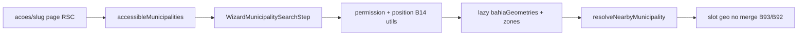

# Empty state do wizard — município mais próximo (geo)

Status: rascunho
Atualizado em: 2026-08-01
Issue: —
Priority: P2
Model: composer-2.5
Impeccable: B — 1 linha prefixada no empty de `WizardMunicipalitySearchStep` (após B92)
Appetite: ~1 dia eng; reuso B14 (`campaignGeolocation` + `municipalityProximity`) no idle do wizard; sem migration / Consent
Responsável: —

## Design (Impeccable)

Âncoras: `PRODUCT.md` (Feel the action) / `DESIGN.md` · tema `campaign` · B14 `NearestMunicipalityCard` · B92 chassis · B93 merge order.

Na implementação: craft compacto → critique → polish. Gatilho `harden` se permission/prompt edge cases vazarem copy inconsistente com B14.

Brief compacto:

- **Persona:** staff em deslocamento (carro/praça) abre uma ação no celular e quer o município **onde está**.
- **Job principal:** no idle, um toque no “mais próximo” avança o wizard com o município resolvido.
- **Estratégia de cor:** Restrained; reason “Perto de você” / distância se B14 já formata.
- **Edit where you see:** não.
- **Anti-goals:** mapa embutido no wizard; POST de lat/lng; Consent novo; prompt agressivo a cada abertura de ação; card GPS gamificado.

### Wireframe (texto)

```text
┌─ Wizard passo município (idle) ────────────────────────┐
│ [input…]                                               │
│ Prováveis                                              │
│ · Salvador — ZE 5 · … · Perto de você (~1,2 km)        │
│ · … (B93 continuity)                                   │
│ · … (B92 esquecidos)                                   │
└────────────────────────────────────────────────────────┘
  Sem permissão / fora da BA / unsupported: linha some;
  lista B92/B93 permanece.
```

## Dados → decisão → apresentação

- **Vou apresentar dados?** Sim — 0–1 município resolvido por geo no escopo do ator.
- **Decisões:** “executo a ação **aqui** (onde estou)?”
- **Forma:** uma linha na lista (pobre). **Rejeitado:** card “Onde estou” duplicando o Quadro; mapa Leaflet no passo.
- **Profile:** 1 item; client-only position; match contra malha já usada em B14.
- **Anti-goals:** sem transmitir posição ao servidor; sem reverse-geocode vendor.

## Contexto

B14 ✓ no **Quadro** (`NearestMunicipalityCard`): posição no browser, containment na malha municipal (+ ZE Salvador), fallback Haversine, prompt 1× por sessão de aba, sem Consent.

O pedido (2026-08-01) inclui o mesmo sinal no empty do **wizard**. O passo 1 hoje não carrega geometrias nem lista `AccessibleMunicipality` — B92 traz hits server; este item acrescenta a resolução client e o slot no merge (ordem: geo → continuity B93 → esquecidos).

## Objetivos

- No idle do wizard, tentar resolver município mais próximo **no escopo do ator** reusando `requestCurrentPosition` / `resolveNearbyMunicipality` / loaders lazy de geometria.
- Página `acoes/[slug]` (passo busca) passa prop `accessibleMunicipalities: AccessibleMunicipality[]` (slug/name/ibgeCode) a partir do scope — ou o client usa só os slugs do suggest B92 **mais** um payload mínimo RSC (recomendação: prop RSC, porque suggest é top-8 e o nearest pode estar fora do top frio).
- Prompt automático: **respeitar** `hasPromptedThisSession` de B14 (não re-assaltar se o Quadro já pediu; se wizard é a 1ª superfície da sessão, um prompt basta).
- Falhas (`denied` / `timeout` / `unsupported` / fora da BA / outOfScope sem nearest): **silêncio** — não montar linha de erro no ritual (diferente do card do Quadro que explica); usuário digita.
- `kind: 'inScope'` → uma hit row com reason; select = auto-avanço.
- Sem migration / Consent / POST de coordenadas.

## Decisões travadas

- **Client-only matching (paridade B14).** **Rejeitado:** POST lat/lng; PostGIS; artefato de centroides commitado (já revertido em B14).
- **Prop RSC de municípios acessíveis** para o matcher (não só top-8 do suggest). **Rejeitado:** resolver só dentro dos 8 esquecidos (falso “perto” se o município real ficou de fora do rank frio).
- **Fail soft sem UI de erro no wizard.** Ritual não deve virar troubleshooting de GPS. **Rejeitado:** copiar o card B14 inteiro para dentro do shell.
- **Uma linha, não card.** **Rejeitado:** embutir `NearestMunicipalityCard`.
- **i18n:** reusar `formatDistanceKm`; reason “Perto de você”; helpers `useWizardNearestMunicipality` se o efeito merecer nome (senão lógica no step até extrair no 2º call site).

## Questões em aberto

- **Prompt automático no mount do wizard se a sessão ainda não pediu?** **Opções:** A sim (paridade Quadro) | B só se permissão já `granted` | C CTA explícito “Usar minha localização”. **Recomendação:** **B** no v1 do wizard (zero surpresa no meio do ritual) + se `granted`, resolve quieto; CTA curto se `prompt`/`denied` e craft quiser. _(assumido — validar com produto; se campo pedir paridade total com Quadro, subir para A)_
- **Salvador multi-ZE outOfScope / zoneCity:** seguir B14 (lista filtrada no Quadro). No wizard: **Opções:** A omitir linha | B deep-link impossível sem município. **Recomendação:** **A** omitir — wizard exige `municipality` atômico. _(assumido)_

## Abordagem proposta



Componentes:

- **`acoes/[slug]/page.tsx`**: ao renderizar o search step, carregar scope enxuto (id/slug/name/ibgeCode) e passar como prop.
- **Ilha no step / hook:** permission + optional locate; dynamic import geometria; resolver; emitir `{ slug, reason, distanceKm? }` ou `null`.
- **Merge** (contrato com B93): fonte `geo` tem precedência máxima de ordenação.
- **Reuse:** `campaignGeolocation.ts`, `municipalityProximity.ts`, `loadMunicipalityGeometryModule`, `formatDistanceKm`.
- **Migration:** nenhuma. **Consent:** nenhum.

## Dependências

- Dura: **B92**.
- Soft: **B93** (merge order — se B94 landar antes, step aceita geo sem continuity; merge helper pode nascer em qualquer um e o outro consome).
- Soft: B14 ✓.

## Não escopo

- Continuity → **B93**.
- Ranking esquecidos → **B92**.
- Mudanças no card do Quadro.
- Geo para `leader`.

## Rabbit holes

- **Extrair `NearestMunicipalityCard` → package compartilhado pesado.** **Mitigação:** reusar utils puros; UI do wizard é uma hit row.
- **Prefetch da malha no Início para o wizard.** **Mitigação:** lazy no mount do step; memo do módulo já ajuda se Quadro carregou antes.

## Adiado com gatilho

- **CTA “Usar localização” quando permission ≠ granted.** Revisitar se sessão observada mostrar staff recusando o prompt silencioso e pedindo botão.
- **Centroid artifact** só se o lazy da malha pesar no mid-tier Android em campo.

## Referências

- GitHub Issue — (após register)
- [`municipio-mais-proximo.md`](municipio-mais-proximo.md) (B14)
- [`campaignGeolocation.ts`](../../src/utilities/campaignGeolocation.ts) · [`municipalityProximity.ts`](../../src/lib/municipalityProximity.ts)
- [`wizard-municipio-sugestoes-chassis.md`](wizard-municipio-sugestoes-chassis.md) (B92)
- AGENTS.md — sem Consent para geo local autenticada (B14)
