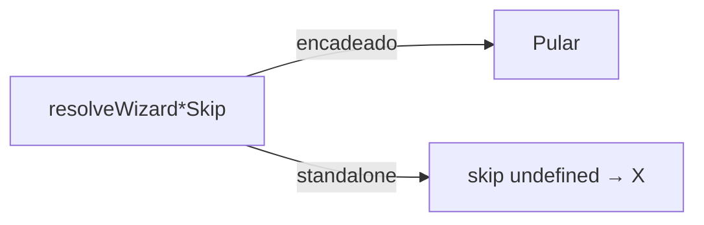

# Wizard — “Pular” curto nas ações encadeadas

Status: registrado
Atualizado em: 2026-08-01
Issue: #131
Priority: P1
Model: composer-2.5
Impeccable: B — slot direito do header mobile do wizard
Appetite: ~0,25–0,5d eng; constantes de skip + pins; sem migration
Responsável: —

## Design (Impeccable)

Âncoras: `PRODUCT.md` · B75/B96 header · tema `campaign` (Mandate Red).

Na implementação: craft compacto → critique → polish (header estreito).

Brief:

- **Persona:** staff no meio da cadeia pós-ação principal (B98).
- **Job principal:** pular o ajuste opcional com um verbo curto; na ação principal, **X** continua.
- **Anti-goals:** X+Pular juntos; “Pular …” longo no header.

### Wireframe (texto)

```text
Principal (standalone / 1ª config):
┌─ header ──────────────────────────────┐
│ [Voltar?]  Ajustar votos · Cairu  [X] │
└───────────────────────────────────────┘

Encadeada (ex. tendência após votos):
┌─ header ──────────────────────────────┐
│ [Voltar]  Mudar tendência · Cairu [Pular] │
└───────────────────────────────────────┘
```

## Dados → decisão → apresentação

Dados: N/A — chrome de fluxo.

## Contexto

**B96 ✓** (#104) alinhou: skip só quando o passo é subfluxo encadeado; label **específica** (“Pular mudança de tendência →”, etc.) — B75 pedia o nome do fluxo. **B98 ✓** encadeia os ajustes. Produto (2026-08-01): nas encadeadas, o direito deve ser só **“Pular”**; a ação principal mantém **X**.

Constantes atuais: `WIZARD_*_SKIP_LABEL` em `campaignWizardCopy.ts`, `wizardSignalUi.ts`, `politicalTrendWizardUi.ts`.

## Objetivos

- Toda label de skip encadeada → **`"Pular"`** (constante única compartilhada, idealmente).
- Resolvers (`resolveWizard*Skip`) intactos na **condição** (quando há skip); só a string muda.
- Ação principal / standalone: `skip` undefined → header mostra **X** (B96).
- Unit: labels === `'Pular'`; standalone tendência/sinal sem skip.
- Sem migration.

## Decisões travadas

- **Supersede B96 na copy: label genérica “Pular”.** Fonte: produto 2026-08-01. **Rejeitado:** manter nome do fluxo (B96/B75 — supersedido neste ponto); “Pular →”.
- **Uma constante compartilhada** (`WIZARD_CHAIN_SKIP_LABEL = 'Pular'`) reusada pelos quatro fluxos. **Rejeitado:** quatro strings iguais espalhadas.
- **Destino do skip / cadeia = B98 (já entregue); este item é só copy.** **Rejeitado:** reabrir matriz de encadeamento.
- **i18n:** id `WIZARD_CHAIN_SKIP_LABEL`; copy pt-BR “Pular”.

## Questões em aberto

- **Seta “→” some?** **Opções:** A) sim, só “Pular” | B) “Pular →”. **Recomendação:** **A**. _(assumido)_

## Abordagem proposta



Componentes:

- **`src/lib/campaignWizardCopy.ts`** (ou módulo de contrato): export `WIZARD_CHAIN_SKIP_LABEL`.
- **`wizardSignalUi.ts` / `politicalTrendWizardUi.ts` / votes / leadership:** apontar label para a constante; remover strings longas se knip reclamar.
- **Unit** dos resolvers + qualquer snapshot de header.
- **Migration:** Sem migration.

## Dependências

- Soft: B96 ✓, B98 ✓. Nenhuma dura.

## Não escopo

- Mudar quando o skip aparece (já B96/B98).
- Desktop copy fora do header mobile.

## Rabbit holes

- **Renomear todo o chrome B75.** Mitigação: só as quatro labels de skip.

## Adiado com gatilho

- Tooltip no “Pular” com o nome do subfluxo. Revisitar se a mesa achar o verbo ambíguo na cadeia longa.

## Referências

- GitHub Issue #131 (B104)
- `docs/plans/wizard-header-x-vs-pular.md` (B96) · `campaignWizardCopy.ts` · `wizardSignalUi.ts` · `politicalTrendWizardUi.ts` · `wizardLeadershipContract.ts`
- AGENTS.md — naming / pt-BR copy
