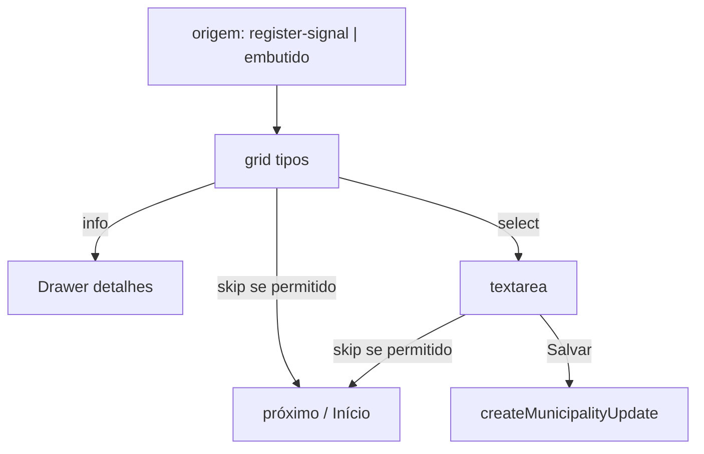

# Wizard registrar sinal — escolher tipo + detalhar texto

Status: entregue (2026-07-30)
Atualizado em: 2026-07-30
Item do roadmap: [docs/roadmap.md](../roadmap.md) (Trilha B, item B63 — UX-1 wizards)
Impeccable: C — UI nova (grid de tipos + drawer de info + passo de texto)
Appetite: ~1–1,25 dia eng; 2 etapas no B59; write via action `createMunicipalityUpdate` existente
Responsável: —

## Contrato de URL (as-built)

```text
/campanha/acoes/registrar-sinal
  → B60 WizardMunicipalitySearchStep

/campanha/acoes/registrar-sinal?municipio=<slug>
  → WizardSignalTypeStep (grid)

/campanha/acoes/registrar-sinal?municipio=<slug>&signalType=<enum>
  → WizardSignalBodyStep (textarea + Salvar)

Query opcional (propagar entre passos):
  ?entry=register-signal|update-votes|…
```

Helpers em `src/lib/campaignActionRoutes.ts`: `WIZARD_SIGNAL_TYPE_QUERY_KEY`, `WIZARD_ENTRY_ACTION_QUERY_KEY`, `parseWizardEntryActionParam`, `resolveWizardSignalTypeParam`, `wizardSignalHref`. Skip: `shouldShowWizardSignalSkip` em `wizardSignalUi.ts` — oculto quando `entryAction` ausente ou `register-signal`; visível caso contrário (href → `/campanha` na v1).

## Design (Impeccable)

Âncoras: `PRODUCT.md` / `DESIGN.md` · `Drawer` shadcn · tema `campaign` · labels de **B62**.

Na implementação: shape → craft → critique → polish.

Brief compacto:

- **Persona:** CG/assessor no polegar; acabou de ouvir no Zap e precisa classificar o fato sem jargão.
- **Job principal:** escolher o tipo de sinal em 1 toque (com info sob demanda) e, se quiser, detalhar em texto; ou pular quando o sinal não era o motivo do wizard.
- **Estratégia de cor:** Restrained — fundo transparente, borda cinza clara (`border-border`), título/ícone `foreground`; sem fill primary nos tiles.
- **Edit where you see:** não — fluxo com Salvar explícito no passo de texto.
- **Anti-goals:** select nativo escondido; “broker”; obrigar sinal quando o fluxo veio de votos; cards com sombra/elevação.

## Dados → decisão → apresentação

Dados: N/A como métrica — tipo categórico + texto livre. Decisão = classificar o fato e se registrar agora ou pular.

## Contexto

Após **B62**, o modelo é `signalType` + `body`. Pedido (2026-07-29, gate confirmado):

**Etapa 1 — tipo**

- Cada tipo = botão **quadrado grande**, cantos arredondados; ícone canto **superior esquerdo**; título + descrição curta alinhados ao **inferior esquerdo**; fundo transparente + borda cinza clara; título/ícone pretos (`foreground`).
- Ícone de **informação** no tile → bottom **Drawer** com: o que é, consequências, quando usar (copy longa; provisória ok).
- Grid; alinhamento do bloco: **bottom no mobile**, **top em tablet/desktop** (prop `contentAlign` do **B59**).
- Topo direito: **“Pular registro de sinal”** — **exceto** quando a ação que abriu o wizard foi `register-signal` (B45).

**Etapa 2 — texto**

- Texto livre para detalhar.
- “Pular registro de sinal” ainda no topo direito (mesma regra de origem).
- Inferior direito: **“Salvar”** → cria `municipalityUpdate` `kind: 'sinal'`.

Município: já escolhido (**B60**) ou pré-preenchido se veio embutido de A1.

## Objetivos

- Duas telas/passos no shell B59: `WizardSignalTypeStep` + `WizardSignalBodyStep`.
- Catálogo de tiles: mapear os 5 `municipalitySignalTypes` → ícone Lucide + label/description curta (B62) + `infoContent` (markdown/plain).
- Info: botão `Info` com `stopPropagation` para não selecionar o tipo ao abrir o Drawer.
- Select de tipo = avança para o passo de texto (sem CTA intermediário).
- Skip: `Link`/button → próximo bloco do fluxo pai ou Início; **hidden** se `entryAction === 'register-signal'`.
- Salvar: `createMunicipalityUpdate` / formAction existente com `overrideAccess: false`; pending no botão (Feel the action).
- Atualizar B26 list control **não** é obrigatório a adotar o grid (pode permanecer select pós-B62); opcional Adiado.
- Sem migration (B62 já migrou). Sem Consent.
- Unit/e2e smoke: skip oculto no entry signal; info não seleciona tipo; salvar exige tipo+body.

## Decisões travadas

- **Duas etapas (tipo → texto), um item de roadmap.** **Rejeitado:** IDs separados (texto é fino demais sozinho).
- **Skip visível só se a origem ≠ `register-signal`.** **Rejeitado:** sempre mostrar (permitiria “registrar sinal” sem sinal); nunca mostrar (bloqueia “quer também?” após votos).
- **Tiles transparentes + borda**, não filled primary. **Rejeitado:** cards elevados / Signal Red no idle.
- **Info = Drawer bottom** (pedido). **Rejeitado:** Tooltip only (touch); Dialog centrado.
- **i18n:** `signalType`, `entryAction`, `skipSignal`; copy “Pular registro de sinal” / “Salvar”.

## Questões em aberto

- **Após Salvar no fluxo standalone A2: ir ao Início ou oferecer “ajustar votos”?** **Opções:** A Início + toast | B “Quer atualizar votos?”. **Recomendação:** A no v1; B no wiring A1/A2 contínuo. _(assumido)_

## Abordagem proposta



Componentes:

- **`WizardSignalTypeStep`** + **`WizardSignalBodyStep`** em `components/campaign/municipality/` (ou `shared/` se 2º call site).
- **`municipalitySignalTypeMeta`** em `lib/` (ícone id, short description, long info) — client-safe; labels de B62.
- Reuso: `Drawer`, `Button`, B59 trailing slot + `contentAlign="end"` no mobile da etapa de tipo.
- **Migration:** Sem migration (depende de B62).

## Dependências

- Dura: **B59**, **B62**. Soft: **B60** (município no standalone). Soft: B45 ✓ (`register-signal` id).

## Não escopo

- Dropar fonte/triangulado / labels → **B62** (pré-requisito).
- Wiring “quer também?” dentro de A1 → fatia A1.
- Trocar B26 para o grid de tiles → Adiado.

## Rabbit holes

- **CMS dos textos de info.** **Mitigação:** constantes em `lib/` até R6/assessoria.
- **Mais de 5 tipos / multi-select.** **Mitigação:** um tipo por sinal (C12).

## Adiado com gatilho

- **Grid de tipos no Popover B26.** Revisitar se o select pós-B62 ainda gerar dúvida de classificação em campo.
- **Copy longa revisada pela assessoria.** Revisitar no R6.
- **Fundir `wizardSignalHref` em `wizardActionHref`.** Revisitar quando B64+ compartilhar o mesmo builder de query (hoje são contratos distintos: `signalType` vs opções genéricas).

## Já resolvido no simplify (não reabrir)

- **B75 chrome:** `flowTitle`, `isEntryStep`, `skip` no `CampaignWizardShell` + `WizardSignalSkipTrailing` no desktop.
- **Skip DRY:** `resolveWizardSignalSkip` em `wizardSignalUi.ts` (substitui `wizardSignalSkipHref`).
- **Lookup O(1):** `municipalitySignalTypeMetaByType`; tiles com `<Link>` (prefetch) em vez de `router.push`.
- **URL `?entry=`** alinhada a B70/B77 (não `?entryAction=`).

## Referências

- [simplificar-modelo-sinal.md](simplificar-modelo-sinal.md) · [chassis-wizard-campanha.md](chassis-wizard-campanha.md) · [fluxos-acao-primeiro-inicio.md](fluxos-acao-primeiro-inicio.md) · [registrar-sinal-lista-municipios.md](registrar-sinal-lista-municipios.md) · `actions/municipalityUpdate` · `campaignHomeActions.ts` (`register-signal`)
- AGENTS.md — Local API `overrideAccess: false`
- `PRODUCT.md` / `DESIGN.md` · Drawer B42/B34
