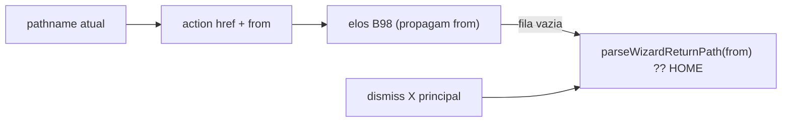

# Wizard — ao terminar, voltar à página de origem (não ao Início)

Status: registrado
Atualizado em: 2026-08-01
Issue: #149
Priority: P1
Model: composer-2.5
Impeccable: B — navegação pós-cadeia nos wizards `/campanha/acoes`
Appetite: ~0,5–1d eng; query `from` allowlisted + `wizardChainContinueHref`; sem migration
Responsável: —

## Design (Impeccable)

Âncoras: `PRODUCT.md` (Continuity; Ação → Local → Quem) / `DESIGN.md` · B98 cadeia · B75/B96 chrome · tema `campaign`.

Na implementação: craft compacto → critique → polish (fluxo município + um fluxo liderança).

Brief:

- **Persona:** staff dispara ação rápida **na página em que está** (detalhe de município, liderança, lista…).
- **Job principal:** ao concluir (ou esgotar a cadeia B98), **voltar para essa página**, não para `/campanha`.
- **Anti-goals:** segundo sistema de deep-link; gravar origem em cookie; mudar a matriz de encadeamento B98.

### Wireframe (texto)

```text
/campanha/municipios/foo
  → strip: Mudar tendência
  → /acoes/mudar-tendencia?municipio=foo&from=/campanha/municipios/foo
  → [cadeia B98…]
  → fim → /campanha/municipios/foo   ← não /campanha

/campanha (Início)
  → mesma ação sem from (ou from=/campanha)
  → fim → /campanha
```

## Dados → decisão → apresentação

Dados: N/A — só navegação.

## Contexto

**B98** fechou a cadeia de ajustes e travou o fim em **Início** (`wizardChainContinueHref` → `CAMPAIGN_HOME`). Correto quando a entrada é o dock do Início. Incorreto quando a entrada é o **bottom drawer** (ou qualquer CTA) numa página de entidade: o usuário perde o contexto e precisa reencontrar o município.

Pedido de produto (2026-08-01): o fluxo de ação deve **sempre** redirecionar, ao final, para a página da qual foi disparado — município, liderança, assessor, lista, etc.

## Objetivos

- Propagar um **return path** allowlisted desde o href da ação rápida (e CTAs equivalentes) até o fim da cadeia / dismiss X da principal.
- `wizardChainContinueHref` (e pontos que hoje hardcodam `CAMPAIGN_HOME` ao esgotar a fila) usam esse path; default permanece Início quando ausente/inválido.
- X / cancel da **principal** também volta à origem (não só “sucesso”).
- Unit pins: fim com `from` → origem; sem `from` → Início; `from` fora da allowlist → Início (fail-closed).
- Guardrails: sem migration; access intacto; open-redirect impossível (só paths internos `/campanha/...`).

## Decisões travadas

- **Query `from` (path absoluto interno allowlisted), não `sessionStorage`.** Sobrevive a refresh e é auditável na URL; B98 já usa query (`entry`, `municipio`). **Rejeitado:** só “se tem `municipio=` voltar ao detalhe” (falha em liderança/lista/assessor sem município); `document.referrer` (frágil cross-flow).
- **Allowlist:** pathname sob `/campanha` que **não** seja `/campanha/acoes/*` nem auth (`login`, `convite`, …) — helper puro `parseWizardReturnPath`. **Rejeitado:** qualquer string; URLs absolutas externas.
- **Supersede o “Fim: Início” do B98 quando `from` presente; Início continua o default.** **Rejeitado:** reabrir a matriz de elos; tela intermediária de sucesso obrigatória.
- **Quick actions / registry:** ao montar `href` com contexto de página, anexar `from=pathname` (pathname atual). Entrada pelo Início omite ou seta `/campanha`.
- **i18n:** `WIZARD_RETURN_PATH_QUERY_KEY = 'from'`; ids EN.

## Questões em aberto

- **Pular o último elo da cadeia: ainda honra `from`?** **Opções:** A) sim | B) Início. **Recomendação:** **A** — “terminar o ritual” = origem. _(assumido)_
- **Demandas / fluxos fora da cadeia B98?** **Opções:** A) mesmo `from` no redirect final | B) só cadeia. **Recomendação:** **A** onde já redirecionam para Início. _(assumido)_

## Abordagem proposta



Componentes:

- **`src/lib/campaignActionRoutes.ts`**: constante da query; `appendWizardReturnPath` / `parseWizardReturnPath` (allowlist).
- **`src/lib/wizardActionChain.ts`**: `wizardChainContinueHref(..., returnPath?)` — fim = returnPath ?? HOME; propagar `from` nos hrefs dos elos.
- **Registry / quick action builders** (`campaignQuickAction*.ts`): incluir `from` a partir do pathname (passado pelo host/registry).
- **Chrome wizard (X / skip último):** ler `from` da URL.
- **Unit:** `wizardActionChain` + parser allowlist.
- **Migration:** Sem migration.

## Dependências

- Soft: B98 ✓. Nenhuma dura.
- Paralelo a **B109** / **B111**.

## Não escopo

- Polimento visual do drawer → **B109**.
- Mudar ordem dos elos B98.
- Deep link pós-login.

## Rabbit holes

- **Histórico `router.back()` em vez de `from`.** Mitigação: back pode sair do app / pular elos; URL explícita.
- **Allowlist por enum de rotas.** Mitigação: prefixo `/campanha` + denylist `acoes`/auth basta neste appetite.

## Adiado com gatilho

- **Toast “Salvo — voltando a …”.** Revisitar se campo pedir confirmação verbal do destino.

## Referências

- GitHub Issue #149 (spec + frontmatter `id/depends/priority/model`)
- `src/lib/wizardActionChain.ts` — `CAMPAIGN_HOME` no fim
- `src/lib/campaignActionRoutes.ts` — builders de href
- `src/lib/campaignQuickActionRegistry.ts` + providers B80–B90
- `docs/plans/encadear-ajustes-wizard.md` (B98)
- AGENTS.md — naming; Campaign auth
- `PRODUCT.md` — Continuity
