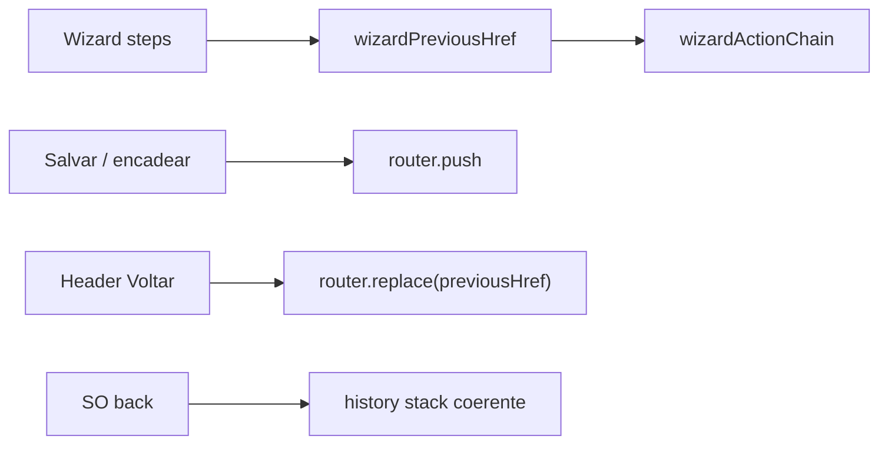

# Impl: Wizard — Voltar = passo imediatamente anterior (também na cadeia)

Status: aprovado
Atualizado em: 2026-08-02
Issue: #289
Intenção: docs/plans/wizard-voltar-passo-anterior-cadeia.md
Appetite restante: herdado (~0,5–1d)

## Leitura da intenção

- **Outcome:** Voltar (header + back do SO) no wizard `/campanha/acoes/*` navega ao passo lógico imediatamente anterior — na cadeia B98, do 1º passo de um elo encadeado volta ao passo principal do elo anterior no mesmo município, nunca à busca de município.
- **O que NÃO negociar:** staff only; sem migration; leader lockdown; `returnPath` (B110) intacto; Registrar pedido (A5) fora — só contrato plugável.
- **O que reavaliar:** hipótese de “history replace no avanço” — confirmado como causa do back cego; corrigir com `push` no avanço + `replace` no Voltar.

## Abordagem recomendada

**Opções consideradas:** A) só corrigir `previousHref` | B) `previousHref` + push/replace | C) popstate interceptor global  
**Recomendação:** **B** — dono único de passo anterior em `wizardActionChain`; avanço empilha histórico; Voltar substitui entrada atual para não duplicar.  
**Rejeitadas:** C (explode appetite); A sem push (back do SO continua mentindo).

### Componentes / mudanças

- **`wizardPreviousHref`** (`src/lib/wizardActionChain.ts`): `WizardStepKind` + href do passo anterior (interno, principal, elo encadeado).
- **Steps** (`Wizard*Step.tsx`): trocar `previousHref` ad hoc pelo helper.
- **`CampaignWizardNavLink`**: prop `replace` para Voltar.
- **`CampaignMobileTopBar`**: Voltar com `replace={true}`.
- **Chain continues** (`WizardExpectedVotesStep`, `WizardTrendNoteStep`, `WizardSignalBodyStep`, `WizardLeadershipStep`): `router.push` em vez de `replace`.
- **Migration:** sem migration.
- **Testes:** unit em `wizardActionChain.unit.spec.ts`; ajuste em `wizardExpectedVotesStep`, `wizardNavigationPending`.

## Fases verificáveis

1. **Tracer** — `wizardPreviousHref` + unit tests.
2. **UI** — steps + nav semantics (push/replace).
3. **Gates** — `pnpm gate:fast`; entrega `pnpm push`.

## Rabbit holes / Não escopo (engenharia)

- Implementar A5 / registrar-pedido.
- Popstate handler global fora do wizard.
- Desfazer saves ao voltar.

## Riscos e mitigação

- **Histórico duplicado se Voltar usa push** — mitigado com `replace` no chrome Voltar.
- **Leadership form vs grid** — `previousHref` dinâmico por `mode`.

## Aceite de engenharia

- [x] Aceite de produto da intenção coberto
- [x] Invariantes AGENTS/engineering-standards
- [x] Testes unit previstos
