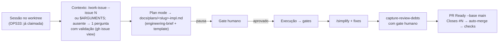

# Impl: Work-issue no paradigma de Issue já claimada (+ model-selection volta ao cardápio Cursor)

Status: aprovado
Atualizado em: 2026-08-10
Issue: #594
Intenção: docs/plans/work-issue-paradigma-issue-claimada.md
Appetite restante: herdado (~1–1,5 dia; entrega pura de skills/scripts/docs — sem schema/UI)

## Leitura da intenção

- **Outcome:** uma sessão `/work-issue` sem nenhum passo de verificação (sem claim, sem checagem de worktree/branch, sem checagem de modelo) — a skill assume o contrato "Issue já claimada, worktree correto, branch correta, modelo fixo" e vai direto ao impl plan → pausa humana → execução → simplify → débitos → PR.
- **O que NÃO negociar:** fluxo continua com impl plan → **pausa** → execução → `/simplify` → `capture-review-debts` **com gate humano** → PR Ready `--base main` + auto-merge; nunca claimar por conta própria; não duplicar a lógica de claim do pool; não virar guarda-costas (anti-goals).
- **O que reavaliar:** a hipótese listava `AGENTS.md` como área — verificada e **descartada**: o texto de claim do `worktree next` é do OPS33 (este item é o receptor, não o produtor); a única menção a work-issue no AGENTS.md é o bullet do launch (`/work-issue` já enviado), que continua válido.

## Abordagem recomendada

**Opções consideradas:** A) work-issue vira fluxo próprio que consome contexto do prompt/args; B) work-issue continua delegando a agent-work-issue só tirando o claim; C) fundir as duas skills.
**Recomendação:** A — o anti-goal da intenção proíbe "um terceiro fluxo", mas B mantém o acoplamento que a intenção quer quebrar ("deixa de ser a versão humana de agent-work-issue": o pool tem regras próprias — prep Cloud, sem pausa, débitos autônomos — e o humano tem gate humano, pergunta de contexto, validate do claim); C duplicaria as duas superfícies de operação (pool vs humano) numa só — o custo de falha do pool (claim coordenado) não cabe na skill humana.
**Rejeitadas:** B porque mantém "base de execução" e arrastaria Prep Cloud/débitos autônomos para a sessão humana; C porque misturaria contratos de atores diferentes.

### Componentes / mudanças

- **`.agents/skills/work-issue/SKILL.md`** (reescrever): descrição no frontmatter + fluxo próprio — (0) prep `pnpm i`; (1) contexto: número da Issue vindo de `$ARGUMENTS`/prompt da sessão (`--issue <N>` ou número puro — contrato OPS33); ausente → **uma** pergunta ao humano com validação (`gh issue view`: OPEN + label `in-progress` — claim é contrato do ambiente, nunca da skill; **checagem falhou → pare e peça o claim fora da skill**); plano de intenção recuperado do **body da Issue** (`Plano: [\`docs/plans/…\`]`— mesma regex`extractPlanPath`do pool; sem plano linkado → body é spec); (2) sem verificação de modelo —`model:`é metadata consultiva, sessão da máquina do humano é sempre Flash; (3) Plan mode →`\*-impl.md`(engineering-brief/implementation-template/decision-quality como **materiais de referência**, não pipeline herdado) → **PARA**; (4) após confirmação: execução →`/simplify`→`capture-review-debts`com gate humano → PR. **Extração do /simplify:** a mecânica de execução→fechamento (Passos 4–6) vira material compartilhado novo`execution-pipeline.md`(no diretório da work-issue), referenciado pelas duas skills com tabela de deltas por ator (branch, UI, modo do capture-review-debts, Cloud) — elimina a duplicação que o rewrite introduziria. Proibidos: DB de prod, merge sem CI green, editar Issues`in-progress` de outros, pular a pausa, Draft.
- **`.agents/skills/model-selection/SKILL.md`** (reescrever seções): remover ambiente Local/Zed, frontmatter `model-local:` e o mapeamento canônico `model:`→DeepSeek (tabelas + regras 3 e 8 + "Como aplicar" dual). Fica: cardápio só-Cursor (Composer 2.5 default; Grok 4.5 com effort obrigatório; Kimi K3 Low só exec bipartida), tabela pool×API Cloud, proibição `-fast`, heurística anti-viés, bipartição, "Issues muito complexas", e gates por fluxo atualizados: `work-issue` = **não verifica modelo** (contexto fixo; `model:` consultivo); `agent-work-issue` = pool fixou no spawn. Frontmatter description reescrito (sai "Toda Issue declara model-local"). Slug da Issue: `model:` único.
- **`.agents/skills/agent-work-issue/SKILL.md`** (edição pontual): remover "a base de execução de `work-issue`" (linha 14) e a linha da tabela de relação (`work-issue` | "Igual, mas claim + confirmação") → passar a descrever work-issue como fluxo humano próprio; Passo 2 (modelo) fica, com wording compatível com cardápio único. Passos 4–6 passam a referenciar o `execution-pipeline.md` compartilhado, com os deltas do ator pool (branch `agent/<id>-<slug>`, harden/optimize só sob gatilho, `capture-review-debts` autônomo com score ≥4, `ManagePullRequest` com `draft: false`).
- **`scripts/agent-claim.mjs`** (brief): linha `model:` → "(metadata consultiva — o fluxo work-issue não verifica modelo; o pool spawna nele; ver skill model-selection)"; linha "ausente" → "model: ausente — registrar slug único na Issue (gh issue edit; ver skill model-selection)". Resto do brief intacto (o claim continua existindo como script — transição + OPS33 o invoca).
- **`scripts/lib/agent-pool-prompt.mjs`** (uma linha): "a verificação assimétrica de work-issue não se aplica" → "o work-issue não verifica modelo — o spawn do pool já fixa o modelo". Header e demais strings intactos (unit tests pinam "NÃO rode agent:claim" e "agent-work-issue/SKILL.md" — não mudam).
- **`.opencode/commands/work-issue.md`** (description): "(claim → plano de implementação → pausa → execução → simplify → PR)" → "(Issue já claimada → plano de implementação → pausa → execução → simplify → PR)". Corpo e frontmatter `model:` intactos (guard `opencodeCommands.unit.spec.ts` só pina existência/name/$ARGUMENTS/model pin).
- **`docs/AGENT-OPS.md`** (linha Skills): "`work-issue` (humano: claim → impl plan → confirmação → execução)" → "(humano: Issue já claimada → impl plan → confirmação → execução)".
- **`docs/CHANGELOG-AGENTS.md`**: uma entrada no topo (entrega OPS32).
- **Migration:** sem migration. **Access/Consent:** N/A. **UI:** Impeccable A (skills de agente, sem superfície de produto).

### Dados → forma

- N/A — sem superfície de dados.

## Fases verificáveis

1. **Skills (cardápio + desacoplamento + reescrita)** — model-selection primeiro (fonte do cardápio), depois agent-work-issue (texto), depois work-issue (fluxo novo) e o command description. Verificação: grep repo-wide de `model-local` → só hits em docs/plans congelados de outras Issues (história) e no histórico do CHANGELOG — zero hits em código vivo/skills.
2. **Scripts + docs** — brief do claim, linha do pool prompt, AGENT-OPS, CHANGELOG. Verificação: unit tests do pool prompt e do guard opencodeCommands verdes sem edição; `pnpm gate:fast`.
3. **Gates de entrega** — `pnpm gate:fast` na iteração; entrega com `pnpm push` (não `git push` nu); `/simplify` completo no diff da sessão; `capture-review-debts` com gate humano.

## Rabbit holes / Não escopo (engenharia)

- **Editar a intenção** (`docs/plans/work-issue-paradigma-issue-claimada.md`): imutável (Issue `in-progress` desde o claim).
- **Texto de claim do `worktree next` / skill `worktree-next-issue` / `scripts/worktree.mjs`** ("claim continua sendo pnpm agent:claim", linha 368): é o OPS33 (produtor do claim) — este item é o receptor.
- **`plan-issue`**: verificado — Passo 4 já sugere slug único, zero menções a `model-local`; única mudança: a linha da tabela de relação (Passo "Divisão com as skills") passa a dizer "Issue já claimada" (achado do /simplify).
- **Mudar o comportamento do pool** (claim coordenado, `agent-pool-models.mjs`, spawn): intacto — `resolvePoolModel` só consome `model:` (verificado no código; unit tests pinam slugs Cursor).
- **Script novo para parsear `$ARGUMENTS`**: a skill é um documento — o agente parseia os args; criar runtime seria guarda-costas.
- **Editar impl plans congelados de outras Issues** que citam `model-local:` (ex. `porta-e2e-isolada-por-worktree-impl.md`, `c97-…-impl.md`): história, não código.
- **README.md / docs/roadmap.md**: fluxo genérico ("claim → PR") permanece verdadeiro; sem mudança.

## Riscos e mitigação

- **Remover `model-local` quebra o spawn do pool?** Não — `agent-pool-models.mjs` consome só `model:`; nenhum `.mjs` referencia `model-local` (grep). Mitigação: gate:fast cobre os unit do pool.
- **Sessão /work-issue sem número da Issue (fallback humano)**: pergunta única com validação `gh issue view` (OPEN + `in-progress`) — nunca claim; 1 round resolve (decisão de produto do gate 2026-08-10).
- **Drift do contrato com o OPS33**: este item define o **consumo** (`--issue <N>` ou número no prompt); o OPS33 define a **produção**; contrato explícito nas duas skills (`worktree-next-issue` + `work-issue`) para o merge de OPS33 não quebrar.
- **Sessão desta própria Issue (transição)**: já rodou `pnpm agent:claim` pelo fluxo antigo — transição esperada, documentada na intenção (claim fora da skill continua sendo `pnpm agent:claim` manual).

## Aceite de engenharia

- [x] Aceite de produto da intenção ainda coberto (skill sem claim/verificações; contexto do body; cardápio Cursor único; #582 fechado por eliminação da situação)
- [x] Invariantes AGENTS/engineering-standards (nada de DB/access/Consent/migration; docs são a entrega)
- [x] Testes de domínio previstos: unit existentes (pool prompt, opencode commands, worktree) verdes sem edição; sem unit novo (delta é texto/processo)
- [x] Self-score decision-quality: 5/5 (decisões com rejeitadas; cabe no appetite; rabbit holes nomeados; reusa contrato `extractPlanPath`; intenção preservada)
