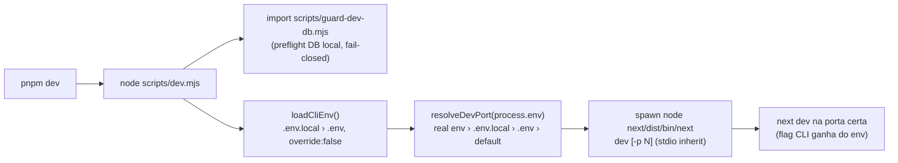

# Impl: worktree dev — `PORT` do `.env.local` honrado pelo `pnpm dev`

Status: aprovado
Atualizado em: 2026-08-11
Issue: #682 (OPS40)
Intenção: docs/plans/worktree-dev-port-nao-honrado.md
Appetite restante: herdado (~2–4h; a entrega é pequena, sobra verificação)

## Leitura da intenção

- **Outcome:** `pnpm dev` num worktree provisionado sobe em `3100+slot` (a porta do `.env.local`); dois worktrees em `pnpm dev` simultâneos não colidem; e2e (webServer com `PORT` explícito) e main repo (`pnpm dev` → 3000) intactos; ninguém precisa lembrar `-p`.
- **O que NÃO negociar:** env do processo do webServer do Playwright continua sendo a fonte que manda no e2e (injeção explícita de `PORT`); main repo sem `PORT` em lugar nenhum continua em 3000; guard de DB local (fail-closed) continua rodando antes do dev server.
- **O que reavaliar:** a hipótese "o problema é o `next dev` ignorar env-file" está **confirmada e com causa exata** — o CLI do Next 15.4.11 resolve a porta via `commander` `.option('-p, --port').env('PORT')` em `next/dist/bin/next` (linha 92), **antes** de `@next/env` carregar `.env.local`; o `env('PORT')` do commander só enxerga o env real do processo. A porta precisa ir como **flag CLI** `-p`. O wrapper do candidato (a) é o caminho certo; refinei os detalhes (guard inline, helpers puros unit-testados, spawn direto do bin do Next).

## Abordagem recomendada

**Opções consideradas:** A (wrapper `scripts/dev.mjs`) | B (`next.config` `port`) | C (shell one-liner com `grep` no `.env.local`) | D (upstream Next)
**Recomendação:** A — causa raiz é o parse da porta antes do env-file; a única alavanca que o repo controla é entregar a porta como flag CLI. O wrapper é um ponto único, testável e não exige que ninguém lembre de nada.
**Rejeitadas:**

- **B** — `next.config` também é avaliado dentro do mesmo bootstrap que já ignorou o env-file para a porta; `port` no config lê `process.env` na mesma ordem problemática (e nem existe `port` de dev no config do Next 15.4 que valha). Mesma classe de bug, sem ganho de evidência.
- **C** — duplica parsing de `.env.local` (semântica de aspas/comentários do dotenv), quebra precedência real-env-vs-arquivo, frágil no shell.
- **D** — upstream, fora de controle; o wrapper sobrevive a mudanças do Next (se um dia `PORT` de env-file for honrado, o wrapper vira no-op correta).

### Componentes / mudanças

- **`resolveDevPort` / `nextDevArgs`** (`scripts/lib/cli.mjs`, novos exports puros): `resolveDevPort(env)` → `number | null` (`null` = sem `-p`, Next decide o default 3000; inválido não-vazio → `Error` fail-closed, ex.: `PORT=abc`); `nextDevArgs(port)` → `['dev']` ou `['dev', '-p', String(port)]`. Reusa o padrão de "derivação pura unit-testada" de `scripts/lib/worktree-env.mjs`.
- **`scripts/dev.mjs`** (novo, wrapper): importa `guard-dev-db.mjs` (o preflight roda inline; `process.exit(1)` do guard derruba tudo — mesmo fail-closed de hoje), chama `loadCliEnv()`, resolve a porta, e dá `spawn(process.execPath, [require.resolve('next/dist/bin/next'), ...nextDevArgs(port), ...extras], { stdio: 'inherit', env: { ...process.env, NODE_OPTIONS: '--no-deprecation' } })` — paridade exata com o `cross-env NODE_OPTIONS=--no-deprecation` atual. Forward de SIGINT/SIGTERM/SIGHUP + propagação de exit code. `process.argv.slice(2)` passa extras (ex.: `--turbopack`) depois do `-p` derivado (último vence no parser do commander; contrato preservado).
- **`package.json`**: `dev` → `node scripts/dev.mjs`; `devsafe` → `rm -rf .next && node scripts/dev.mjs`. `cross-env` continua em uso por build/lint/etc.
- **Migration:** sem migration (nenhum schema).
- **Access / Consent:** N/A.
- **UI:** N/A (Impeccable A).

### Precedência da porta (contrato)

1. `process.env.PORT` real (webServer do Playwright injeta — e2e continua dono da porta);
2. `PORT` do `.env.local` (provisionador do worktree);
3. `PORT` do `.env` (sem uso hoje, mas simétrico);
4. nenhum → sem `-p` → Next default 3000 (main repo intacto; `allowRetry` do Next continua ativo só neste caso — comportamento atual preservado).

## Fases verificáveis

1. **Helpers puros** — `resolveDevPort`/`nextDevArgs` em `scripts/lib/cli.mjs` + `tests/unit/devPort.unit.spec.ts` (casos: ausente→null, `3140`→3140, espaço em volta→trim, `0`/`abc`/`65536`→throw, `65535`→ok; args com/sem `-p`). `pnpm test:unit`.
2. **Wrapper + scripts** — `scripts/dev.mjs` + package.json. Verificação manual: `pnpm dev` neste worktree (`.env.local` `PORT=3140`) → log "Local: http://localhost:3140"; e2e dev-mode smoke (`pnpm test:e2e` com `--grep` curto) provando o caminho webServer→wrapper→porta certa.
3. **Docs + gates** — AGENTS.md (menção ao wrapper no contrato de worktrees + no bullet do guard), entrada curta no `docs/CHANGELOG-AGENTS.md`, status do plano de intenção. Gates: `gate:fast` + `format:check` + `knip` + `check:cycles`.

## Rabbit holes / Não escopo (engenharia)

- Não carregar `.env.local` duas vezes com ordens conflitantes — `loadCliEnv` já é idempotente (`override:false`); o wrapper usa a MESMA fonte do provisionador.
- Não dar prioridade ao `.env.local` sobre o env real — e2e perderia a porta forçada (rabbit hole apontado na intenção; a precedência acima o elimina estruturalmente).
- Não mexer no guard (`guard-dev-db.mjs` continua standalone e é quem decide o DB).
- Fora de escopo: `next start`/`pnpm start` (e2e prod-mode usa 3000 e `PORT` real — intocado), re-provisionamento de worktrees existentes, e os marcadores de conflito não resolvidos no `AGENTS.md` em `main` (pré-existentes — ver Riscos).

## Riscos e mitigação

- **Colisão de porta real (EADDRINUSE) vira erro alto em vez de retry silencioso** — desejado: worktree colidindo deve falhar alto com o número da porta, não migrar sozinho (contrato `3100+slot`). `allowRetry` do Next só ativa no source `default` (sem `-p`), exatamente o caso do main repo. Mitigação: mensagem de erro clara do Next basta.
- **`AGENTS.md` em main tem conflito commitado (OPS33/OPS37)**: não é deste escopo e há Issue de main-mess (OPS38) em aberto para a área — registrar como débito no capture-review-debts, não resolver aqui.
- **NODE_OPTIONS** — paridade com o cross-env atual (substitui, não concatena).
- **Windows** — não é alvo do repo; `spawn` via `process.execPath` + bin do Next é neutro de plataforma de qualquer forma.

## Aceite de engenharia

- [x] Aceite de produto da intenção ainda coberto (porta do worktree honrada; e2e e main intactos)
- [x] Invariantes AGENTS/engineering-standards (guard fail-closed preservado; helpers puros unit-testados)
- [x] Testes de domínio previstos (unit `devPort.unit.spec.ts`; verificação manual do caminho real)
