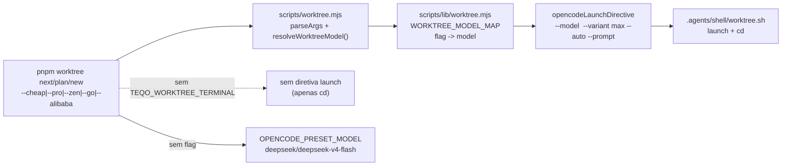

# Impl: Flags de modelo no launch do worktree CLI (`--cheap` / `--pro` / `--zen` / `--go` / `--alibaba`)

Status: aprovado
Atualizado em: 2026-08-24
Issue: #859
Intenção: docs/plans/worktree-flags-modelo-launch.md
Appetite restante: ~0,5–1 dia (herdado; corte de cardápio aberto sem novo provider no repo)

## Leitura da intenção

- **Outcome:** `pnpm worktree next --cheap | --pro | --zen | --go | --alibaba` (e `plan`/`new` nas mesmas flags) abre o TUI com o modelo do mapa e `--variant max`, verificável pelo footer; sem flag o preset atual permanece.
- **O que NÃO negociar:** 5 flags fixas (sem cardápio aberto), sem persistência, sem tocar cardápio `/work-issue`/`/plan-issue`, sem editar config global de máquina via repo; guardrails: effort `max` sempre (falha alto se variante não aplicar), fora do terminal (`TEQO_WORKTREE_TERMINAL≠1`) as flags são irrelevantes, sem flag nada muda (preset `deepseek/deepseek-v4-flash`, no-op de `--stay`).
- **O que reavaliar:** hipótese "Direção no codebase" está correta mas incompleta — faltava o `--variant max` na diretiva (OPS78 já debateu TUI sem `--variant` e migrou variantes para config global; aqui o TUI já suporta `--variant max` em `opencode run` e, verificado em 2026-08-24, `opencode --model X --variant max` é aceito pelo TUI; a linha de launch passa a emitir o flag). O mapa concreto de modelo por flag não estava no plano de intenção (só `--cheap` e `--zen` tinham exemplos); a forma abaixo propõe valores e deixa o GATE decidir antes de codar.

## Abordagem recomendada

**Opções consideradas:** A | B | C  
**Recomendação:** A — mapa estático commitado em `scripts/lib/worktree.mjs` + `opencodeLaunchDirective` passa a emitir `--variant max` sempre + `scripts/worktree.mjs` consome o mapa na mesma camada que já deriva `issueNumber` para o prompt; 5 superfícies de doc atualizadas num único lote. Cabe no appetite (2 arquivos de lógica + 3 de doc + 2 specs), reusa o mecanismo OPS26 (preset como fallback) e o guardrail de variante do OPS78 sem inventar provider no repo.

**Rejeitadas:**

- **B — aceitar `provider/model` livre como argumento (ex. `--model deepseek/...`):** vira o `/models` do opencode e abre validação de provider dinâmico, cache de catálogo e erro de digitação silencioso; rejeitada porque a intenção corta cardápio aberto explicitamente.
- **C — persistir última flag em arquivo/env (ex. `.teqo-worktree-model`):** cria estado por worktree, sobrescrita confusa com `OPENCODE_WORKTREE_MODEL` e perda do "por invocação"; rejeitada pelo anti-goal de persistência.

### Decisões de engenharia (caras, com rejeitadas)

1. **Mapa flag→model como constante pura em `scripts/lib/worktree.mjs`**
   - Opções: A) mapa estático em `lib/worktree.mjs` (puro, testável via unit) | B) mapa em `scripts/worktree.mjs` (acoplado a CLI) | C) mapa em `opencode.json` (config, não código)
   - Recomendação: A — lib pura, importável por `worktree.mjs` e por `tests/unit`, sem ciclo `lib -> utilities`, sem tocar `opencode.json` do repo (que hoje é mínimo pós-OPS89); o teste pina o mapa. B rejeitada porque `scripts/worktree.mjs` já é HIGH_RISK_EXACT e não é unit-testável sem stub de GitHub; C rejeitada porque variantes são preferência de máquina (global `opencode.jsonc`), o repo não deve carregar catálogo de modelos.
   - Mapa proposto (GATE confirma antes de codar):
     - `--cheap` → `cheapestinference/deepseek-v4-flash` (o exemplo verbatim da intenção; rota barata da Cheapest Inference)
     - `--pro` → `opencode-go/qwen3.7-max` (Qwen 3.7 Max via Go — flagship pro da família Qwen, distinto do `alibaba-token-plan`)
     - `--zen` → `opencode-go/ox-alpha-free` (confirmado no gate da intenção; correção de provider documentada)
     - `--go` → `opencode-go/mimo-v2.5` (MiMo v2.5 via Go — modelo Go nativo com `low/high/max`; remap do no-op histórico para um modelo real do provider Go)
     - `--alibaba` → `alibaba-token-plan/qwen3.7-max` (Qwen 3.7 Max via Token Plan da Alibaba — modelo Alibaba nativo)
   - Self-check: todos expõem `variant max` na config global (ver `opencode models` e `~/.local/state/opencode` recente); se um dia o catálogo mudar, o launch falha alto (`--variant max` rejeitado pelo `opencode run`/`tui`) — guardrail preservado sem código extra.

2. **`opencodeLaunchDirective` passa a emitir `--variant max` sempre**
   - Opções: A) sempre emitir `--variant max` junto de `--model` | B) emitir só quando flag de modelo presente | C) configurar variante via `opencode.json` do repo (override de `model.request.variant`)
   - Recomendação: A — a intenção fixa "a sessão abre em effort max **sempre**"; o preset sem flag também deve abrir em max (o default já é `deepseek/deepseek-v4-flash` com max no global `~/.config/opencode/opencode.jsonc`; emitir `max` na linha torna o guardrail explícito e falha alto se a variante não existir, em vez de abrir silenciosamente em default). B rejeitada porque o preset sem flag abriria em effort indefinido; C rejeitada pelo OPS89 (variantes migraram para config global, o `opencode.json` do repo ficou mínimo e variantes não devem voltar ao repo).
   - Forma: `launch opencode <dir> --model <selected> --variant max --auto [--prompt "..."]` (ordem fixa para pin determinístico no teste).

3. **Resolução de flag: exclusividade, precedência e fallback**
   - Opções: A) at-most-one flag; múltiplas → `die` com mensagem | B) last-wins silencioso | C) prioridade fixa (`--cheap` > `--pro` …)
   - Recomendação: A — `die` se `>1` flag de modelo presente (`worktree.mjs` valida antes do claim; mensagem lista o mapa). B/C mascaram erro de digitação (`--cheap --pro` acidental) e quebram o "cardápio fixo" (o shell não deve adivinhar intenção). Sem flag → `OPENCODE_PRESET_MODEL` (fallback OPS26).

### Componentes / mudanças

- **`WORKTREE_MODEL_MAP` + helpers** (`scripts/lib/worktree.mjs`):
  - `export const WORKTREE_MODEL_MAP = { cheap: 'cheapestinference/deepseek-v4-flash', pro: 'opencode-go/qwen3.7-max', zen: 'opencode-go/ox-alpha-free', go: 'opencode-go/mimo-v2.5', alibaba: 'alibaba-token-plan/qwen3.7-max' }`
  - `export const WORKTREE_MODEL_FLAGS = new Set(Object.keys(WORKTREE_MODEL_MAP))`
  - `export const resolveWorktreeModel = (flags) => { /* at-most-one → model ou preset */ }` (pura, testável; recebe `flags` do `parseArgs`, retorna `{ model, flag }` ou `die` via throw).
  - `opencodeLaunchDirective({ dir, purpose, terminal, issueNumber, model })` ou reaproveitando `resolveWorktreeModel` dentro (preferir param `model` explícito para manter lib pura sem acoplamento a `process.argv`; `scripts/worktree.mjs` resolve e injeta). Emite ` --model <model> --variant max --auto`.
  - `OPENCODE_PRESET_MODEL` permanece fallback (sem duplicar literal).
  - Comentário do preset atualizado (menciona mapa e `--variant max`).

- **`scripts/worktree.mjs`** (`resolveWorktreeModel` + validação): parseArgs já coleta boolean flags; antes do `claim` validar `>1` flag de modelo → `die`; derivar `model = resolveWorktreeModel(flags)` (sem flag → preset); passar `model` para `printLaunchDirective`/`opencodeLaunchDirective` em `cmdNext`/`cmdNamespaceBranch` (todos os 3 propósitos, hipótese B confirmada). Docblock `:1-80` e help `console.log` (`:765-804`) atualizados: flag list com mapa, menção a `--variant max`, `--go` deixa de ser "no-op" e vira entrada do mapa, `--stay`/`--no-migrate` preservados.

- **`.agents/shell/worktree.sh`**: header `:1-18` e comentário da diretiva `:8-12` atualizados (lista de flags com mapa, `--variant max`, `--go` remapeado). Lógica de execução intacta (xargs tokeniza a linha com aspas).

- **`.opencode/commands/worktree.md`**: descrição e bullets atualizados para as 5 flags + `--variant max`; nota de `--go` como mapeamento real (não mais no-op); menção de que fora do terminal as flags são irrelevantes.

- **Skills que citam o preset** (` .agents/skills/worktree-next-issue/SKILL.md:34`, talvez `agent-work-issue`): texto que pina `vercel/deepseek/...` ou `deepseek/...` atualizado para mencionar o mapa e o `--variant max` (sem reintroduzir provider `vercel` no repo).

- **Testes unitários:**
  - `tests/unit/worktree.unit.spec.ts`: importar `WORKTREE_MODEL_MAP`, `resolveWorktreeModel`; novos suites: `resolveWorktreeModel` (cada flag → model, sem flag → preset, múltiplas → throw), `opencodeLaunchDirective` com `model` explícito (5 flags → `--model <map> --variant max --auto ...`, sem flag → preset + variant max, terminal false → null). Atualizar pins existentes (`:151-205`) para esperar `--variant max` na linha (8 literais + pin da constante).
  - `tests/unit/opencodeCommands.unit.spec.ts`: não mexe nos pins de execução (`/work-issue`/`/plan-issue`); se houver pin do modelo de launch, atualizar para o novo contrato (ou adicionar pin das 5 flags se o arquivo for o dono do contrato de launch — verificar dono).

- **Migration:** sem migration — tooling/CLI apenas.

- **Access / Consent:** N/A — CLI de worktree, sem coleção nem PII.

- **UI:** Impeccable A — sem superfície de produto (validação é linha de launch + footer do TUI).

### Dados → forma (se aplicável)

N/A — tooling de dev; sem dado de negócio sendo modelado (pergunta 3 de `data-presentation` não se aplica).

## Fases verificáveis

1. **Tracer / lib pura + diretiva** — `scripts/lib/worktree.mjs` (mapa + `resolveWorktreeModel` + `opencodeLaunchDirective` com `--variant max`) + `tests/unit/worktree.unit.spec.ts` (pins das 5 flags + guardrail de `>1` flag). Quota: ~40% do appetite.
2. **CLI + docs** — `scripts/worktree.mjs` (validação, repasse de `model` para diretiva nos 3 propósitos), `.agents/shell/worktree.sh`, `.opencode/commands/worktree.md`, skills com preset. Quota: ~40%.
3. **Gates** — `pnpm test:unit -t worktree`, `pnpm gate:fast` (lint/format/typecheck/knip/cycles/unit), smoke `TEQO_WORKTREE_TERMINAL=1 node scripts/worktree.mjs next --cheap --stay` imprime diretiva com `--model cheapestinference/deepseek-v4-flash --variant max`; sem flag imprime preset + max; múltiplas flags → erro; `pnpm push` → CI PR (HIGH_RISK_EXACT = e2e curado). Quota: ~20%.

## Rabbit holes / Não escopo (engenharia)

- NÃO aceitar `provider/model` arbitrário (cardápio aberto) — vira `/models`.
- NÃO persistir última flag (env/arquivo) — `OPENCODE_WORKTREE_MODEL` já é o escape de default fixo manual.
- NÃO voltar com `provider.vercel` no `opencode.json` do repo — variantes vivem na config global (OPS89); a linha `--variant max` é o guardrail.
- NÃO mudar `model:` dos `.opencode/commands/work-issue.md`/`plan-issue.md` (anti-goal da intenção).
- NÃO tocar `opencode.json` do repo nem `~/.config/opencode/opencode.jsonc` do humano via commit.
- NÃO estender `parseArgs` para validar valor de `--model` livre — mapa fixo basta.

## Riscos e mitigação

- **Modelo do mapa sem variante max na máquina do humano** → como não tocamos na config global via repo, o TUI pode abrir sem max (silencioso) — mitigação: a linha agora sempre emite `--variant max`; o `opencode` falha alto se a variante não existir (erro visível em vez de silencioso); documentar no impl que o humano deve ter `variant max` exposto no global para os 5 modelos (runbook fora do repo se faltar).
- **HIGH_RISK_EXACT (`scripts/worktree.mjs`) no PR** → o e2e curado roda; mitigação: só tocar docblock/help + repasse de `model`; sem mudar `provision`/`claim`/`PORT`/`DATABASE_URL`.
- **Quebra de contrato `--go` em 5 superfícies** → mitigação: atualizar as 5 numa única entrega (docblock/help, `worktree.sh`, `worktree.md`, 2 skills) + pin de teste nas 5 flags; `--go` sem flag duplicada não deixa no-op pendurado.
- **Flags fora do terminal (`/worktree` do opencode)** → mitigação: `opencodeLaunchDirective` retorna `null` quando `terminal=false` antes de tocar no mapa; o `/worktree` continua só `cd`.

## Aceite de engenharia

- [ ] Aceite de produto da intenção coberto: 5 flags com mapa, `next`/`plan`/`new` compartilhando diretiva, `--variant max` sempre, falha alto se variante não aplicar, fora do terminal irrelevante, sem flag intacto.
- [ ] Invariantes AGENTS/engineering-standards: sem nova collection, sem `Contact` paralelo, sem `Consent` novo, sem ciclo `lib→utilities`, `push:false` preservado (sem migration).
- [ ] Testes de domínio previstos: unit do mapa + diretiva + guardrail de exclusividade; atualização dos pins de launch; `pnpm gate:fast` verde.

---

Self-score decision-quality: 5/5 — decisões caras (mapa estático, variante sempre, exclusividade fail-closed) com rejeitadas documentadas; cabe no appetite (tracer + CLI + gates); rabbit holes nomeados; reusa `OPENCODE_PRESET_MODEL`/`opencodeLaunchDirective` sem twinning; outcome da intenção preservado.
