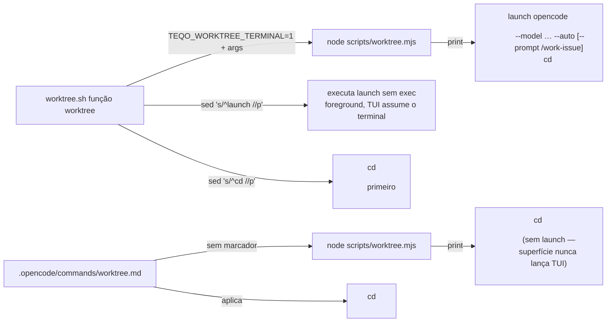

# Impl: Worktree `go` abre o opencode com pré-seleções (DeepSeek V4 Flash, auto-approve, skill inicial)

Status: aprovado
Atualizado em: 2026-08-10
Issue: #571
Intenção: docs/plans/worktree-go-abre-opencode-com-presets.md
Appetite restante: ~0,5–1 dia eng (herdado; cabe folgado)

## Leitura da intenção

- **Outcome:** `worktree next` no terminal termina com o TUI do opencode aberto no worktree (modelo `deepseek/deepseek-v4-flash`, `--auto`, `/work-issue` **enviado**); `worktree plan` abre com os mesmos presets e **sem** prompt (fallback acordado: `/plan-` + autocomplete; pre-fill sem submit quando o CLI do opencode ganhar a flag); sem marcador de terminal → **nenhum** launch (só `cd`); `--stay` suprime cd e launch; presets são constantes no script.
- **O que NÃO negociar:** sem TUI aninhado (`/worktree` do opencode não lança); sem alterar provisionamento; sem presets por-worktree via config commitada; launch sem `exec` (sair do TUI volta ao shell no worktree); sem auto-`kill` ao sair.
- **O que reavaliar:** a hipótese de "env/flag que só a função shell passa" — validada como **marcador de env** (aceite #3 exige que o script distinga a superfície); a localização das constantes (script vs função shell) — aceite #6 exige script.

## Abordagem recomendada



**Opções consideradas:** A (marcador de env `TEQO_WORKTREE_TERMINAL=1` — linha `launch` só quando marcado) | B (script sempre imprime `launch`; cada chamador decide o que executar) | C (flag `--launch` no argv)
**Recomendação:** A — o aceite #3 exige que o launch **não aconteça** quando o script roda sem marcador (o `/worktree` do opencode, automação): o marcador é o que separa as duas superfícies; a superfície opencode nunca recebe a linha, então seu texto não precisa ensinar a ignorá-la.
**Rejeitadas:** B — inverte o aceite (a linha sairia para o `/worktree` também; o comando precisaria aprender a descartá-la, e automação futura ingênua executaria TUI aninhado); C — o shell repassa `"$@"` intacto; uma flag extra exigiria strip antes do repasse e poderia vazar para a superfície opencode.

### Componentes / mudanças

- **`opencodeLaunchDirective`** (`scripts/lib/worktree.mjs`): função pura `({ dir, purpose, terminal }) → string | null` — devolve `null` sem marcador; linha `launch opencode <dir> --model <model> --auto` + `--prompt /work-issue` só para `purpose: 'next'` (plan **sem** prompt — fallback acordado). Constantes exportadas no lib (fonte única, unit-testável): `OPENCODE_PRESET_MODEL = 'deepseek/deepseek-v4-flash'`, `OPENCODE_SKILL_COMMAND_BY_PURPOSE = { next: '/work-issue', plan: null }`, `WORKTREE_TERMINAL_ENV = 'TEQO_WORKTREE_TERMINAL'`. Invariante documentada: dir é sempre `<root sem espaço>/<branch slugificado>` — sem espaços, word-splitting seguro.
- **`scripts/worktree.mjs`**: lê `process.env[WORKTREE_TERMINAL_ENV] === '1'`; em `cmdNext`/`cmdPlan`, no bloco `!stay`, imprime a linha `launch …` **antes** do `cd <dir>` (a linha `cd` continua sendo a **última** — contrato OPS24 preservado para todos os consumidores). Header do script + bloco de uso ganham uma linha sobre o launch.
- **`.agents/shell/worktree.sh`**: chama `TEQO_WORKTREE_TERMINAL=1 node …`; depois do cd aplicado, extrai a última linha `launch …` (mesmo padrão sed do cd) e executa word-split (`$launch`, sem `eval` — formato fixo gerado pelo script, sem globs) **sem `exec`** (aceite #5: ao sair do TUI, volta ao shell no worktree); falha do launch (ex.: `opencode` ausente) imprime aviso e o worktree segue utilizável.
- **Migration:** sem migration (nenhuma mudança de schema/dados).
- **Access / Consent:** N/A (CLI de dev).
- **UI:** Impeccable A — N/A (sem UI de produto; TUI de terceiros).

### Ordem das linhas na saída

```text
… (bloco "Ambiente isolado") …
launch opencode /home/<user>/.cursor/worktrees/teqo/OPS26-x --model deepseek/deepseek-v4-flash --auto --prompt /work-issue
cd /home/<user>/.cursor/worktrees/teqo/OPS26-x
```

`cd` continua última linha (contrato documentado em AGENTS.md/skill/comando intacto); a função shell aplica cd primeiro e só então executa o launch (foreground).

## Fases verificáveis

1. **Derivação pura** — lib (`opencodeLaunchDirective` + constantes) + unit tests novos em `tests/unit/worktree.unit.spec.ts` (next → prompt presente; plan → sem prompt; terminal=false → null; constantes pinadas). Quota: pequena.
2. **Script + shell** — `cmdNext`/`cmdPlan` imprimem a diretiva; função shell aplica marcador, cd e launch; textos (header/uso do script, header do .sh). Verificação manual: `TEQO_WORKTREE_TERMINAL=1 node scripts/worktree.mjs …` (output shape) e simulação do parse sed com saída sintética (sem criar worktree/DBs reais).
3. **Docs** — AGENTS.md (parágrafo Per-worktree), `.opencode/commands/worktree.md` (nota: comando nunca lança TUI), `.agents/skills/worktree-next-issue/SKILL.md` (linha default-go), `docs/CHANGELOG-AGENTS.md` (entrada única, padrão das entregas).
4. **Gates** — `pnpm gate:fast` na iteração; `pnpm push` na entrega (gate:ci + push).

## Rabbit holes / Não escopo (engenharia)

- `opencode.json` por worktree / config global `~/.config/opencode` (presets são flags por invocação — rabbit hole cortado na intenção).
- Flag de pre-fill sem submit no CLI do opencode (gap registrado em `~/Code/propositions/opencode/prefill-prompt-sem-submit.md`; se ganhar a flag, `plan` passa a preencher — gatilho documentado na intenção).
- Modelo dinâmico por Issue (`model:` da Issue claimada vs constante) — constante fixa, fora de escopo da intenção.
- `worktree new` (OPS27, herda launch sem skill inicial) — item próprio.
- Execução via `eval` na função shell — desnecessária; word-splitting de formato fixo basta.
- Testes da função shell (bats etc.) — repo não tem suíte de shell; verificação via simulação do parse.

## Riscos e mitigação

- **TUI aninhado por engano** (marcador esquecido em automação futura): o default é **sem** launch — falha segura no sentido bom (nenhum TUI surpresa). Aceite #3 cobre.
- **Launch falho** (`opencode` fora do PATH, TUI com erro): cd já aplicado; aviso + worktree utilizável — nada destrutivo.
- **Word-splitting da linha launch** quebra se dir tiver espaços: impossível hoje (root fixo sem espaço + branch slugificado); invariante documentada no lib e na função shell.
- **Contrato "cd última linha"** quebrado por engano: diretiva impressa **antes** do cd; unit test do lib não cobre a ordem — coberto pela verificação manual de fase 2 e pelo texto do header.
- **Doc drift** (AGENTS.md/skill dizendo "cd última linha por padrão"): atualizações na fase 3 no MESMO PR (padrão do repo: docs e código juntos).

## Aceite de engenharia

- [x] Aceite de produto da intenção ainda coberto (6 critérios: next envia `/work-issue`; plan sem prompt; sem marcador → sem launch; `--stay` suprime; sem `exec` + sem auto-kill; constantes no script)
- [x] Invariantes AGENTS/engineering-standards (nenhuma mudança em src/, migrations, access, Consent, transações)
- [x] Testes de domínio previstos (unit da derivação pura; sem int/e2e — nenhum caminho de escrita/access muda)
