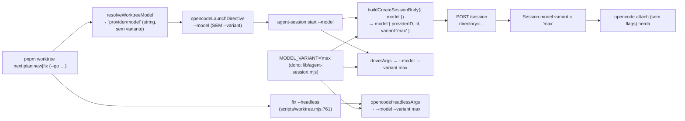

# Impl: `pnpm worktree … --go` abre a sessão no DeepSeek V4.1 Flash (`opencode-go`) na variante `max`

Status: aprovado
Atualizado em: 2026-09-18
Issue: #1149
Intenção: docs/plans/worktree-go-variant-max.md
Appetite restante: herdado (~0,5 dia eng — plumbing de launch + textos + pins). Sem migration, sem schema, sem UI, sem DB.
Modo: autônomo (`--auto`) — impl plan nasce aprovado pelo agente.

## Leitura da intenção

- **Outcome:** todo lançamento de worktree (`next`, `plan`, `new`, `fix` — inclusive `fix --headless`/auto-unblock e o preset sem flag) cria a sessão do servidor com `Session.model.variant === 'max'` para o modelo selecionado, e `--go` continua em `opencode-go/deepseek-v4.1-flash`. Verificável no body de `POST /session` virado `Session.model.variant`, no argv do driver/headless e nos pins unitários. A TUI anexada (`opencode attach`, sem flag) herda.
- **O que NÃO negociar:**
  - Nenhuma flag `--variant` no `opencode attach` nem na diretiva `launch` (o yargs do TUI rejeita o flag — veto OPS95).
  - Config global da máquina (`~/.config/opencode/…` / Ctrl+T) intocada; `opencode.json` do repo intocado.
  - Lançamento nunca quebra por variante: nenhum lookup/`throw` local por capacidade de modelo; o literal é constante.
  - Cardápio/modelos tocados **só** na variante — `WORKTREE_MODEL_MAP`/`OPENCODE_PRESET_MODEL` inalterados (OPS112 deixa `go = opencode-go/deepseek-v4.1-flash`).
  - Docs históricos congelados (`docs/plans/*` anteriores, HISTORY) intocados.
- **O que reavaliar:** a hipótese "variante nunca entra na diretiva" permanece correta, mas o dono da variante **não** é `resolveWorktreeModel` (que segue devolvendo string `provider/model`); é `scripts/lib/agent-session.mjs` (dono do ciclo de vida da sessão). Reavalia-se também a hipótese de guardar `variant` no estado: **não** guardar (ver D2). O sintoma "nem no provider correto" já foi atacado pela OPS122 (`createSession` passa o modelo no body); a variante não altera esse caminho — a verificação viva fica no aceite.

## Abordagem recomendada

**Opções consideradas:** A | B | C | D
**Recomendação:** **A — variante como constante `MODEL_VARIANT = 'max'` aplicada **dentro** de `scripts/lib/agent-session.mjs`** (body da sessão + argv do driver) e reusada por `opencodeHeadlessArgs` em `scripts/lib/worktree.mjs`. A diretiva `launch`/`attach` permanece model-only. É a única opção que (1) faz a variante chegar à sessão pelo caminho já validado pela OPS122 (`POST /session`), (2) mantém o pin "diretiva sem `--variant`" verdadeiro (nenhum flag novo no TUI), (3) cobre **todos** os propósitos — terminal, driverless, driver e headless — com um único dono de literal, e (4) cabe no appetite (poucas linhas + textos/pins).

**Rejeitadas:**

- **B — `--variant` roteado pela diretiva `opencodeLaunchDirective` até o CLI de sessão.** Rejeitada: reintroduz o flag no canal tokenizado da diretiva/TUI (a classe exata da quebra OPS95 — yargs do TUI rejeita flag desconhecida) e torna a diretiva inconsistente com o attach, que continua sem o flag. A variante é atributo do _modelo da sessão_, não um parâmetro de linha do TUI.
- **C — mapa de capacidade por modelo (só enviar `max` a quem suporta).** Rejeitada: over-engineering; a intenção corta explicitamente a revisão do cardápio e diz que `max` é a única variante, em todos os propósitos. Um mapa seria mais um lugar para divergir do provider real.
- **D — variante só no body da sessão, sem argv no driver/headless.** Rejeitada: o driver é um `opencode run` separado (`driverArgs`, `opencodeHeadlessArgs`) — sem `--variant` ele abriria no variant default e divergiria da sessão; o aceite exige **todos** os lançamentos.

**Decisões caras registradas:**

- **D1 — Dono do literal:** `scripts/lib/agent-session.mjs` exporta `MODEL_VARIANT = 'max'`; `scripts/lib/worktree.mjs` o importa no import já existente com `assertKnownFlags, SKILL_AUTO_FLAG` (`lib/worktree.mjs:10`) e o usa em `opencodeHeadlessArgs`. `worktree.mjs` e o CLI `agent-session.mjs` **não** re-spelam `'max'` (single source).
- **D2 — Estado da sessão continua `model` string, variante implícita.** Não gravar `variant` no estado: a variante é constante global; registrá-la forçaria migrar estados antigos (sem `variant`) e a checagem de reuso (`agent-session.mjs:520`) passaria a falhar fechado por diferença de `undefined`, quebrando reuso de runs vivos. **Gatilho de revisitação:** se um dia existir uma segunda variante real ou seleção por sessão, aí sim gravar e comparar.
- **D3 — Posição do flag no argv headless:** `['opencode','run','--model',model,'--variant',MODEL_VARIANT,'--auto','--command',command, report]` — `--variant` **antes** do `report` posicional (não pode ir depois, viraria argumento do report). Pin de array exato no teste.
- **D4 — Guardrail "nunca quebra":** a variante entra como propriedade string constante; helpers seguem puros (aceitam/devolvem string, sem lookup que lance). Se um modelo do cardápio não declarar `max`, o servidor persiste o que recebe e o provider decide — comportamento do upstream, não do nosso launch. Verificação viva dos modelos usados nos gates.

### Componentes / mudanças

- **`MODEL_VARIANT`** (`scripts/lib/agent-session.mjs`, novo, acima de `buildCreateSessionBody`): `export const MODEL_VARIANT = 'max'` + docblock citando 1.18.31 (`Session.model.variant`) e o porquê de não ir no attach (OPS95/OPS127).
- **`buildCreateSessionBody`** (`scripts/lib/agent-session.mjs:245-248`): assinatura inalterada `({ model = null } = {})`; quando há modelo, retorna `{ model: { ...parseModelRef(model), variant: MODEL_VARIANT } }` (variante incondicional — sem parâmetro de override); sem modelo segue `{}`. Trocar o comentário "No `variant` (OPS95: variants stay on the machine's global config)" (`:242`) pela nova semântica.
- **`driverArgs`** (`scripts/lib/agent-session.mjs:368-394`): inserir `'--variant', MODEL_VARIANT` imediatamente após `--model <model>` (antes de `--auto`), incondicional. Nenhum parâmetro de override, nenhum `throw` novo (simplify pós-revisão: override era generalidade especulativa — sem caller de produção).
- **`opencodeHeadlessArgs`** (`scripts/lib/worktree.mjs:333-345`): inserir `'--variant', MODEL_VARIANT` após o modelo; importar `MODEL_VARIANT` de `./agent-session.mjs` na linha `:10`. `headlessDirective` (`:351-356`) herda o argv sem mudança própria.
- **CLI `createSession`/`cmdStart`** (`scripts/agent-session.mjs:272-279`, `:468-572`): **sem mudança de código** — `buildCreateSessionBody({ model })` já ganha o default e `driverArgs({ …, model, invocation })` também; o estado `model` (`:538`) permanece string (D2).
- **Migration:** sem migration — tooling de launch; nenhum schema/coleção Payload muda.
- **Access / Consent:** N/A — nenhum dado de cidadão, login de campanha ou Consent envolvido.
- **UI:** N/A — nenhum componente Next/Payload. O TUI do opencode é consumidor externo (sem superfície de design; Impeccable A).

### Dados → forma (se aplicável)

N/A — tooling. Não há dado de negócio modelado; a mudança é uma constante de variante aplicada ao body da sessão e ao argv do driver. Perguntas de data-presentation não se aplicam.

## Pins de teste a atualizar (valores exatos)

**`tests/unit/agentSession.unit.spec.ts`:**

- **L328-337** (`buildCreateSessionBody` com modelo) — passa a esperar:
  `{ model: { providerID: 'opencode-go', id: 'deepseek-v4.1-flash', variant: MODEL_VARIANT } }` (referência à constante; o literal é pinado à parte).
  Os casos `null`/`undefined`/`{}`/`{}` (L332-335) seguem `{}`; o `throw` de `'no-slash'` (L336) inalterado.
- **L339-342** — o `it` "never emits a variant (OPS95)" vira o pin único da constante: `expect(MODEL_VARIANT).toBe('max')` (o body exato de L328 já cobre a emissão).
- **L458-483** (`driverArgs` com invocation) — inserir `'--variant', 'max'` logo após `'--model', 'deepseek/deepseek-flash'` (L476-477), antes de `--auto`.
- **L486-509** (`driverArgs` sem argumentos, model `'m'`) — inserir `'--variant', 'max'` após `'--model', 'm'`.
- **L550-560** (`attachArgs`) — manter o array exato e acrescentar `expect(argv).not.toContain('--variant')` (guardrail OPS127/OPS95).
- **Import novo no topo** — `MODEL_VARIANT` (usado no pin e no `toEqual` do body).

**`tests/unit/worktree.unit.spec.ts`:**

- **L296-303** — a asserção `not.toContain('--variant')` **permanece** (a diretiva segue model-only); atualizar só a descrição do `it` para "diretiva segue sem --variant; a variante viaja no body/driver (OPS127)".
- **L426-439** (`opencodeHeadlessArgs`) — array esperado vira:
  `['opencode','run','--model','deepseek/deepseek-flash','--variant','max','--auto','--command',OPENCODE_HEADLESS_COMMAND,'run 1 falhou']`.
- **L442-450, L452-463** — sem mudança estrutural (o `:452` só confere `argv[0]`).
- **L466-479** (mapa/preset) e **L482-519** (resolução/diretiva) — **inalterados** (cardápio intocado).
- Nenhuma mudança em `tests/unit/autoUnblock.unit.spec.ts` / `autoUnblockWorkflow.unit.spec.ts` — `parseHeadlessDirective` valida só `dir/branch/argv` e o wrapper passa `directive.argv` adiante; o `--variant max` flui sem contrato novo.

**`tests/unit/opencodeCommands.unit.spec.ts`** — **não tocar** (pina frontmatter dos comandos; anti-goal).

## Textos / superfícies a sincronizar (mesma entrega)

- **`scripts/lib/agent-session.mjs:238-248`** — docblock de `buildCreateSessionBody`: remove "No `variant` (OPS95)" e explica `variant: 'max'` no body (1.18.31), attach sem flag.
- **`scripts/lib/agent-session.mjs:360-367`** — docblock de `driverArgs`: acrescentar `--variant max`.
- **`scripts/lib/worktree.mjs:31-38`** (OPS95 no header), **`:43-52`** (mapa "No `--variant` is emitted") e **`:333-345`** — nota OPS127: diretiva/attach sem flag; variante no body e no argv run.
- **`scripts/worktree.mjs:33-49`** (docblock do launch) e **help `:991-1004`** — acrescentar que a sessão nasce em variante `max` (body/driver), sem alterar a linha `--model`.
- **`.agents/shell/worktree.sh:20-27`** e **`:76-77`** — trocar a frase "Sem `--variant` (OPS95… config global/Ctrl+T)" por: variante `max` aplicada na criação da sessão; o attach não leva flag.
- **`.opencode/commands/worktree.md:13`** — nota OPS122 estendida: modelo e variante `max` gravados na sessão (TUI anexado herda, inclusive driverless).
- **`.agents/skills/worktree-next-issue/SKILL.md:34`** — parágrafo de launch: substituir o trecho OPS95 de variante/global por `max` no body da sessão + driver.
- **`.agents/skills/local-database/SKILL.md:29`** — menção curta: o modelo selecionado é gravado na sessão na variante `max`.
- **`docs/AGENT-OPS.md:65`** (parágrafo "Sessões persistentes") e **`:70`** (linha da tabela `agent:session start`) — registrar que a criação fixa a variante `max` (ex.: `--model <M>` + variante `max` no body). **Não** tocar `:24` (ladder de design — só cita o modelo `opencode-go/…`, sem vínculo com variante).
- **Changelog novo:** `docs/changelog/2026-09-18-ops127.md` (uma entrada curta; nunca editar `docs/CHANGELOG-AGENTS.md`/HISTORY).

## Fases verificáveis

1. **Tracer (dono da variante) — quota ~40%:** `scripts/lib/agent-session.mjs` (`MODEL_VARIANT`, `buildCreateSessionBody`, `driverArgs`) + `tests/unit/agentSession.unit.spec.ts` (pins L328-342, L458-509, L550-560 + novo pin da constante). Rodar `pnpm vitest run tests/unit/agentSession.unit.spec.ts` verde antes de seguir.
2. **Launch (headless + textos de código) — quota ~30%:** `scripts/lib/worktree.mjs` import `:10` + `opencodeHeadlessArgs` `:333-345`; pins de `tests/unit/worktree.unit.spec.ts` (L426-439; descrição L296-303). Rodar `pnpm vitest run tests/unit/worktree.unit.spec.ts`.
3. **Superfícies/labels — quota ~20%:** textos listados acima (`worktree.mjs` docblock/help, `worktree.sh`, `worktree.md`, 2 skills, `AGENT-OPS.md`) + `docs/changelog/2026-09-18-ops127.md`.
4. **Gates — quota ~10%:** `pnpm gate:fast` (lint+typecheck+unit); verificação viva: criar sessão de teste (`pnpm worktree plan --go` em branch descartável ou `agent-session start --model opencode-go/deepseek-v4.1-flash`), ler `~/.local/state/teqo/agent-sessions/<slug>.json` e a sessão no servidor (`Session.model.variant === 'max'` / TUI mostrando `max`); `pnpm push` (origin GitHub) → PR `--base main`. **Atenção CI:** `scripts/worktree.mjs` é `HIGH_RISK_EXACT` — o PR roda unit/int full + e2e curado (esperado, não é surpresa).

## Rabbit holes / Não escopo (engenharia)

- **Não** emitir `--variant` na diretiva `launch` nem no `opencode attach` (classe OPS95; attach sem flags por design).
- **Não** criar mapa de capacidade modelo→variante nem lookup que lance (opção C rejeitada).
- **Não** gravar/derivar `variant` no estado da sessão nem na checagem de reuso (D2; gatilho de revisitação registrado).
- **Não** alterar `WORKTREE_MODEL_MAP`/`OPENCODE_PRESET_MODEL` nem o cardápio de flags (intenção corta).
- **Não** tocar `opencode.json` do repo nem a config global da máquina / Ctrl+T.
- **Não** mudar `opencodeCommands.unit.spec.ts` nem frontmatter de comandos de execução.
- **Não** editar docs históricos congelados (`docs/plans/*` antigos, `CHANGELOG-AGENTS.md`, HISTORY).
- **Não** adicionar flag nova de variante, nem parâmetro de CLI `--variant` no `agent-session start` (a variante é default interno).

## Riscos e mitigação

- **Sessão reusada de antes do OPS127 não tem `variant`.** `start` com driver vivo/sessão busy reusa sem re-aplicar o body (`agent-session.mjs:515-526`). Mitigação: worktrees de `plan`/`new` nascem com sessão nova; para runs longevos, `--new` força recriação; documentar o efeito no changelog. Revisitar se virar recorrente.
- **`--variant` em posição errada no argv do `run`.** Se cair depois do `report` posicional vira parte do report. Mitigação: D3 + pin de array exato (L426-439).
- **Servidor/provider rejeitar `max` em algum modelo do cardápio.** Guardrail pede "nunca quebra"; sem mapa (opção C rejeitada), o risco residual existe. Mitigação: verificação viva no PR para o preset e `--go` (os usados no fluxo) e flag de revisitação; o body é string constante, sem `throw` local.
- **Divergência do sintoma "nem sempre no provider correto".** O caminho de modelo da sessão é o da OPS122; a variante não o altera. Mitigação: o aceite de engenharia exige sessão viva conferindo provider/modelo **e** variante antes de marcar aprovado.
- **Deriva de texto vs. constante.** Vários docblocks citavam OPS95. Mitigação: pins unit + os pontos de texto são atualizados na mesma fase (3), e `MODEL_VARIANT` é importado (não re-digitado) em `lib/worktree.mjs`.
- **PR dispara suíte ampla por `worktree.mjs` ser HIGH_RISK_EXACT.** Esperado; não é regressão. Mitigação: rodar `gate:fast` local antes do push.

## Aceite de engenharia

- [ ] Aceite de produto da intenção coberto: `next`/`plan`/`new`/`fix` (inclui `fix --headless`) e o preset criam a sessão com `Session.model.variant === 'max'`; `--go` segue em `opencode-go/deepseek-v4.1-flash`.
- [ ] Guardrails: **nenhum** `--variant` em `attachArgs`/diretiva `launch`; `opencode.json` e config global intocados; variante é constante sem lookup que lance; cardápio/preset de modelos inalterados.
- [ ] Invariantes AGENTS/engineering-standards: single owner do literal (`lib/agent-session.mjs`), sem twinning, sem migration/schema/Consent/access.
- [ ] Pins unitários atualizados conforme lista acima (`agentSession.unit.spec.ts`, `worktree.unit.spec.ts`); `tests/unit/opencodeCommands.unit.spec.ts` intacto.
- [ ] Superfícies sincronizadas na mesma entrega (código, help/docblocks, shell, command, skills, AGENT-OPS, changelog novo).
- [ ] `pnpm test:unit` (specs citados) e `pnpm gate:fast` verdes; verificação viva de sessão em `max` no PR; push via `pnpm push`.

**Self-score decision-quality: 5/5.** (1) Decisão cara — dono do literal e formato do body/argv — tem opções e rejeitadas explícitas (A recomendada; B/C/D rejeitadas com motivo técnico). (2) Cabe no appetite: poucas linhas funcionais + textos + pins, sem schema/UI. (3) Rabbit holes nomeados (mapa de capacidade, attach, estado da sessão, config global, cardápio, docs congelados). (4) Depth check: reusa o caminho OPS122 `buildCreateSessionBody`/`driverArgs`/`opencodeHeadlessArgs` em vez de criar passe-through novo; literal em single owner. (5) Outcome preservado: a engenharia cobre todos os propósitos via body/argv e mantém o guardrail do attach, sem reescrever o aceite.
