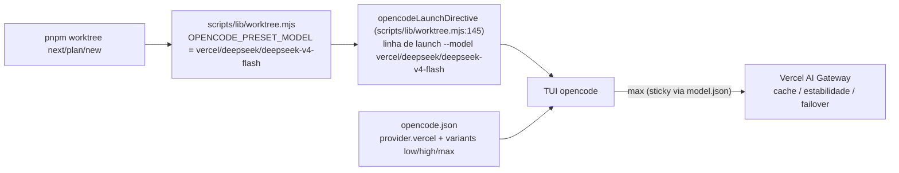

# Impl: Worktree launch default → LLM max via Vercel AI Gateway

Status: rascunho
Atualizado em: 2026-08-23
Issue: #784
Intenção: docs/plans/worktree-launch-default-llm-max-gateway.md
Appetite restante: ~0,5–1 dia (ajustado da intenção: mudança é config-only, sem migration, sem code além da constante)

## Leitura da intenção

- **Outcome:** o default de launch do worktree opencode (`pnpm worktree next/plan/new`) passa a rotear o DeepSeek pela rota do **Vercel AI Gateway** (`vercel/deepseek/deepseek-v4-flash` — cache/estabilidade/failover) em vez da rota direta atual (`deepseek/deepseek-v4-flash`), o provider fica exposto no `opencode.json` do repo e as variantes low/high/**max** ficam disponíveis — verificável pela linha de launch emitida pelo preset e pelos testes unitários atualizados.
- **O que NÃO negociar:** anti-goals da intenção — NÃO mudar o cardápio de execução de Issues (`work-issue.md`/`plan-issue.md` nem o pin de `opencodeCommands.unit.spec.ts`); NÃO tocar no `~/.config/opencode/opencode.jsonc` global do humano; NÃO editar docs históricos (`docs/plans`, `docs/CHANGELOG-AGENTS.md:208,212` congelado). Fix de variantes é **config-only** em `opencode.json` — sem migration, sem code.
- **O que reavaliar:** a hipótese de produto "a sessão **abre** com a variante max". Verificação ao vivo (opencode 1.18.21): o TUI (`opencode <dir> --model X --auto`) não tem flag `--variant` (só `opencode run` tem; `--model` aceita estritamente `provider/model`, sem sufixo de variante). A variante não é forçável na linha de launch — ela é **selecionável no TUI** (keybind variant_cycle) e **sticky** por model key (`~/.local/state/opencode/model.json`), com fallback para `model.request.variant` do catálogo. A intenção é atendida expondo as variantes no override + roteando o preset pelo gateway; a linha de launch é a verificação primária aceita.

## Abordagem recomendada



**Opções consideradas:** A | B | C
**Recomendação:** B — mudar a constante single-source do preset para a rota do gateway (`vercel/deepseek/deepseek-v4-flash`) e expor as variantes low/high/max via override do model config no `opencode.json` do projeto (bloco `provider.vercel.models["deepseek/deepseek-v4-flash"].variants`, max com `reasoningEffort: "max"`). É a única opção que atende o outcome dentro das capacidades reais do TUI, preserva o cardápio de execução intacto, é verificável (linha de launch + testes unit) e cabe no appetite (config-only). O override foi validado ao vivo (`opencode debug config` mostra o override; `opencode run --model vercel/deepseek/deepseek-v4-flash --variant max` funciona).
**Rejeitadas:**

- **A — agente default com `variant: max`** (`model.agent`/default): muda o comportamento de launch de **todas** as sessões do repo e força a variante por fora do TUI, arriscando o cardápio de execução de Issues (que pina `model: deepseek/deepseek-v4-flash` no frontmatter dos comandos) e o próprio modelo de descoberta no TUI. Rejeitada porque é mais intrusiva do que a intenção pede e fere o "config-only" (variante no default muda a experiência de todo mundo, não só o preset).
- **C — flag `--variant` na linha de launch** (`--model ...:max` ou `--variant max`): o TUI do opencode não suporta (`tui.ts` só expõe `--model`; formato estritamente `provider/model`). Verificado ao vivo (erro de servidor em `:max`). Rejeitada por impossibilidade técnica upstream.

### Componentes / mudanças

- **`OPENCODE_PRESET_MODEL`** (`scripts/lib/worktree.mjs:28`): valor → `'vercel/deepseek/deepseek-v4-flash'`; comentário `:23-26` atualizado para "preset → rota do Vercel AI Gateway". É a **única** fonte da string (OPS26); emitida em `opencodeLaunchDirective` (`:145`) — nenhum outro código lê/duplica o literal.
- **`opencode.json`** (`:10-34`): adicionar o provider `vercel` **ao lado** de `cheapest-inference` (não substituir) com override do model config:
  ```json
  "vercel": {
    "models": {
      "deepseek/deepseek-v4-flash": {
        "variants": {
          "low":  { "reasoningEffort": "low" },
          "high": { "reasoningEffort": "high" },
          "max":  { "reasoningEffort": "max" }
        }
      }
    }
  }
  ```
  (variantes exatamente como no fix de variantes da intenção; o provider `vercel` é built-in/models.dev, credencial do gateway já no ambiente — sem npm/options adicionais.)
- **`tests/unit/worktree.unit.spec.ts`** (`:151,159,165,171,177,180,185,196`): atualizar os 8 literais da linha de launch para `vercel/deepseek/deepseek-v4-flash`; `:185` pina a constante (`OPENCODE_PRESET_MODEL`) — trocar o literal esperado. **NÃO** mexer em `tests/unit/opencodeCommands.unit.spec.ts:36-38` (pina o frontmatter dos comandos de execução — anti-goal).
- **Textos (string atualizada, sentido OPS26 preservado — "preset é constante em `scripts/lib/worktree.mjs`"):**
  - `scripts/worktree.mjs:27` (docblock) e `:778` (help console.log)
  - `.agents/shell/worktree.sh:10` (comentário header)
  - `.agents/skills/worktree-next-issue/SKILL.md:34` (texto do skill)
- **Migration:** sem migration — config/tooling apenas; nenhum schema de Payload muda, `pnpm migrate`/`migrate:create` não se aplicam.
- **Access / Consent:** N/A — não há collection nem dado de cidadão envolvido; não afeta login de campanha nem LGPD.
- **UI:** N/A — TUI do opencode é consumidor, não produto deste plano (nenhum componente Next/Payload do repo muda).

### Dados → forma (se aplicável)

N/A — tooling. Não há dado de negócio sendo modelado: a mudança é uma constante de config + bloco de provider no `opencode.json`. (Perguntas de data-presentation não se aplicam.)

## Fases verificáveis

1. **Constante + opencode.json + testes** — `scripts/lib/worktree.mjs:23-28`, `opencode.json` (bloco `provider.vercel`), `tests/unit/worktree.unit.spec.ts` (8 literais + pin `:185`). Quota: maior parte do appetite.
2. **Textos** — `scripts/worktree.mjs:27,:778`, `.agents/shell/worktree.sh:10`, `.agents/skills/worktree-next-issue/SKILL.md:34`. Quota: resto do appetite.
3. **Gates** — `pnpm test:unit` (foco em `tests/unit/worktree.unit.spec.ts`, opcionalmente com `-t` no spec); `pnpm gate:fast` (lint + typecheck + test:unit); validação manual: `opencode debug config` mostra o provider `vercel` + variants do override, e um launch real de teste (`pnpm worktree next` em branch descartável) emite `--model vercel/deepseek/deepseek-v4-flash` e responde; push via `pnpm push` → CI PR (checks).

## Rabbit holes / Não escopo (engenharia)

- NÃO mudar `.opencode/commands/work-issue.md:3` / `plan-issue.md:3` (frontmatter `model: deepseek/deepseek-v4-flash`) nem o pin de `tests/unit/opencodeCommands.unit.spec.ts:36-38` — o cardápio de execução de Issues fica intacto (anti-goal).
- NÃO forçar a variante via agente default (opção A rejeitada) — variante fica selecionável e sticky no TUI, não imposta.
- NÃO tocar no `~/.config/opencode/opencode.jsonc` global do humano — o provider vive no `opencode.json` do repo.
- NÃO editar `docs/CHANGELOG-AGENTS.md:208,212` nem outros docs históricos (`docs/plans`, changelogs) — congelados.
- NÃO criar provider duplicado/renomear `cheapest-inference` — `vercel` entra ao lado.
- Não inventar flag `--variant` no launch do preset (TUI não suporta) nem sufixo `:max` no `--model` (formato inválido).

## Riscos e mitigação

- **O TUI não força a variante na linha de launch** (sem `--variant`; `--model` é estritamente `provider/model`) → a sessão pode abrir com `request.variant` do catálogo (não o max). Mitigação: variantes low/high/max expostas pelo override e cicláveis no TUI com sticky persistente (`~/.local/state/opencode/model.json`); o aceite de produto foi ajustado — a **linha de launch emitida pelo preset** (`--model vercel/deepseek/deepseek-v4-flash`) é a verificação primária.
- **Override rejeitado pelo config loader do opencode** (model config v1 não é setável via user config em todas as versões) → mitigação: validar `opencode debug config` (mostra o override) e `opencode run --model vercel/deepseek/deepseek-v4-flash --variant max` no PR, antes de marcar aprovado; documentar no plano se versões futuras mudarem o formato.
- **String duplicada em textos fora da constante** → mitigação: os 4 pontos de texto são atualizados na mesma mudança (Fase 2) e os testes unit pínam a linha de launch, então qualquer deriva volta a aparecer na CI.
- **Erro de digitação no valor da constante (rota do gateway)** → mitigação: testes unit comparam a linha emitida com o literal esperado; `:185` pina a própria constante.

## Aceite de engenharia

- [ ] Aceite de produto da intenção coberto: preset emite `--model vercel/deepseek/deepseek-v4-flash`; variantes low/high/max expostas no `opencode.json` (max com `reasoningEffort: "max"`); verificável pela linha de launch + testes unit atualizados.
- [ ] Anti-goals preservados: `work-issue.md`/`plan-issue.md` e `opencodeCommands.unit.spec.ts` intactos; `~/.config/opencode/opencode.jsonc` intacto; `docs/CHANGELOG-AGENTS.md` e docs históricos intactos; config-only (sem migration, sem code além da constante).
- [ ] Invariantes AGENTS/engineering-standards: constante single-source mantida (OPS26), provider adicionado ao lado (sem twinning), testes de domínio atualizados onde o literal muda.
- [ ] `pnpm test:unit` verde (spec `worktree.unit.spec.ts`) e `pnpm gate:fast` verde; `opencode debug config` validado no PR.
