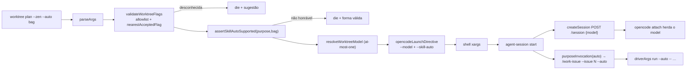

# Impl: Launch do worktree honra as flags do humano: o modelo pedido e o `--auto` chegam onde deveriam

Status: em execução
Atualizado em: 2026-09-16
Issue: #1088
Intenção: docs/plans/worktree-launch-honra-flags.md
Appetite restante: herdado ~1 dia (parser + transporte + modelo na sessão; sem UI)

## Leitura da intenção

- **Outcome:** digitar `--zen/--go/…` abre a SESSÃO (a que o TUI anexa) no modelo pedido em **todos** os purposes — inclusive driverless (`new`, `plan` sem bag); `--auto` chega à mensagem inicial nas formas `/work-issue --issue <N> --auto`, `/plan-issue --auto <bag>`, `/bug-fix --auto <bag>`; flag desconhecida ou não-honrável falha alto com sugestão, nunca descarte silencioso.
- **O que NÃO negociar:** preset `deepseek/deepseek-flash` intocado; OPS119 (`plan`/`new` sem bag driverless); ciclo OPS110 (`serve`/`start`/`attach`/`stop`, `TEQO_WORKTREE_TERMINAL`) e contrato `purposeInvocation` preservados; sem mudança de provider/auth; `--auto` do humano ≠ `--auto` de permissões do `opencode run`.
- **O que reavaliar:** (i) a rota `/api/session/:id/model` **não** é necessária no caminho principal — `resolveStartDecision` só devolve `reuse` com driver vivo/sessão busy ([lib/agent-session.mjs:393-417](../../scripts/lib/agent-session.mjs)), então não há reuso ocioso para trocar de modelo; (ii) o item "modelo na sessão" exige tocar `createSession` (HTTP) — manter a decisão testável extraindo a construção do body para helper puro.

### Extensão de escopo (aprovada pelo humano em 2026-09-16)

A revisão de simplify provou que a skill `bug-fix` **não tinha** modo `--auto` (só `work-issue`/`plan-issue` têm): transpor `/bug-fix --auto <bag>` seria honra de mentira e sujaria a descrição do bug com `--auto`. O humano decidiu (opção "Implementar --auto no bug-fix") **estender o item**: a skill `bug-fix` ganha a seção §Modo autônomo (`--auto`), espelhando `work-issue`/`plan-issue` (auto-aprova diagnóstico/fix/prevenção/post-mortem/PR; **continua parando** em DB/prod, Consent/LGPD, migração, URL/shapes públicos, aprovação humana da produção e divergência material — `--auto` nunca aprova o environment `production`), e `.opencode/commands/bug-fix.md` documenta o uso. Isso sobrepõe o "Fora de escopo" da intenção por decisão explícita do dono do produto.

## Abordagem recomendada

**Opções consideradas:** A | B | C (por decisão abaixo)
**Recomendação:** modelo na **sessão** via `POST /session` (B), `--auto` anexado em `purposeInvocation` (A), validação fail-high espelhando OPS110-F1 — ataca a raiz (descarte silencioso / ausência de model na sessão) sem processo fantasma nem dono duplicado.
**Rejeitadas:** driver mínimo só para fixar modelo (A da intenção — reintroduz submissão espúria no driverless, contra OPS119); deixar driverless quebrado (C); `--auto` na diretiva de launch (dois donos do comando).

### Componentes / mudanças

- **`WORKTREE_FLAG_ALLOWLIST` + `validateWorktreeFlags`** (`scripts/lib/worktree.mjs`, novo): allowlist por subcomando; **reusa `nearestAcceptedFlag` importado de `scripts/lib/agent-session.mjs`** (direção `lib→lib`; `agent-session.mjs` só importa `slug`/builtins — sem ciclo; `check:cycles` cobre só `src`). Chamado no dispatch ([scripts/worktree.mjs:1031](../../scripts/worktree.mjs)) após `subcommand`, antes de `cmdNext`/git. Allowlist: `next:[issue,stay,no-migrate,+modelFlags,+auto]`, `plan/new:[stay,no-migrate,+modelFlags,+auto]`, `fix:[stay,no-migrate,headless,directive,+modelFlags,+auto]`, `kill:[force,stay]` (`stay` fica p/ preservar a mensagem específica de `kill`, [:1054](../../scripts/worktree.mjs)).
- **`assertSkillAutoSupported({purpose, bag})`** (`scripts/lib/worktree.mjs`, novo, puro): matriz determinística — `next` sempre; `fix` sempre; `plan` só com bag; `new` nunca; `--stay` + `--auto` nunca (o launch é suprimido). Chamado no dispatch (mesmo ponto), antes de qualquer git. Sem migration, sem access, sem Consent.
- **`opencodeLaunchDirective`** ([scripts/lib/worktree.mjs:202-232](../../scripts/lib/worktree.mjs)): novo parâmetro `skillAuto` → emite `--skill-auto` (nome interno, decisão C) só quando `true`. `--model=` continua **sempre** (driverless inclusive).
- **`printLaunchDirective`** ([scripts/worktree.mjs:225-239](../../scripts/worktree.mjs)) + call sites [:643](../../scripts/worktree.mjs) (`next`) e [:747](../../scripts/worktree.mjs) (`cmdNamespaceBranch`): repassar `skillAuto: Boolean(flags.auto)`.
- **`parseModelRef(model)` + `buildCreateSessionBody({model})`** (`scripts/lib/agent-session.mjs`, novos, puros): split no PRIMEIRO `/` → `{providerID,id}`; throw se não houver `/`; sem `variant` (OPS95); body `{}` sem model. **Colocados aqui** (não em `lib/worktree.mjs`) porque `lib/worktree.mjs` passará a importar de `lib/agent-session.mjs` (decisão A) — evita ciclo.
- **`createSession(url, dir, model)`** ([scripts/agent-session.mjs:269-276](../../scripts/agent-session.mjs)): usa `buildCreateSessionBody`; `POST /session?directory=…` com `{ model: {providerID,id} }` (verificado ao vivo no `serve` 1.18.31: a sessão passa a reportar o model).
- **`cmdStart`** ([scripts/agent-session.mjs:465-559](../../scripts/agent-session.mjs)): passa `model` ao `createSession` ([:515](../../scripts/agent-session.mjs)); `purposeInvocation({..., auto: Boolean(flags['skill-auto'])})` ([:472](../../scripts/agent-session.mjs)); decisão D no ramo `reuse` ([:511](../../scripts/agent-session.mjs)). `driverArgs` ([:291-317](../../scripts/lib/agent-session.mjs)) **intocado** — segue emitindo o `--auto` de permissões; o `--auto` do humano viaja como texto da invocation.
- **`purposeInvocation`** ([scripts/lib/agent-session.mjs:187-203](../../scripts/lib/agent-session.mjs)): novo `auto=false`; formas exatas `--issue <N>[ --auto]`, `[--auto ]<bag>`, `[--auto ][<bag>]`.
- **`SESSION_FLAG_ALLOWLIST.start`** ([scripts/lib/agent-session.mjs:214](../../scripts/lib/agent-session.mjs)): incluir `skill-auto`.
- **`assertSessionState`** ([scripts/lib/agent-session.mjs:113-125](../../scripts/lib/agent-session.mjs)): **não** exige `model` (decisão E); só doc.
- **Docs/comando:** `.agents/shell/worktree.sh` (comentário; shell não muda) e `.opencode/commands/worktree.md` (documentar `--auto` e o fail-high).
- **Migration:** sem migration. **Access/Consent/UI:** N/A (Impeccable A — sem UI).

### Dados → forma (se aplicável)

N/A — CLI; o efeito é observável no `model` do estado/servidor (`~/.local/state/teqo/agent-sessions/<slug>.json` e `GET /session/<id>`) e no log do driver.

## Decisões de engenharia (caro de reverter)

| #   | Decisão                                                                                                              | Opções / Rejeitadas                                                                                                                                                                                                                                                                                                                                                                                                                                                                             |
| --- | -------------------------------------------------------------------------------------------------------------------- | ----------------------------------------------------------------------------------------------------------------------------------------------------------------------------------------------------------------------------------------------------------------------------------------------------------------------------------------------------------------------------------------------------------------------------------------------------------------------------------------------- |
| A   | `validateWorktreeFlags` em `lib/worktree.mjs`, reusando `nearestAcceptedFlag`                                        | **Rec:** reusar (um dono da distância OSA). **Rej:** duplicar OSA (drift); extrair p/ `lib/cli.mjs` (churn, 1 call site).                                                                                                                                                                                                                                                                                                                                                                       |
| B   | `--auto` não-honrável falha alto via `assertSkillAutoSupported({purpose,bag})` puro chamado no dispatch antes do git | **Rec:** helper puro (testável, falha antes de criar worktree). **Rej:** embutir em `purposeInvocation` (tarde, já provisionou); validar na skill (fora do launcher).                                                                                                                                                                                                                                                                                                                           |
| C   | Nome do transporte interno no `start`                                                                                | **Rec:** `--skill-auto` — inequívoco, separa do `--auto` de permissões que `driverArgs` já emite. **Rej:** reusar `--auto` no `start` (dois significados no mesmo pipeline).                                                                                                                                                                                                                                                                                                                    |
| D   | Sessão reusada com `state.model` ≠ pedido                                                                            | **Rec:** `die` claro ("run já em andamento no modelo X; encerre com `pnpm agent:session stop` e reabra para trocar") — `reuse` só ocorre com driver vivo/sessão busy, então não há janela para trocar; nunca descarte silencioso. **Rej:** trocar via `/api/session/:id/model` (complexidade extra; o ramo "ocioso" é inalcançável por `resolveStartDecision`); ignorar (quebra "honra as flags"). Gatilho de revisão: se reabrir sessão viva virar caso de uso, implementar a troca pela rota. |
| E   | `assertSessionState` exige `model`?                                                                                  | **Rec:** não exigir; só documentar `model`. **Rej:** exigir (estados antigos; `model` nunca foi obrigatório).                                                                                                                                                                                                                                                                                                                                                                                   |
| F   | Parse do modelo                                                                                                      | **Rec:** `parseModelRef` puro em `lib/agent-session.mjs`, throw sem `/`, sem variant (OPS95). **Rej:** em `lib/worktree.mjs` (ciclo com A); aceitar sem `/` (servidor rejeita remoto).                                                                                                                                                                                                                                                                                                          |

## Fases verificáveis

1. **Tracer — modelo na sessão:** `parseModelRef`/`buildCreateSessionBody` + `createSession(model)` + `cmdStart` passando `model`. Prova: unit puro do body e criação real contra o `serve` local. `<0,3 dia>`
2. **Transporte `--auto`:** `purposeInvocation(auto)` nas 3 formas + `SESSION_FLAG_ALLOWLIST.start` + `opencodeLaunchDirective({skillAuto})` + repasse nos call sites. Unit das formas exatas. `<0,3 dia>`
3. **Fail-high no parser:** `WORKTREE_FLAG_ALLOWLIST`/`validateWorktreeFlags`/`assertSkillAutoSupported` + dispatch + decisão D. Unit de flag desconhecida com sugestão, das células falsas da matriz e do reuso com modelo divergente. `<0,3 dia>`
4. **Skill `bug-fix` §Modo autônomo** (extensão aprovada): seção na skill + `Uso:` no comando, espelhando `work-issue`/`plan-issue`. `<0,1 dia>`
5. **Docs + gates:** atualizar comentários/`.opencode/commands/worktree.md`; `pnpm gate:fast`; push via `pnpm push`. `<0,1 dia>`

## Adiado com gatilho (triage de simplify, 2026-09-16)

Nenhum achado atingiu o piso de registro (score ≥3); os dois abaixo ficam adiados com gatilho:

- **`assertKnownFlags`/`nearestAcceptedFlag` como helpers neutros de CLI** hoje moram em `scripts/lib/agent-session.mjs` e são importados por `scripts/lib/worktree.mjs` (acopla launcher→domínio de sessão; sem ciclo, sem risco de runtime). **Gatilho:** um 3º consumidor de validação de flag, ou `scripts/lib/cli.mjs` ganhar o dono do parser — então mover os três para `cli.mjs`.
- **Branch de reuso divergente** (`scripts/agent-session.mjs`, decisão D) sem teste unit — o CLI de sessão não tem harness impuro; a decisão pura está coberta por `resolveStartDecision`. **Gatilho:** o CLI ganhar harness impuro, ou a próxima mudança nesse ramo.

## Rabbit holes / Não escopo (engenharia)

- Seletor de modelo no TUI / mexer em `WORKTREE_MODEL_MAP` ou preset.
- `--auto` de permissões do `opencode run`; semântica das skills; `--variant`.
- Caminho `--headless` (OPS106): usa `opencodeHeadlessArgs`, não a invocation de skill — `--auto` do humano não se aplica; documentar.
- `--model` combinado com `--stay`: mantém comportamento atual (gatilho: aplicar a mesma regra depois se incomodar).
- Validar flags do comando `/worktree` como camada separada (a validação é no script, único dono; shell e comando não ganham allowlist própria).

## Riscos e mitigação

- **TUI não herda o model da sessão criada** → validar cedo no Tracer (fase 1); fallback já desenhado e documentado (`POST /api/session/:id/model`), sem mudar contrato público.
- **Quebra dos specs que pinam a diretiva** ([tests/unit/worktree.unit.spec.ts:153-320](../../tests/unit/worktree.unit.spec.ts)) → `--skill-auto` é aditivo; strings sem `auto` permanecem idênticas.
- **`--auto` duplicado confundir replay de argv** → nome interno distinto (C) e comentário no `driverArgs`.
- **Reuse + modelo divergente** (D) → `die` claro; se estourar o appetite, manter o `die` (mais simples que funciona).

## Aceite de engenharia

- [ ] Aceite de produto da intenção ainda coberto (modelo em todos os purposes; `--auto` nas 3 formas; fail-high)
- [ ] Invariantes AGENTS/engineering-standards (preset/OPS110/OPS119 intactos; sem provider/auth)
- [ ] Testes de domínio previstos (unit puro; int N/A justificado)

## Self-score (decision-quality)

5/5 — (1) decisões caras A–F com rejeitadas; (2) cabe no appetite ~1 dia com fases ≤0,3 dia; (3) rabbit holes nomeados (seletor, headless, `--stay`); (4) depth check: reusa `nearestAcceptedFlag` e o padrão `validateSessionFlags`, sem módulo pass-through; (5) outcome de produto preservado — engenharia não reescreveu o aceite.
