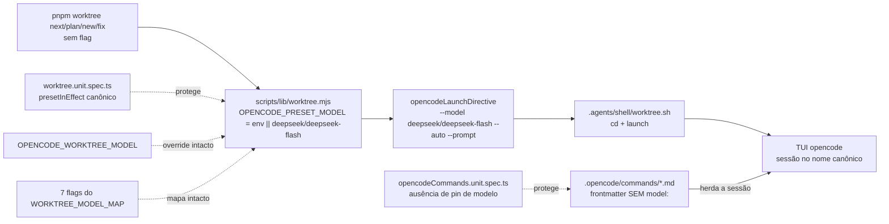

# Impl: Modelo padrão do worktree → DeepSeek V4.1 Flash (`deepseek/deepseek-flash`)

Status: aprovado (gate humano 2026-09-12)
Atualizado em: 2026-09-12
Issue: #944
Intenção: docs/plans/worktree-modelo-canonico-deepseek-flash.md
Appetite restante: ~0,5 dia eng (herdado; config-only + textos + pins)

## Leitura da intenção

- **Outcome:** o fluxo sem flag (`pnpm worktree next/plan/new/fix` → `launch opencode <dir> --model <preset> --auto [--prompt …]`) nasce em `deepseek/deepseek-flash`; os 4 commands do fluxo deixam de pinar modelo no frontmatter; help/docblocks/comentários citam o nome novo; override e as 7 flags intactos; unit de preset/frontmatter verde com os literais novos.
- **O que NÃO negociar:**
  - `OPENCODE_WORKTREE_MODEL` segue como override (precedência env > fallback) e as 7 flags (`--cheap/--pro/--zen/--go/--alibaba/--glm/--free`) + `WORKTREE_MODEL_MAP` intactos — incluindo os aliases legados de outros providers (`cheapestinference/deepseek-v4-flash`, `alibaba-token-plan/deepseek-v4-flash`).
  - Nada além do nome do modelo muda: sem `--variant`/variantes/Ctrl+T, sem config global, sem `opencode.json`, sem mudança de lógica no CLI.
  - Usos diretos do app (`src/app/(campaign)/campanha/api/ai-chat/route.ts:62`, `src/utilities/ai/campaignDemandTitle.ts:31`) fora — plano irmão Sollinha; docs históricos congelados.
  - É future-proofing de nome canônico, **não** economia (o alias legado já é servido pelo V4.1 ao preço Flash).
- **O que reavaliar:**
  - Remover o pin `model:` dos 4 commands muda a semântica desejada: o comando passa a **herdar o modelo da sessão** (o `--model` do launch) em vez de forçá-lo por cima — é isso que faz flags/override valerem dentro da sessão. Precisa de guard de teste para não regredir (decisão 1).
  - `tests/unit/worktree.unit.spec.ts:46` (`presetInEffect()`) duplica o literal do fallback — sem trocar junto, o unit quebra no CI (env não exportado). Trocar na mesma fase da constante.
  - `tests/unit/opencodeCommands.unit.spec.ts:36-38` é o único guard do frontmatter dos 4 commands — tem de mudar na mesma entrega (decisão 1).
  - O docblock do preset (`scripts/lib/worktree.mjs:22-35`) cita `.forgejo/worktree.env` como caminho de override por repo — referência stale (nenhum código lê, pós-cutover GitHub). Fica **fora** desta entrega (não é o nome do modelo); registrar como follow-up.
  - `scripts/worktree.mjs:877` (help) interpola `${OPENCODE_PRESET_MODEL}` — auto-atualiza; não há literal para editar ali (só o docblock `:30` tem o literal).

## Estado atual verificado (explorador)

- **Fonte executável única:** `OPENCODE_PRESET_MODEL` em `scripts/lib/worktree.mjs:36-37` (`process.env.OPENCODE_WORKTREE_MODEL || 'deepseek/deepseek-v4-flash'`); consumida em `resolveWorktreeModel` (`:74`) e `opencodeLaunchDirective` (`:214`). `WORKTREE_MODEL_MAP:49` (`cheapestinference/...`) e `:53` (`alibaba-token-plan/...`) ficam intactos.
- **Superfícies com o literal legado do preset (fora de docs):** `scripts/lib/worktree.mjs:37` (constante), `scripts/worktree.mjs:30` (docblock; help `:877` interpola a constante, sem literal), `.agents/shell/worktree.sh:22`, `.agents/skills/worktree-next-issue/SKILL.md:34`, `.opencode/commands/work-issue.md:3` / `plan-issue.md:3` / `bug-fix.md:3` / `testing-audit.md:3`, `tests/unit/worktree.unit.spec.ts:46` (espelho) e `:245` (título), `tests/unit/opencodeCommands.unit.spec.ts:37` (regex).
- **Ausência de pin já é padrão do repo:** `.opencode/commands/issue.md` e `worktree.md` não têm `model:` no frontmatter.
- **Diretiva cobre os 4 propósitos:** `cmdNext` (`scripts/worktree.mjs:619`), `cmdNamespaceBranch` (`:706`, usado por `plan`/`new`/`fix` via `cmdFix:762`) chamam `printLaunchDirective` → `opencodeLaunchDirective`.
- **Blast radius:** `scripts/worktree.mjs` está em `HIGH_RISK_EXACT` (`scripts/lib/test-affected-core.mjs:36`) → diff nele = unit/int full + e2e curado no PR (OPS86). `scripts/lib/worktree.mjs` não é high-risk.
- **Fora do fluxo (intocados):** usos do app em `ai-chat/route.ts:62` e `campaignDemandTitle.ts:31`; `opencode.json`, README, `.husky`, workflows e pool sem refs; `deepseek-v4-flash-vision-exp` sem ocorrência viva.

## Abordagem recomendada

**Opções consideradas:** A | B | C
**Recomendação:** A — trocar o fallback na constante única + remover o pin `model:` dos 4 commands + trocar o guard do frontmatter para proibir qualquer pin + sincronizar os textos vivos e os pins de teste. É o menor diff que cumpre o aceite integral e ataca a causa (o pin que sobrescreve a sessão), sem tocar mapa, override ou config.
**Rejeitadas:**

- **B — preset canônico + pin trocado para `deepseek/deepseek-flash` nos 4 commands:** cumpre o nome, mas mantém o acoplamento que anula as flags/override dentro da sessão e recria o débito na próxima renomeação; a intenção manda "deixar de pinar".
- **C — preset canônico apenas (commands intocados):** deixaria o frontmatter pinando o legado — falha o aceite (2) e mantém o override do pin sobre a sessão.

### Decisões de engenharia (caras, com rejeitadas)

1. **Guard do frontmatter após remover o pin (decisão cara desta entrega)**
   - Hoje: `tests/unit/opencodeCommands.unit.spec.ts:36-38` exige `model: deepseek/deepseek-v4-flash` no frontmatter de cada um dos 4 commands.
   - Opções: **A)** remover a linha `model:` e trocar a asserção por **ausência de qualquer pin** (`expect(frontmatter![1]).not.toMatch(/^model:/m)`); **B)** remover a linha e apagar a asserção; **C)** manter o pin, só trocando o valor para o canônico.
   - **Recomendação: A** — única que preserva a intenção ("deixam de pinar") **e** evita regressão silenciosa: se alguém reintroduzir um pin (legado ou canônico), o teste falha e obriga a decisão explícita. Ausência de pin é o padrão já praticado no repo (`.opencode/commands/issue.md` e `worktree.md` vivem sem `model:`), e o comando herda o modelo da sessão — que o launch define via `--model` (preset/flag/override). Forma: remover a linha dos 4 arquivos (frontmatter fica só com `description`); a asserção continua dentro do `it.each(commands)` e cobre os 4 de uma vez, com mensagem explicando que o modelo vem da sessão.
   - **Rejeitadas:** **B** — apagar a asserção deixa o frontmatter sem guard: um pin reintroduzido passa em silêncio e volta a anular flags/override (exatamente a classe de bug desta entrega). **C** — contradiz o aceite (2) e recria o acoplamento: com pin, `/work-issue` numa sessão `--cheap`/`--pro` roda no modelo pinado, não no da sessão; a próxima renomeação repetiria a OPS101.

2. **Espelho do fallback no teste (`presetInEffect()`)**
   - Opções: **A)** trocar o literal nos dois pontos (constante e espelho); **B)** exportar um `DEFAULT_PRESET_MODEL` e importar no teste; **C)** o teste comparar `OPENCODE_PRESET_MODEL` consigo mesmo.
   - **Recomendação: A** — o espelho é deliberado (comentário `:41-45`: "o lib resolve exatamente nessa precedência") e é o que detecta deriva; sem env no CI, espelho = fallback e a comparação em `:246` falha se um dos dois ficar para trás. Menor diff, sem superfície nova.
   - **Rejeitadas:** **B** — abstração prematura para um literal com 2 usos (engineering-standards: sem abstração especulativa); **C** — tautologia; teste que sempre passa não protege nada.

3. **Escopo da sincronização de textos**
   - Opções: **A)** trocar o literal do preset nas superfícies vivas levantadas (docblock de `scripts/lib/worktree.mjs`, `scripts/worktree.mjs:30`, `.agents/shell/worktree.sh:22`, `SKILL.md:34`, título do teste `:245`); **B)** só a constante; **C)** varrer o repo inteiro por `deepseek-v4-flash`.
   - **Recomendação: A** — o aceite pede "textos/help/docblocks refletem o nome novo"; B deixa a doc mentindo; C atinge aliases de outros providers e os usos do app (fora de escopo).
   - **Rejeitadas:** **B** — os 3 textos fixos ficariam errados (só o help auto-atualiza); **C** — quebra o anti-goal dos aliases e invade o plano irmão do app.

### Componentes / mudanças

- **`OPENCODE_PRESET_MODEL`** (`scripts/lib/worktree.mjs:36-37`): fallback `'deepseek/deepseek-v4-flash'` → `'deepseek/deepseek-flash'`; `process.env.OPENCODE_WORKTREE_MODEL ||` intacto. Docblock `:22-35`: 1 frase registrando o nome canônico (OPS101, V4.1 Flash) — sem tocar no caminho stale `.forgejo/worktree.env` (fora de escopo). `WORKTREE_MODEL_MAP:49/:53` intactos.
- **`scripts/worktree.mjs:30`** (docblock): literal → nome novo. Help `:877` não muda (interpola a constante). Nenhuma mudança de lógica.
- **`.agents/shell/worktree.sh:22`** (comentário): literal → nome novo; aliases `:19`/`:21` intactos.
- **`.agents/skills/worktree-next-issue/SKILL.md:34`**: prosa do preset → nome novo; aliases da mesma linha intactos.
- **`.opencode/commands/work-issue.md:3`, `plan-issue.md:3`, `bug-fix.md:3`, `testing-audit.md:3`**: remover a linha `model: deepseek/deepseek-v4-flash` (frontmatter fica só com `description`).
- **`tests/unit/worktree.unit.spec.ts:46`**: `presetInEffect()` → literal novo; `:245` título do teste → nome novo (cosmético; evita doc mentirosa); `:294`/`:298` aliases intactos.
- **`tests/unit/opencodeCommands.unit.spec.ts:36-38`**: asserção → ausência de pin (decisão 1).
- **Migration:** sem migration — tooling/config-only, nenhuma collection/global.
- **Access / Consent:** N/A — sem coleção, sem PII, sem write path.
- **UI:** Impeccable A — N/A sem UI (verificação = linha de launch + unit).

### Dados → forma (se aplicável)

N/A — config-only de tooling; nenhum dado de negócio modelado (pergunta 3 de data-presentation não se aplica).

## Fases verificáveis

1. **TDD do preset** — `tests/unit/worktree.unit.spec.ts:46/:245` primeiro (vermelho: constante ainda legada), depois `scripts/lib/worktree.mjs` (constante + docblock); `pnpm test:unit -t worktree` verde, com e sem `OPENCODE_WORKTREE_MODEL` exportado. Quota ~30%.
2. **TDD do frontmatter** — trocar o guard em `opencodeCommands.unit.spec.ts:36-38` para ausência de pin (vermelho com os pins atuais), depois remover a linha `model:` dos 4 `.opencode/commands/*.md`; `pnpm test:unit -t opencodeCommands` verde; `grep -n "^model:" .opencode/commands/*.md` vazio. Quota ~30%.
3. **Textos vivos + gates + entrega** — `scripts/worktree.mjs:30`, `.agents/shell/worktree.sh:22`, `SKILL.md:34`; smoke seguro (sem claim) `node -e "import('./scripts/lib/worktree.mjs').then(m => console.log(m.opencodeLaunchDirective({ dir: '/tmp/wt', purpose: 'next', terminal: true })))"` → `--model deepseek/deepseek-flash`; grep final de `deepseek/deepseek-v4-flash` fora de `docs/` deve sobrar só os 2 usos do app (Sollinha); changelog NOVA entrada `docs/changelog/2026-09-12-ops101.md`; `pnpm gate:fast`; `pnpm push` → PR `Closes #944`. Nota: `scripts/worktree.mjs` é `HIGH_RISK_EXACT` (`scripts/lib/test-affected-core.mjs:36`) → PR roda unit/int full + e2e curado (OPS86), mesmo com diff só de docblock. Quota ~40%.

## Rabbit holes / Não escopo (engenharia)

- NÃO trocar o cardápio/mapa (`WORKTREE_MODEL_MAP`, chaves ou values) nem os aliases de outros providers.
- NÃO mexer em variante/thinking/`--variant`/Ctrl+T/config global/`opencode.json` do repo.
- NÃO "vender economia" — registrar como nome canônico/future-proofing.
- NÃO trocar os usos diretos do app (plano irmão Sollinha: `ai-chat/route.ts:62`, `campaignDemandTitle.ts:31`).
- NÃO corrigir o caminho stale `.forgejo/worktree.env` no docblock do preset (follow-up; não é o nome do modelo).
- NÃO editar docs históricos (`docs/plans/*` antigos, `docs/changelog/*`, `docs/CHANGELOG-AGENTS*`).
- NÃO criar constante/abstração nova para o fallback (2 usos; espelho do teste é o guard).
- NÃO varrer o repo inteiro por `deepseek-v4-flash` (atinge app e aliases).
- NÃO usar `pnpm worktree next` como smoke (claimaria Issue real) — o smoke é a chamada direta da lib.

## Triage de débitos (simplify, 2026-09-12)

6 colhidos / 2 já resolvidos na sessão / 2 descartados / 2 deferidos com gatilho / 0 registrados (nenhum score ≥3).

- **Já resolvido (não reabrir):** gramática do docblock (`scripts/lib/worktree.mjs`, "passou a usar o nome canônico") e fragilidade da regex do guard (`opencodeCommands.unit.spec.ts:39` → `/^\s*["']?model["']?\s*:/m`).
- **Descartado:** espelho `presetInEffect()` inerte com `OPENCODE_WORKTREE_MODEL` exportada (deliberado e documentado em `worktree.unit.spec.ts:41-45`; o CI exercita o literal) e docblock stale `.forgejo/worktree.env` (pré-existente, doc-only, parkeado como follow-up).
- **Adiado com gatilho:**
  - Literais do preset em comentários vivos (`scripts/worktree.mjs:30`, `.agents/shell/worktree.sh:22`, `.agents/skills/worktree-next-issue/SKILL.md:34`) sem guard de sincronização — **gatilho:** próxima troca de preset deixar um dos textos divergente.
  - Guard de frontmatter cobre os 4 commands do array (`opencodeCommands.unit.spec.ts:13`), não os 6 arquivos de `.opencode/commands/` — **gatilho:** novo command de execução (ou pin em command fora do array).

## Riscos e mitigação

- **Sessões manuais que invocam `/work-issue` fora do launch passam a herdar o modelo da sessão** (antes o pin forçava o legado) → é o comportamento desejado (o launch/flags/override mandam); registrar como mudança intencional no PR.
- **HIGH_RISK_EXACT (`scripts/worktree.mjs`)** → PR roda unit/int full + e2e curado; mitigação: tocar só docblock (`:30`), sem claim/provision/PORT/env.
- **Deriva entre constante e `presetInEffect()`** → CI sem env quebra; mitigação: trocar os dois na mesma fase (Fase 1).
- **Pin reintroduzido por engano** → guard de ausência (Fase 2) falha com mensagem explicando a origem do modelo.
- **Varredura ampla apagar aliases do mapa** → mitigação: troca só do literal `deepseek/deepseek-v4-flash` (com namespace), nunca dos aliases; pins `:294/:298` cobrem o mapa.
- **Usos do app trocados por engano** → mitigação: grep final mostra os 2 `deepSeek('deepseek-v4-flash')` intocados.
- **Override `OPENCODE_WORKTREE_MODEL`** → intacto (só o fallback muda); teste cobre a precedência env > fallback.

## Aceite de engenharia

- [ ] Aceite de produto da intenção ainda coberto: preset sem flag = `deepseek/deepseek-flash`; 4 commands sem pin; help/docblocks/comentários com o nome novo; override + 7 flags intactos; unit verde com literais novos.
- [ ] Invariantes AGENTS/engineering-standards: sem collection/global/migration; sem twin (constante única editada no dono); Consent/LGPD intocados; `push:false` preservado; `pnpm gate:fast` verde; identificadores em inglês.
- [ ] Testes de domínio previstos (unit/int) onde access/write paths mudam: N/A (sem access/write path) — unit de preset (`worktree.unit.spec.ts`) e de frontmatter (`opencodeCommands.unit.spec.ts`) atualizados e verdes; smoke da diretiva registrado no PR.

---

Self-score decision-quality: 5/5 — decisão cara (guard do frontmatter) deliberada com rejeitadas e forma exata; cabe no appetite (constante + 4 remoções de linha + 3 textos + 2 specs); rabbit holes nomeados com gatilhos; depth check reusa o dono (`OPENCODE_PRESET_MODEL`) e os guards existentes sem criar twin; outcome da intenção preservado (incluindo o não-ganho de economia).
