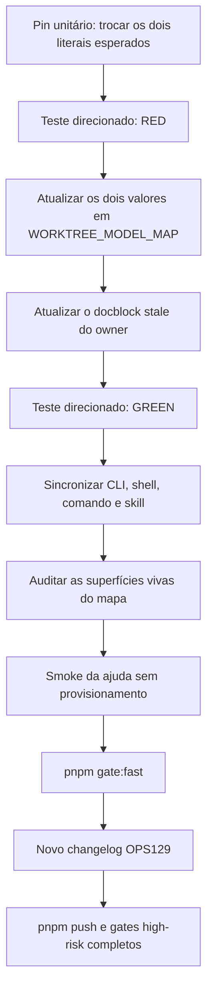

# Impl: Modelos das flags do worktree: `--zen` → Space Bunny Free e `--free` → Space Bunny Alpha

Status: em execução
Atualizado em: 2026-09-25
Issue: #1342
Intenção: docs/plans/worktree-modelos-space-bunny.md
Appetite restante: herdado (~0,5 dia)

## Leitura da intenção

- **Outcome:** `next`, `plan`, `new` e `fix` devem abrir Space Bunny Free pelo OpenCode Zen com `--zen` e Space Bunny Alpha pelo OpenRouter com `--free`; código, ajuda, comandos, skills e pin unitário que apresentam o mapa exibem a mesma associação.
- **O que NÃO negociar:** `zen: 'opencode/space-bunny-free'` e `free: 'openrouter/stealth/space-bunny-alpha'`; preset sem flag, demais flags, fail-high para múltiplas flags e `MODEL_VARIANT = 'max'` permanecem intactos. Não criar aliases, fallback, seletor, nova flag, mapa paralelo, persistência, migration, schema, UI ou alterações em registros históricos.
- **O que reavaliar:** nenhuma hipótese de produto precisa ser reaberta. O owner, o transporte compartilhado por todos os propósitos e a ajuda derivada foram confirmados. Só reavaliar a sincronização manual se uma futura evolução exigir gerar documentação do mapa ou surgir outra superfície viva exibindo seus valores.

## Abordagem recomendada

**Opções consideradas:** A | B | C

- **A — Alterar os dois valores no owner, usar o pin unitário existente no fluxo RED/GREEN e sincronizar manualmente as superfícies documentais.**
- **B — Extrair ou gerar toda a documentação do mapa a partir de `WORKTREE_MODEL_MAP`.**
- **C — Introduzir aliases, um segundo mapa ou uma camada de compatibilidade entre os IDs antigos e novos.**

**Recomendação:** A — porque o problema já tem um owner profundo e um pin exato; duas trocas de strings são o tracer bullet completo, preservam o contrato e cabem no appetite sem criar mecanismo novo. A ajuda já deriva do mapa, enquanto shell, comando e skill precisam apenas receber a associação vigente no mesmo lote.

**Rejeitadas:** B — porque transformaria uma troca values-only em refatoração de geração de documentação, ampliaria o risco de formato e manutenção e violaria o limite de um único mapa owner; C — porque preservaria os IDs antigos como semântica de runtime, criaria uma segunda política de escolha e contrariaria a troca direta aprovada. A decisão de manter sincronização manual só deve ser revista se surgirem novas superfícies vivas ou uma necessidade concreta de gerar documentação do mapa.

### Decisões de engenharia

- **Ownership:** editar `WORKTREE_MODEL_MAP`; não introduzir constantes por provider, aliases ou exceções por propósito.
- **TDD:** alterar primeiro apenas o `toEqual` do pin existente e observar a falha causada pelos valores antigos; só depois mudar o owner.
- **Resolução:** reutilizar `resolveWorktreeModel`, `WORKTREE_MODEL_FLAGS` e o allowlist existentes. `next`, `plan`, `new` e `fix` já compartilham a resolução e o transporte; `fix` não ganha caminho especial.
- **Documentação viva:** sincronizar somente onde os IDs são exibidos. A ajuda de `scripts/worktree.mjs:992-996` já deriva do owner e não recebe literal duplicado.
- **Transporte:** não alterar `parseModelRef` nem `MODEL_VARIANT`. O parser divide no primeiro slash, portanto `openrouter/stealth/space-bunny-alpha` chega como provider `openrouter` e id `stealth/space-bunny-alpha`.
- **Histórico:** acrescentar proveniência da OPS129 onde houver notas vivas, sem reescrever os registros de OPS100/OPS112 ou planos antigos.

### Componentes / mudanças

- **`WORKTREE_MODEL_MAP`** (`scripts/lib/worktree.mjs:43-63`): trocar somente os valores `zen` e `free`; atualizar o docblock stale que ainda identifica `--zen` como Muse Spark 1.3 Free. Chaves, ordem, `WORKTREE_MODEL_FLAGS`, `resolveWorktreeModel`, preset e demais modelos permanecem iguais.
- **Docblock e ajuda do CLI** (`scripts/worktree.mjs:22-30`, `scripts/worktree.mjs:973-1003`): atualizar os dois IDs no docblock e a proveniência viva. Não editar a interpolação da ajuda, que já mostra `WORKTREE_MODEL_MAP` automaticamente.
- **Launcher shell** (`.agents/shell/worktree.sh:23-28`): atualizar a associação de `--zen` e `--free`; preservar as linhas de uso que já listam apenas as flags. Acrescentar OPS129 à nota de proveniência sem apagar OPS100/OPS112.
- **Comando `/worktree`** (`.opencode/commands/worktree.md:7`): atualizar os dois IDs e manter `at-most-one` e os contratos de `cd`/launch intactos.
- **Skill do worktree** (`.agents/skills/worktree-next-issue/SKILL.md:32-34`): atualizar apenas os IDs e a proveniência na linha 34. A linha 32, que lista flags sem IDs, não precisa mudar.
- **Pin unitário** (`tests/unit/worktree.unit.spec.ts:469-523`): primeiro mudar os dois valores esperados; manter intactas as provas de flag set, preset, resolução individual, fail-high e diretivas de `next`/`plan`/`new`.
- **Registro da entrega** (`docs/changelog/2026-09-25-ops129.md`): criar uma entrada curta nova com os dois remaps e as invariantes preservadas; não alterar changelogs anteriores nem o agregado gerado.
- **Transporte fora da mudança** (`scripts/lib/agent-session.mjs`, `tests/unit/agentSession.unit.spec.ts`): não editar. Os exemplos genéricos de ref com slash e a cobertura de `parseModelRef` não apresentam o mapa; `MODEL_VARIANT` continua `max`.
- **Migration:** sem migration; não há schema ou Payload.
- **Access / Consent:** N/A; não há collection, write path, role, helper ou chave LGPD.
- **UI:** Impeccable A — N/A, sem UI; nenhum designer, shell visual, shape, craft ou polish.
- **Codebase map:** sem mudança; nenhum módulo muda de camada ou de owner.

### Dados → forma

- N/A como visualização: não há métrica, série ou comparação para o usuário.
- A forma técnica escolhida é o dicionário fixo `flag → model reference` já existente. Os valores novos são configuração executável, não conteúdo duplicado de catálogo; somente as superfícies vivas que exibem o mapa recebem a nova associação textual.

## Fases verificáveis

1. **TDD RED — 20 min**
   - Em `tests/unit/worktree.unit.spec.ts`, alterar primeiro apenas `WORKTREE_MODEL_MAP.zen` e `WORKTREE_MODEL_MAP.free` no `toEqual` para os literais novos.
   - Executar `pnpm test:unit tests/unit/worktree.unit.spec.ts`.
   - Confirmar RED por divergência entre os literais esperados e os antigos no owner. Não alterar owner nem documentação antes de registrar essa falha.

2. **Owner e GREEN — 30 min**
   - Trocar em `scripts/lib/worktree.mjs` somente os dois valores do mapa.
   - Atualizar o comentário stale imediatamente acima do mapa para Space Bunny Free e Space Bunny Alpha, preservando a proveniência histórica relevante.
   - Não modificar `WORKTREE_MODEL_FLAGS`, `resolveWorktreeModel`, as outras cinco entradas, o preset ou `MODEL_VARIANT`.
   - Reexecutar `pnpm test:unit tests/unit/worktree.unit.spec.ts` e confirmar GREEN, incluindo as invariantes existentes de preset, fail-high e transporte.

3. **Sincronização das superfícies vivas — 45 min**
   - Atualizar os IDs no docblock de `scripts/worktree.mjs`, shell, comando e skill.
   - Manter a ajuda de runtime derivada do mapa; confirmar por inspeção que ela não contém literal próprio.
   - Fazer busca exata dos IDs antigos apenas nos seis arquivos vivos que apresentam o mapa, confirmando que não sobrou associação antiga.
   - Permitir IDs antigos apenas onde são semanticamente corretos: registro histórico, intenção atual, exemplos genéricos de parser e este plano. Não editar `agent-session.mjs`, seu teste, `codebase-map`, `local-database` ou documentos históricos.

4. **Smoke e gates — 1 h 15 min**
   - Reexecutar `pnpm test:unit tests/unit/worktree.unit.spec.ts`.
   - Executar `node scripts/worktree.mjs` sem subcomando e validar a saída de uso, conferindo `--zen=opencode/space-bunny-free` e `--free=openrouter/stealth/space-bunny-alpha` sem provisionar worktree ou banco.
   - Executar `pnpm gate:fast` para lint, typecheck e unit completo.
   - Não criar teste e2e: a mudança não introduz fluxo visual nem integração de aplicação. Os arquivos `scripts/worktree.mjs` e `scripts/lib/worktree.mjs` são high-risk; o push deve respeitar a expansão automática para unit/int full e e2e curado, sem editar manifest nem tentar seleção vazia.

5. **Changelog e push — 1 h**
   - Criar somente `docs/changelog/2026-09-25-ops129.md`; não rodar `pnpm changelog:build` nem commitar o agregado.
   - Rodar `pnpm changelog:check` e revisar o diff para confirmar que contém apenas o plano, o pin, o owner, as superfícies vivas, a nova entrada e os ajustes documentais necessários.
   - Entregar com `pnpm push -u origin HEAD`; registrar o resultado dos gates high-risk completos.
   - Abrir PR Ready para `main` com `Closes #1342` e deixar o auto-merge nativo aguardar `CI (PR) / checks`.

## Rabbit holes / Não escopo (engenharia)

- Não criar `WORKTREE_MODEL_MAP` paralelo, mapa por provider, aliases, fallback, seletor, variável de ambiente nova ou persistência da escolha.
- Não renomear `--zen`/`--free`, adicionar flag, alterar precedência, allowlist ou comportamento para múltiplas flags.
- Não alterar `cheap`, `pro`, `go`, `alibaba` ou `glm`, nem revisar o restante do catálogo.
- Não alterar `MODEL_VARIANT`, `parseModelRef`, `buildCreateSessionBody`, ciclo de sessão ou o transporte de headless.
- Não criar caminho especial para `fix`; allowlist e `cmdNamespaceBranch` já o levam ao mesmo `launchModel`.
- Não substituir exemplos genéricos de slash em `agent-session.mjs`; eles não exibem o mapa e sua troca seria ruído documental.
- Não reescrever `docs/plans/worktree-modelos-go-zen.md`, `docs/plans/worktree-launch-honra-flags.md`, `docs/changelog/2026-09-15-ops112.md`, `docs/changelog/2026-08-27-ops100.md` ou a intenção desta Issue.
- Não adicionar migration, schema, access, Consent, UI, componente, utility, módulo ou abstração.
- Não atualizar `codebase-map`, manifests de risco ou skills que apenas enumeram flags sem IDs.
- Não provisionar worktrees reais para o smoke; isso criaria branch, bancos e efeitos externos sem benefício para uma troca de constantes.
- Não adicionar e2e específico; unit puro, ajuda e gates existentes cobrem a mudança com menor acoplamento.

## Riscos e mitigação

- **Documentação viva divergir:** limitar a edição às quatro superfícies listadas, atualizar a ajuda por derivação e fazer busca exata nos arquivos-alvo após o lote.
- **Busca ampla sinalizar falsos positivos:** IDs antigos continuarão legitimamente em histórico, intenção e exemplos genéricos de parser; avaliar o contexto, não exigir zero ocorrências no repositório inteiro.
- **Ref com slash adicional em `--free`:** `parseModelRef` divide no primeiro slash e preserva `stealth/space-bunny-alpha` como id; o pin e a cobertura genérica existente verificam a associação e a capacidade do parser.
- **Regressão em `max` ou demais flags:** não tocar no transporte e preservar o `toEqual` completo das sete entradas e as asserções existentes de preset/fail-high.
- **`fix` ficar sem prova direta no pin de diretiva:** a allowlist já inclui `fix`, e `plan`/`new`/`fix` usam o mesmo `cmdNamespaceBranch`, `resolveLaunchModel` e `printLaunchDirective`; não criar branch de código apenas para duplicar essa prova.
- **Classificação high-risk ampliar tempo ou suites:** aceitar o cascade oficial, sem bypass, seleção vazia ou alteração do manifest; o push deve produzir full unit/int e e2e curado.
- **Mudança parecer maior que values-only:** limitar o diff aos literais e à sincronização documental; qualquer novo mecanismo exige revisão da decisão e não cabe nesta entrega.

## Aceite de engenharia

- [ ] `WORKTREE_MODEL_MAP.zen === 'opencode/space-bunny-free'`.
- [ ] `WORKTREE_MODEL_MAP.free === 'openrouter/stealth/space-bunny-alpha'`.
- [ ] `next`, `plan`, `new` e `fix` aceitam `--zen` e `--free` pelo mesmo `resolveWorktreeModel` e transportam o valor resolvido.
- [ ] Space Bunny Free é associado ao provider `opencode`/OpenCode Zen e Space Bunny Alpha ao provider `openrouter`/OpenRouter.
- [ ] A ajuda de `node scripts/worktree.mjs` mostra os dois novos valores sem provisionamento.
- [ ] Docblock do CLI, shell, comando e skill não exibem os IDs antigos como associação vigente.
- [ ] O pin unitário foi alterado primeiro, houve RED e depois GREEN.
- [ ] Preset sem flag, outras cinco flags e a lista de flags permanecem idênticos.
- [ ] Múltiplas flags continuam falhando alto sem adivinhação.
- [ ] `MODEL_VARIANT` continua `max`; nenhum transporte foi alterado.
- [ ] Planos, changelogs antigos e exemplos genéricos de parser não foram reescritos.
- [ ] Nenhum mapa paralelo, alias, fallback, seletor, flag, persistência, migration, schema, access, Consent ou UI foi criado.
- [ ] `pnpm test:unit tests/unit/worktree.unit.spec.ts` e `pnpm gate:fast` estão verdes.
- [ ] O smoke da ajuda confirma os dois valores sem efeitos externos.
- [ ] O push respeita a classificação high-risk e registra unit/int full e e2e curado.
- [ ] A nova entrada `docs/changelog/2026-09-25-ops129.md` está incluída sem modificar o agregado.
- [ ] Nenhum manifest ou codebase map foi alterado sem necessidade arquitetural.

Self-score decision-quality: 5/5 — as alternativas e rejeições preservam o owner único, a escolha cabe no appetite values-only, os rabbit holes e a busca distinguem superfície viva de histórico, o mecanismo profundo existente é reutilizado e o aceite mantém literalmente as duas associações e todas as invariantes para os quatro comandos.
