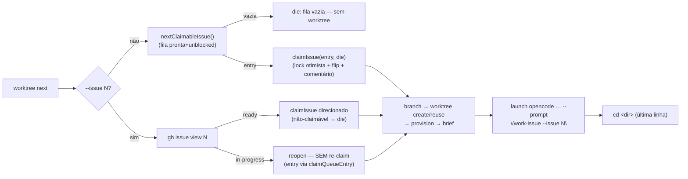

# Impl: Worktree next claima deterministicamente a Issue e abre o opencode com /work-issue já informado

Status: aprovado
Atualizado em: 2026-08-10
Issue: #595
Intenção: docs/plans/worktree-next-claima-issue-deterministicamente.md
Appetite restante: herdado (~1 dia; entrega de scripts/lib/shell/docs — sem schema/UI)

## Leitura da intenção

- **Outcome:** `worktree next` claima a Issue **antes** de criar o worktree (mesma fila/ordem e lock otimista de `pnpm agent:claim`); claim falhou → motivo e saída **sem worktree órfão**; `--issue <N>` repassa ao claim; reabrir Issue já claimada → segue ao launch **sem re-claim** ("já claimada — reabrindo"); o launch entrega a Issue ao agente de forma determinística (`/work-issue --issue <N>`); `--stay` continua suprimindo cd+launch mas o claim acontece; o comando `/worktree` do opencode roda o mesmo script (claim incluso, sem launch).
- **O que NÃO negociar:** nunca desfazer claim (falha pós-claim → reportar, humano decide); claim coordenado do pool (`claimIssueForPool`/supervisor) intacto; mesmo lock otimista do `agent:claim` (race → para com motivo); fonte única de verdade é a Issue — o launch só passa o **número**, o resto a skill lê do GitHub.
- **O que reavaliar:** a hipótese "reutilizar/**invocar** a lógica de `scripts/agent-claim.mjs`" — invocar como subprocesso e parsear o stdout para descobrir o número claimado seria acoplamento frágil de formato de saída (exatamente a classe de bug que #582 puniu). Reavaliado para: **extrair** claim+brief para `scripts/lib/agent-github.mjs` (o worktree.mjs já consome `nextClaimableIssue` de lá — precedente do dono do conhecimento).

## Abordagem recomendada

**Opções consideradas:** A) extrair `claimIssue` + `claimBriefLines` + `claimQueueEntry` para `scripts/lib/agent-github.mjs` e o worktree.mjs consome direto; B) `worktree next` invoca `pnpm agent:claim` como subprocesso e parseia o stdout; C) duplicar o claim (lock + labels + comentário) dentro do worktree.mjs.
**Recomendação:** A — o claim é conhecimento de domínio com **um dono**: `agent-github.mjs` já hospeda fila/gh/labels e é o precedente de `nextClaimableIssue`; agent-claim.mjs vira um CLI fino (mesma saída), o worktree chama a mesma função. B acopla o worktree ao formato de saída do claim (brief, log lines mudam sem aviso → parse quebra) e roda gh duas vezes; C faz o lock otimista divergir — o pior caso é claim duplo.
**Rejeitadas:** B porque parse de stdout para descobrir qual Issue foi claimada é a fragilidade que #582 puniu (claim/branch divergentes); C porque duplica o lock e o brief em dois arquivos que evoluem separados.

### Componentes / mudanças

- **`claimIssue(entry, die)`** (`scripts/lib/agent-github.mjs`): lock otimista (re-read + recusa race) + flip `ready→in-progress` + comentário de claim — extraído **verbatim** de `scripts/agent-claim.mjs`; `die` é injetado (label `[agent:claim]` vs `[worktree]`). O pool segue com `claimIssueForPool` (`agent-pool-github.mjs`) — claim coordenado, intacto.
- **`claimQueueEntry(issue, byId)`** (`scripts/lib/agent-github.mjs`): shape de entry para UMA Issue (reopen) — o derivador interno do `buildClaimQueue` (`entryForIssue` + `doneIdsOf`) vira função privada e é reusado; comportamento de `buildClaimQueue` preservado (spec de parity do pool pina).
- **`claimBriefLines(entry)`** (`scripts/lib/agent-github.mjs`): linhas do brief (id/priority/rename_chat/model/deps/url/`--- spec ---`/body) — extraídas verbatim do agent-claim.mjs; os dois CLIs imprimem as **mesmas linhas** (fonte única).
- **`scripts/agent-claim.mjs`**: passa a usar `claimIssue(pick, die)` + `claimBriefLines(pick)` — CLI, mensagens e saída intactos (OPS32 já ajustou as linhas de model; não regride).
- **`scripts/worktree.mjs`** (`cmdNext`): claim **antes** de branch/fetch/worktree; flag nova `--issue <N>` (parseArgs ganha `issue` com valor): `ready` → claim direcionado via `buildClaimQueue([target], issuesById())` (bloqueada/dep → die "não claimável"); `in-progress` → **reopen** (`claimQueueEntry`, sem claim); outros estados/não-existente → die com motivo. Saída: linha de status ("Claimado da fila" / "Reabrindo sessão já claimada") + brief + "Issue já claimada — NÃO rodar `pnpm agent:claim`" (substitui a linha "Issue NÃO claimada — claim continua sendo…" e sai do branch de criação, vira sempre-impresso). `printLaunchDirective` ganha `issueNumber`.
- **`opencodeLaunchDirective`** (`scripts/lib/worktree.mjs`): assinatura `{ dir, purpose, terminal, issueNumber = null }`; `next` com número → prompt `"/work-issue --issue <N>"` (valor **citado** na linha — a diretiva agora carrega um espaço); sem número → `/work-issue` (fallback atual). `plan`/`new` intactos (sem prompt).
- **`.agents/shell/worktree.sh`**: a execução da diretiva deixa de ser split cego por `IFS=' '` (que não honra aspas) e passa a **tokenizar como shell** (`printf '%s\n' "$launch" | xargs -n 1 printf '%s\n'` → array; xargs processa aspas duplas, não é eval; conteúdo 100% gerado por constantes + número). Comentário do "nunca eval" atualizado.
- **Textos:** header/uso do script (`scripts/worktree.mjs`), `.opencode/commands/worktree.md` (description: "next claima; --issue N; reabrir"), skill `worktree-next-issue` (sai "read-only, NÃO claima"), `AGENTS.md` (bullet "Per-worktree environments": claim-first, `--issue N`/reopen, launch com `/work-issue --issue <N>`), `docs/AGENT-OPS.md` (linha 39 da tabela de scripts, se necessário), `docs/CHANGELOG-AGENTS.md` (uma entrada no topo).
- **Migration:** sem migration. **Access/Consent:** N/A (CLI/shell; gh autenticado do operador). **UI:** Impeccable A — sem superfície de produto.

### Dados → forma

- N/A — sem superfície de dados.

## Fases verificáveis

1. **Lib + scripts** — extração do claim/brief/entry para `agent-github.mjs`; `agent-claim.mjs` refatorado (mesma saída); `cmdNext` com claim + `--issue` + reopen. Verificação: `pnpm gate:fast` (unit de parity do pool e worktree verdes sem edição de comportamento).
2. **Launch com Issue** — `opencodeLaunchDirective` com `issueNumber` + tokenização do worktree.sh. Verificação: unit novos (directive com/sem número, plan/new intactos, não-terminal → null); smoke: `TEQO_WORKTREE_TERMINAL=1 node scripts/worktree.mjs next --issue <N> --stay` imprime a diretiva com o prompt citado.
3. **Docs + textos** — AGENTS.md, worktree.md, skill worktree-next-issue, CHANGELOG. Verificação: `pnpm gate:fast`; grep de "NÃO claima"/"read-only" em código vivo → só docs/plans congelados.

## Rabbit holes / Não escopo (engenharia)

- **Reverter claim / devolver Issue à fila** — outra entrega (intenção).
- **Claim do pool** (`claimIssueForPool`, supervisor, worker UUID) — intacto.
- **`plan`/`new`** não ganham `--issue` nem prompt — só `next` claima.
- **Validação extra de worktree/env/modelo** — o contexto já garante; overhead é o anti-goal da intenção.
- **`rename_chat` no brief compartilhado** — ruído no worktree, mas fonte única > dois briefs que divergem.
- **Editar a intenção** (`worktree-next-claima-issue-deterministicamente.md`) — imutável (Issue in-progress desde o claim).
- **Editar `.opencode/commands/work-issue.md` / skill work-issue** — receptor OPS32, já aceita `--issue <N>` (contrato fechado).

## Já resolvido no /simplify (não reabrir)

- **Claim antes da validação do branch** (P1/R1 + P3/R2): derivação/validação do branch moveu para **antes** do `claimIssue` (pick é read-only; uma Issue sem frontmatter id morre antes do flip, sem claim órfão) + hint "reabra com `next --issue N`" em falha pós-claim (try/catch no `cmdNext`).
- **`--issue` sem valor e posicional `next 595`** (P2/R1#2 + R2#3 + F8): die com motivo; `parseArgs` não consome `--flag` seguinte como valor (`--issue --stay` → "requer um número").
- **Claim direcionado via `buildClaimQueue([target])`** (P2/R1#3): trocado por `claimQueueEntry` + checagem explícita de `blockedBy` com os ids na mensagem.
- **Decisão claim/reopen sem teste** (F3/F4): `claimTargetVerdict` puro extraído (`agent-github.mjs`) + 5 unit (reopen/claim/closed/neither/double-label).
- **Reset `-B` de branch com commits de sessão no reopen** (F1): guard `git log origin/main..<branch>` → die pedindo decisão.
- **Headline "Claimado da fila" no claim direcionado** (F5/R2#1): três variantes (fila / direcionado / reaberto) + aviso "já claimada" diferenciado.
- **`new` omitido nos docs do launch** (R2#5) e **cap ≤999 do slot** no AGENTS.md (R2#6): texto alinhado.
- **Mensagem de race sugerindo re-claim** (F7): agora aponta reopen via `--issue N`.

## Explicitamente fora (descartes + defers com gatilho — triage confirmada 2026-08-10)

- **S1 (defer)** — extração da diretiva `launch`/`cd` por `sed+tail` sobre output que intercala o corpo livre da Issue: o contrato é a ordem das linhas (launch e cd são as últimas 2). **Gatilho:** se `next` (ou qualquer subcomando) passar a imprimir linhas depois da diretiva → trocar por marcadores máquina-leitura (`__WORKTREE_LAUNCH__=`/`__WORKTREE_CD__=`) no output + parse no `worktree.sh`.
- **S2 (defer)** — reopen concorrente (2 terminais, mesmo `--issue N`) sem lock local: double `CREATE DATABASE` (um morre) e `runMigrate` concorrente. Raro (gatilho humano), sem dano permanente. **Gatilho:** relato de double-CREATE ou de migrate concorrente → advisory lock local (ex. `mkdir` exclusivo em `/tmp`) no `cmdNext`.
- **S3 (defer)** — `claimIssue` (mutation do lock otimista) sem unit: a decisão pura foi extraída e testada (`claimTargetVerdict`); mockar `gh` via vi.mock é caro (ESM, execFileSync). **Gatilho:** regressão do lock no `agent:claim`/`next` (race não detectada) → injetar `ghJson`/`setLabels`/`gh` no módulo para unit.
- **S4 (descartar)** — reopen não limpa `ready` stale no double-label `ready`+`in-progress`: o fluxo normal não produz o estado (claim remove `ready`); precedência `in-progress` pinada no teste do `claimTargetVerdict`.

## Riscos e mitigação

- **Race no lock do claim** (outro agente claima entre o pick e o flip) → `claimIssue` die com o motivo (mesma mensagem do agent:claim); o humano re-roda — e **nenhum worktree órfão** porque o claim falha antes do `worktree add`.
- **`--issue N` inexistente/estranho** → `ghJson` lança; o catch do worktree.mjs imprime o stderr do gh com o label `[worktree]` — motivo no terminal, sem worktree.
- **Falha pós-claim** (`worktree add`/provision quebra) → claim **não** desfeito (intenção); recuperação: `worktree next --issue N` vê `in-progress` e reabre sem re-claim — caminho explícito, sem cerimônia.
- **Tokenização por xargs no worktree.sh** → a diretiva é 100% constantes + número (sem input livre, dir slugificado sem espaços); xargs não é eval nem expande globs; unit pina o formato exato da linha.
- **Refactor do `buildClaimQueue`** → extração preserva saídas; spec `agentPoolEligibility` (parity com agent:claim) permanece verde sem edição.
- **Reopen de Issue `in-progress` com deps abertas** → `claimQueueEntry` deriva o shape sem o filtro de bloqueio (reopen é sobre a sessão, não sobre a fila) — caso coberto por design.

## Aceite de engenharia

- [x] Aceite de produto da intenção ainda coberto (claim-first com falha→para; `--issue N`; reopen sem re-claim; launch `/work-issue --issue <N>`; `--stay` claima; `/worktree` com claim)
- [x] Invariantes AGENTS/engineering-standards (sem DB/access/Consent/migration; pool intacto; lock otimista compartilhado)
- [x] Testes de domínio previstos: unit novos para `opencodeLaunchDirective` com `issueNumber`, `claimQueueEntry` (incl. deps satisfeitas) e `claimTargetVerdict` (5 casos); parity `buildClaimQueue` verde sem edição; smoke E2E do reopen (#595, sem re-claim) e dos caminhos de erro
- [x] Self-score decision-quality: 5/5 (decisões com rejeitadas; cabe no appetite; rabbit holes nomeados; reusa dono do conhecimento `agent-github.mjs`; intenção preservada)
