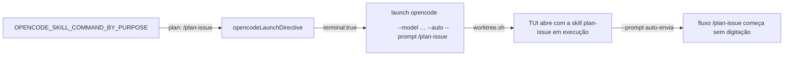

# Impl: Worktree plan abre o opencode com /plan-issue já enviado

Status: aprovado
Atualizado em: 2026-08-10
Issue: #593
Intenção: docs/plans/worktree-plan-abre-opencode-com-plan-issue.md
Appetite restante: ~0,5 dia — cabe folgado (1 constante + textos + testes + anotação local)

## Leitura da intenção

- **Outcome:** `worktree plan [bag]` no terminal (sem `--stay`) imprime a diretiva `launch opencode <dir> --model <preset> --auto --prompt /plan-issue` antes do `cd`; o TUI abre com a skill `plan-issue` já enviada e em execução, sem digitação. `--stay` e o comando `/worktree` continuam como estão (nunca TUI aninhado). Proposição `~/Code/propositions/opencode/prefill-prompt-sem-submit.md` revisada/anotada com o desfecho. Textos correlatos que dizem "plan sem prompt — `/plan-` + autocomplete" passam a dizer "`/plan-issue` enviado".
- **O que NÃO negociar:** simetria com `next` (auto-envio, mesmo se o upstream ganhar prefill — decisão do gate); `next` intacto (`/work-issue`); `new` intacto (prompt-less, "apenas conversar"); `--stay` suprime cd + launch; superfície `/worktree` nunca lança TUI; presets continuam constantes em `scripts/lib/worktree.mjs`.
- **O que reavaliar:** o tom do comentário "gap registered for the opencode repo" no lib — a intenção manda sair ou mudar de tom; o gap upstream (prefill-sem-submit) **continua existindo** como feature request do opencode, mas deixa de ser fallback do Teqo.

## Abordagem recomendada

**Opções consideradas:** A (mudança de valor da constante `plan: null → '/plan-issue'` + textos + testes + anotação da proposição — o mecanismo OPS26 já injeta `--prompt` quando o valor existe) | B (novo mecanismo de draft/prefill por propósito no script do Teqo, ex. campo que distinguisse auto-envio de pré-preenchimento) | C (flag nova no CLI do opencode a partir do Teqo — `--prompt-draft` etc.)
**Recomendação:** A — o mecanismo de launch já existe e é simétrico ao `next`; a necessidade real (revisada na proposição) é **auto-envio**, que `--prompt` cobre hoje; prefill-sem-submit é feature upstream, não bloqueio do Teqo (anti-goal explícito da intenção: não virar mecanismo de prefill-draft).
**Rejeitadas:** B — duplica o que `--prompt` já faz e inventa cerimônia para um uso único; o gate decidiu manter auto-envio mesmo quando o upstream ganhar prefill. C — fora do escopo do repo (anti-goal: prefill é feature do opencode).

### Componentes / mudanças

- **`OPENCODE_SKILL_COMMAND_BY_PURPOSE`** (`scripts/lib/worktree.mjs:34`): `plan: null → plan: '/plan-issue'`; `next`/`new` intocados. Comentário do bloco (linhas 22–33): `plan` passa a enviar `/plan-issue`; o tom do gap muda — prefill-without-submit segue como feature request do opencode (proposição anotada), não é mais fallback do Teqo; `new` continua "apenas conversar" sem skill.
- **`tests/unit/worktree.unit.spec.ts`**: teste "plan launches with the same presets but NO prompt" (linha 151) vira "plan launches with `/plan-issue` sent"; pin de constantes (linhas 163–171) espera `{ next: '/work-issue', plan: '/plan-issue', new: null }`; `new` prompt-less e unknown-purpose fail-safe **intocados** (continuam corretos).
- **`scripts/worktree.mjs`**: docblock do `plan` (linhas 43–46) e usage do help (linha 617) — "sem `--prompt` / autocomplete" → "`--prompt /plan-issue` enviado". Bloco do `new` (linhas 57–59, 623) intocado.
- **`.agents/shell/worktree.sh`**: comentário do header (linhas 12–13) — `plan` passa a "com `/plan-issue` já enviado".
- **`AGENTS.md`** (linha 37, parágrafo Per-worktree): `plan` sai do "NO prompt (`plan`: `/plan-` + TUI autocomplete)" → "`plan` sends `/plan-issue`"; nota do gap reduzida ao upstream (proposição anotada).
- **`.agents/skills/worktree-next-issue/SKILL.md`** (linha 34): `plan` abre com `/plan-issue` já enviado; mesma redução de tom do gap.
- **`docs/CHANGELOG-AGENTS.md`**: entrada **nova** OPS31 (curta, padrão das entregas). Entradas OPS26/OPS27 **permanecem como histórico** (registram o estado na entrega; decisão abaixo).
- **`~/Code/propositions/opencode/prefill-prompt-sem-submit.md`** (fora do repo — edição local, sem commit): bloco de desfecho datado — a necessidade real do fluxo Teqo era auto-envio, coberto por `--prompt` (OPS31 envia `/plan-issue`); prefill-sem-submit segue como feature request upstream; seção "Impacto no Teqo" atualizada.
- **Migration:** sem migration. **Access / Consent:** N/A. **UI:** Impeccable A — N/A (CLI/shell, sem superfície de produto).

## Fases verificáveis

1. **Constante + testes** — `scripts/lib/worktree.mjs` (valor + comentário) e `tests/unit/worktree.unit.spec.ts` (2 testes). Quota: pequena. Rodar só o spec: `pnpm exec vitest run tests/unit/worktree.unit.spec.ts`.
2. **Textos correlatos + proposição** — `scripts/worktree.mjs` (docblock/usage), `worktree.sh`, `AGENTS.md`, skill `worktree-next-issue`, CHANGELOG (entrada nova), proposição anotada. Verificação manual da diretiva: `TEQO_WORKTREE_TERMINAL=1 node scripts/worktree.mjs plan --stay --dry-run`? Não — o script cria worktree real; verificar via simulação da função pura (`opencodeLaunchDirective({ purpose: 'plan', terminal: true })`) que o teste de fase 1 já cobre + leitura da linha impressa não muda (o lib gera).
3. **Gates** — `pnpm gate:fast` na iteração; `pnpm push` na entrega.

## Rabbit holes / Não escopo (engenharia)

- Implementar prefill-draft no opencode (feature upstream; só anotação na proposição).
- Mudar o launch do `next` (`/work-issue`) ou do `new` (prompt-less) — fora de escopo.
- `docs/plans/*` de entregas passadas (OPS25/OPS26) e entradas OPS26/OPS27 do CHANGELOG: histórico congelado, sem edição retroativa.
- `.opencode/commands/worktree.md`: sem mudança — não descreve o prompt do `plan` (a nota do marcador continua válida).

## Riscos e mitigação

- **Quebrar `next` por engano:** valor do mapa muda só em `plan`; teste de pin cobre os três (se o pin quebrar, a CI falha na fase 1).
- **Texto "gap" ambíguo (leitor acha que prefill não existe mais):** comentário do lib mantém menção curta ao upstream com o novo tom (proposição anotada = fonte).
- **Contrato "cd última linha" quebrado:** nenhuma mudança na ordem de impressão (a diretiva continua antes do `cd`); só o valor de `--prompt`.
- **Word-splitting da linha launch:** `/plan-issue` não tem espaços; invariante existente preservada.
- **CHANGELOG histórico divergente do runtime atual:** entrada OPS31 registra a supersessão explícita do comportamento OPS26; leitor do histórico tem a data e o desfecho.

## Aceite de engenharia

- [x] Aceite de produto da intenção ainda coberto (diretiva com `--prompt /plan-issue` no `plan`; `--stay` e `/worktree` intocados; proposição anotada; textos correlatos atualizados)
- [x] Invariantes AGENTS/engineering-standards (nenhuma mudança em src/, migrations, access, Consent, transações; identificadores em inglês, copy pt-BR)
- [x] Testes de domínio previstos (unit da derivação pura — 2 testes; sem int/e2e — nenhum caminho de escrita/access muda)
