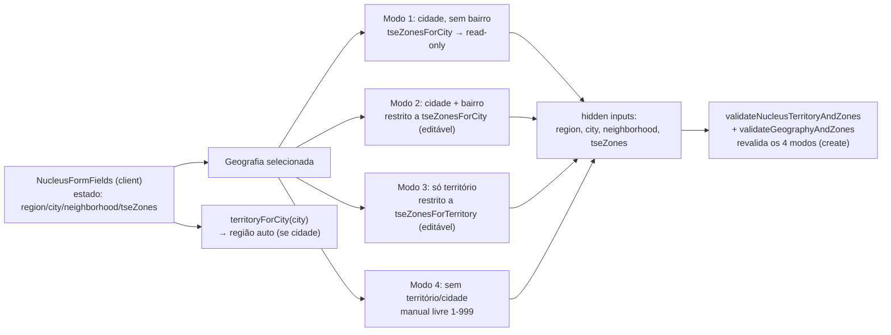

# Zonas TSE por município (auto-preenchimento)

Status: rascunho
Atualizado em: 2026-07-18
Item do roadmap: [docs/roadmap.md](../roadmap.md) (Trilha A → A2)
Responsável: —

## Premissa atualizada (A1 entregue)

A1 ([territorio-multi-municipio-bairro.md](territorio-multi-municipio-bairro.md)) renomeou o território do núcleo para arrays `regions` / `cities` / `neighborhoods` (`text` + `hasMany`). Este plano **nasce contra `cities[]`**: o auto-preenchimento de zonas passa a ser a **união** das zonas oficiais de todos os municípios selecionados (não “a zona do município”). Bairros continuam a exigir exatamente um município (regra A1), então os modos com bairro permanecem escopados a um único município.

## Referência visual (UX Pilot)

Design: [`Formulario-Territorio.png`](../design-refs/latest/Formulario-Territorio.png) · [`Formulario-Territorio.html`](../design-refs/latest/Formulario-Territorio.html) — **compartilhado com [territorio-multi-municipio-bairro.md](territorio-multi-municipio-bairro.md)** (a mesma tela cobre os dois planos).

Como usar (parte deste plano — seção "Zonas Eleitorais (TSE)"):

- **Adotar a estrutura:** banner informativo "Zonas sugeridas pelo cadastro oficial do TSE — confira antes de salvar", lista de zonas como linhas com checkbox + número ("ZE 12"), badge "sugerida" e o município de origem como legenda — bom formato para o modo multi-município (união das zonas, cada uma rastreável ao município).
- **Divergências a resolver na implementação:** o design mostra checkboxes editáveis e um link "Adicionar zona manualmente" para todos os casos; o plano define 4 modos — no modo 1 (municípios sem bairro) as zonas são **somente leitura** (sem checkbox, sem adicionar manual); checkbox/edição vale para os modos 2 e 3 (restrito ao conjunto permitido); entrada manual livre só no modo 4. Usar o visual das linhas do design, trocando checkbox por badge estático no modo read-only.
- **Manter do design:** a zona desmarcada "ZE 7 (zona adicional)" ilustra bem o modo 2/3 (subconjunto permitido).
- **Ajustar cores:** paleta antiga no HTML/PNG; implementar com `TseZoneInput` + tokens do tema `campaign` (chips TSE `#F1F3F5`/`#3F4854`).

## Contexto

Hoje o campo **Zonas TSE** do formulário do núcleo (`TseZoneInput` em `src/components/campaign/TseZoneInput.tsx`) é sempre de preenchimento manual livre: o usuário digita números de 1 a 999, separados por vírgula/espaço/Enter, e o servidor só valida unicidade e intervalo (`parseTseZoneNumbers` em `src/utilities/tseZone.ts`, `validateNucleusTerritoryAndZones` em `src/collections/ElectoralNucleus.ts`). Não há nenhuma relação entre o(s) município(s) selecionado(s) e as zonas informadas — o usuário precisa saber (ou adivinhar) quais zonas cobrem aquele território.

O TSE publica, como dado aberto, a correspondência oficial entre município e zona eleitoral (cada par município×zona aparece no conjunto "Eleitorado por município e zona", por UF). A decisão de produto (2026-07-17) é usar esse cadastro oficial para **preencher automaticamente** as Zonas TSE do núcleo a partir do município selecionado, sem edição manual nesse caso. O território de identidade já é auto-selecionado hoje quando o município muda (`territoryForCity` em `src/lib/bahiaTerritories.ts`, já wired em `NucleusTerritoryFields`); este plano preserva esse comportamento e o documenta como parte do mesmo fluxo.

O cadastro de zonas é relativamente estável, mas pode mudar entre eleições; por isso o mapeamento entra como **dado estático versionado com proveniência**, no mesmo estilo de `src/lib/bahiaTerritories.ts` e seu fixture `tests/fixtures/bahia-identity-territories.official.json`.

## Objetivos

- Mapeamento estático **município (BA) → lista de Zonas TSE** com proveniência oficial TSE, em novo arquivo `src/lib/bahiaTseZones.ts`, validado por fixture independente `tests/fixtures/bahia-tse-zones.official.json` e teste `tests/int/bahiaTseZones.int.spec.ts` (mesmo padrão de `bahiaTerritories`).
- No formulário do núcleo (criação e edição), quatro modos para o campo Zonas TSE, regidos por uma regra única: **se a geografia selecionada define o conjunto exato de zonas que o núcleo cobre, auto-preencher em somente leitura; se define um superconjunto (zonas permitidas, mas o núcleo pode cobrir um subconjunto), editar restrito; se não define nada, livre**.
  1. **Município selecionado e bairro vazio** → o núcleo cobre o município inteiro, conjunto exato conhecido → auto-preencher com todas as zonas oficiais daquele município, em ordem crescente, **somente leitura** (sem adicionar/remover).
  2. **Bairro selecionado** (implica município selecionado) → o núcleo cobre um subconjunto do município (não sabemos qual zona cobre qual bairro) → editável, **restrito às zonas do município**.
  3. **Apenas território de identidade selecionado** (sem município) → o núcleo cobre um subconjunto do território → editável, **restrito à união das zonas dos municípios daquele território** (`citiesForTerritory` ∘ `tseZonesForCity`).
  4. **Sem território e sem município** → preenchimento manual livre (1–999), comportamento atual.
- Ao selecionar o município, o **território de identidade** continua sendo auto-selecionado (já existe; manter e documentar). Ao selecionar só o território, o município permanece vazio (modo 3).
- Validação **server-side** espelhando exatamente os quatro modos, para que o estado read-only do cliente não seja a única barreira (hook `validateNucleusTerritoryAndZones` + zod `validateGeographyAndZones`).
- Sem nova collection, sem alteração de schema, sem migration, sem server action nova, sem `Consent`. O campo `tseZones` (array de `{ zoneNumber, label }`) já existe.

## Decisões travadas

- **Mapeamento como dado estático versionado.** Novo `src/lib/bahiaTseZones.ts` derivado do conjunto "Eleitorado por município e zona" do TSE (UF BA), com cabeçalho documentando URL oficial, versão/data e SHA-256 do download — espelhando o estilo de `src/lib/bahiaTerritories.ts`. O fixture `tests/fixtures/bahia-tse-zones.official.json` é gerado de forma independente e serve de evidência para o teste, nunca lendo `bahiaTseZones.ts`.
- **Sem migration.** O campo `tseZones` já é `array<{ zoneNumber, label }>`. Toda a mudança é UI + dado estático + validação. Nenhuma escrita nova além do que já existe.
- **Regra de auto-preenchimento é autoritativa no servidor (em criação).** O cliente mostra read-only/construído, mas o servidor revalida em **create**: (1) cidade + sem bairro → zonas enviadas devem ser exatamente o conjunto oficial do município; (2) cidade + bairro → cada zona enviada deve pertencer ao conjunto do município; (3) só território → cada zona enviada deve pertencer à união das zonas dos municípios do território; (4) sem território/cidade → livre 1–999. Divergência = `APIError` 400 / issue zod, igual ao padrão atual de território incompatível. Em **update**, a regra só se aplica quando o campo `tseZones` é efetivamente alterado na requisição — para preservar zonas manuais legadas de núcleos existentes (ver "Questões em aberto → núcleos existentes").
- **Território de identidade auto-selecionado já existe.** `NucleusTerritoryFields` já chama `territoryForCity(nextCity)` no `onValueChange` do município. Este plano **não** reimplementa isso; só garante que a subida de estado do novo fluxo não quebre esse comportamento e o documenta como parte do mesmo conjunto de regras.
- **Estado compartilhado entre território e zonas.** Hoje `NucleusTerritoryFields` e `TseZoneInput` são siblings com estado independente em `NucleusFormFields`. Para reagir à mudança de município/bairro, o estado de `region/city/neighborhood/tseZones` precisa ser **levantado** para um único componente cliente que os coordene e emita os hidden inputs. Reusar os componentes existentes como filhos controlados.
- **Read-only não significa oculto.** Nos modos read-only (1), as zonas auto-preenchidas continuam visíveis como badges (mesmo visual do `TseZoneInput`), mas sem o input de texto e sem o botão de remover. Indicar `aria-readonly` e um texto de ajuda explicando que as zonas derivam do município.
- **Transição modo 1 → modo 2 (digitar bairro).** Mantém todas as zonas do município selecionadas como ponto de partida, agora editáveis (o usuário pode remover as que não se aplicam ao bairro). Decisão de produto 2026-07-17.
- **Restrição por território (modo 3).** `tseZonesForTerritory(territory)` = união ordenada e deduplicada de `tseZonesForCity(m)` para cada `m` em `citiesForTerritory(territory)`. O input aceita somente zonas desse conjunto; zonas fora são rejeitadas com a mesma mensagem de "Zona TSE inválida" já usada por `parseTseZoneNumbers`.
- **Subcampo `label` das zonas.** No auto-preenchimento, `label` fica vazio (é opcional). No modo (3) manual, continua sem label (comportamento atual). Não inventar descrição automática.
- **i18n e naming** seguem o AGENTS.md: identificadores em inglês (`bahiaTseZones`, `tseZonesForCity`, `NucleusTerritoryAndZonesFields` ou similar), strings visíveis em pt-BR.
- **Bahia implícita.** O mapeamento é só para BA (todo núcleo é baiano). Sem UF no dado.
- **Ordem de execução: depois de [`territorio-multi-municipio-bairro.md`](territorio-multi-municipio-bairro.md)** (decisão de sequenciamento 2026-07-17). Aquele plano muda `city` → `cities[]`; implementar este plano antes exigiria retrabalho imediato dos quatro modos. Este plano deve nascer contra o modelo de arrays: os modos abaixo leem "município" como "conjunto de municípios selecionados" e o auto-preenchimento passa a ser a **união** de `tseZonesForCity(m)` para cada `m` em `cities`. Modo 1 = `cities` não vazio e sem bairro (união read-only); modo 2 = bairro selecionado (implica `cities.length === 1`, editável restrito às zonas desse município); modo 3 = só território(s) (editável restrito à união das zonas dos municípios dos territórios); modo 4 = sem geografia (livre). A validação server-side espelha a mesma leitura.

## Questões em aberto

- **Versão do cadastro TSE.** Decidido: usar a versão mais recente do cadastro TSE validada em 2026 (conjunto "Eleitorado por município e zona", UF BA), com data e SHA-256 documentados no cabeçalho de `bahiaTseZones.ts` e no fixture. Reavaliar a cada eleição.
- **Núcleos existentes com zonas manuais divergentes.** Decidido: **só aplicar a novos**. Sem migration de dados; núcleos já criados mantêm suas zonas manuais. No formulário de edição, ao carregar um núcleo existente, pré-preencher com as **zonas armazenadas** (não as oficiais); o auto-preenchimento só dispara quando o usuário **altera** o município/território. A validação server-side estrita (zonas == oficiais do município, etc.) vale em **create**; em **update**, só revalidar quando `tseZones` vier alterado na requisição — aceitar zonas legadas divergentes caso contrário. Sub-questão a fechar na implementação: como detectar "tseZones alterado" de forma robusta (comparar com `originalDoc.tseZones`).
- **Cidade com zero zonas no dataset?** Não deveria ocorrer, mas o helper deve falhar fechado: se `tseZonesForCity(city)` retornar vazio para uma cidade válida, tratar como dado faltante e permitir modo manual com aviso, em vez de travar o formulário. O mesmo vale para `tseZonesForTerritory(territory)`.
- **Zona que cobre vários municípios pequenos.** Isso é normal (uma zona, vários municípios). O mapeamento é município→suas zonas, então cada município lista a zona compartilhada; não há ambiguidade para o auto-preenchimento. No modo 3 (território), a união deduplica naturalmente zonas compartilhadas entre municípios do território. Confirmar com o fixture.
- **Ordem e dedup.** `tseZonesForCity` e `tseZonesForTerritory` retornam números únicos em ordem crescente (mesmo padrão de `parseTseZoneNumbers`).
- **Edição de bairro após auto-preenchimento.** Decidido: manter todas as zonas do município selecionadas como ponto de partida (modo 1 → modo 2), agora editáveis.
- **Cache/ISR.** O dado é estático no bundle; sem `unstable_cache`, sem tag. Confirmar com produto.
- **Relação com o item "Import do cadastro oficial de zonas TSE e/ou polígonos GeoJSON" (roadmap linha 59).** Este plano entrega o mapeamento município→zonas e território→zonas (cadastro tabular). Polígonos GeoJSON para o mapa continuam no item da linha 59. Definir se este plano substitui a parte "cadastro" daquele item ou se mantém ambos — recomendação: este plano cobre o cadastro tabular; o item da linha 59 fica restrito a polígonos/GeoJSON.

## Abordagem proposta

Arquivos:

- **`src/lib/bahiaTseZones.ts`** (novo): export `bahiaMunicipalityTseZones` (record/map de cidade→`number[]` ordenado e único), `tseZonesForCity(city): number[]`, `tseZonesForTerritory(territory): number[]` (união deduplicada e ordenada de `tseZonesForCity` sobre `citiesForTerritory(territory)`), e `isTseZoneOfCity`/`isTseZoneOfTerritory` para validação server-side. Cabeçalho com proveniência (URL, versão validada em 2026, SHA-256), no estilo de `bahiaTerritories.ts`.
- **`tests/fixtures/bahia-tse-zones.official.json`** (novo): evidência independente (não gerada a partir de `bahiaTseZones.ts`) com `provenance` (URL do "Eleitorado por município e zona" BA, data, SHA-256 do download) e a tabela município→zonas. Espelha `bahia-identity-territories.official.json`.
- **`tests/int/bahiaTseZones.int.spec.ts`** (novo): valida que `bahiaTseZones.ts` cobre exatamente os 417 municípios de `CitiesByState.BA`, que cada zona está em 1–999, que `tseZonesForTerritory` bate com a união manual sobre `citiesForTerritory`, e que o conteúdo bate com o fixture. Espelha `bahiaTerritories.int.spec.ts`.
- **`src/components/campaign/NucleusForm.tsx` / `NucleusTerritoryFields.tsx` / `TseZoneInput.tsx`**: subir o estado de `region/city/neighborhood/tseZones` para um componente cliente coordenador (ex.: `NucleusTerritoryFields` passar a ser controlado, ou um wrapper novo em `NucleusFormFields`). `TseZoneInput` ganha um modo `readOnly` que renderiza só os badges (sem input/remover) e um modo `allowedZones` que restringe a entrada aos números permitidos (do município ou do território). Seleção de cidade dispara `tseZonesForCity` + `territoryForCity`; seleção de só território dispara `tseZonesForTerritory`; limpar cidade/território reverte o modo conforme a regra. Ao carregar núcleo existente, pré-preencher com as **zonas armazenadas** (não as oficiais).
- **`src/lib/schemas/nucleus.ts`** (`validateGeographyAndZones`) e **`src/collections/ElectoralNucleus.ts`** (`validateNucleusTerritoryAndZones`): adicionar a regra de consistência geografia↔zonas usando `tseZonesForCity`/`isTseZoneOfCity` e `tseZonesForTerritory`/`isTseZoneOfTerritory`, conforme os quatro modos. Em create, validar tudo; em update, só quando `tseZones` vier alterado (preservar zonas legadas). Mesma mensagem em pt-BR e mesmo padrão de `APIError` 400 já usado para território incompatível.
- **`src/utilities/nucleusUi.ts`** (`parseTseZoneNumbers` / `parseSharedNucleusFormData`): quando aplicável, validar no parse que as zonas enviadas respeitam o modo (defesa em profundidade antes do zod/hook), usando o conjunto permitido derivado da geografia enviada (cidade ou território).
- **Sem migration, sem collection, sem server action.** Todo o fluxo é leitura/escrita no formulário existente + dado estático.

## Dependências

- **[`territorio-multi-municipio-bairro.md`](territorio-multi-municipio-bairro.md) — pré-requisito de sequenciamento** (decisão 2026-07-17): este plano nasce contra `cities[]` (união de zonas), evitando retrabalho. Ver "Decisões travadas".
- Fora isso, reusa `territoryForCity`/`citiesForTerritory` (`src/lib/bahiaTerritories.ts`), `CitiesByState.BA` (`src/lib/cities`), `parseTseZoneNumbers` (`src/utilities/nucleusUi.ts`), `NucleusTerritoryFields`/`TseZoneInput` existentes, e o padrão de fixture/teste de `bahiaTerritories`.
- O plano [`baseline-eleitoral-tse.md`](baseline-eleitoral-tse.md) **não** depende deste para funcionar (resolve zonas pelas rows de `electionTally`), mas se beneficia da qualidade do input: zonas auto-preenchidas eliminam erro de digitação que distorceria o baseline por núcleo.
- **Polígonos GeoJSON / mapa** (roadmap linha 59) continuam fora deste plano.

## Não escopo

- Importar polígonos/GeoJSON de zonas ou integrar o mapa (roadmap linha 59 e "Mapa / PostGIS" linha 52).
- Alterar o schema `tseZones` ou criar migration — o campo já existe.
- Mapear bairro→zona (dado não existe oficialmente no TSE; continua ambíguo por design).
- Estender o mapeamento para outros estados (todo núcleo é BA).
- Previsão estatística de votos por zona (roadmap linha 60) — aqui só preenchemos o cadastro.
- Alterar a lista de núcleos, filtros ou dashboard — só o formulário de criar/editar núcleo.

## Referências

- `docs/roadmap.md` (item novo; linha 59 para o relacionado "Import do cadastro oficial de zonas TSE")
- `src/components/campaign/NucleusForm.tsx`, `NucleusTerritoryFields.tsx`, `TseZoneInput.tsx` — formulário a alterar
- `src/lib/bahiaTerritories.ts` e `tests/fixtures/bahia-identity-territories.official.json`, `tests/int/bahiaTerritories.int.spec.ts` — padrão de dado estático + fixture + teste a espelhar
- `src/collections/ElectoralNucleus.ts` — `validateNucleusTerritoryAndZones`
- `src/lib/schemas/nucleus.ts` — `validateGeographyAndZones`
- `src/utilities/nucleusUi.ts` — `parseTseZoneNumbers`, `parseSharedNucleusFormData`
- Portal de Dados Abertos do TSE — conjunto "Eleitorado por município e zona" (UF BA): https://dadosabertos.tse.jus.br/
- AGENTS.md — naming conventions, padrão de leitura/escrita, "Bahia implícita no Núcleo"
