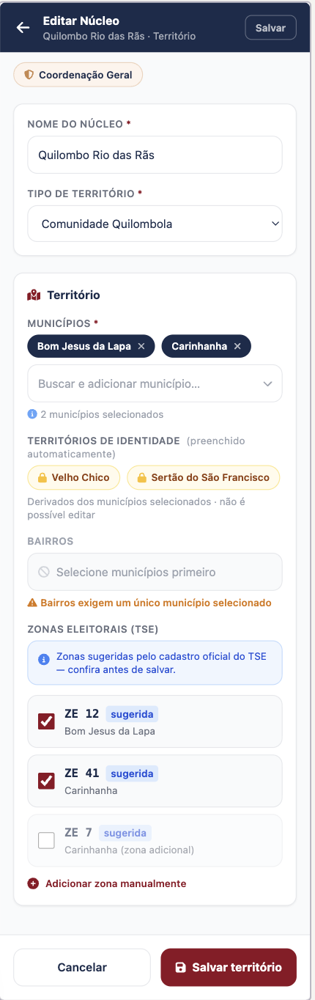
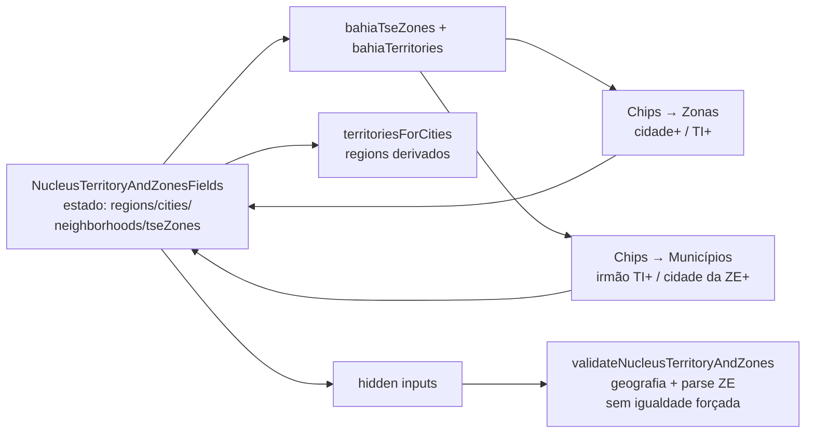

# Zonas TSE por município + sugestões cruzadas de território

Status: entregue
Atualizado em: 2026-07-18
Item do roadmap: [docs/roadmap.md](../roadmap.md) (Trilha A → A2)
Responsável: —

Revisões:
- 2026-07-18 (entrega): cadastro estático `bahiaTseZones` a partir do TSE 2024 `detalhe_votacao_munzona` BA (SHA-256 no cabeçalho); motor `territorySuggestions` + chips opt-in no coordenador `NucleusTerritoryAndZonesFields`; sem migration. Corrigido drift factual: a validação server-side existente chama-se `validateTerritoryAndZones` (não `validateGeographyAndZones`). Reuso de `canonicalizeMunicipalityName` / aliases de A3 na geração do dataset.

## Premissa atualizada (A1 entregue)

A1 ([territorio-multi-municipio-bairro.md](territorio-multi-municipio-bairro.md)) renomeou o território do núcleo para arrays `regions` / `cities` / `neighborhoods` (`text` + `hasMany`). Este plano **nasce contra `cities[]`**: sugestões e validações leem o conjunto de municípios/territórios selecionados. Bairros continuam a exigir exatamente um município (regra A1).

## Revisão de produto (2026-07-18)

A versão anterior deste plano (2026-07-17) definia quatro modos com auto-preenchimento forçado e Zonas TSE em somente leitura quando o município cobria o conjunto exato. A decisão de produto de 2026-07-18 **substitui esse modelo** por **sugestões opt-in** (chips `{rótulo} +` acima dos inputs): o usuário mantém o input livre e clica para completar o que falta. O cadastro estático município↔zona e o lift de estado compartilhado permanecem; o que muda é a UX e a validação server-side (não há mais “zonas devem ser exatamente o conjunto oficial”).

## Referência visual (UX Pilot)

Design: [`Formulario-Territorio.png`](../design-refs/latest/Formulario-Territorio.png) · [`Formulario-Territorio.html`](../design-refs/latest/Formulario-Territorio.html) — **compartilhado com [territorio-multi-municipio-bairro.md](territorio-multi-municipio-bairro.md)** (a mesma tela cobre os dois planos).

Como usar (parte deste plano — seção "Zonas Eleitorais (TSE)" + chips de sugestão):

- **Adotar a estrutura:** banner “Zonas sugeridas pelo cadastro oficial do TSE — confira antes de salvar”; chips/linhas com badge “sugerida”; entrada manual ainda disponível. O design já aponta para **sugestão opt-in**, não para lock read-only.
- **Divergência vs design (aceita nesta revisão):** o HTML mostra checkboxes de zonas individuais pré-marcadas; a UX canônica deste plano são chips `{Município} +` / `{Território} +` **acima** do `TseZoneInput` (abaixo do título da seção), que ao clicar fazem união das ZEs faltantes. No campo Municípios, chips `{Município irmão} +` acima do combobox. Não implementar a lista checkbox do design como fonte de verdade.
- **Ajustar cores:** paleta antiga no HTML/PNG; implementar com `TseZoneInput` / `NucleusTerritoryFields` + tokens do tema `campaign` (chips TSE `#F1F3F5`/`#3F4854`; chips de sugestão com primário `#C51414` ou outline secundário — seguir o padrão de Badge existente).

## Contexto

Hoje o campo **Zonas TSE** (`TseZoneInput` em `src/components/campaign/TseZoneInput.tsx`) é preenchimento manual livre: números 1–999, validados por `parseTseZoneNumbers` (`src/utilities/tseZone.ts`) e `validateNucleusTerritoryAndZones` (`src/collections/ElectoralNucleus.ts`). Não há relação município↔zona no app.

O bloco de território (`NucleusTerritoryFields` em `src/components/campaign/NucleusTerritoryFields.tsx`) já deriva `regions` no cliente via `territoriesForCities` quando há municípios (e o servidor rederiva). Falta o restante do grafo de sugestões: completar ZEs a partir de município/TI, sugerir municípios irmãos do mesmo TI, e sugerir municípios a partir de uma ZE adicionada.

O TSE publica a correspondência município×zona (“Eleitorado por município e zona”, UF BA). A decisão de produto (2026-07-17, UX revisada 2026-07-18) é versionar esse cadastro como dado estático (estilo `src/lib/bahiaTerritories.ts`) e usá-lo para **oferecer sugestões clicáveis**, sem forçar o conjunto no save.

Exemplo canônico (TI oficial `Vale do Jiquiriçá`):

1. Usuário adiciona município **Itiruçu** → `regions` ganha automaticamente **Vale do Jiquiriçá** (já existe).
2. Se alguma ZE de Itiruçu ainda não está em `tseZones` → chip **「Itiruçu +」** acima do input de ZEs; clique faz união das ZEs oficiais de Itiruçu.
3. Se o TI está selecionado (derivado ou manual) e falta ao menos uma ZE da união dos municípios do TI → chip **「Vale do Jiquiriçá +」** (mesma posição).
4. Municípios do mesmo TI ainda não selecionados (ex. **Maracás**) → chips **「Maracás +」** acima do input de Municípios.
5. Usuário adiciona uma ZE → municípios oficiais dessa ZE que ainda não estão em `cities` → chips **「{Município} +」** acima do input de Municípios.

## Objetivos

- Mapeamento estático **município (BA) ↔ Zonas TSE** em `src/lib/bahiaTseZones.ts`, com fixture independente `tests/fixtures/bahia-tse-zones.official.json` e teste `tests/int/bahiaTseZones.int.spec.ts` (espelha `bahiaTerritories`).
- Helpers bidirecionais: `tseZonesForCity`, `tseZonesForTerritory` (união), `citiesForTseZone` (reverso), `isTseZoneOfCity` / `isTseZoneOfTerritory`.
- No formulário de criar/editar núcleo, **três faixas de sugestão opt-in** (chips `{rótulo} +`), sempre acima do input alvo e abaixo do título/label do campo:
  1. **→ Zonas TSE:** por município selecionado com ZEs faltantes; por TI selecionado (derivado ou manual) com ao menos uma ZE da união faltando.
  2. **→ Municípios:** irmãos do(s) TI(s) tocado(s) ainda não selecionados; municípios oficiais de cada ZE já selecionada ainda não em `cities`.
- Clique em sugestão **une** o conjunto faltante ao estado atual (nunca substitui nem remove o que o usuário já escolheu).
- `regions` continua derivado dos municípios quando `cities` não vazio (A1; sem mudança de regra).
- Inputs de município e ZE permanecem **sempre editáveis** (livre 1–999 para ZE; combobox estrito para município). Sem modo read-only forçado.
- Validação server-side: intervalo/unicidade de ZEs (já existe) + geografia Bahia (já existe). **Não** exigir que `tseZones` coincida com o conjunto oficial. Opcional: aviso suave no cliente se houver ZE fora do conjunto sugerido pela geografia atual — sem bloquear save.
- Sem nova collection, sem migration, sem server action, sem `Consent`.

## Decisões travadas

- **Sugestão opt-in, nunca auto-gravação forçada de ZEs/municípios irmãos.** Adicionar Itiruçu **não** preenche `tseZones` sozinho; só aparece o chip até o usuário clicar (ou digitar). Municípios irmãos e municípios-por-ZE idem. (Decisão de produto 2026-07-18; revisa o auto-preenchimento forçado de 2026-07-17.)
- **TI a partir do município continua automático** via A1 (`territoriesForCities` / rederivação no servidor). Isso **não** é chip de sugestão — é derivação. Remover municípios restaura edição manual de `regions`.
- **Mapeamento como dado estático versionado.** `src/lib/bahiaTseZones.ts` a partir do TSE 2024 `detalhe_votacao_munzona` (UF BA — cobertura eleição-validada dos 417 municípios; preferido aos resultados 2022 por risco de remanejamento de zonas), cabeçalho com URL, data de extração e SHA-256 — estilo `bahiaTerritories.ts`. Nomes TSE reconciliados via `canonicalizeMunicipalityName`. Fixture independente nunca lido a partir do módulo TypeScript.
- **Sem migration.** Campo `tseZones` já é `array<{ zoneNumber, label }>`.
- **Estado compartilhado.** Hoje `NucleusTerritoryFields` e `TseZoneInput` são siblings com estado independente em `NucleusForm`. Subir estado de `regions` / `cities` / `neighborhoods` / `tseZones` para um coordenador cliente (ex. `NucleusTerritoryAndZonesFields`) que emite hidden inputs e calcula sugestões.
- **União, não replace.** Clique em 「Itiruçu +」 = `tseZones ∪ tseZonesForCity('Itiruçu')`. Clique em 「Vale do Jiquiriçá +」 = união de todas as ZEs de `citiesForTerritory('Vale do Jiquiriçá')`. Clique em 「Maracás +」 = adiciona o município (respeitando `MAX_NUCLEUS_CITIES`).
- **Quando mostrar o chip de ZE por município:** município ∈ `cities` e existe `z ∈ tseZonesForCity(m)` com `z ∉ tseZones` atuais. Chip some quando o conjunto estiver completo.
- **Quando mostrar o chip de ZE por TI:** TI ∈ `displayRegions` (derivado ou manual) e existe ao menos uma ZE em `tseZonesForTerritory(ti)` ausente de `tseZones`. Se o município já tem chip próprio, o chip do TI ainda aparece quando a união do TI tem ZEs além das dos municípios já selecionados (ex.: só Itiruçu selecionado → chip do município + chip do TI para puxar o resto do Vale).
- **Quando mostrar município irmão:** cidade ∈ `citiesForTerritory(ti)` para algum `ti` em `displayRegions`, cidade ∉ `cities`, e ainda há cota em `MAX_NUCLEUS_CITIES`.
- **Quando mostrar município a partir de ZE:** cidade ∈ `citiesForTseZone(z)` para algum `z` em `tseZones`, cidade ∉ `cities`. Zona compartilhada entre muitos municípios é o caso normal — ver teto de UI em “Questões em aberto”.
- **Ordem dos chips de sugestão:** alfabética por rótulo (pt-BR), ZEs internas em ordem crescente (já padrão de `parseTseZoneNumbers`).
- **`label` das zonas** continua vazio no preenchimento por sugestão (opcional no schema).
- **Bahia implícita.** Mapeamento só BA.
- **i18n e naming** seguem o AGENTS.md: identificadores em inglês (`bahiaTseZones`, `tseZonesForCity`, `citiesForTseZone`, `TerritorySuggestionChips`, `NucleusTerritoryAndZonesFields`), strings visíveis em pt-BR (`「Itiruçu +」`, aria-labels “Adicionar zonas TSE de Itiruçu”).
- **Ordem de execução:** depois de A1 (já entregue). Nasce contra `cities[]`.

## Questões em aberto

- **Versão do cadastro TSE.** **Recomendação:** versão mais recente validada em 2026 do “Eleitorado por município e zona” BA, data + SHA-256 no cabeçalho e no fixture. Reavaliar a cada eleição.
- **Teto de chips visíveis.** Um TI tem até ~30 municípios; uma ZE compartilhada pode listar vários. **Recomendação:** mostrar até **8** chips por faixa; se houver mais, chip “+N municípios” / “+N sugestões” que expande a lista (ou abre o combobox com filtro pré-aplicado). Definir N com produto se 8 for baixo em uso real.
- **Prioridade quando as duas fontes sugerem o mesmo município** (irmão do TI e município da ZE). **Recomendação:** deduplicar por nome; uma única chip.
- **Cidade com zero zonas no dataset.** **Recomendação:** falhar fechado no helper (array vazio) e **não** mostrar chip 「{cidade} +」; permitir input manual sem travar. Log/teste garante cobertura dos 417 municípios na fixture.
- **ZE digitada fora do conjunto da geografia atual.** **Recomendação:** não bloquear save; opcional `FieldDescription` âmbar “Zona X não aparece no cadastro dos municípios/TIs selecionados” — só UX, sem `APIError`.
- **Núcleos existentes.** **Recomendação:** carregar zonas/municípios armazenados; sugestões aparecem só para o que ainda falta. Sem backfill.
- **Bairros e sugestões.** Bairro não altera o conjunto oficial município→zona. **Recomendação:** chips de ZE por município/TI ignoram bairros (mesmo com bairro, sugerir o conjunto municipal completo; o usuário remove ZEs irrelevantes manualmente).
- **Cache/ISR.** Dado estático no bundle; sem `unstable_cache`.

## Abordagem proposta

Componentes:

- **`src/lib/bahiaTseZones.ts`** (novo): `bahiaMunicipalityTseZones` (cidade → `number[]` ordenado único), `tseZonesForCity(city)`, `tseZonesForTerritory(territory)` (= união sobre `citiesForTerritory`), `citiesForTseZone(zoneNumber)` (reverso, nomes canônicos ordenados), predicados `isTseZoneOfCity` / `isTseZoneOfTerritory`. Cabeçalho com proveniência TSE.
- **`tests/fixtures/bahia-tse-zones.official.json`** + **`tests/int/bahiaTseZones.int.spec.ts`**: cobertura dos 417 municípios de `CitiesByState.BA`, zonas em 1–999, reverso consistente com o mapa direto, união por TI bate com `citiesForTerritory`, conteúdo = fixture.
- **`src/lib/territorySuggestions.ts`** (novo, puro, testável): funções que, dado `{ cities, regions, tseZones }`, retornam `{ zoneSuggestions: { kind: 'city'|'territory', label: string, zonesToAdd: number[] }[], citySuggestions: { kind: 'sibling'|'zone', label: string, city: string }[] }` já filtradas (só o que falta) e ordenadas. Sem React.
- **`TerritorySuggestionChips`** (em `src/components/campaign/TerritorySuggestionChips.tsx`): lista de botões/Badges `{label} +` com `aria-label` descritivo; `onAccept(suggestion)`.
- **`NucleusTerritoryAndZonesFields`** (novo ou evolução de `NucleusTerritoryFields` + `TseZoneInput` em `src/components/campaign/`): coordenador cliente; monta chips acima de Municípios e acima de Zonas TSE; ao aceitar, atualiza estado e esconde chips resolvidos; `TseZoneInput` vira controlado (`value`/`onChange`) em vez de só `defaultValues`.
- **`NucleusForm.tsx`**: passa a usar o coordenador no lugar dos dois siblings soltos.
- **`src/lib/schemas/nucleus.ts` / `ElectoralNucleus.ts` / `nucleusUi.ts`**: **não** adicionar regra de igualdade zonas==oficiais. Manter validação atual de geografia e parse de ZEs. (A revisão 2026-07-18 remove a validação estrita prevista na versão anterior deste plano.)
- **Sem migration, sem collection, sem server action.**

## Dependências

- **A1** ([territorio-multi-municipio-bairro.md](territorio-multi-municipio-bairro.md)) — dura, já entregue: `cities[]` / `regions` derivados / `territoriesForCities` / `citiesForTerritory`.
- Reusa `bahiaTerritories.ts`, `CitiesByState.BA`, `parseTseZoneNumbers`, `NucleusTerritoryFields` / `TseZoneInput` / `StrictCombobox`, padrão de fixture de `bahiaTerritories`.
- **[baseline-eleitoral-tse.md](baseline-eleitoral-tse.md)** — dependência suave na outra direção: A4 se beneficia de `tseZones` bem preenchidos; o baseline não bloqueia este plano (`electionTally` já resolve cidade↔zona).
- Polígonos GeoJSON / B4 continuam fora.

## Não escopo

- Auto-preenchimento forçado / Zonas TSE read-only (modelo descartado em 2026-07-18).
- Importar polígonos/GeoJSON de zonas (B4 / [mapa-bahia-geometrias.md](mapa-bahia-geometrias.md)).
- Alterar schema `tseZones` ou criar migration.
- Mapear bairro→zona (dado oficial inexistente).
- Estender mapeamento para outros estados.
- UI de baseline/insights (A4/A5) — só melhora a qualidade do input de `tseZones`.
- Alterar lista de núcleos, filtros ou dashboard.

## Referências

- `docs/roadmap.md` (Trilha A → A2; Janela 1 ordem 3)
- `src/components/campaign/NucleusForm.tsx`, `NucleusTerritoryFields.tsx`, `TseZoneInput.tsx` — formulário a coordenar
- `src/lib/bahiaTerritories.ts`, `tests/fixtures/bahia-identity-territories.official.json`, `tests/int/bahiaTerritories.int.spec.ts` — padrão a espelhar
- `src/collections/ElectoralNucleus.ts` — `validateNucleusTerritoryAndZones`
- `src/lib/schemas/nucleus.ts` — `validateTerritoryAndZones`
- `src/utilities/tseZone.ts` / `nucleusUi.ts` — parse de ZEs
- `docs/design-refs/latest/Formulario-Territorio.{png,html}` — referência visual (banner + “sugerida”)
- Portal de Dados Abertos do TSE — “Eleitorado por município e zona” (UF BA): https://dadosabertos.tse.jus.br/
- AGENTS.md — naming, Bahia implícita, overrideAccess nas queries (este plano não introduz queries novas)
