# Roadmap — Teqo

Atualizado em: 2026-07-30 — ~~**B66**~~ ✓ busca no focus; ~~**B51**~~ ✓; ~~**B52**~~ ✓; ~~**B72**~~ ✓ gap strip ações; ~~**B71**~~ ✓ polish busca; **B69**–**B70** A4 liderança; ~~**B62**~~ ✓ simplificar sinal (E11 triage 1 por presença); ~~**B56**~~ ✓; ~~**B67**~~ ✓; ~~**B68**~~ ✓; ~~**B59**~~ ✓; ~~**B65**~~ ✓; ~~**B60**~~ ✓; ~~**B61**~~ ✓; ~~**B48**~~ ✓; ~~**B49**~~ ✓; ~~**B50**~~ ✓; B53–B55; wizards ~~B60~~ ✓/~~**B61**~~ ✓/B63–B64.
Registro canônico dos **próximos** planos e débitos. Histórico de entregas: resumo abaixo + planos em [`docs/plans/`](plans/) + notebook [`.cursor/rules/projects/nucleos-eleitorais.mdc`](../.cursor/rules/projects/nucleos-eleitorais.mdc).

## Âncoras do calendário eleitoral 2026 (Res. TSE 23.760/2026)

| Data        | Marco                                   | Consequência para o produto                                                                   |
| ----------- | --------------------------------------- | --------------------------------------------------------------------------------------------- |
| 20/07–05/08 | Convenções partidárias                  | Vertical remodelada já em produção; smoke + onboarding do time no modelo novo                 |
| 15/08       | Prazo final de registro de candidaturas | TSE publica candidaturas 2026 → destrava A6 (dobradinha)                                      |
| 16/08       | Início da propaganda eleitoral          | Base nominal com dados reais + inteligência mínima (E8–E9, C12) operando **antes** desta data |
| 09–23/10    | Propaganda gratuita rádio/TV            | Congelar mudanças arriscadas (~20/09)                                                         |
| 04/10       | 1º turno                                | GOTV (C5) — confirmação de comparecimento da base nominal                                     |
| 25/10       | Eventual 2º turno                       | Chapa majoritária; Solla decidido no 1º turno                                                 |

## Princípios e decisões travadas

- Ownership de audiência e portabilidade de dados; módulos reutilizáveis em outros contextos políticos.
- Um único app Next.js: site `(frontend)`, admin `(payload)`, `/campanha` `(campaign)`. Sem Rust separado. Vercel por enquanto.
- Doações só via CTA QueroApoiar (`apoiar.me/jorgesolla`). Pessoa = `Contact` + joins — nunca cadastro paralelo.
- **Município = unidade operacional pré-definida** (remodelagem 2026-07-23, **em produção**): 435 entradas — um por município da Bahia, exceto Salvador (19 Municípios-zona, ZE 1–19); Camaçari é município inteiro (ZE 170/171 agregadas); geografia seedada e read-only. Substitui Praça/Núcleo Eleitoral — plano-mestre [remodelagem-municipios.md](plans/remodelagem-municipios.md).
- Roles: `coordinator` ("Coordenador Geral"), `advisor` ("Assessor"), `leader` ("Liderança") e `candidate` ("Candidato", visão irrestrita); assessor vê só os municípios que administra; liderança em lockdown (só a ferramenta de contatos de apoiadores). Assimetria de votos: staff registra `declaredVotes` e estima em 3 cenários (A10); liderança nunca vê estimativas. Sem disparo em massa (Res. TSE 23.610 art. 33 / Meta). Comunicação **1:1 interna** staff↔lideranças via bridge WhatsApp não oficial = programa **D3–D5** (não é Business API nem blast).
- Padrões de engenharia vigentes (hardening 2026-07-23): access explícito em toda collection, zero lint warnings, ban `as never`, knip no CI, caching ladder — regra `.cursor/rules/engineering-standards.mdc`; débitos no ledger [TECH-DEBT.md](TECH-DEBT.md).

## Onda 0 — caminho crítico para dados reais

Textos provisórios de Consent + `/privacidade` auto-provisionados ([onda-0.md](plans/onda-0.md)); **hold de PII real** até o lote jurídico final. Inalterada pela remodelagem (mesmas chaves `Consent`).

1. **Lote jurídico único** _(externo)_ — textos finais (substituem provisórios) + base LGPD art. 11: `lideranca-autopreenchimento`, `apoiador-cadastro`, `apoiador-intencao-voto`, `campanha-notificacoes-push`, **`campanha-whatsapp-canal`** (D3 — armazenamento/processamento do canal interno staff↔lideranças; se o lote já tiver fechado sem esta chave, entra no próximo passe com a assessoria — não abrir rodada jurídica só por ela), Aviso de Privacidade, avaliação RIPD.
2. **Smoke pós-deploy** _(desbloqueado — deploy da remodelagem aplicado em produção em 2026-07-23)_ — `NEXT_PUBLIC_SITE_URL` HTTPS, login `/campanha`, município de teste; checklist no AGENTS.md.
3. **Ativação com dados reais** assim que (1) liberar — lideranças/apoiadores reais e import em massa.
4. **Onboarding do time** — usuários `coordinator`/`advisor`, primeiros municípios assumidos, treino de campo; ~~**B19** `/campanha/assessores`~~ (**entregue 2026-07-24** — CG/candidato sem `/admin`); **seed da planilha de prioridades via E4R** (engenharia pronta — `pnpm db:seed:projecao`; aplicar em produção após smoke — [plano](plans/import-planilha-projecao.md)); rede/lideranças (nomes) só após o lote jurídico.

**O0+** (escala/DRY pós-Onda 0) não bloqueia jurídico nem smoke fictício — [plano](plans/escala-dry-pos-onda0.md).

## Já entregue (resumo)

- **Era Núcleos (2026-07-15 → 2026-07-20)** — MVP + Ciclo 2 (auth `campaignUser`, território A1/A2, baseline TSE A3/A4, overview B1, share C1, PWA D1, geometrias B2, Leaflet B3), C2 apoiadores (eng.), C3 agenda, C6–C11 escala, E1+E3 metas/estratégia, E2 série TSE 2014/2018/2022, A5 conversão/classificação/alavancagem/mobilização, A7 F1–F2, A8 perfis IBGE, fill-ins (reset senha/perfil, visitados recentes, Field Desk polish). Infra e padrões (locks, transações, consent por chave, shells, mapa, dados eleitorais) reaproveitados pela remodelagem; superfícies e modelo de Núcleo substituídos.
- **Plataforma** — local Postgres + guards, migrations baselined, posts/tags do site público com cache `posts`, Onda 0 textos provisórios + `/privacidade`; toolchain TS6 (tooling) + TS7 (typecheck).
- **Site público (2026-07-21)** — Pixel do Meta nos abaixo-assinados ([plano](plans/pixel-meta-abaixo-assinado.md)).
- **Remodelagem Praças → Municípios (R0–R5 2026-07-21; M1–M5 2026-07-23; em produção 2026-07-23)** — modelo Município (435 entradas; Salvador 19 zonas; Camaçari inteira), role `candidate`, demandas staff-only, lockdown da liderança (ferramenta de contatos, `source: lideranca`), dobradinhas `stateDeputy` + `/campanha/dobradinhas`, mapa no Início; migrações destrutivas da vertical aplicadas em produção via build Vercel. Planos: [remodelagem-pracas.md](plans/remodelagem-pracas.md) → [remodelagem-municipios.md](plans/remodelagem-municipios.md).
- **Mapa e lista (2026-07-21, na era Praças; identificadores renomeados na M1)** — A9 total esperado ([plano](plans/estimativa-votos-praca.md)) + A9+ loader compartilhado ([plano](plans/escala-dry-pos-a9.md)); B6 setStyle incremental ([plano](plans/escala-dry-pos-b3.md)); B7 mapa filtrado ([plano](plans/mapa-pracas-filtrado.md)); B9 edição rápida ([plano](plans/edicao-rapida-lista-pracas.md)); B10 hover/tap ([plano](plans/hover-mapa-pracas.md)); B11 escala % dos válidos ([plano](plans/escala-percentual-mapa-pracas.md)); B12 fit ao footprint filtrado ([plano](plans/aproximar-mapa-pracas.md)); B8 F1 catálogo bairros das zonas ([plano](plans/poligonos-pracas-zona.md) — hoje Salvador-only, entradas de Camaçari removidas na M1); fill-ins filtros-auto ([plano](plans/filtros-auto-pracas.md)) e C8 F4 ([plano](plans/escala-dry-pos-c6.md)).
- **A10 (2026-07-23)** — cenários pessimista/média/otimista em `votePledge.estimatedVotes` e `municipality.expectedVotes`; agregação por cenário (default média); seletor no mapa/overview; liderança segue com um `declaredVotes` ([plano](plans/cenarios-estimativa-votos.md)). Desbloqueou **E8**.
- **Admin Payload (2026-07-23)** — export CSV de assinaturas e contatos ([plano](plans/exportar-csv-assinaturas.md)).
- **Hardening de engenharia (2026-07-23, Fases 0–6)** — access lockdown (PII/CMS admin-only + gates de rota do leader), tooling gate (knip no CI, `--max-warnings=0`, ban `as never`), artefato TSE commitado + cache (`bahiaElectionAggregates`, `election-tse`, `loadMunicipalityScope`), pending honesto + Suspense streaming, state scoping, splits (`src/utilities/access/*`, `supporterImport.ts`, shells DRY). Tracker: [IMPROVE-CODE-QUALITY-PLAN.md](IMPROVE-CODE-QUALITY-PLAN.md) · ledger: [TECH-DEBT.md](TECH-DEBT.md) · mapa de testes: [TESTING.md](TESTING.md).
- **Consolidação de engenharia Pass 2 (2026-07-25, W0–W5 + D3)** — sistema de listas da campanha (colunas como dado em `CampaignTable`, URL state compartilhado, 8 superfícies migradas, B16+ absorvido; **B17/B18 ficaram triviais** — só falta a UI de toggle/salvar), split do `municipalityUi`, fronteiras lib/utilities zeradas + `server-only` em 21 loaders + `components/campaign` em 15 domínios (decisão: sem `src/domains/`), `electionInsights` deletado (**E10 nasce limpo**), knip `exports` em ERROR no CI (0 mortos), tabs de detalhe extraídas, `runCampaignFormAction` fecha C8 F4, copy Praça→Município varrida, consent do WhatsApp por chave estável (D3). Tracker: [IMPROVE-CODE-QUALITY-PLAN.md](IMPROVE-CODE-QUALITY-PLAN.md) § Pass 2 · arquitetura: [ARCHITECTURE.md](ARCHITECTURE.md).
- **E4R (2026-07-24)** — import único da planilha de projeção → `municipality.expectedVotes` (Bom→otimista, Regular→média, Mínimo→pessimista) + `priority` (`pnpm db:seed:projecao`, always-overwrite, dry-run + runbook; Salvador pulado; zero PII). No mesmo dia o grupo duplicado `voteGoals` ("Meta Bom/Regular/Mínimo") foi **removido do app** (migration `20260724_133600` com backfill metas→estimativas) — a única série por cenário é `expectedVotes`. Plano: [import-planilha-projecao.md](plans/import-planilha-projecao.md). Seed local verificado (189 estimativas / 50 alta); produção após smoke.
- **E17 (2026-07-24)** — tabela comparativa dos 27 Territórios de Identidade no Início staff (`/campanha`): `territoryOverview.ts` (rollup puro client-safe: `computeTerritoryRollup` + `sortTerritoryRows`) + `loadTerritoryOverview.ts` (loader server-only, `overrideAccess: true`) + `TerritoryOverviewTable.tsx` (tabela densa, ordenação client-side default `% da própria votação desc`, Metropolitano decomposto em Salvador 19 zonas × Demais RMS, linha→`/campanha/municipios?region=<TI>`). Somas/razões apenas (salvaguarda MAUP); sem migration/collection. Primeira fatia de E12. Plano: [tabela-ti-inicio.md](plans/tabela-ti-inicio.md).
- **C12 (2026-07-24)** — registro-fundação: versions nativas em `votePledge` com baseline; sinais tipados em `municipalityUpdate`; origem do `actionPlan`; demandas vinculadas com custo derivado e criação múltipla atômica; `allocationDecision` ex-ante imutável. Migration `20260724_180000_add_campaign_foundation_records`; testes int + E2E. Plano: [registro-fundacao.md](plans/registro-fundacao.md).
- **E8 (2026-07-24)** — conta da cadeira: artefato TSE commitado estendido para v2 (`campoFederalVotesByYear`, `federalTallyByYear`, `majoritarian2022` presidente/governador T1, via `pnpm build:election-aggregates`); curadoria `src/lib/campoParties.ts` (ano→siglas do campo, validada contra `electionPartySpectrum`); global `campaignGoals` (meta estadual 150 mil + margem, access staff-read/coordinator-write, migration `20260724_180000_add_campaign_goals_global`); `municipalityPotential.ts` (válidos projetados, teto do campo, captura, share intracampo, roll-off 2022-only, meta sugerida + sanity por TI) e `goalCoverage.ts` (`meta = expectedVotes[cenário] ?? suggestedGoal`; `comprometido = Σ pledges`, nunca a expectativa da mesa); encaixado no dashboard, na visão geral e na lista de municípios (nova coluna "Cobertura da meta"), e num novo card "Conta da cadeira" no detalhe. Plano: [conta-da-cadeira.md](plans/conta-da-cadeira.md). Desbloqueia **E9**, **E10**, **E12**, **E13** (e melhora **B13**/**E16**). _(A fórmula da meta sugerida foi revista no mesmo dia, durante o E9 — ver abaixo.)_
- **B19 (2026-07-24)** — gerenciar assessores em `/campanha/assessores` (lista + novo + detalhe): criar/editar contas `advisor`, carteira de municípios (auto-save por delta), reenviar link de senha; só CG/candidato (`isCampaignUnrestricted`); access de update/phone e atribuição `municipality.advisors` alinhados ao `candidate`; leitura privilegiada de e-mail no loader (`reloadUnrestrictedActor`); sem migration. Plano: [gerenciar-assessores.md](plans/gerenciar-assessores.md).
- **E9 (2026-07-24)** — fila de alocação na própria lista de municípios (sem rota nova, sem coluna nova, sem migration). Corrigiu antes a meta sintética do E8, que repartia os 150 mil proporcionalmente **só ao teto do campo** e por isso dava meta 2.911 a Vitória da Conquista (5.005 votos em 2022) e 813 a Campo Formoso (47) — ordenar por déficit sobre ela colocaria desertos no topo. `deriveSuggestedGoalsByScenario` (substitui `decomposeStateGoal`) ancora a meta na votação própria de 2022 por cenário: pessimista = base×(1−`margin`), central = base, otimista = base×(`stateGoal` ÷ Σ base), com clamp; `goalCoverage` passou a receber `SuggestedGoalByScenario`. Na fila: `lastPledgeAt` no agregado de pledges, `lastSignalAt` = máx(`lastUpdateAt`, pledge) no view model, sort keys `deficit` (**novo default do staff**) e `frescor` (cenário `central` fixo), frescor dobrado na coluna "Última atualização" (frio ≥ 21 dias), badge "sem responsável" em prioridade alta sem assessor, "coluna da vergonha" no detalhe da métrica de assessoria (`?priority=alta&coverage=sem_assessor`) e copy Praças→Municípios. Cortes: votos em jogo → **B13**, LQ/captura → **E10**, coluna dedicada de déficit → desnecessária. Plano: [fila-de-alocacao.md](plans/fila-de-alocacao.md). Desbloqueia **E11**.
- **E16 (2026-07-25)** — dossiê do município (pré-agenda, pedido O6): aba `?tab=dossie` staff-only no detalhe compondo os loaders existentes (`municipalityDossierData.ts` + `MunicipalityDossier.tsx`) — capa com data de geração, série TSE/rank (A11), conta da cadeira (E8), rede de lideranças com frescor, conjuntura/dobradinhas/encaminhamentos, agenda (`actionPlan`), sinais recentes (C12), perfil IBGE (A8 — reentrada do artefato, caveat para zonas); caps 8/5/3+2 com "ver tudo"; campo staff-only `municipality.budgetNotes` ("Emendas aportadas", G11 manual-first, migration `20260725_022155`); **visão print** via CSS (chrome oculto, shells destravados, tipografia A4 — 1–2 páginas). Plano: [dossie-municipio.md](plans/dossie-municipio.md).
- **B26 (2026-07-25)** — registrar sinal na célula "Último sinal" de `/campanha/municipios`: Popover (desktop) / Drawer (mobile) cria `municipalityUpdate` `kind: 'sinal'` sem sair da fila; submit explícito; `revalidateMunicipalityListPaths`; sem migration. Plano: [registrar-sinal-lista-municipios.md](plans/registrar-sinal-lista-municipios.md).
- **E10 (2026-07-25)** — classificação territorial relativa: `municipalityTerritorialClass.ts`, função **pura sobre o artefato TSE commitado** (sem query, sem `campaignGoals`, sem `user`, sem migration), classificando os 435 municípios em **Reduto · Expansão · Manutenção · Marginal · Sem base** — vocabulário do research, que substitui o `Defesa/Ataque/Indecisa/Perdida` herdado do A5-2. Eixos: LQ contra o padrão estadual do próprio candidato (`strongLq` 2 / `weakLq` 0,5), importância na própria votação, teto do campo não capturado contra a **mediana do catálogo** e pertencimento ao bloco que soma 50% da votação (impede que um município grande com baixa penetração leia como "Marginal"). `getStatewideFederalTotals` foi extraído/memoizado em `bahiaElectionAggregates.ts` (`municipalityVoteRank` passou a reusá-lo). Superfícies: badge + "por quê" no card "Conta da cadeira" (E8), capa do dossiê (E16, com print CSS para o badge não achatar em cinza) e **coluna nova "Classe"** na lista com sort (`?sort=classe`) e filtro multi (`?class=` repetível) — o filtro é derivado, então força o caminho `limit: 0` e se aplica também ao escopo da visão geral e às facetas, senão `totalDocs` mentiria. Dois verbetes novos em `/campanha/conceitos` (E18). Cortes exatos são ilustrativos (calibração = **E15**); NEC/competição ficou fora com gatilho. Plano: [classificacao-territorial-relativa.md](plans/classificacao-territorial-relativa.md). Desbloqueia **B13** e a parte de classes do **E11**.
- **B16 (2026-07-25)** — filtros no header da lista de municípios: `MunicipalityHeaderFilter` (funil + Popover ao lado do sort do B15) com multi-seleção OR em município, território, assessores e tendência, busca acento-insensível e "Limpar"; mobile mantém os selects empilhados; header sticky com a página como scroller e empty state que troca só as linhas, preservando visão geral e filtros; coluna "Assessoria" removida (ordenação foi para "Assessores", com/sem assessor virou opção do popover e o alerta "sem responsável" do E9 passou a morar na célula de assessores). Plano: [filtros-no-header-lista-municipios.md](plans/filtros-no-header-lista-municipios.md).
- **B20 (2026-07-25)** — Municípios prioritários no Início staff: seção deixa de truncar 6 prioritárias sem critério; amostra de 8 ordenada por déficit de cobertura (E9/`central`) via `pickDashboardPriorityMunicipalities`; `highPriorityCount` no Badge; CTA “Ver todas” → `/campanha/municipios?priority=alta`; markup `list-none`. Plano: [municipios-prioritarios-inicio.md](plans/municipios-prioritarios-inicio.md).
- **B38 (2026-07-26)** — sidebar recolhido em tablet: `CampaignSidebar` com `collapsible="offcanvas"`, `SidebarTrigger` no inset `md+`, `defaultOpen` a partir do cookie `sidebar_state`, colapso padrão 768–1023 via `CampaignSidebarViewportDefault` quando não há cookie; mobile Sheet inalterado. Plano: [sidebar-recolhido-tablet.md](plans/sidebar-recolhido-tablet.md).
- **B13 (2026-07-26)** — escala relativa no mapa do Início: o coropleto era quase monocromático porque 0–100% dos válidos comprime uma disputa cujo topo estadual é 4,71%. Três escalas relativas em classes discretas — **quantis** (novo default, degradando para 3 classes com escopo < 10 municípios e declarando isso na legenda), **padrão próprio (LQ)** nas mesmas âncoras do E10 e **posição no município** — mais uma camada opcional de bolhas por válidos projetados, coloridas pela classe do E10. "Posição no município" não existia em lugar nenhum: entrou no **artefato TSE commitado (v3)** como `federalRankByIbgeCode` (colocação entre todos os candidatos com votos na geografia, 2014/2018/2022; 534 → 623 KB, orçamento 700 KB), não em query de request. `computeAggregateTerritorialClass` classifica um grupo de slugs como um território só (o mapa é por `ibgeCode` e Salvador são 19 slugs) somando insumos e rodando o **mesmo** classificador — o E12 herda o helper. As âncoras do E10 saíram para `src/lib/territorialClassAnchors.ts` para não arrastar o artefato ao bundle do cliente; a matemática das escalas vive em `src/lib/mapScaleClasses.ts`. Legenda discreta com faixas reais, readout que nunca mostra a classe sem o porquê, dois conceitos novos em `/campanha/conceitos`. Rank indisponível em 2026 (dado TSE); sem migration; bundle client de `/campanha` inalterado (o payload RSC cresceu ~63,6 KB — **B13+ F4**). Plano: [escala-relativa-mapa.md](plans/escala-relativa-mapa.md); débitos do `/simplify`: [escala-dry-pos-b13.md](plans/escala-dry-pos-b13.md).

- **B8 F2 (2026-07-26)** — polígonos das 19 ZE de Salvador e re-keying do coroplético. Salvador era **um** polígono carregando os votos da cidade, então o mapa não respondia "qual pedaço de Salvador está fraco / é meu". Novo artefato commitado `bahia-municipality-zones.topo.json` (72 KB, ~20 KB gzip, 19 features) gerado por `pnpm build:municipality-zone-geometries` a partir do `BA_bairros_CD2022` do IBGE (`shpjs` como devDependency — o recorte só existe em SHP), dissolvendo bairro→zona pela **RA 02/2017 do TRE-BA**: 170/170 polígonos atribuídos, 19/19 zonas, curadoria em 3 tabelas explícitas no script (aliases, bairro sem polígono próprio, bairro que a resolução parte) mais um passe de **maior fronteira compartilhada** para os 5 que a resolução nunca nomeia — regra validada contra os 4 que ela nomeia sob outro rótulo. A chave do mapa virou **map key** (`slug` na zona, `ibgeCode` no resto): bundle, rollups, navegação e classe territorial re-keyed, e o ramo `kind: 'zones'` do readout morreu. O polígono municipal de Salvador ficou desenhado por baixo como **base sem dado e sem pointer**, porque duas malhas simplificadas independentemente não fecham na mesma costa. `competitiveRank` continua por cidade (o artefato só tem `federalRankByIbgeCode`, o que a legenda já dizia — int pina que as 19 dividem uma posição). Sem migration, sem collection, sem action. Plano: [poligonos-pracas-zona.md](plans/poligonos-pracas-zona.md); débitos do `/simplify` (relatórios chegaram depois do merge): [escala-dry-pos-b8f2.md](plans/escala-dry-pos-b8f2.md).

- **E14 (2026-07-27)** — níveis de envolvimento N0–N4 e o primeiro escritor de produção do `allocationDecision` (C12 ✓). Três campos staff-only em `municipality` (`engagementLevel` sem default, `levelNote`, `levelChangedAt` derivado por hook) na migration `20260727_161752_add_municipality_engagement_level`, que também acrescenta `movimento` ao enum de `outcome` — um movimento de nível não é "aceita" nem "descarta". **Sem backfill:** o campo nasce nulo em 435 municípios, porque carimbar N2 afirmaria uma decisão que ninguém tomou; "sem nível" é o estado honesto e filtrar por ele **é** a fila de triagem. Mover é decisão de realocação, então só `coordinator`/`candidate` (field access própria + `reloadUnrestrictedActor`); o assessor lê e propõe por sinal. A action grava o município e a decisão na **mesma transação**, sob o lock `municipality-engagement-level:{id}` — sem ele o "nível anterior" do snapshot é chute. A histerese do relatório §6.8 (salto de 2 níveis só com choque triangulado, 3 semanas de proteção pós-promoção, um movimento por mês, este derivado só de `levelChangedAt`) vive num módulo puro e client-safe, então o Popover mostra o motivo antes de submeter e o servidor revalida; a rota responde `blocked` (409) com as violações tipadas, e o override entra no snapshot com exatamente as regras que contrariou. **Submit explícito, não auto-save** — a exceção que `campanha-edit-where-you-see` prevê para flows com nota/confirmação, e que mantém o controle fora do 4º call site do **B32+**. Na lista: 11ª coluna staff com badge outline numerado, filtro `?level=` **nativo** (o campo é armazenado; "sem nível" vira `exists: false` num ramo `or`) e sort `nivel` **em memória** — o Postgres põe NULL primeiro no DESC, então o sort nativo entregaria "N4 primeiro" com uma página de "Sem nível"; `sortByNullableValue` manda o nulo para o fim nas duas direções, como `sem_base` em `classe` —, mais o verbete no `/campanha/conceitos` (E18). Plano: [niveis-de-envolvimento.md](plans/niveis-de-envolvimento.md).

- **B32+ (2026-07-28)** — escala e DRY pós-B32, em cinco fases e três premissas corrigidas pela auditoria. Do lado do servidor, `campaignJsonMutationRoute(config, handler)` passou a exportar o `POST` das cinco rotas JSON de `/campanha` já com origem verificada, corpo parseado e `catch` mapeado — a fase existia porque `isSameOriginRequest` estava copiada em cinco arquivos e **a rota que esquecesse a linha falharia aberta**, então o helper proposto pelo plano (mais uma linha que se pode esquecer) foi rejeitado em favor do wrapper, acompanhado de um guard de convenção que impede a 6ª rota de nascer fora. O `bodySchema.parse` roda **dentro do mesmo `try`** de propósito: é o que preserva a mensagem de hoje para corpo inválido. Do lado do cliente, `postCampaignJson` cobre só o transporte e `useCampaignCellAutosave` absorve a máquina dos três controles de debounce (B24/B27/B32) — com **um** valor, porque `display` e `draft` eram sempre setados juntos (o par que o plano tratava como a dificuldade central era o mesmo valor com dois nomes), com `flush()` idempotente como caminho único de save e o hook dono do `open`, já que fechar É o commit. Duas fases de casca: a região `aria-live` mudou-se para **fora** do Popover/Drawer (era anunciada por um nó que o fechamento — o próprio gatilho da gravação — desmontava), e o `variant="sheet"` ganhou slot `footer`, o que tirou "Registrar movimento" de baixo da dobra no controle de nível (E14 ✓) e permitiu ao Sinal (B26 ✓) largar o Popover/Drawer que só mantinha por causa do rodapé; `formId` na casca acabou desnecessário (`<button form={id}>` é HTML padrão). Sem migration, sem collection, sem action, sem mudança de contrato de rede. Plano: [escala-dry-pos-b32.md](plans/escala-dry-pos-b32.md).

## Próximos — Campanha (`/campanha`)

### Programa Inteligência de campanha (E8–E16, B13, C12 · adjacentes A11/E17/E18)

O discovery literatura→persona→entrevista ([relatório aprovado](research/relatorio-entrevista-persona-campanha.md); compêndio com ~67 fontes em [docs/research/](research/)) fixou o kernel: a disputa de DF é conta de quociente fragmentada; o gargalo é converter lealdade de campo em voto nominal município a município via rede; % estadual absoluto é anti-métrica. A **sessão real com o Coordenador Geral (2026-07-23 — [CUSTOMER.md](CUSTOMER.md))** confirmou as apostas centrais (fogo amigo intra-PT como ameaça nº 1; canal = ZAP sem registro datado; "coluna da vergonha" validada — Salvador cobrado 10×) e calibrou as âncoras: a leitura relativa da mesa é **% da própria votação** (concentração da captura própria — critério rígido de prioridade dele), não % do eleitorado local; a restrição dominante é **"perna"/estrutura**, não dinheiro; piso projetado **150 mil** (2022: 129k). O produto deve entregar **inteligência, não planilha chique**: metas derivadas, leitura relativa, fila de decisão priorizada, sugestões dado→decisão com humano no loop, registro ex-ante auditável. Plano-mestre: [inteligencia-campanha.md](plans/inteligencia-campanha.md) (incl. gaps de dados G1–G11 e desenho canônico da fila).

| ID      | Fatia                                  | Plano                                                   | Entrega essencial                                                                                                                                                    | Classe | Appetite | Janela    | Depende de               |
| ------- | -------------------------------------- | ------------------------------------------------------- | -------------------------------------------------------------------------------------------------------------------------------------------------------------------- | ------ | -------- | --------- | ------------------------ |
| ~~E10~~ | ~~Classificação territorial relativa~~ | [detalhes](plans/classificacao-territorial-relativa.md) | **✓ (entregue 2026-07-25)** Reduto/Expansão/Manutenção/Marginal por LQ + importância + teto do campo; coluna, sort e filtro na lista                                 | B      | ~1,25d   | 3         | E8 ✓                     |
| ~~B13~~ | ~~Escala relativa no mapa~~            | [detalhes](plans/escala-relativa-mapa.md)               | **✓ (entregue 2026-07-26)** Quantis (default) + LQ nas âncoras do E10 + posição no município (artefato v3); bolhas por válidos projetados coloridas pela classe      | B      | ~3d      | 3         | E8 ✓, E10 ✓              |
| ~~E14~~ | ~~Níveis de envolvimento N0–N4~~       | [detalhes](plans/niveis-de-envolvimento.md)             | **✓ (entregue 2026-07-27)** `engagementLevel` staff-only com histerese e sinais de reversão; movimento grava `allocationDecision` na mesma transação                 | B      | ~1,25d   | 3         | C12 ✓                    |
| ~~E11~~ | ~~Motor de sugestões v1~~              | [detalhes](plans/motor-de-sugestoes.md)                 | **✓ (entregue 2026-07-28)** 8 padrões (P1/P2/P3/P5/P6/P7/K-A/K-B), menu com estatuto, aceitar/adiar/descartar → `allocationDecision`, triagem 1–5, pauta do silêncio | C      | ~3d      | 3         | E8 ✓, E9 ✓, E10 ✓, C12 ✓ |
| ~~E12~~ | ~~Camada TI~~                          | [detalhes](plans/camada-territorios-identidade.md)      | **✓ (entregue 2026-07-26)** Rollups MAUP + cobertura/classe/captura em `/campanha/territorios`; benchmark intra-TI no card Conta da cadeira; gatilhos T = E11 fase 2 | B      | ~1,5d    | 3         | E8 ✓                     |
| E13     | Planejador de presença/giros           | [detalhes](plans/planejador-de-giros.md)                | Elegibilidade (5 condições ✓/—), fases construção/consolidação/ativação, compositor de giro, visita pedida×justificada                                               | C      | ~1,5d    | 3         | E8 ✓, C12                |
| E15     | Backtest pós-eleição                   | [detalhes](plans/backtest-pos-eleicao.md)               | Pledge (trajetória) vs. resultado por zona; calibração de limiares                                                                                                   | A      | ~1d      | pós-04/10 | C12, TSE 2026            |

### Demais itens abertos

- **UX-1 fluxos ação-primeiro (prioridade pós-sessão 29/07)** — evidência: [snapshot](plans/sessao-observada-coordenador-2026-07-29-snapshot.md) · O9–O11 em CUSTOMER.md · **rascunho:** [fluxos-acao-primeiro-inicio.md](plans/fluxos-acao-primeiro-inicio.md). Soft deadline: **03/08**. **Chassis Início:** ~~**B43**~~ ✓ → ~~**B44**~~ ✓ → ~~**B45**~~ ✓ → ~~**B46**~~ ✓ → ~~**B47**~~ ✓ → ~~**B58**~~ ✓ → ~~**B67**~~ ✓ (pan strip) → ~~**B65**~~ ✓ (âncora inferior mobile) → ~~**B66**~~ ✓ (focus limpa tela + animação) → ~~**B48**~~ ✓ → ~~**B49**~~ ✓ → ~~**B68**~~ ✓ → ~~**B71**~~ ✓ (polish resultados busca) · ~~**B72**~~ ✓ (gap strip) → ~~**B50**~~ ✓ → ~~**B51**~~ ✓ → ~~**B52**~~ ✓ → **B53–B55** · ~~**B56**~~ ✓ · **B57** futuro. **Wizards:** ~~**B59**~~ ✓ → ~~**B60**~~ ✓/~~**B61**~~ ✓/**B64** · ~~**B62**~~ ✓ → **B63** · **B69** → **B70** (A4 liderança).
- ~~**B43** Início em branco + Quadro~~ — **entregue 2026-07-29** (`/campanha` blank; staff dashboard em `/campanha/quadro`; liderança em `/campanha/contatos`; nav Início+Quadro / Início+Meus contatos; `requireCampaignPageActor` manda leader bloqueado → `/campanha/contatos`; sem migration) · [plano](plans/inicio-em-branco-quadro.md)
- ~~**B44** Botão de ação do Início + lista horizontal~~ — **entregue 2026-07-29** (`CampaignHomeActionButton` + `CampaignHomeActionStrip`; Tooltip fine / long-press Drawer coarse; montado no Início por B45 ✓) · ~1d · Janela 1 · Impeccable C · [plano](plans/botao-acao-inicio-strip.md)
- ~~**B45** Catálogo de ações por persona~~ — **entregue 2026-07-29** (`src/lib/campaignHomeActions.ts` + `CampaignHomeActions`; staff 6 ações com `uncovered-municipalities` → `?coverage=sem_assessor&sort=votos`; leader 2 com `my-contacts` → `/campanha/contatos`; demais inertes; ilha client por limite RSC↔ícones Lucide) · [plano](plans/catalogo-acoes-inicio-por-persona.md)
- **B58** Polimento visual da strip de ações do Início — ~~remover heading "O que você quer fazer?"; rótulos curtos (Ajustar votos, Registrar sinal, …; atalho → **"Ver esquecidos"** _(proposto — validar com produto)_); scale discreto no círculo (hover/long-press) + opacity no active; scrollbar horizontal oculta (pan preservado)~~ — **entregue 2026-07-29** (catálogo + strip + botão; e2e atualizado) · Depende de B45 ✓ · ~0,5d · Janela 1 · Impeccable B · [plano](plans/polimento-strip-acoes-inicio.md) · **regressão de pan → B67**
- **B67** Restaurar pan/scroll na strip de ações — **entregue 2026-07-29** (scrollbar oculta mantida; `pointer-fine` click+arrasta + touch pan nativo; limiar 8px; unit drag vs click) · Depende de B44 ✓ / B58 ✓ · ~0,25–0,5d · Janela 1 · Impeccable B · [plano](plans/restaurar-pan-strip-acoes-inicio.md)
- **B59** ~~Chassis do wizard~~ — **entregue 2026-07-29** (`CampaignWizardShell`; `/campanha/acoes/*` com layout staff-only; Voltar `md:hidden`; caption sticky de município; catálogo B45 com hrefs; passo ponte até B60) · [plano](plans/chassis-wizard-campanha.md)
- **B60** ~~Etapa busca município nos wizards~~ — **entregue 2026-07-29** (`WizardMunicipalitySearchStep`; `searchStaffMunicipalityHits` + modo `wizard-municipality` no `POST /campanha/home-search`; select → `?municipio=<slug>`; stub B61 com caption sticky; chips recentes adiados — sem `recentVisits` no repo) · [plano](plans/busca-municipio-wizard.md)
- **B61** ~~Etapa ajuste de votos (média→pessimista→otimista; atalhos 2×/±50/±100; coerência com jump+warning)~~ — **entregue 2026-07-29** (`WizardExpectedVotesStep`; `?cenario=`; batch POST expected-votes ao concluir otimista; stub B60 substituído só em `atualizar-votos`) · [plano](plans/ajuste-votos-wizard.md)
- ~~**B62** Simplificar modelo de sinal~~ — **entregue 2026-07-29** (sinal = tipo + texto; migration drop `signal_source`/`triangulated`; labels mesa sem "broker" — `Rede esfriou`/`Adversário apareceu`/`Alguém pediu algo`; E11 sem dimensão triangulado: presença = confirmado, **triage 1**; forms/lista/detalhe/dossiê alinhados; e2e stale-B43 corrigido de bônus) · [plano](plans/simplificar-modelo-sinal.md)
- **B63** Wizard registrar sinal (grid de tipos + Drawer info + texto + “Pular” se origem ≠ register-signal) · Depende de B59 + B62 · soft B60 · ~1–1,25d · Janela 1 · Impeccable C · [plano](plans/wizard-registro-sinal.md)
- **B64** Wizard mudar tendência (grid colorido ≠ atual + Drawer info + justificativa com prefill/Limpar/Salvar + “Pular” sempre) · Depende de B59 · soft B60 · soft B24 ✓ · ~1–1,25d · Janela 1 · Impeccable C · [plano](plans/wizard-mudar-tendencia.md)
- **B69** Simplificar modelo de liderança (`exclusive` default true; dropar org/setor/`consentNote`; dobradinha-self = `stateDeputy`+chips) · Depende de — · ~1–1,25d · Janela 1 · Paralelizável com B59/B62 · Impeccable B · [plano](plans/simplificar-modelo-lideranca.md)
- **B70** Wizard atualizar liderança (grid 2/3/4 + form curto + skip + Continuar dirty + focus) · Depende de B59 + B69 · soft B60 · ~1,25–1,5d · Janela 1 · Impeccable C · [plano](plans/wizard-atualizar-lideranca.md)
- ~~**B46** Posição dos botões de ação (thumb zone)~~ — **entregue 2026-07-29** (`CampaignHomeLayout`: coluna `min-h-full` + spacer `flex-1` só em mobile; `data-slot="home-actions"` / `home-search`; ordem flex `order-*` — mobile ações→busca, `md+` busca→ações); `/campanha` usa `CampaignPageShell` `min-h-full` + layout; decisão sticky vs coluna = coluna (opção B). Unit `campaignHomeLayout.unit.spec.ts`; e2e B45 intacto. Sem migration. Âncora inferior no mobile corrigida por **B65** ✓ (2026-07-29). · [plano](plans/posicao-botoes-acao-inicio-thumb-zone.md)
- ~~**B47** Busca global — input (debounce, sem botão; modo focado: sobe e esconde o resto)~~ — **entregue 2026-07-29** (`CampaignHomeStaffChrome` + `CampaignHomeSearch` + `useHomeSearchQuery`; debounce 250 ms; query ativa ≥2 chars; `HomeSearchContext` para B48+; staff-only via `isStaffCampaignRole`; Escape limpa; região `aria-live` sem hits ainda; sem migration) · [plano](plans/busca-global-inicio-input.md) · **emenda B66:** limpeza no **focus** (não só na digitação) + animação
- **B66** ~~Modo focado da busca no **focus** (não na digitação) + animação de retração do chrome (strip/spacer/resumo) como se a barra expandisse — emenda a decisão B47 “expand = query”; hits continuam gated por limiar ≥2~~ — **entregue 2026-07-30** (`homeSearchUiFocused`; `CampaignHomeLayout` grid `0fr/1fr` + opacity 220ms + `motion-reduce`; `HomeSearchHitRow` blur→click; e2e focus sem digitar) · Depende de B47 ✓ · soft ~~B65~~ ✓ · ~0,5–0,75d · Janela 1 · Impeccable B · [plano](plans/modo-focado-busca-no-focus.md) · empty útil → **B68** ✓
- ~~**B65** Ancorar busca + ações do Início no limite inferior (mobile)~~ — **entregue 2026-07-29** (`h-full min-h-0` em `CampaignPageShell` + `CampaignHomeStaffChrome` + `CampaignHomeLayout`; `data-slot="home-dock"` agrupa strip + busca; spacer `flex-1` empurra o dock acima da bottom nav; `md+` inalterado; modo focado B47/B66 intacto; sem `fixed`/`mt-auto`) · Depende de B46 ✓ / B47 ✓ · [plano](plans/ancorar-busca-acoes-inicio-mobile.md)
- ~~**B48** Busca — resultados Municípios (+ TIs no mesmo grupo; flag de prioridade alinhada; “2022” / agregado à direita; sem card)~~ — **entregue 2026-07-29** (`POST /campanha/home-search`, `searchHomeMunicipalities`, `HomeSearchMunicipalityGroup`; word-start; assessor scoped; TIs via `loadTerritoryOverview`) · [plano](plans/busca-global-resultados-municipios.md)
- ~~**B68** Sugestões na busca aberta (empty state por papel)~~ — **entregue 2026-07-29** (`POST /campanha/home-search` com `mode: 'suggest'`; `loadHomeSearchSuggestions` + `rankHomeSearchSuggestMunicipalities`; assessor = carteira fria; CG/candidato = `priority === 'alta'` por déficit central + frescor; `homeSearchUiFocused` + seção **Sugestões**; `resultKind`; sem migration) · [plano](plans/sugestoes-busca-vazia-inicio.md)
- **B71** ~~Polimento visual dos resultados de busca (sem bullets no `<ul>`; título “Municípios” discreto sentence-case; hover full-bleed borda a borda)~~ — **entregue 2026-07-30** (`homeSearchUi.ts`; `HomeSearchHitRow` bleed; `HomeSearch*Group` `list-none` + heading `text-xs` sentence-case) · Depende de B48 ✓ · ~0,25–0,5d · Janela 1 · Impeccable B · [plano](plans/polimento-resultados-busca-inicio.md)
- **B72** ~~Reduzir espaçamento horizontal da strip de ações (`gap-6` → `gap-4`)~~ — **entregue 2026-07-29** (`CampaignHomeActionStrip` `<ul>` `gap-4`; botões `w-[4.75rem]` e pan B67 ✓ inalterados) · Depende de B58 ✓ / B67 ✓ (soft) · ~0,25d · Janela 1 · Impeccable B · [plano](plans/espacamento-strip-acoes-inicio.md)
- ~~**B49** Busca — resultados Lideranças~~ — **entregue 2026-07-29** (`searchHomeLeaderships`, `HomeSearchLeadershipGroup`, `leaderships` no POST `/campanha/home-search`; word-start; assessor scoped; municípios no secundário; cap 25; sem WA — **B55**) · Depende de B47 ✓ · [plano](plans/busca-global-resultados-liderancas.md)
- ~~**B50** Busca — resultados Assessores (access B19)~~ — **entregue 2026-07-29** (`searchHomeAdvisors` + `HomeSearchAdvisorGroup`; unrestricted only; word-start no nome; contagem de municípios na linha; `POST /campanha/home-search` agrega `advisors`) · Depende de B47 ✓ · [plano](plans/busca-global-resultados-assessores.md)
- ~~**B51** Busca — resultados Atividades~~ — **entregue 2026-07-29** (`searchHomeActivities` + `HomeSearchActivityGroup`; word-start no título; access `activity`; rascunhos no escopo; secundário município + data; cap 25; `POST /campanha/home-search` agrega `activities`; sem WA — **B55**) · Depende de B47 ✓ · [plano](plans/busca-global-resultados-atividades.md)
- ~~**B52** Busca — resultados Dobradinhas~~ — **entregue 2026-07-29** (`searchHomeStateDeputies` + `HomeSearchStateDeputyGroup`; staff incl. assessor; word-start em nome ou partido; secundário partido · contagem de municípios; `POST /campanha/home-search` agrega `stateDeputies`; WA = **B55**) · Depende de B47 ✓ · [plano](plans/busca-global-resultados-dobradinhas.md)
- **B53** Busca — resultados Demandas · Depende de B47 · ~0,5d · Janela 1 · Impeccable B · [plano](plans/busca-global-resultados-demandas.md)
- **B54** Busca — layout resultados (mobile empilhado; tablet 2 col; desktop 3 col; cap ao viewport; prioridade Municípios) · Depende de B47 · soft B48 · ~0,5–0,75d · Janela 1 · Impeccable B · [plano](plans/busca-global-layout-resultados.md)
- **B55** Busca — ações de linha (WA em lideranças/assessores/dobradinhas; share nativo mobile / WA no desktop em demandas/atividades) · Depende de B47 + ≥1 de B49–B53 · ~0,5–0,75d · Janela 1 · Impeccable B · [plano](plans/busca-global-acoes-linha.md)
- **B56** ✓ Resumo da campanha no Início (entregue 2026-07-29) — total `staffVoteTotal` central (fonte grande) + cobertura E8 discreta com barra; topo do conteúdo, sem saudação; staff-only; sem Δ · Depende de E8 ✓ / B45 ✓ · soft B46/B47 · ~1d · Janela 1 · Impeccable C · [plano](plans/resumo-campanha-inicio.md)
- **B57** Delta 7 dias do total no Início — seta ↑/↓ + magnitude; exige snapshot diário (versions de pledge sozinhas não cobrem `expectedVotes`) · **baixa prioridade / futuro** · Depende de B56 · ~1,5–2d · Janela 3+ · Impeccable B · [plano](plans/delta-7-dias-estimativa-inicio.md)
- ~~**E4R** import único da planilha de projeção~~ — **entregue 2026-07-24** (`pnpm db:seed:projecao`; overwrite-always; [plano](plans/import-planilha-projecao.md))
- ~~**A11** posição em votos do município (rank absoluto + % da própria votação) + ordenação da lista por votação~~ — **entregue 2026-07-24** (helper `municipalityVoteRank`; baseline + coluna lista; default `?sort=votos` desc; header=`2022`; consome contrato B15) · [plano](plans/ranking-votos-municipio.md)
- ~~**E17** tabela comparativa dos Territórios de Identidade no Início (pedido do candidato) · somas/razões apenas, Metropolitano decomposto (salvaguardas MAUP) · ~1d · Janela 1–2 · primeira fatia de E12 · [plano](plans/tabela-ti-inicio.md)~~ — **entregue 2026-07-24** (`territoryOverview.ts` + `loadTerritoryOverview.ts` + `TerritoryOverviewTable.tsx`; rollup puro client-safe, loader `overrideAccess: true`, Metropolitano decomposto, ordenação client-side; sem migration)
- ~~**E12** camada TI (rollups MAUP + benchmark intra-TI)~~ — **entregue 2026-07-26** (estende E17/B21: colunas Cobertura/Captura/Classe em `/campanha/territorios`, `loadTerritoryOverview` com bundle E8 + `computeAggregateTerritorialClass`, captura como razão dos agregados com decomposição no tooltip, T4 no `MunicipalityGoalAccountCard`; `territoryIntraCaptureBenchmark.ts`; conceitos E18; sem migration) · [plano](plans/camada-territorios-identidade.md)
- ~~**C12** registro-fundação~~ — **entregue em código 2026-07-24** (versions, sinais, origem/custo derivado, decisões ex-ante; migration + testes) · [plano](plans/registro-fundacao.md)
- ~~**C13** renomear "Plano de Ação" → "Atividade" (entidade, código, banco e rotas)~~ — **entregue 2026-07-25** (collection `activity`, 4 tabelas + 3 enums + 2 colunas + 39 índices + 14 FKs + 2 sequences renomeados por migration data-preserving escrita à mão `20260725_213000_rename_action_plan_to_activity`, que também alinhou os 8 índices fósseis `%plaza%` da remodelagem; rota `/campanha/atividades`, sidebar "Atividades", rótulos de campo "Tipo/Origem/Resultado da atividade"; guard de vocabulário table-driven em `codebaseConventions.unit.spec.ts` varrendo `src`+`tests`+`scripts`) · [plano](plans/renomear-plano-acao-para-atividade.md)
- **A6** dobradinha 2026 automática quando o TSE publicar candidaturas · gatilho externo: pós-15/08 · camada de insight sobre o registro operacional `stateDeputy` (M4) · alimenta **E13** · [plano](plans/insight-dobradinha-2026.md)
- **B5 F2–F3** cache CLI compartilhado + factory mun/TI (scripts continuam) · [plano](plans/escala-dry-pos-b2.md)
- ~~**B8 F2** polígonos dos Municípios-zona de Salvador (ZE 1–19)~~ — **entregue 2026-07-26** (artefato `bahia-municipality-zones.topo.json` por dissolve IBGE↔TRE RA 02/2017; coroplético keyed por map key `slug`|`ibgeCode`; polígono municipal de Salvador mantido como base sem interação; rank competitivo segue por cidade com int pinando o fato) · ~~débito F2-D1: ZE exata no card "Onde estou" (B14)~~ **fechado 2026-07-29** · débito aberto: rank por ZE · [plano](plans/poligonos-pracas-zona.md)
- **C5** operação dia D / GOTV _(validar com produto)_ · design [`Dia-D-GOTV`](design-refs/latest/Dia-D-GOTV.png) · depende de C2 dados reais
- **D2** push + sino in-app · soft: chave `campanha-notificacoes-push` (Onda 0) · [plano](plans/notifications.md)
- **Programa WhatsApp interno (D3–D5)** · baixa/média prioridade · 1:1 staff↔lideranças via bridge **não oficial** · **número pessoal** de cada assessor/CG (QR no app, parece chat pessoal) · não Business API / não massa / não chip institucional · fecha Little Hire · gatilho atualizado (2026-07-29): sessão observada mostrou que o delta **quer** entrar no Teqo mas a **IA** impede — D3 sobe se UX-1 não absorver o Zap após o chassis ação-primeiro; senão D3 continua plano B · plano-mestre [whatsapp-interno-campanha.md](plans/whatsapp-interno-campanha.md)
  - **D3** fundação multi-sessão (QR por `campaignUser` + log + Consent `campanha-whatsapp-canal`) · [plano](plans/whatsapp-canal-fundacao.md)
  - **D4** envio 1:1 pela sessão do ator · depende de D3 · [plano](plans/whatsapp-envio-liderancas.md)
  - **D5** inbox da própria sessão → rascunhos (`municipalityUpdate`/demanda) com humano no loop · depende de D3 · [plano](plans/whatsapp-sugestao-atualizacoes.md)
- **R6** critique/polish visual da vertical remodelada (ciclo /impeccable completo por superfície; smoke visual coordenador feito em 2026-07-21) · absorve débitos FD2 ([field-desk-ux-pos-critique.md](plans/field-desk-ux-pos-critique.md)): glossário (O3 **confirmada 29/07**), triagem em lote, empty states · **subordinado a UX-1 / B43–B48** (não polish células se a porta de entrada continuar entidade-primeiro) · gatilho: antes de 16/08; soft 03/08
- ~~**B38** sidebar recolhido em tablet~~ — **entregue 2026-07-26** (`collapsible="offcanvas"` no `CampaignSidebar`; `SidebarTrigger` no inset `md+`; `defaultOpen` lê cookie `sidebar_state`; `CampaignSidebarViewportDefault` colapsa uma vez em 768–1023 sem cookie; mobile Sheet inalterado; sem migration) · [plano](plans/sidebar-recolhido-tablet.md)
- ~~**B14**~~ ✓ município mais próximo (geolocalização → card "Onde estou" no Início staff, entregue 2026-07-26; **débito B8 F2-D1** ZE exata em Salvador fechado 2026-07-29) · pede permissão **1× por sessão** se ainda não concedida; matching client-side **por point-in-polygon** (malha municipal + malha das 19 ZE em Salvador; centroides ordenam fallback de carteira e ZE mais próxima) · [plano](plans/municipio-mais-proximo.md)
- ~~**B20** Municípios prioritários no Início~~ — **entregue 2026-07-25** (`pickDashboardPriorityMunicipalities` + amostra 8 por déficit `central`; Badge com total; “Ver todas” → `?priority=alta`; `list-none` na strip) · [plano](plans/municipios-prioritarios-inicio.md)
- ~~**B21** página própria dos Territórios de Identidade~~ — **entregue 2026-07-25** (`/campanha/territorios` staff-only; 27 TIs + decomposição do Metropolitano; sort/filtros/busca canônicos na URL; drill para municípios; chrome extraído em `shared/CampaignSortableHead` + `CampaignHeaderFilterPopover`; painel de TI removido do Início por decisão da sessão) · sem migration/collection/action · [plano](plans/pagina-territorios-identidade.md)
  - **Downstream atualizado:** B25 teve a dependência dura atendida; B29 e B33 não pagam mais a extração do chrome compartilhado e agora implementam apenas política/URL/filtros dos próprios domínios.
- ~~**B15** ordenar lista de municípios pelo header da coluna~~ — **entregue 2026-07-24** (`?sort=`/`?dir=` na URL + clique no header (desktop) / select compacto (mobile); ordenação global no filtrado; **A11** consome o contrato (key `votos`)) · [plano](plans/ordenacao-colunas-lista-municipios.md)
- ~~**B16** filtros no header das colunas da lista de municípios~~ — **entregue 2026-07-24** (funil+Popover no `TableHead` ao lado do sort B15; barra slim busca+resumo+Limpar; mobile selects empilhados; optimistic + busca no Popover de TI) · [plano](plans/filtros-no-header-lista-municipios.md)
- ~~**B22** explicação por coluna no header das listas~~ — **entregue 2026-07-26** (`description?: ReactNode` em `CampaignTableHead` e `MunicipalitySortableHead` — rename de `tooltip`, sublinhado pontilhado no label, mesmo `CampaignHoverTooltip` compartilhado já promovido pelo **E10 ✓**; `campaignConceptOneLiner` em `campaignIntelligenceConcepts.ts` como fonte única para as colunas cobertas pelo **E18 ✓**; `municipalityColumnDescriptions` cobre as 11 colunas de `/campanha/municipios`, staff e leader; sem migration/action) · [plano](plans/explicacao-colunas-header-listas.md)
- ~~**B23** tooltip de conteúdo nas células das listas~~ — **entregue 2026-07-26** (a mecânica genérica — `cellTooltip?: (row) => ReactNode` em `CampaignTableColumn`, `CampaignCellTooltip`, `CampaignHoverTooltip` promovido para `shared/` — já tinha saído de graça no **E10 ✓**; este item fechou o que faltava: `openOnTouch`/`disabled` em `CampaignHoverTooltip` para conviver com Popover sem roubar o tap nem sobreviver atrás dele (mais um terceiro comportamento do `/simplify`: `content` falsy renderiza o trigger sem wrapper), `formatAdvisorNamesTooltip`, e os dois consumidores de `/campanha/municipios` — hover na célula "Assessores" mostra os nomes completos (avatares só levavam iniciais, ambíguas a partir do 3º), hover na célula "Tendência" mostra a justificativa (`politicalTrend.note`, semeada pelo **E4R ✓**, antes só um `<input type="hidden">`); em touch a informação passou a aparecer dentro do próprio Popover de edição (a nota da tendência vira leitura acima do select); sem migration) · [plano](plans/tooltip-celulas-listas.md)
- ~~**B24** auto-save + justificativa no popover de Tendência da lista de municípios~~ — **entregue 2026-07-26** (`MunicipalityListTrendControl` sem "Salvar": status ~150 ms / justificativa 600 ms + flush blur/fechamento; `Textarea` no lugar do hidden/`
` read-only; endpoint `POST /campanha/municipios/political-trend` sem `revalidatePath`; fecha o adiado "nota no popover" do **B9 ✓** e o anti-goal do princípio 4; soft **B23 ✓**/**B27 ✓**) · [plano](plans/autosave-tendencia-lista-municipios.md)
- ~~**B25** link do território na lista de municípios~~ — **entregue 2026-07-26** (`TerritoryLink` na coluna/card de `/campanha/municipios` → `/campanha/territorios#ti-<slug>`; `src/lib/territoryAnchor.ts`; `CampaignTable.rowId` + âncoras em `TerritoryList`; escopo A — só lista) · [plano](plans/link-territorio-lista-municipios.md)
- ~~**B26** registrar sinal a partir da célula "Último sinal"~~ — **entregue 2026-07-25** (Popover desktop / Drawer mobile; `municipalityUpdate` `kind: 'sinal'`; submit explícito; `revalidateMunicipalityListPaths`; sem migration) · [plano](plans/registrar-sinal-lista-municipios.md)
- ~~**B27** combobox + chips + auto-save no popover de Assessores da lista de municípios~~ — **entregue 2026-07-26** (chips removíveis + `Command` de busca acento-insensível + gravação **por delta**, sem botão "Salvar"; `nextAdvisorIdsAfterMembership` subiu para `src/lib/municipalityAdvisorMembership.ts`; endpoint `POST /campanha/municipios/advisors` espelha `expected-votes/`; `assignMunicipalityAdvisorsFormAction`/replace do array sobrevive só para `/editar`) · [plano](plans/combobox-assessores-lista-municipios.md)
- ~~**B28** e-mail + celular na lista de lideranças~~ — **entregue 2026-07-26** (em `/campanha/liderancas`: colunas **E-mail** e **Celular** com o **mesmo funcionamento de leitura** da tabela de assessores — **B19 ✓** — clique copia (toast), "—" se vazio, celular com máscara BR, mais uma coluna de **Ações** com ícone WhatsApp (`wa.me`) por linha quando o número normaliza; `LeadershipRowViewModel.email` populado sem query nova e `loadLeadershipDetail` deduplicado; primitivo de copy extraído para `shared/CampaignCopyableCell.tsx` **já no 2º call site** — `AdvisorsTable` migrado no mesmo PR — e `whatsAppHrefForPhone` promovido a `lib/phone.ts`; `CampaignTable` permanece (sem clonar `AdvisorsTable`). **Fora:** toggle "Editar" / debounce in-list (Contact update + locks = Adiado no plano); sem migration/collection/Consent/action de escrita) · [plano](plans/email-celular-lista-liderancas.md)
- ~~**B30** convidar para completar cadastro por WhatsApp na lista de lideranças~~ — **entregue 2026-07-26** (`LeadershipInviteRowAction` na coluna `actions` ao lado do WhatsApp de contato do B28 ✓; `UserPlusIcon` + Popover two-step com `createCampaignInvite`/`kind: 'autopreenchimento'`; disable por `normalizeBrazilianPhone`; sem migration/action nova) · [plano](plans/convite-whatsapp-lista-liderancas.md)
- ~~**B29** ordenação e filtro no header da lista de lideranças~~ — **entregue 2026-07-28** — pedido de produto (2026-07-25): levar para `/campanha/liderancas` o que a lista de municípios ganhou em **B15 ✓** (ordenar clicando no header, `?sort=`/`?dir=` na URL) e **B16 ✓** (filtro multi-seleção em Popover no header, com busca, chips e "Limpar"). Hoje o estado da URL é só `q`+`page` e a ordem é fixa em `-updatedAt` — que, com o seed do **E4R ✓**, é a ordem em que a planilha gravou as fichas. Filtros v1 = **as colunas visíveis** (Status de apoio, Setor, Município com facet no escopo do ator, Acesso ao app), entrando as colunas "Setor" e "Última atualização" (ambas já no view model, hoje não renderizadas) para não haver ordenação invisível; ordenação **no banco**, incluindo nome por join `contact.name` (o adapter resolve caminho pontilhado em `buildOrderBy`) — **sem** desnormalizar nome na `leadership` (segunda fonte de verdade de pessoa é anti-goal do AGENTS; se o join não sair, corta-se o sort por nome, não a normalização). Corrige de passagem o teto mudo de `limit: 200` na pré-resolução de contatos da busca. É o **3º call site** do header rico (municípios ✓ · **B21** · este), o gatilho que o B21 registrou: extrai `CampaignSortableHead` + `CampaignHeaderFilterPopover` para `shared/` (só chrome — estado/optimistic/hrefs ficam nos wrappers de domínio) e migra municípios no mesmo PR; dá a B22/B23 um único lugar onde pousar. Sem migration/collection/Consent/action · ~1,5–2d · Janela 1–2 · Impeccable B · soft: B21 (quem entrar 2º duplica; B29 migra os três), B28 (mesma tabela — colunas de contato ficam sem head rico), B22/B23 (primitivo), B17/B18 (colunas já são dado; URL nasce salvável), E14 (níveis pousam aqui) · cortável · [plano](plans/ordenacao-filtros-lista-liderancas.md)
- ~~**B31** coluna de dobradinhas na lista de lideranças~~ — **entregue 2026-07-26** (coluna **Dobradinhas** entre Organizações e Acesso ao app: chips clicáveis → `/campanha/dobradinhas/<slug>`, edição por Popover+`Command` — mesma mecânica do **B27 ✓**, com escrita por **server action chamada direto do cliente via `useTransition`**, padrão de `AdvisorMunicipalityCell`/**B19 ✓**, não o endpoint JSON do B27, porque aqui há derivados a revalidar; `setLeadershipStateDeputyMembership(Record)` em transação + `acquireTextAdvisoryLocks` + `revalidatePath` em `/campanha/liderancas`, `/campanha/liderancas/<id>` (id concreto — `/simplify` rodada 2 trocou o template dinâmico), `/campanha/dobradinhas` e a ficha do deputado tocado; helper puro `nextStateDeputyIdsAfterMembership` espelha `nextAdvisorIdsAfterMembership`; catálogo (`loadStateDeputyOptions`, agora com `plainName`/`party`/`slug`) entregue uma vez por tabela via `leadershipColumns(stateDeputyOptions)` (columns factory, mesmo precedente de `municipalityListColumns` — `/simplify` rodada 2 substituiu o Context inicial); `MAX_LEADERSHIP_STATE_DEPUTIES` exportado; `loadLeadershipDetail` deduplicado. É o **2º call site** do padrão Popover+Command+chips — extração para `shared/` continua esperando o 3º) · [plano](plans/dobradinhas-lista-liderancas.md)
- ~~**B32** editar Status de apoio na célula da lista de lideranças~~ — **entregue 2026-07-26** (`LeadershipListSupportStatusControl`: Popover + `NativeSelect` **sempre montado** na coluna "Status" de `/campanha/liderancas`, sem toggle "Editar" de tabela inteira — mesmo anti-goal já travado no B19 ✓/B28/B31 ✓; auto-save por debounce ~150 ms via `POST /campanha/liderancas/support-status` (2º/3º endpoint JSON da campanha — `isSameOriginRequest` e o shell `campaignJsonMutationRoute.ts` já existiam por B24 ✓/B27 ✓, este item só importa), reusando `updateLeadershipInternal` sem `revalidatePath`; extraiu `leadershipStaffEditSafeMessages` (completado nos irmãos `liderancas/formActions.ts`/`nova/formActions.ts` pelo `/simplify`) e `leadershipLabels.ts` (agora fonte única também para `SupportStatusBadge`); fecha o "Adiado com gatilho" que o B29 registrou) · [plano](plans/autosave-status-lista-liderancas.md)
- ~~**B33** ordenação e filtro no header da lista de dobradinhas~~ — **entregue 2026-07-26** (`?sort=`/`?dir=` por Nome/Partido + Popover multi-seleção de Partido com "Sem partido", consumindo o chrome compartilhado do **B21 ✓** sem extrair de novo; `stateDeputyListUrl.ts`/`stateDeputyListFilters.ts` espelham `municipalityListUrl.ts`/`territoryListUrl.ts`; paridade mobile — `StateDeputyFilters` — entrou por decisão desta sessão; ordem dos nulos de `party` pinada por int test, não assumida; `municipalityCount`/`leadershipCount` seguem sem sort/filtro, como travado) · [plano](plans/ordenacao-filtros-lista-dobradinhas.md)
- ~~**B34** chips editáveis de municípios na lista de lideranças~~ — **entregue 2026-07-27** (a coluna "Municípios" de `/campanha/liderancas` virou chips editáveis: cada município navega para `/campanha/municipios/[slug]`, um chip de território (`MapPinIcon` + contagem) aparece quando a liderança cobre o TI inteiro, e a célula é **sempre editável em ponteiro fino** — "×" no canto do chip só no hover/foco, input de busca no fim da linha — enquanto em **ponteiro grosso** o toque em qualquer ponto da célula abre um **Drawer** com "×" de 44 px, porque um polegar rolando a tabela não pode ser convidado a distinguir "abrir o município" de "apagar o vínculo". **O pedido literal ganhou, com o anti-goal emendado, não reaberto:** `PRODUCT.md` princípio 3 e `.cursor/rules/campanha-edit-where-you-see.mdc` passaram a admitir input sempre montado **para relações por chips em `pointer-fine`** (o input É o readout; um Popover por linha seria um clique a mais para um alvo já na tela) — B28/B31 ✓/B32 ✓ seguem valendo: nada aqui é "modo de tabela", e o toggle de `AdvisorsTable` foi renomeado para **"Editar nome e contato"**, que é tudo o que ele ainda destrava. **Divergências do plano, todas medidas:** `AdvisorMunicipalityCell` **foi** promovido a `shared/MunicipalityPortfolioCell` (o plano rejeitava — mas com a célula sempre visível a máquina de `ResizeObserver`/"Ver mais…" da origem passou de peso morto a requisito, e `/campanha/assessores` migrou para a peça compartilhada no mesmo PR, então o 2º call site nasceu junto); **sem provider de contexto** (índice + `addableIds` viajam por props da factory de colunas, montada uma vez pelo RSC); **uma única action de lote** (`setLeadershipMunicipalitiesMembership`, `municipalityIds` repetidos + `assigned`) — a gêmea de um id só nunca nasceu e a de assessor (`setAdvisorMunicipalityMembershipRecord` + schema) foi **deletada**, com os int tests migrados para a de lote; `LeadershipRowViewModel.municipalityNames` → `municipalityIDs: number[]` (nome/slug resolvidos no cliente contra o catálogo); piso de 1 com `aria-disabled` + razão no toast em vez de `disabled`, porque `disabled` esconde do teclado a única cópia da explicação; teto de 30 recusado no cliente **antes** do apply otimista, para um lote de TI não voltar inteiro com uma mensagem que não diz qual limite estourou. **`/impeccable` fechou dois P0/P1 reais:** as sugestões eram só de mouse (agora contrato ARIA 1.2 completo — setas/Home/End/Enter, `aria-activedescendant`, listbox portalizado com nome próprio, e-mail e "nenhum resultado" fora do listbox) e o auto-save era mudo (`aria-busy` + dim + live region, rollback só do delta que falhou, e **undo** em remoção de lote); mais alvo de 24 px no "×" via `before:-inset-1` (SC 2.5.8), links dos chips restaurados dentro do Drawer e borda do "×" com contraste real. **Bug latente encontrado e corrigido de graça:** o seam `description` de `CampaignTableHead` (**B22 ✓**) quebrava **qualquer** chamador RSC — `campaignHoverTooltipAlign`/`campaignHoverExplanationClassName` moravam no módulo `'use client'`, então o servidor chamava uma referência de cliente; foram para `src/lib/campaignHoverTooltip.ts` e a lista de lideranças é o primeiro header com explicação em RSC. Sem migration/collection/Consent/mudança de URL) · [plano](plans/chips-municipios-lista-liderancas.md)
- ~~**B37** chips editáveis de municípios na lista de dobradinhas~~ — **entregue 2026-07-28** (a coluna "Municípios" de `/campanha/dobradinhas` troca `row.municipalityCount` pela mesma peça do **B34 ✓** — `shared/MunicipalityPortfolioCell`, sem cópia, sem provider novo — escrevendo do lado invertido `municipality.stateDeputies` por uma action de lote única (`setStateDeputyMunicipalitiesBatch`, transacional, lock por município, **tudo-ou-nada**), sem piso mínimo e sem `assertMunicipalitiesWithinScope` (`canUpdateMunicipality` já escopa o assessor); cap de `stateDeputiesArraySchema` 20 → 435 para caber um lote de território do lado do município. **O critique achou dois P1 e a resposta foi generalizar na hora:** `MunicipalityPortfolioCell` e `LeadershipStateDeputyRelationCell` (B31 ✓/B36 ✓) duplicavam a mesma máquina (delta otimista, undo, combobox ARIA, piso/teto, split pointer-fine/coarse) com contratos incompatíveis — este item **era** o 3º call site que o B34+ esperava, então `shared/RelationChipCell.tsx` nasceu como motor único e as duas células viraram wrappers finos; fecha adiantado o `useChipRowOverflow` do **B34+**. O segundo P1 — chip de município fora do escopo do assessor, removível na UI mas recusado em silêncio pelo servidor — fechou **escondendo** o chip (`addableIds` agora filtra o que a célula renderiza, não só o que oferece adicionar), não só explicando a falha. `LeadershipStateDeputyRelationCell` ganhou `ownerName` e sua primeira suíte de testes própria; gate completo (unit 651/651, int 452/452, Aikido 0 findings). Sem migration/collection/Consent/mudança de URL) · [plano](plans/chips-municipios-lista-dobradinhas.md)
- ~~**B34+** escala e DRY pós-B34~~ — **entregue 2026-07-28** (appetite real ~3d; Fase 0 `memoizePerRequest` no objeto `req` — medido 367→1 leitura de `campaign_user` por `/campanha/liderancas`; F7 tira `revalidatePath` da própria lista nos toggles de chip; F8 `unstable_cache` + tag `municipality-catalog`; F1 índice payload-mínimo `{id,slug}` com nome/região do catálogo (−21,9 kB RSC/rota; First Load JS 306/298/271 kB **byte-idêntico** ao `main` — catálogo já no bundle); F4 lista de assessores só `municipalityIDs`; F3 `openLeadershipForRelationDelta` (não `withLeadershipRelationDelta` completo); F5 adoção de `ui/combobox.tsx` **rejeitada** (valor único; `aria-controls` condicionado); F6 `expectPostResponse`/`createStaffLeadership`/`relationIds` + cleanup de fixture restaura `name` do catálogo; F10 adiado. Gate: tsc/lint/format/cycles/build, unit 770/int 482; knip P3; Aikido 0 nos arquivos escaneados) · [plano](plans/escala-dry-pos-b34.md)
- ~~**B36** coluna de lideranças na lista de dobradinhas~~ — **entregue 2026-07-26** (coluna **Lideranças** em `/campanha/dobradinhas`: chips clicáveis → `/campanha/liderancas/<id>`, edição por Popover+`Command` com escrita por server action + `useTransition`, reusando **sem alteração** `setLeadershipStateDeputyMembership`/`leadershipStateDeputyMembershipSchema`/lock `leadership-state-deputies:{id}`/`nextStateDeputyIdsAfterMembership` do **B31 ✓**; `LeadershipStateDeputiesCell` promovido a `shared/LeadershipStateDeputyRelationCell` bidirecional (`direction` + `measureOverflow` — clamp 3 linhas + "Ver mais…" no lado do deputado; lado liderança passa `false`); columns factory `stateDeputyColumns(..., leadershipOptions)` — não Context; casca própria `dobradinhas/formActions.ts`; `loadLeadershipOptions`; `StateDeputyRowViewModel.leadershipCount` → `leaderships: {id,name}[]` na mesma query batch. Sem migration) · [plano](plans/chips-liderancas-lista-dobradinhas.md)
- ~~**B17** seletor de colunas (mostrar/ocultar)~~ — **entregue 2026-07-28**, e **nas sete superfícies do sistema de listas**, não só em municípios: o picker nasceu como capacidade do `CampaignTable` (uma prop `columnVisibility` liga e filtra), então municípios, lideranças, dobradinhas, organizações, demandas, apoiadores e territórios ganharam a mesma barra "Colunas" no mesmo lugar, de graça. **Duas premissas do plano morreram na implementação.** A primeira é o `localStorage`: `CampaignTableColumn.cell` é uma **função**, o array de colunas não atravessa a fronteira server/client, e esconder no cliente exigiria `data-column` + `<style>` por lista — a persistência virou **cookie** (`campaign_columns`, path `/campanha`, um mapa `listId → ids ocultos` num formato compacto sem `JSON`/percent-encoding, porque `document.cookie` e o `cookies()` do Next discordam sobre decodificação), o servidor filtra e a coluna oculta **também some do payload RSC**; o custo é um `router.refresh()` dentro da transição compartilhada, que dima o resultado como todo filtro dessas telas. A segunda é o seam `defaultVisible`, que **morreu**: era `true` em 10 colunas e `false` em nenhuma, então o armazenamento é só o conjunto de ocultas — coluna nova nasce visível, que é o contrato que E9 ✓/E14 ✓ assumiram. Em troca, `label: string` virou **obrigatório** em `CampaignTableColumn` (o picker precisa de um rótulo serializável), preenchido nas ~55 definições de coluna — e como em 24 delas o `head` passou a só repetir o `label`, o `/simplify` tornou `head` **opcional**, com default `<CampaignTableHead>{label}</CampaignTableHead>`. Cada superfície declara uma coluna `mandatory`, que aparece no menu desabilitada com o motivo e é **refiltrada no servidor**, para um cookie velho não deixar ninguém sem a única célula linkada da linha. **O bug que a revisão pegou é o de sempre nesta base, em roupa nova:** o payload RSC do toggle A chega enquanto B ainda está na janela de debounce, e adotar o servidor ali desfazia B **e commitava o conjunto sem ele** — a reconciliação agora só roda com nada pendente, pinada num spec verificado vermelho contra o código anterior. **Nota de operação, não de código:** as duas falhas que pareciam "`router.refresh()` não funciona" eram a máquina em load 40 (outro worktree) — a suite passa a 1 e a 2 workers · [plano](plans/seletor-colunas-lista-municipios.md)
- ~~**B18** filtros salvos na lista de municípios~~ — **entregue 2026-07-28**: um botão "Salvar filtro" ao lado de "Limpar" nomeia o recorte atual da URL, e o atalho vira **submenu de 2º nível sob Municípios** no sidebar, com chevron, estado persistido, item ativo e apagar com desfazer. **Cinco premissas do plano de 2026-07-24 morreram na auditoria**, e a primeira custou trabalho não previsto no appetite: `SidebarMenuSub*`/`SidebarMenuAction` **não existiam** (o Pass 2 W4b pôs knip `exports` em ERROR e o kit foi podado), então foram re-adicionados — e ao fazê-lo apareceu um bug latente do kit, `data-active={false}` que React renderiza como `data-active="false"` e o seletor `data-active:` do Tailwind casa, ou seja **todo item não-ativo estava estilizado como ativo**. As outras: `municipalityUi.ts` não existe mais (W1 o dividiu); o estado da URL cresceu para 14 params, absorvidos serializando o estado inteiro menos `page`/`compare`; **B17 persiste em cookie, não `localStorage`**; e o disclosure por hover morreu com **B38 ✓** (`collapsible="offcanvas"` tira a sidebar inteira da tela, não sobra rail), virando collapsible com chevron. Dois seams saíram de graça: `formatMunicipalityActiveFiltersSummary` já era o gate "tem filtro?" **e** já produzia o rótulo legível, então é ao mesmo tempo a condição de montagem e o **nome padrão** sugerido; e como a identidade é o **href**, re-salvar é upsert e "renomear" — adiado no plano — custou uma string, não uma fase. **O risco central era de bundle e foi medido contra árvore limpa:** a sidebar está no layout de `(app)`, então importar o serializador de URL do domínio custaria os 21 kB que o AGENTS.md já registra × **toda** rota `/campanha`; com o comparador puro `lib/listQueryMatch.ts` no lugar dele, `/campanha` ficou **inalterado em 277 kB** e só `/campanha/municipios` subiu (328 → 330 kB) — e de quebra ignorar `page` resolveu um caso que o plano não previa, estar na página 3 de um filtro salvo. **Dois bugs reais só o e2e pegou:** o auto-open reabria o grupo em toda montagem porque o store responde vazio até o cliente ler o `localStorage`, então um match vindo da hidratação parecia navegação — tornando a preferência persistida inobservável justamente para quem mais usa filtros salvos; e apagar uma linha derrubava o foco para `<body>`. No critique, uma falha de **SC 2.5.3**: rótulo visível "Salvar filtro" com `aria-label` "Salvar este filtro", que por voz não casa com nada · [plano](plans/filtros-salvos-municipios.md)
- ~~**B19** gerenciar assessores — `/campanha/assessores` (lista + novo + detalhe): criar/editar contas `advisor`, ver/atribuir municípios, reenviar link de senha; **só Coordenador Geral e Candidato** (`isCampaignUnrestricted`); alinha access de update/phone do `candidate`~~ — **entregue 2026-07-24** (também alinha atribuição `municipality.advisors` a unrestricted; e-mail na lista via leitura privilegiada; auto-save da carteira) · [plano](plans/gerenciar-assessores.md)
- ~~**B39** lembrar de mim / sessão longa em `/campanha`~~ — **entregue 2026-07-27** (checkbox default off; 8 h padrão / 14 d opt-in; `CampaignUser` configura o teto longo e `setCampaignAuthCookie` re-assina JWT + cookie para o TTL escolhido; `logoutCampaign` revoga o `sid` no servidor antes de limpar cookie/PWA; smoke E2E mede a expiração longa; sem migration/Consent) · [plano](plans/lembrar-de-mim-sessao-campanha.md)
- ~~**B40** login com biometria (WebAuthn) em `/campanha`~~ — **entregue 2026-07-28** (enrollment opt-in por toast dismissível no shell + seção permanente em `/campanha/perfil`, botão de platform authenticator na tela de login emitindo o mesmo `campaign-token` de 14 dias, revogação por dispositivo; **vale para todos os papéis, liderança inclusive**, que é quem tem mais atrito; **sem `Consent`** — nenhum dado biométrico sai do aparelho, guardamos só uma chave pública, então o art. 11 não entra e o lote da Onda 0 não reabre. O Payload 3.82.0 **não tem caminho password-less**: o mint usa `payload.db.findOne` (nunca `findByID` — o `afterRead` `removePrivateAuthFields` apagaria `sessions`/`email` e o `addSessionToUser`, que reescreve o documento inteiro, derrubaria as outras sessões do usuário) + `checkLoginPermission` + `addSessionToUser` + `getFieldsToSign`/`jwtSign`, sob lock `campaign-webauthn-session:{id}` numa transação, com int spec provando que a sessão pré-existente sobrevive. Duas descobertas que a auditoria não previu: o RP derivado da origem canônica **tinha sucesso** num preview da Vercel e estourava `SecurityError` no browser, então a resolução agora exige que o host do request bata com o host derivado e devolve `null` quando divergem; e o challenge tem de ser **o mesmo bytes** que o `@simplewebauthn/server` gerou — a primeira versão gerava o seu e todo `register` respondia 400. Deleção de `campaignUser` ganhou `beforeDelete` em cascata (a FK que o Payload emite é `ON DELETE SET NULL` sobre coluna `NOT NULL`). Migration `20260728_041958_add_campaign_webauthn_credentials`; `@simplewebauthn/browser` custa 3,0 kB gzip e `/campanha/login` fica em 126 kB de First Load JS; e2e com autenticador virtual por CDP) · [plano](plans/login-biometrico-campanha.md)
- ~~**B41** scroll horizontal + coluna Município fixa na lista de municípios~~ — **entregue 2026-07-27** (`overflow-x-auto` + `sticky left-0` na coluna nome, espelho **B21 ✓** `TerritoryList`; revisita o trade-off do **B16 ✓**) · [plano](plans/scroll-horizontal-lista-municipios.md)
- ~~**B42** polimento mobile da lista de municípios~~ — **entregue 2026-07-27** (Tendência, Assessores **e Votos estimados** abrem Drawer no mobile e Popover no desktop através da casca compartilhada `CampaignCellEditOverlay`, extraída já na entrega porque o escopo virou 3 call sites; card mais baixo com Classe e Cobertura em paridade com a tabela — os props `layout` dos dois viraram dead code e morreram; "Abrir município" saiu e o card inteiro virou alvo de toque por link esticado, sem JS. O critique achou um **P0 no gesto central**: posicionar as células do `<dl>` em vez dos controles levantava rótulos e padding acima do overlay e transformava metade do card em toque morto — hoje só o trigger é `relative`, e o e2e toca justamente num rótulo dentro da grade. Outros três defeitos de comportamento entraram no mesmo passe: o Drawer focava um campo na abertura e subia o teclado virtual sobre a folha (`initialFocus` no título; o `preventContentAutoFocus` que devia mitigar isso era inerte no branch `sheet` — prop renomeado para `preventPopoverAutoFocus`), o `aria-label` do trigger anunciava o verbo e **engolia o valor** que o pill mostra (agora "Editar tendência em X — Favorável", que de passagem tirou `municipalityName` de payload RSC morto no desktop), e uma gravação que falhava **depois** do fechamento revertia o badge em silêncio, porque fechar desmonta o `Alert` que carregaria o erro (`toast.error` só quando já fechado, nos quatro controles de auto-save). `LeadershipListSupportStatusControl` (B32 ✓) era o branch Popover da casca redigitado à mão e virou o 4º call site; a classe do trigger, em três arquivos, virou `campaignCellEditTriggerClassName`. O critique rodou sobre o código: **evidência visual em device não foi coletada** — alvos de toque são checados por classe, não medidos) · [plano](plans/polimento-mobile-lista-municipios.md)
- ~~**E18** documentação de conceitos de inteligência de campanha~~ — **entregue 2026-07-24** (`/campanha/conceitos` staff-only; 7 conceitos de E8 em `src/lib/campaignIntelligenceConcepts.ts` agrupados em base/diagnóstico/meta; "Saiba mais" por métrica nos tooltips + link de teclado no Popover do card; `formatElectionNumber` passou a arredondar votos) · cada fatia futura (E9/E10/B13/E11/E12/E13/E14) acrescenta sua seção ao array como parte da própria entrega · [plano](plans/documentacao-conceitos-campanha.md)

### Fill-ins abertos

- ~~**Limitar o mapa da Bahia a pan/zoom dentro do estado**~~ — **✓ (entregue 2026-07-26)** `BahiaMap` trava pan com `maxBounds` (`BAHIA_BOUNDS.pad(0.1)`) + `maxBoundsViscosity: 1` e zoom-out com `minZoom` via `getBoundsZoom(BAHIA_BOUNDS, false, L.point(16, 16))` recalculado no `ResizeObserver` existente; único arquivo tocado; sem migration/props · [plano](plans/limitar-mapa-a-bahia.md)
- ~~**Renomear coluna Cobertura da meta → Cobertura**~~ — **✓ (entregue 2026-07-28)** em `/campanha/municipios`: `municipalityListSortLabels.deficit` → "Cobertura" (B17 ✓ propaga header, picker e sort); card mobile via `municipalityColumnLabels.goalCoverage`; `whereItAppears` do conceito E18 atualizado; strips/card/título do glossário e `/campanha/territorios` intactos · [plano](plans/renomear-coluna-cobertura-meta.md)
- ~~**Remover coluna Tipo** em `/campanha/municipios`~~ — **✓ (entregue 2026-07-29)** coluna "Tipo" + filtro/sort no header e mobile + param `?kind=` do contrato URL da lista removidos; `municipality.kind` e `municipalityKindLabels` intactos (mapa, B8, dossiê); bookmarks `?kind=` viram no-op no parse; testes B17/B18 migrados para Território/`?priority=alta`; módulos em `src/utilities/municipality/` · [plano](plans/remover-coluna-tipo-municipios.md)
- ~~**Remover lista "Municípios por zona eleitoral" do Início**~~ — **✓ (entregue 2026-07-28)** bloco do painel + `zoneBreakdown` do bundle removidos; ressalva de aproximação permanece via `hasZoneMunicipalities` (B8+ F3 ✓) · [plano](plans/remover-lista-zonas-mapa-inicio.md)
- ~~**Dimir o resultado no compositor de giro**~~ — **✓ (entregue 2026-07-28)** em `/campanha/atividades/giros`: `CampaignListPendingBoundary` + `CampaignListResults` dimam a proposta (`data-pending`/`aria-busy`/`aria-live`), `TourRegionPicker` usa `useCampaignListTransition` (spinner do select permanece); `CalendarPhaseNote` moveu para dentro de Results; unit `tourRegionPending.unit.spec.ts` · sem migration · [plano](plans/feedback-pendente-compositor-giro.md)
- ~~**Ícone de prioridade na lista**~~ ✓ (entregue 2026-07-28) em `/campanha/municipios` — Badge “Prioritária” trocado por Flag + `CampaignHoverTooltip` “Município prioritário” na coluna do nome (tabela + card mobile) · ~0,25d · Impeccable B · [plano](plans/icone-prioridade-lista-municipios.md)
- ~~**Selecionados no topo nos filtros do header**~~ — **✓ (entregue 2026-07-28)** opções já marcadas sobem ao topo nos Popovers multi-seleção do sistema de listas (municípios, lideranças, territórios, dobradinhas) e nos `CampaignMobileMultiFilterField`; helper puro `orderFilterOptionsSelectedFirst` (`src/lib/listFilterOptions.ts`); snapshot congelado enquanto o Popover está aberto; hairline entre grupos (oculto durante busca); single-select gateado por `row.checkbox` · Impeccable B · [plano](plans/selecionados-no-topo-filtros-header.md)
- ~~**Cenário junto aos filtros**~~ — **✓ (entregue 2026-07-29)** `VoteEstimateScenarioField` na barra slim de `MunicipalityFilters` (desktop/mobile); overview só consome contexto; provider envolve filtros + resultados · ~0,25–0,5d · Impeccable B · [plano](plans/cenario-junto-filtros-municipios.md)
- ~~**B16+** escala/DRY pós-B16~~ — **absorvido pelo Pass 2 W1-D1 (2026-07-25)**: `useOptimistic`, facet por slugs, hrefs via serializador canônico, facets no mesmo `Promise.all` · [plano](plans/escala-dry-pos-b16.md)
- ~~**E10+** escala/DRY pós-E10~~ — **✓ (entregue 2026-07-29)** quatro fases do `/simplify` da classificação territorial: **F1** a lista lê `municipality` 2× por request (`listQuery` + `loadMunicipalityScope`, mesmo `where`, select superset) — **fecha o "Adiado com gatilho" do A11**, cujo gatilho ("3º path derivado no loader") disparou com `classe` sendo o 4º (`votos`, `deficit`, `frescor`); **F2** `computeAllMunicipalityPotentials()` recomputa 435 linhas puras do artefato por request (memo de processo, como `bahiaElectionAggregates`/`municipalityVoteRank`); **F3** um `TooltipProvider` por tooltip (~30 na lista) anula o agrupamento de delay do Radix — hoist para o layout de `(app)`; **F4** os 4 multi-filtros do mobile saem da mesma `municipalityFilterDefinitions` que os single-select vizinhos já usam · ~0,75–1d eng · Impeccable A · sem migration · cortável · [plano](plans/escala-dry-pos-e10.md)
- ~~**B13+** escala/DRY pós-B13~~ — **✓ (entregue 2026-07-29)** quatro fases do `/simplify` pós-B13: **F1** `tests/unit/mapLqConcordance.unit.spec.ts` pina o LQ do painel contra `computeMunicipalityTerritorialClass` (rede de segurança do E15, sem extrair helper); **F2** `actorRole` no mapa do **Quadro** (`quadro/page.tsx` → `MunicipalityMapPanelDynamic`) e copy de escopo no readout (quantis/LQ "no seu escopo" para assessor; posição "na cidade inteira"; bolha E10 "(lista)"); **F3** uma varredura federal por ano no `build:election-aggregates` via `candidateVotesByCityZoneFromFederalSlice` / `campoFederalVotesByCityZoneFromFederalSlice` (`party` no select do slice); **F4** `competitiveRankByYear` no bundle RSC como tupla `[rank, candidates]` + `readFederalCompetitivePlacement` (artefato JSON inalterado) · sem migration · [plano](plans/escala-dry-pos-b13.md)
- ~~**B8+** escala/DRY pós-B8 F2~~ — **✓ (entregue 2026-07-27)** as quatro fases do `/simplify` dos polígonos das ZE. **F1:** a política de escala de chão nasceu em `scripts/lib/topology.mjs` (primeiro módulo de `scripts/lib/` — **B5 F2** pousa nele) declarando tolerância de Visvalingam em **m² de chão** e derivando os dígitos de quantização do bbox de cada topologia; `SIMPLIFY_QUANTILE`/`QUANTIZE_DIGITS` morreram nos dois scripts. A auditoria corrigiu a alavanca do plano: quantização sozinha quase não corta (mesmo na grade estadual as zonas ficariam em 203 pontos/feature), o peso absoluto é que manda — as zonas caíram de **9.120 → 574 pontos de arco (480 → 30,2/feature) e 72.310 → 7.687 bytes**, `bahia-municipalities` saiu **byte-idêntico** e territórios mudou 1 byte (grade 102,730 → 102,822 m). Tolerância própria por malha, com o número medido no comentário: a tolerância municipal chegaria a 17,9/feature nas zonas mas comeria 5% da área de Salvador (306 → 291 km²), que é justamente a grandeza que prova que nenhum bairro sumiu. `MAX_TOPO_BYTES` ganhou ao lado `MAX_POINTS_PER_FEATURE = 60`. **F2:** `featureMapKey` passou a ser exercido sobre features **reais** das três malhas, cada uma no laço que já a varre inteira (417 `codarea` + 27 `code` + 19 `slug`) — o `/simplify` corrigiu a primeira escrita, que asseria a cidade dentro do laço das zonas e portanto cobria **uma** feature municipal 19 vezes; o teste de precedência sintético caiu e o comentário passou a declarar o invariante real (as três propriedades de chave são mutuamente exclusivas; `ibgeCode` na zona deliberadamente não é chave). **F3:** `.catch()` na metade das zonas — o mapa segue sem elas (com o motivo logado), com Salvador como polígono sem dado nem interação — e a ressalva de aproximação saiu do gate `!comparisonActive` para um `
` condicionado a `bundle.hasZoneMunicipalities`, campo novo publicado pelo loader a partir de `kind === 'zona'`: o `/simplify` **rejeitou** o predicado `isZoneMapKey` que lia isso da forma da chave (7 dígitos ⇒ município), porque era uma segunda codificação da regra de `mapKeyForMunicipality`, e gatear em `zoneBreakdown` recriaria o acoplamento que o fill-in da lista (✓ 2026-07-28) deletou. **F4:** dois acessores órfãos deletados, a união de navegação de 3 estados colapsada em `string | undefined`, `MunicipalitiesByMapKey` virou `Record<string, string>` (435 strings fora do payload RSC do Início), `polygonRingsOf` exportado e os helpers de geometria retipados em `PolygonalFeature`/`BahiaFeature
`/`BahiaMeshFeature`. **Um item do plano foi rejeitado por medição:** `city`/`zoneNumber` de `MunicipalityZoneNeighborhoodEntry` **ficam** — entram nas linhas hasheadas por `canonicalEvidenceRows` e são colunas do fixture de proveniência da RA 02/2017, então não são código morto (só o `zoneNumber` do **artefato** TopoJSON saiu) · sem migration · [plano](plans/escala-dry-pos-b8f2.md)
- **E12+** escala/DRY pós-E12 — **✓ (entregue 2026-07-29)** F1: `src/lib/metropolitanoTerritoryPeers.ts` (peers/sub-linhas Metropolitano unificados para rollup, classe agregada e benchmark T4); F2 adiada — `benchmarkBySlug` já cobre · ~0,25d · Impeccable A · [plano](plans/escala-dry-pos-e12.md)
- **O0+** escala/DRY pós-Onda 0 · [plano](plans/escala-dry-pos-onda0.md)
- **RS+** auth read leve + shells de senha · [plano](plans/escala-dry-pos-reset-senha-perfil.md)
- **C10 / C11** escala apoiadores/planos · C11 absorveu a extensão pós-C12 para picker de planos e paginação das demandas vinculadas (Fase 6 condicional; ≥100 planos ou ≥50 demandas/plano) · gatilhos: base nominal crescendo ([plano](plans/escala-dry-pos-c9.md)) / volume de planos medido ([plano](plans/escala-dry-pos-c7.md))
- **C8 F1–F2 restantes** perf de import/lista (F3 parsers fechou no Pass 2 W1-D2) · gatilho: import em volume real pós-Onda 0 · [plano](plans/escala-dry-pos-c6.md)
- ~~**C8 F4b**~~ ✓ (entregue 2026-07-27) o guard de `formActions` só inspecionava arquivos chamados exatamente `formActions.ts` — ampliado para `*FormActions.ts` + `taskActions.ts`; 6 irmãos migrados para `runCampaignFormAction`/`runCampaignRedirectFormAction`; `taskActions.ts` allowlisted (contrato posicional) · achado do `/simplify` do C13 · [plano](plans/escala-dry-pos-c6.md)
- ~~**B33+**~~ ✓ escala/DRY pós-B33 (entregue 2026-07-27) — `useCampaignListFilterNavigation` em `shared/` absorve o scaffold de navegação/debounce dos três filtros (**325 linhas removidas contra 228 em `src`**, das quais 138 são o hook novo; JSX só se moveu onde era bug); a auditoria derrubou o racional das "assinaturas diferentes" (os três `buildXListHref` já canonicalizam, então um só callback `toHref` basta) e achou **dois** bugs de comportamento: dobradinhas e territórios descartavam a busca digitada ao tocar um filtro (unificado na semântica de municípios via `navigateWithSearch`) e o timer do debounce capturava o `state` do render que o agendou, revertendo um sort clicado dentro da janela de 1s — municípios escapava pelo `key=` da página, que remonta e mata o timer (corrigido com `stateRef`, com caso de spec verificado vermelho nas três listas sem o fix). O `/simplify` somou o fallback de transition copiado em 5 lugares (o hook era o 6º) virando `useCampaignListTransition`, e um `aria-live` a menos; a 2ª rodada fechou a ressincronização da caixa de busca com o `q` commitado (o que permitiu **remover** o `key=` de municípios e unificar a política de montagem das três listas — `buildMunicipalityFiltersKey` orfanou e morreu, junto com `shouldUpdateMunicipalitySearchUrl`), colapsou `setSearch`+`scheduleSearch` num `onSearchChange` (superfície de 8 → 6 nomes), passou a reusar o `buildMunicipalityFilterHref` que já existia + criou o irmão `buildStateDeputyFilterHref` (4 sítios pinavam página 1 à mão), e deu a municípios o resumo de filtros ativos que faltava no bloco mobile; `campaignListFilterNavigation.unit.spec.ts` (10 casos × 3 listas) é a primeira cobertura desses três componentes. **Dívidas deferidas com gatilho** (no plano, § "Adiado com gatilho"): shell de `<form>` compartilhado (gatilho B29), `CampaignListSortSelect` (bloqueado numa decisão de altura de select, já divergida entre as três), `serialize`/`parseXSortValue` triplicado → `campaignListUrl`, `SupporterFilters`/`ActivityFilters` reconstruírem href à mão tendo builders pinados, ~10 kB gzip do catálogo no bundle cliente de `/campanha/municipios` (pré-existente, achado da review de performance — **gatilho já disparado duas vezes**: B41 ✓ e B42 ✓ entregaram na rota sem pagar, então deixou de ser condicional e é a dívida de bundle corrente da rota) e o 3º idioma de mock de router nos specs · [plano](plans/escala-dry-pos-b33.md)
- ~~**B32+**~~ ✓ escala/DRY pós-B32 (entregue 2026-07-28) — **+564 / −802 linhas** em 15 arquivos mais quatro novos. A auditoria mudou três premissas antes do código: **`display` vs `draft` nunca divergiu** (os dois eram setados juntos em todos os caminhos — um valor com dois nomes; só o `noteDraft` do Trend, texto cru vs. nota normalizada, ficou no chamador), **`reportFailure` não nascera nos quatro controles** (o de assessores não importava `sonner`, então falha depois do fechamento era muda — furo do B42, fechado aqui) e **o helper do F2 não resolvia o motivo do F2**. Por isso F2 virou **wrapper de rota**: `campaignJsonMutationRoute(config, handler)` exporta o `POST` já com origem verificada, corpo parseado e `catch` mapeado, com o `bodySchema.parse` **dentro do mesmo `try`** para preservar a mensagem de hoje em corpo inválido; `parseCampaignJsonRequestBody`/`campaignJsonMutationErrorResponse` deixaram de ser exportados, `engagement-level` mantém o 409 dentro do handler, e um **guard de convenção** (molde do de `formActions`, verificado vermelho com um `route.ts` probe) impede a 6ª rota de nascer fora — é o que troca a política de origem de disciplina de cópia por estrutura. F3 é `postCampaignJson` (25 linhas, cinco call sites). F1 é `useCampaignCellAutosave`: **um** valor, `flush()` idempotente como caminho único de save (o `inFlightRef` do B24 entrou no hook e passou a proteger os três), o hook **dono do `open`** porque fechar É o commit, `valueRef` avançado sincronamente para não reler o render que agendou a mudança (bug que B33+ e B34 já pagaram) e `reportFailure` embutido; spec novo com fake timers cobre debounce, coalescência, resposta superada, flush no fechamento e revert com toast só depois de fechado — antes essa máquina só tinha rede e2e. F4 moveu a região `aria-live` para **fora** do Popover/Drawer (prop `statusMessage` na casca, que permanece montada). F5 deu `footer` ao `variant="sheet"` e **o Sinal migrou**: o `formId` que o plano queria na casca é desnecessário — `<form id>` no chamador + `<button form={id}>` no footer é HTML padrão, e com isso `MunicipalityListSignalControl` perdeu o Popover/Drawer próprios e `campaignCellEditTriggerClassName` virou privada. Gate: 661 unit / 444 int, e2e de tendência e de sinal reexecutados isoladamente (as falhas da suíte cheia foram compilação a frio sob duas outras sessões `next dev` no mesmo host, o padrão já fichado em B27 ✓/B32 ✓/B42 ✓) · [plano](plans/escala-dry-pos-b32.md)
- ~~**B17+**~~ ✓ escala/DRY pós-B17 (entregue 2026-07-29) — duas fases independentes do `/simplify` do seletor de colunas, ambas de estrutura e nenhuma de cálculo (o corte server-side do B17 já economiza as 25 chamadas de `cell()` e o payload RSC da coluna oculta): **F1** esconder a coluna **não** desliga a query que existe só para ela — `loadLeadershipOptions` (dobradinhas) e `loadStateDeputyOptions` (lideranças) são `limit: 0, pagination: false` dentro do `Promise.all`, e o cookie é lido **depois**; como `cookies()` não faz I/O, subir a leitura e condicionar a promise é ordem de statements, e a rota que mais paga é `/campanha/liderancas` (~229 ms / 371 statements, P1 no TECH-DEBT); **F2** o botão "Colunas" some junto com a tabela no estado vazio em demandas/organizações/apoiadores, que trocam a tabela inteira por um bloco (`rows.length ? … : …`) em vez de usar a prop `empty` que a `CampaignTable` expõe e que municípios/lideranças/territórios já adotam — filtrar até zero linhas tira um controle que não tem relação com o filtro · ~0,5d, F2 cortável · Impeccable A (F1) · [plano](plans/escala-dry-pos-b17.md)
- **B68+** escala/DRY pós-B68 — **F1** embed RSC de suggest no Início (evitar POST duplicado scope+coverage no focus CG/candidato; `initialSuggest` hidratando `useHomeSearchResultsState`); **F2** cortável: comparator compartilhado de déficit central quando 3º call site · gatilho: latência observada no focus ou próximo touch em ranking · ~0,5–0,75d eng · Impeccable A · [plano](plans/escala-dry-pos-b68.md)
- Higiene PascalCase de componentes legados

### A validar (assumptions)

- **C5** GOTV — validar com produto antes de planejar (hoje só design-ref; depende de C2 dados reais).
- **O8** "ilhas isoladas" — fluxo de informação entre política/comunicação/território (pedido de ajuda direto na sessão 2026-07-23; adjacente ao produto) · discovery antes de qualquer build; candidato natural se virar build: D2 sino/resumo semanal.
- **O3** jargão — resgatar o Bloco B (uso observado) das notas dos entrevistadores e/ou 2ª sessão observada antes de investir em glossário além do R6; parcialmente endereçado por evidência datada: **E18 ✓** (página de conceitos, pedido de 2026-07-24) e **B22** (explicação por coluna no header, pedido de 2026-07-25) — o que continua sem evidência é glossário em badges/estimativas (FD2) ([IMPROVE-APP-PLAN.md](IMPROVE-APP-PLAN.md)).

### Grafo de dependências (abertos + predecessores mínimos)

```mermaid
flowchart TD
    JUR["Lote jurídico único<br/>(Consent finais + privacidade)"]
    JUR --> C2prod["C2 dados reais<br/>(base nominal)"]
    C2prod --> C5["C5 GOTV (validar)"]
    TSE2026["TSE candidaturas 2026<br/>(após 15/08)"] --> A6["A6 Dobradinha 2026"]
    JUR -.chave push.-> D2["D2 Push + sino"]
    JUR -.chave WA canal.-> D3["D3 WA canal fundação"]
    C2prod -.telefones reais.-> D3
    D3 --> D4["D4 WA envio 1:1"]
    D3 --> D5["D5 WA → rascunhos"]
    D4 -.thread.-> D5
    B8F2["B8 F2 ✓ Polígonos<br/>zonas de Salvador"]
    B14n["B14 ✓ Município mais próximo"]
    B38n["B38 ✓ Sidebar recolhido<br/>em tablet"]
    B39n["B39 ✓ Lembrar de mim<br/>/ sessão longa"]
    B40n["B40 ✓ Login biométrico<br/>WebAuthn"]
    B41n["B41 ✓ Scroll horizontal<br/>+ sticky Município"]
    B42n["B42 ✓ Polimento mobile<br/>lista municípios"]
    B43n["B43 ✓ Início em branco<br/>+ Quadro / Contatos"]
    B44n["B44 ✓ Botão ação<br/>+ strip horizontal"]
    B45n["B45 ✓ Catálogo ações<br/>por persona"]
    B58n["B58 ✓ Polish strip<br/>ações Início"]
    B67n["B67 ✓ Restaurar pan<br/>strip ações"]
    B46n["B46 ✓ Thumb zone<br/>ações Início"]
    B47n["B47 ✓ Busca global<br/>input + modo focado"]
    B66n["B66 Focus limpa tela<br/>+ animação busca"]
    B65n["B65 ✓ Âncora inferior<br/>busca+ações mobile"]
    B48n["B48 ✓ Busca<br/>Municípios + TIs"]
    B68n["B68 ✓ Sugestões busca<br/>vazia por papel"]
    B71n["B71 ✓ Polish resultados<br/>busca Início"]
    B72n["B72 ✓ Gap strip<br/>ações Início"]
    B49n["B49 Busca Lideranças"]
    B50n["B50 ✓ Busca Assessores"]
    B51n["B51 Busca Atividades"]
    B52n["B52 Busca Dobradinhas"]
    B53n["B53 Busca Demandas"]
    B54n["B54 Busca layout<br/>grid + cap"]
    B55n["B55 Busca ações<br/>WA / share"]
    B56n["B56 Resumo campanha<br/>total + cobertura ✓"]
    B57n["B57 Delta 7d estimativa<br/>(futuro / baixa prio)"]
    B59n["B59 Chassis wizard ✓<br/>shell + município sticky"]
    B60n["B60 Busca município<br/>nos wizards"]
    B61n["B61 Ajuste votos<br/>cenários + atalhos"]
    B62n["B62 ✓ Simplificar<br/>modelo de sinal"]
    B63n["B63 Wizard sinal<br/>tipo + texto"]
    B64n["B64 Wizard tendência<br/>escolha + justificativa"]
    B69n["B69 Simplificar modelo<br/>liderança + exclusive"]
    B70n["B70 Wizard atualizar<br/>liderança grid+form"]
    B15n["B15 ✓ Ordenar lista<br/>por coluna"]
    B16n["B16 ✓ Filtros no header<br/>da lista"]
    B17n["B17 ✓ Seletor de colunas<br/>das 7 listas"]
    B18n["B18 ✓ Filtros salvos<br/>+ atalho sidebar"]
    B19n["B19 ✓ Gerenciar assessores"]
    B20n["B20 ✓ Municípios prioritários<br/>no Início"]
    B21n["B21 ✓ Página dos<br/>Territórios de Identidade"]
    B22n["B22 Explicação por coluna<br/>no header das listas"]
    B23n["B23 Tooltip nas células<br/>das listas"]
    B24n["B24 ✓ Auto-save + justificativa<br/>no popover de Tendência"]
    B25n["B25 ✓ Link do território<br/>na lista de municípios"]
    B26n["B26 ✓ Registrar sinal<br/>na célula Último sinal"]
    B27n["B27 ✓ Combobox + chips<br/>no popover de Assessores"]
    B28n["B28 ✓ E-mail + celular<br/>na lista de lideranças"]
    B30n["B30 ✓ Convite WhatsApp<br/>na lista de lideranças"]
    B31n["B31 ✓ Coluna de dobradinhas<br/>na lista de lideranças"]
    B32n["B32 ✓ Editar Status de apoio<br/>na célula da lista"]
    B33n["B33 ✓ Sort + filtro no header<br/>da lista de dobradinhas"]
    B34n["B34 Chips editáveis de município<br/>na lista de lideranças"]
    B37n["B37 Chips editáveis de município<br/>na lista de dobradinhas"]
    B36n["B36 ✓ Chips de lideranças<br/>na lista de dobradinhas"]
    B29n["B29 ✓ Sort + filtro no header<br/>da lista de lideranças"]
    C13n["C13 ✓ Plano de Ação → Atividade<br/>(rename + guard de vocabulário)"]
    E4R["E4R ✓ Import planilha<br/>(seed estratégia)"]
    A11n["A11 ✓ Posição em votos"]
    E17n["E17 ✓ Tabela TI no Início"]
    E18n["E18 ✓ Documentação<br/>de conceitos"]

    subgraph Intel["Inteligência de campanha"]
        E8i["E8 ✓ Conta da cadeira"]
        E9i["E9 ✓ Fila de alocação"]
        C12i["C12 ✓ Registro-fundação"]
        E16i["E16 ✓ Dossiê do município"]
        E10i["E10 ✓ Classificação relativa"]
        B13i["B13 ✓ Escala relativa no mapa"]
        E14i["E14 ✓ Níveis N0–N4"]
        E11i["E11 ✓ Motor de sugestões v1"]
        E12i["E12 ✓ Camada TI"]
        E13i["E13 ✓ Planejador de giros"]
        E15i["E15 Backtest pós-eleição"]
    end

    E4R -.metas seedadas.-> E8i
    E4R -.priority alta.-> B20n
    E8i -.conceitos a documentar.-> E18n
    E8i -.cobertura.-> B20n
    E9i -.critério déficit.-> B20n
    E9i -.célula de frescor.-> B26n
    C12i -.sinal tipado.-> B26n
    B15n -.contrato sort/dir.-> A11n
    B15n -.header sort.-> B16n
    B15n -.ids de coluna.-> B17n
    B16n -.barra slim.-> B17n
    B16n -.barra slim.-> B18n
    B17n -.vizinho barra.-> B18n
    B38n -.rail aberto p/ submenu.-> B18n
    B39n -.TTL / LoginForm.-> B40n
    B16n -.trade-off overflow-x.-> B41n
    B38n -.viewport tablet.-> B41n
    B26n -.Drawer mobile.-> B42n
    B24n -.Trend control.-> B42n
    B27n -.Advisors control.-> B42n
    B43n --> B44n --> B45n --> B58n
    B45n --> B46n
    B58n -.rótulos/scroll.-> B46n
    B44n -.pan quebrado.-> B67n
    B58n --> B67n
    B46n --> B47n
    B46n -.âncora falhou.-> B65n
    B47n -.slots/modo focado.-> B65n
    B47n --> B66n
    B65n -.dock idle.-> B66n
    B47n --> B48n
    B48n --> B68n
    B66n -.empty no focus.-> B68n
    B48n --> B71n
    B68n -.mesmo grupo/linha.-> B71n
    B58n -.gap visual.-> B72n
    B67n -.strip estável.-> B72n
    B47n --> B49n
    B47n --> B50n
    B47n --> B51n
    B47n --> B52n
    B47n --> B53n
    B47n --> B54n
    B48n -.cap prioridade.-> B54n
    B49n -.grupo no empty.-> B68n
    B51n -.grupo no empty.-> B68n
    B53n -.grupo no empty.-> B68n
    B49n --> B55n
    B50n --> B55n
    B51n --> B55n
    B52n --> B55n
    B53n --> B55n
    B45n -.Início staff.-> B56n
    E8i -.cobertura OMTM.-> B56n
    B46n -.thumb-zone layout.-> B56n
    B47n -.some no modo focado.-> B56n
    B66n -.some no focus.-> B56n
    B56n --> B57n
    B45n --> B59n
    B59n --> B60n
    B59n --> B61n
    B59n --> B63n
    B59n --> B64n
    B59n --> B70n
    B69n --> B70n
    B60n -.município standalone.-> B70n
    B48n -.UX/loader.-> B60n
    B66n -.paridade focus.-> B60n
    B60n -.município.-> B61n
    B60n -.município standalone.-> B63n
    B60n -.município standalone.-> B64n
    B61n -.prefill votos.-> B64n
    B63n -.prefill sinal.-> B64n
    C12i --> B62n
    B62n --> B63n
    B26n -.forms a alinhar.-> B62n
    B16n -.densidade do th.-> B22n
    E18n -.oneLiner dos conceitos.-> B22n
    B22n -.colunas se explicam.-> B17n
    B22n -.header compartilhado.-> B21n
    B22n -.primitivo compartilhado.-> B23n
    B19n -.carteira de assessores.-> B23n
    E4R -.notas de tendência.-> B23n
    E4R -.notas a corrigir.-> B24n
    B23n -.nota no Popover vira campo.-> B24n
    B23n -.células se explicam.-> B21n
    A11n -.coluna/ordenação.-> E9i
    B16n -.pattern header.-> E9i
    B17n -.viewport colunas.-> E9i
    E17n -.rollup + tabela.-> B21n
    B15n -.header sort.-> B21n
    B16n -.header filtro.-> B21n
    B17n -.colunas como dado.-> B21n
    B21n --> B25n
    B17n -.coluna ocultável.-> B25n
    B24n -.contrato do popover na linha.-> B26n
    B23n -.tap na mesma célula.-> B26n
    B19n -.delta + lock + chips.-> B27n
    B24n -.endpoint JSON sem revalidar.-> B27n
    B23n -.tooltip no mesmo gatilho.-> B27n
    B16n -.busca em Popover.-> B27n
    B26n -.contratos vizinhos na mesma linha.-> B27n
    E9i -.badge sem responsável.-> B27n
    E4R -.contas de assessor.-> B27n
    B19n -.copy + WhatsApp na lista.-> B28n
    B28n -.ícone na mesma linha.-> B30n
    B19n -.chips + busca + delta.-> B31n
    B27n -.mesma peça de célula.-> B31n
    B29n -.colunas da mesma tabela.-> B31n
    B28n -.mesma tabela.-> B31n
    B30n -.mesma tabela.-> B31n
    B17n -.coluna ocultável.-> B31n
    E4R -.dobradinha só no município.-> B31n
    B31n -.rede vinculada por dobradinha.-> E13i
    B24n -.mesma família de decisão.-> B32n
    B29n -.gatilho fechado.-> B32n
    B31n -.mesma tabela, célula vizinha.-> B32n
    B29n -.mesma corrida de extração.-> B33n
    B21n -.mesma corrida de extração.-> B33n
    B15n -.contrato a espelhar.-> B33n
    B16n -.contrato a espelhar.-> B33n
    B19n -.lib de origem.-> B34n
    B27n -.mesma peça de célula.-> B34n
    B31n -.mesma tabela + decisão de container.-> B34n
    B28n -.mesma tabela.-> B34n
    B30n -.mesma tabela.-> B34n
    B32n -.mesma tabela.-> B34n
    B17n -.tabela cresce.-> B34n
    E16i -.painel do município a revalidar.-> B34n
    B34n -.mesma promoção de lib + container.-> B37n
    B31n -.mesma família de pedido.-> B37n
    B19n -.lib de origem + cálculo de próximo array.-> B37n
    B33n -.mesma tabela.-> B37n
    E4R -.dobradinha só no município.-> B37n
    B31n -.mutação/schema/lock reusados sem alteração.-> B36n
    B19n -.padrão de origem.-> B36n
    B33n -.mesma tabela.-> B36n
    E4R -.fichas vazias dos dois lados.-> B36n
    B15n -.contrato sort/dir.-> B29n
    B16n -.popover de filtro.-> B29n
    B21n -.3º call site do head.-> B29n
    B28n -.colunas vizinhas na mesma tabela.-> B29n
    B29n -.coluna e filtro de nível.-> E14i
    E4R -.fichas seedadas na lista.-> B29n
    B21n -.superfície regional.-> E12i
    E17n -.primeira fatia.-> E12i
    E8i --> E9i --> E11i
    C12i --> E11i
    C12i --> E14i
    C12i --> E15i
    E8i --> E10i --> B13i
    E10i -.classes.-> E11i
    E8i --> E12i
    E8i -.metas.-> E14i
    E14i -.níveis.-> E11i
    C12i --> E13i
    E8i --> E13i
    E8i -.derivados.-> E16i
    C12i -.sinais.-> E16i
    E16i -.dossiê pré-visita.-> E13i
    A6 -.dobradinha.-> E13i
    C13n -.vocabulário e caminhos da vertical.-> E13i
    C2prod -.dados reais.-> E11i
    E11i -.decisões acumuladas.-> E15i
    B8F2 -.rank por ZE = débito aberto.-> B14n
```

Paralelizáveis agora: **B66** (focus limpa busca — após ~~B65~~ ✓); ~~**B71**~~ ✓; **B59** (chassis wizard — desbloqueia B60/B61/B63/B64/B70); **B69** (simplificar liderança — paralelo a B59/B62; desbloqueia B70); **B49–B53** após B47 ✓ / B48 ✓ (depois B54/B55). Após **B59**: **B60** ∥ **B61** ∥ **B64**. **B63** espera B59+B62 ✓ (só B59). **B70** espera B59+B69. Prefills ricos de B64 com B61/B63 são soft. **B57** futuro (depende B56 ✓). Fill-ins / débitos `*+` e itens já ✓ permanecem fora do caminho crítico UX-1. **D3** só após smoke + folga se UX-1 não absorver o Zap.

### Sequência por janela (só pendentes)

**Janela 1 — agora → 05/08 (convenções):** **prioridade pós-29/07 — ~~B43–B48~~ ✓ → ~~B67~~ ✓ (pan strip) **→ ~~B65~~ ✓** (âncora inferior) **→ B66** (focus limpa busca) **→ ~~B68~~ ✓\*\* **→ ~~B71~~ ✓** (polish resultados) **· ~~B72~~ ✓** (gap strip) **→** **wizards B59** → B60∥B61∥B64 · ~~B62~~ ✓ → B63 · B69 → B70 (soft 03/08) · **B49–B55** · [fluxos](plans/fluxos-acao-primeiro-inicio.md); smoke + onboarding Onda 0; **E4R ✓** aplicar seed em produção após smoke; demais entregues/pendentes da janela inalterados no detalhe abaixo — foco operacional = polish Início B66 + busca B53–B55 + wizards B59–B64 + A4 B69/B70.

**Janela 2 — 05/08 → 16/08 (pré-propaganda):** C2 dados reais assim que o jurídico liberar; ~~**E9** fila de alocação~~ (entregue 2026-07-24, antecipada da janela 2); ~~**E16** dossiê do município~~ (entregue 2026-07-25, antecipado da janela 2); D2 se sobrar folga.

**Janela 3 — 16/08 → set:** A6 dobradinha (pós-TSE 15/08); ~~**E10** classificação relativa~~ (entregue 2026-07-25) → **B13** escala relativa no mapa; ~~**E14** níveis N0–N4~~ (entregue 2026-07-27); ~~**E11** motor de sugestões v1~~ (entregue 2026-07-28); ~~**E12** camada TI~~ (entregue 2026-07-26); ~~**E13** planejador de giros~~ (entregue 2026-07-27); ~~**B8 F2** polígonos das zonas de Salvador~~ (entregue 2026-07-26); **B57** delta 7d do total no Início _(baixa prioridade — só com folga após B56 e chassis UX-1 estáveis; snapshot diário)_ ; débitos sobreviventes. Se houver folga **e** os deltas do ZAP não estiverem sendo absorvidos pelo fluxo sede-digita (C12): começar **D3**.

**Janela 4 — set → 04/10:** C5 GOTV _(validar)_, congelamento ~20/09 (só bugfix/dados). **D4** envio 1:1 e **D5** inbox→rascunhos só se D3 estiver estável **antes** do congelamento (senão adiar pós-04/10). **E15** backtest pós-eleição (após 04/10).

### Cortes seguros / não cortáveis

**Não cortáveis:** Onda 0 (jurídico/Consent); ~~**B43–B48** chassis UX-1 + busca Municípios~~ ✓; ~~**B67** pan na strip de ações~~ ✓ (entregue 2026-07-29 — B58 escondia a barra; drag fine restaurado); ~~**B65** âncora inferior mobile~~ ✓ (entregue 2026-07-29); **B66** focus limpa busca (cortar = strip compete com o gesto de buscar até digitar — emenda explícita de produto); **B59–B61** etapas mínimas do wizard de votos (chassis + município sticky + busca município + ajuste — cortar = ações do Início continuam inertes no ritual A1 **e** o CG perde o contexto de município no meio do passo); ~~**B62** simplificar sinal~~ ✓ (entregue 2026-07-29); **B69** simplificar liderança (schema `exclusive` + limpeza — cortar = A4/B70 sem modelo e ficha continua inchada); ~~**E4R** seed da planilha~~ (entregue 2026-07-24 — ainda aplicar em produção após smoke); ~~**E8** conta da cadeira~~ (entregue 2026-07-24); ~~**C12** registro-fundação~~ (entregue 2026-07-24); C2 dados reais; assimetria declarado×estimado (relação de campo); ~~**E9** fila de alocação~~ (entregue 2026-07-24 — era o mínimo de "inteligência, não planilha"); ~~**B19** gerenciar assessores~~ (entregue 2026-07-24 — CG/candidato não entram em `/admin`); **B39** lembrar de mim / sessão longa (default de 2 h derruba sessão no onboarding/campo — atrito diário de adoção).

**Cortes seguros** (se o prazo apertar, nesta ordem): ~~**B71**~~ ✓; **B68** sugestões na busca aberta (digitação B48 continua; cortar = empty mudo no focus até folga); **B64** wizard tendência standalone (A1 ainda pode embutir tendência via B24 ✓ / passo curto; cortar = sem grid colorido + prefill até folga); **B63** wizard sinal standalone (A1 ainda pode embutir select pós-B62; cortar = sem grid/Drawer de tipos até folga); **B70** wizard liderança standalone (A1 ainda pode embutir passo curto pós-B69; cortar = sem grid 2/3/4 até folga — pacote Cairu sofre); **B57** delta 7d (Início continua com total+cobertura do B56; Δ era futuro de propósito); **B56** resumo no Início (Quadro já tem os mesmos agregados — cortar = Início sem briefing numérico); **B55** ações WA/share na busca (linha continua clicável); **B54** grid/cap (empilhar sempre); **B51**/**B53**/**B52**/**B50**/**B49** grupos secundários da busca (nessa ordem — Municípios B48 fica); **D5** inbox→rascunhos (manter registro manual + `wa.me`); **D4** envio bridge (manter `wa.me`); **D3** fundação do canal (atalho `wa.me` continua); **E12** camada TI (rollup manual por lista; **E17** já dá a leitura regional básica no Início); **E13** planejador de giros (rebaixado na fila de corte em 2026-07-24: "perna"/agenda é a restrição dominante nomeada em campo — cortar só depois de E12; agenda segue manual com J-A/J-B como guia); **E15** backtest (pós-eleição por definição — cortar = perder o aprendizado 2030); **E11** motor v1 (manter a fila E9 ✓ sem sugestões); **B13** símbolo proporcional (manter quantis/LQ como escala); ~~**E14** níveis~~ (entregue 2026-07-27 — `priority` continua, intocado); ~~**B8 F2** polígonos~~ (entregue 2026-07-26 — o mapa não é mais agregado em Salvador); **D2** push (adiar); **A6**; ~~**B14** município mais próximo~~ (entregue 2026-07-26); ~~**B38** sidebar recolhido em tablet~~ (entregue 2026-07-26); ~~**B40** login biométrico~~ (entregue 2026-07-28 — senha + B39 ✓ continuam, e cortar teria custado só o atalho de digital/Face ID; era o mais caro e o primeiro a cair desta leva B39–B42); **B42** polimento mobile da lista de municípios (Popover e card longos continuam usáveis — cortar custa conforto de teclado e densidade no celular); ~~**B41** scroll horizontal + sticky~~ (entregue 2026-07-27) (a tabela continua legível com zoom/pan da página — cortar custa o overflow em tablet; cai **depois** de B42 porque o bug de layout em mesa é mais caro que o polish mobile); ~~**B18** filtros salvos~~ ✓ entregue (lista + filtros manuais continuam; Visitados cobrem “voltar”); **B21** página dos Territórios de Identidade (o painel do E17 ✓ no Início continua entregando a leitura regional) — **B25** cai junto por definição (sem destino, sem link); ~~**B17** seletor de colunas~~ ✓ entregue (tabela completa continua; scroll horizontal); ~~**B22** explicação no header~~ (entregue 2026-07-26); ~~**B23** tooltip nas células~~ (entregue 2026-07-26); ~~**B24** auto-save + justificativa na Tendência~~ (entregue 2026-07-26); **B27** combobox + chips nos Assessores (a lista de checkboxes com "Salvar" continua atribuindo — cortar custa a mesma coerência do B24 mais o tempo do CG procurando nomes numa coluna durante o onboarding; corte junto com B24, já que dividem o endpoint); **B28** e-mail + celular na lista de lideranças (a ficha `/liderancas/[id]` continua mostrando o contato — cortar custa o gesto de copiar/abrir ZAP na varredura; quick win barato de cortar e de fazer); ~~**B30** convite de completar cadastro por WhatsApp na lista~~ (entregue 2026-07-26); **B31** coluna de dobradinhas nas lideranças (o `RelationMultiSelect` da ficha interna continua vinculando — cortar custa o preenchimento em lote do onboarding, uma ficha aberta por liderança, e mantém o vínculo invisível na varredura; corte junto com B27, já que dividem a peça de célula, e antes de B29 só se a mesa já tiver preenchido as dobradinhas à mão); ~~**B32** editar Status de apoio na célula~~ (entregue 2026-07-26); **B34** chips editáveis de municípios na lista de lideranças (o texto simples `row.municipalityNames.join(', ')` continua legível e a ficha `/liderancas/[id]` continua vinculando município via formulário — cortar custa o link direto ao município, a navegação por chip e o atalho de adicionar/remover sem abrir a ficha; corte junto com B31, já que dividem a mesma peça de célula editável, e antes de B29 pelo mesmo motivo de coerência); **B37** chips editáveis de municípios na lista de dobradinhas (o número `municipalityCount` continua legível e a ficha de município continua vinculando dobradinha pelo `MunicipalityStrategyForm` — cortar custa o link direto, a navegação por chip e o atalho de adicionar/remover sem abrir a ficha do município; corte junto com B34, já que dividem a mesma lib e a mesma decisão de container); ~~**B36** coluna de lideranças na lista de dobradinhas~~ (entregue 2026-07-26; a contagem `leadershipCount` era o fallback e a ficha `/liderancas/[id]` continua vinculando dobradinha via formulário — cortar custa o link direto à liderança, a navegação por chip e o atalho de adicionar/remover sem abrir a ficha; corte junto com B31, já que dividem a mesma mutação/schema/lock); ~~**B33** sort + filtro no header das dobradinhas~~ (entregue 2026-07-26); **B29** sort + filtro no header das lideranças (a busca por nome continua funcionando e o escopo do assessor já reduz a lista — cortar custa o recorte por status/setor/município no onboarding da rede e mantém o header rico como cópia única de municípios; por ser o item mais caro desta faixa (~1,5–2 dias com a extração do head), cai **antes** do B26, que é o que sustenta o gate de adoção); **B26** registrar sinal na célula (o formulário completo em `/[slug]?tab=updates` continua sendo o caminho — cortar custa o laço da fila do E9 ✓ e o registro em campo pelo celular, que é justamente onde o gate de adoção se decide; por isso cai **depois** de B22/B23/B24); ~~**C13** renomear Plano de Ação → Atividade~~ (entregue 2026-07-25); **B20** prioritários no Início (lista `?priority=alta` continua; só perde o atalho — mas a seção atual mente, então cortar = conviver com o bug); fill-in **renomear coluna Cobertura** (a lista continua legível com o rótulo longo — corte = header mais largo); fill-in **remover coluna Tipo** (a lista continua completa; só mantém densidade morta — corte = conviver com a coluna); ~~fill-in **remover lista de zonas do Início**~~ ✓ (entregue 2026-07-28 — o mapa B8 F2 ✓ continua abrindo cada ZE); ~~**B16** filtros no header~~ (entregue 2026-07-25); ~~**B15** sort por coluna~~ (entregue 2026-07-24); ~~**A11**/**E17**~~ (entregues 2026-07-24); ~~**E18** documentação de conceitos~~ (entregue 2026-07-24); ~~**E16** dossiê~~ (entregue 2026-07-25); demais débitos/fill-ins.

## Bloqueadores atuais

| Item                                                                                          | Status                               | Fonte                          |
| --------------------------------------------------------------------------------------------- | ------------------------------------ | ------------------------------ |
| Lote jurídico final LGPD (Consent + privacidade + RIPD) — PII real em hold                    | **caminho crítico para dados reais** | notebook; onda-0; AGENTS       |
| Smoke pós-deploy + onboarding do time (deploy da remodelagem aplicado em produção 2026-07-23) | pendente (operacional)               | Onda 0 §2/§4; checklist AGENTS |
| Consent público ainda por ID numérico (`submitWhatsapp.ts` etc.)                              | pendente                             | AGENTS Known Gap #2            |
| Collection `Pages` + hero/copy da home editáveis                                              | pendente (não bloqueia `/campanha`)  | AGENTS Known Gap #3            |

## Site público

**Já entregue:** `post`/`tag`, listagens/artigos, seed, cache `posts`; `/privacidade` (texto provisório Onda 0); Pixel do Meta nos abaixo-assinados ([plano](plans/pixel-meta-abaixo-assinado.md)); export CSV no admin.

**Próximos:**

- Textos finais de privacidade + polish O0+ (revalidate globals, DRY Lexical) — mencionar cookies/Meta com Pixel em uso
- ~~**Build resiliente ao global `metadata` ausente**~~ ✓ (entregue 2026-07-27) — `resolveSiteMetadata` cobre as 4 rotas públicas + layout; cadeia `global.URL` → `NEXT_PUBLIC_SITE_URL` → omitir canonical/OG/JSON-LD url; [plano](plans/build-resiliente-metadata-ausente.md) · _(fonte: simplify B16 2026-07-25)_
- `Pages` institucionais (bio, mandato, propostas) + hero/copy editáveis
- Agenda/multimídia via links oficiais; CTA Doar → QueroApoiar
- Migrar Consent dos fluxos públicos para chave estável

## Admin Payload

- ~~Campo `roles` em `users` (migration) antes de ampliar `/admin`~~ — **entregue 2026-07-27** (`admin` \| `editor`; [plano](plans/roles-admin-payload.md)). Access explícito por collection já shipped em 2026-07-23 (hardening Fase 0). Unificação com `campaignUser` rejeitada (gatilho: Fase 2 white-label).
- Seed reproduzível de `Consent` por chave (não por ID)

## Débitos de engenharia (hardening 2026-07-23)

- Ledger vivo em [`TECH-DEBT.md`](TECH-DEBT.md) (tracker: [`IMPROVE-CODE-QUALITY-PLAN.md`](IMPROVE-CODE-QUALITY-PLAN.md)); itens maiores: dirigir `knip` unused-exports de warn→error após os splits (já em ERROR no Pass 2 W4b), redesenho do lease da janela de consent ausente nos testes, e2e fino, CI só no mirror GitHub

## Plataforma white-label

- Fase 2 do README (multi-tenant / marca por mandato) — **depois da eleição**

## Fora de escopo (por enquanto)

- Serviço Rust separado; self-host/Coolify enquanto Vercel atender; doações in-app
- Geocodificação de seções eleitorais / unidade = seção (os polígonos **aproximados** dos 19 Municípios-zona de Salvador saíram no **B8 F2 ✓ 2026-07-26**, por dissolve de bairros — seções continuam fora)
- PWA do site/`/admin`; PostGIS sem query espacial real
- WhatsApp Business API / disparo em massa / blast a apoiadores ou eleitores (Res. TSE 23.610 art. 33; Meta veda WABA político). **Exceto** o programa **D3–D5**: bridge não oficial **1:1 interno** staff↔lideranças já no CRM (ver [whatsapp-interno-campanha.md](plans/whatsapp-interno-campanha.md)) — risco ToS/operacional explícito nos planos; não é substituto de WABA
- Previsão estatística de votos neste ciclo
- Import **automático/recorrente** de planilhas de projeção como feature de produto (atualização contínua segue via UI). O seed **único** E4R foi aprovado em 2026-07-24 (evidência O5 — a planilha é a fonte de verdade da mesa) — [plano](plans/import-planilha-projecao.md)
- **Reordenar colunas** da tabela de `/campanha/municipios` por drag-and-drop — avaliado 2026-07-24: tecnicamente possível (~1–1,5d), mas **não agora**. Distinto de **B17** (mostrar/ocultar colunas — aberto). B15 já reordena **linhas** (sort no header); B16 densifica o mesmo header com filtros; PRODUCT anti spreadsheet/data-grid; preferência de _ordem_ visual ≠ decisão de alocação; sem evidência de campo. Gatilho: ≥2 atores pedirem em sessão/R6 **ou** B16+B17+E9 estáveis com atrito medido de ordem — [plano](plans/reordenar-colunas-lista-municipios.md) _(fonte: avaliação roadmap-item 2026-07-24; rabbit hole B15 / Não escopo B16/B17)_

## Fontes

- [`AGENTS.md`](../AGENTS.md) — decisões travadas, Known Gaps, checklist
- [`.cursor/rules/projects/nucleos-eleitorais.mdc`](../.cursor/rules/projects/nucleos-eleitorais.mdc) — status operacional (era Núcleos → Praças → Municípios)
- [`README.md`](../README.md) — missão
- [`docs/plans/*.md`](plans/) — planos por item ([remodelagem-municipios.md](plans/remodelagem-municipios.md) e [inteligencia-campanha.md](plans/inteligencia-campanha.md) são os planos-mestre vigentes)
- [`docs/research/`](research/) — embasamento de produto/domínio (compêndio de literatura + relatório de discovery aprovado 2026-07-21)
- [`docs/CUSTOMER.md`](CUSTOMER.md) — job, OST e evidência de campo (sessão real do CG em 2026-07-23; O1–O8) · [`docs/IMPROVE-APP-PLAN.md`](IMPROVE-APP-PLAN.md) — journey de discovery/UX (fases, próximas ações)
- Res. TSE 23.760/2026 · Res. TSE 23.610/2019 art. 33 · Politipédia AVM
