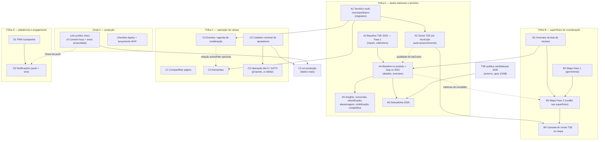

# Roadmap — Teqo

Atualizado em: 2026-07-18 (código do MVP de Núcleos enviado; priorização eleitoral mantida)

Registro canônico no repositório dos planos futuros e débitos conhecidos. Status operacional do ciclo atual de Núcleos fica em [`.cursor/rules/projects/nucleos-eleitorais.mdc`](../.cursor/rules/projects/nucleos-eleitorais.mdc); este arquivo lista o que ainda é futuro ou bloqueador, **em ordem de execução**, com dependências e paralelismo explícitos.

## Âncoras do calendário eleitoral 2026 (Res. TSE 23.760/2026)

| Data        | Marco                                           | Consequência para o produto                                                                                                                                                  |
| ----------- | ----------------------------------------------- | ---------------------------------------------------------------------------------------------------------------------------------------------------------------------------- |
| 20/07–05/08 | Convenções partidárias                          | Estrutura de núcleos/coordenadores deve estar operando **agora**                                                                                                             |
| 15/08       | Prazo final de registro de candidaturas         | TSE publica candidaturas 2026 na sequência → destrava o insight de dobradinha                                                                                                |
| 16/08       | Início da propaganda eleitoral (rua e internet) | "Quem chega em 16/08 com base de dados estruturada tem vantagem operacional" (Politipédia) — base nominal, baseline e agenda precisam estar em produção **antes** desta data |
| 09–23/10    | Propaganda gratuita rádio/TV                    | Reta final; congelar mudanças arriscadas no app                                                                                                                              |
| 04/10       | 1º turno                                        | Operação do dia D (GOTV) — confirmação de comparecimento da base nominal                                                                                                     |
| 25/10       | Eventual 2º turno                               | Chapa majoritária (Lula/Jerônimo); Solla decidido no 1º turno                                                                                                                |

## Princípios e decisões travadas

- Priorizar ownership de audiência e portabilidade de dados. _(README)_
- Manter módulos genéricos o bastante para reuso em outros contextos políticos. _(README)_
- Default seguro e com controle de acesso para equipes de campanha e institucionais. _(README)_
- Um único app Next.js com três áreas: site público `(frontend)`, admin Payload `(payload)`, ferramenta interna `(campaign)` em `/campanha`. Sem serviço Rust separado. _(AGENTS.md)_
- Hospedagem na Vercel por enquanto; sem migração self-host/Coolify em andamento. _(AGENTS.md)_
- Doações **não** entram neste app — só CTA/link para QueroApoiar (`apoiar.me/jorgesolla`, homologado TSE). _(AGENTS.md)_
- Pessoa = `Contact` + collections de junção; nunca criar cadastro paralelo de "apoiador/pessoa". _(AGENTS.md)_
- Núcleo Eleitoral é unidade operacional da campanha; Zona TSE é referência oficial distinta. _(notebook Núcleos)_
- Sem disparo em massa por WhatsApp: vedado pela Res. TSE 23.610 (art. 33) e pela política da Meta; mobilização é orgânica (kits de compartilhamento individuais). _(plano cadastro-nominal, pesquisa 2026-07-17)_

## Onda 0 — Caminho crítico para `/campanha` em produção

O MVP de Núcleos está **entregue em código** (ondas 1–8 + refactors; commit em `main` em 2026-07-18). A migration `20260718_010733_consolidate_campaign_schema` aplica automaticamente no `pnpm build` da Vercel. O que ainda separa a vertical de uso operacional com dados reais é jurídico + smoke pós-deploy:

1. **Lote jurídico único de LGPD/Consent** _(externo — assessoria jurídica eleitoral; é o caminho crítico da vertical inteira)_. Uma única rodada cobrindo:
   - Base do art. 11 da LGPD + texto versionado de `Consent.key = 'lideranca-autopreenchimento'` (bloqueador do MVP de Núcleos; o app falha fechado sem a chave).
   - Textos de `apoiador-cadastro` e `apoiador-intencao-voto` (bloqueadores do cadastro nominal — [detalhes](plans/cadastro-nominal-apoiadores.md)).
   - Texto de `campanha-notificacoes-push` (opt-in de push — [detalhes](plans/notifications.md)).
   - **Aviso de Privacidade / política de privacidade institucional** (obrigação do controlador antes de coleta em massa; também é item do site público).
   - Avaliação de necessidade de RIPD (tratamento em larga escala + dado sensível).
   - Racional: fatiar em rodadas separadas multiplica o lead time externo; quatro textos + aviso numa rodada só.
2. **Smoke pós-deploy** _(após o build Vercel aplicar a migration)_: conferir `NEXT_PUBLIC_SITE_URL` HTTPS exato, login `/campanha`, criar núcleo de teste, e só então cadastrar o Consent de liderança. Checklist completo no AGENTS.md.
3. **Ativação com dados reais assim que (1) liberar a chave de liderança.** Decisão de sequenciamento: **não** esperar a migração multi-município. Prós: coordenadores estruturam núcleos reais durante as convenções (20/07–05/08); a migration multi-município é in-place com backfill seguro e pode rodar com dados reais pequenos. Contras: uma migration a mais pós-lançamento. O contra é barato; o pró é tempo de campanha, que não volta.
4. **Onboarding do time real** (usuários `geral`/`coordenador`, primeiros núcleos, treinamento básico de campo).

## Campanha (`/campanha`)

### Ciclo 1 — Núcleos (entregue)

MVP de território + reporte implementado e enviado (ondas 1–8 + refactors de composição/infra/fixtures): auth isolada `campaignUser` (`geral` / `coordenador` / `lideranca`), núcleos com slug canônico, designação de coordenador, lideranças, estimativas sugerir/confirmar com versão UUID, atualizações semanais, convites WhatsApp (`wa.me`, hash, uso único), dashboard e hardening. Território atual ainda é `region`/`city`/`neighborhood` unitários; multi-município permanece no item A1. Detalhes: [`.cursor/rules/projects/nucleos-eleitorais.mdc`](../.cursor/rules/projects/nucleos-eleitorais.mdc).

### Grafo de dependências

Setas cheias = dependência dura; tracejadas = dependência suave (melhora, não bloqueia).

Itens sem seta de entrada (**paralelizáveis a qualquer momento**): A1, A3, B1, B2, C1, C2 (engenharia — produção espera o jurídico), D1, além dos fill-ins (visitados recentemente, listas globais, reset de senha, higiene PascalCase).

### Sequência de execução por janela do calendário

**Janela 1 — agora → 05/08 (convenções): colocar a vertical em produção e consertar a fundação de dados.**

| Ordem | Item                                            | Plano                                                  | Depende de                                                                                | Paralelizável com |
| ----- | ----------------------------------------------- | ------------------------------------------------------ | ----------------------------------------------------------------------------------------- | ----------------- |
| 1     | Onda 0 (jurídico em lote + deploy + lançamento) | —                                                      | externo                                                                                   | tudo              |
| 2     | A1 Território multi-município/bairro            | [detalhes](plans/territorio-multi-municipio-bairro.md) | — (executar cedo: migration barata antes do volume de dados; pré-requisito de A2, C3, C4) | B1, C1, A3        |
| 3     | A2 Zonas TSE por município (auto-preenchimento) | [detalhes](plans/zonas-por-municipio.md)               | A1 (nasce contra `cities[]`)                                                              | B1, C1, A3        |
| 4     | B1 Overview da lista de núcleos                 | [detalhes](plans/overview-lista-nucleos.md)            | —                                                                                         | A1, A2, C1        |
| 5     | C1 Compartilhar página (quick win de campo)     | [detalhes](plans/compartilhar-pagina.md)               | —                                                                                         | tudo              |
| 6     | A3 Baseline TSE 2022 — Fase 1 (import)          | [detalhes](plans/baseline-eleitoral-tse.md)            | — (dado público; sem bloqueador LGPD)                                                     | tudo              |

**Janela 2 — 05/08 → 16/08 (pré-propaganda): base nominal + inteligência + agenda prontas para o arranque.**

| Ordem | Item                                                                                                                 | Plano                                            | Depende de                       | Paralelizável com |
| ----- | -------------------------------------------------------------------------------------------------------------------- | ------------------------------------------------ | -------------------------------- | ----------------- |
| 7     | C2 Cadastro nominal de apoiadores (a peça central pré-16/08; engenharia não espera o jurídico — o app falha fechado) | [detalhes](plans/cadastro-nominal-apoiadores.md) | produção: lote jurídico (Onda 0) | A4, C3            |
| 8     | A4 Baseline no produto + insight Gap vs 2022                                                                         | [detalhes](plans/baseline-eleitoral-tse.md)      | A3 + B1 (suave: A2)              | C2, C3            |
| 9     | C3 Eventos / agenda de mobilização (`actionPlan`)                                                                    | [detalhes](plans/eventos-agenda-mobilizacao.md)  | A1                               | C2, A4            |

**Janela 3 — 16/08 → set (campanha de rua): inteligência ampliada, visualização e engajamento.**

| Ordem | Item                                                                                                                       | Plano                                                                                                                                                                                                                                                                                 | Depende de                                                      | Paralelizável com |
| ----- | -------------------------------------------------------------------------------------------------------------------------- | ------------------------------------------------------------------------------------------------------------------------------------------------------------------------------------------------------------------------------------------------------------------------------------- | --------------------------------------------------------------- | ----------------- |
| 10    | A5 Insights derivados do baseline (5 itens, paralelizáveis entre si; conversão e classificação exigem limiares de produto) | [conversão](plans/insight-taxa-conversao.md) · [classificação](plans/insight-classificacao-territorial.md) · [alavancagem](plans/insight-alavancagem-chapa.md) · [mobilização](plans/insight-mobilizacao-brancos-nulos.md) · [competitiva](plans/insight-inteligencia-competitiva.md) | A4                                                              | B2/B3, C4, D1     |
| 11    | B2 + B3 Mapa da Bahia (geometrias + Leaflet)                                                                               | [detalhes](plans/mapa-bahia-geometrias.md)                                                                                                                                                                                                                                            | B3 ← B1+B2 (suave: A4 para coroplético de baseline/classe)      | A5, C4, D1        |
| 12    | C4 Demandas                                                                                                                | [detalhes](plans/demandas-campanha.md)                                                                                                                                                                                                                                                | A1 (suave: C3 para a relação `actionPlan`)                      | A5, B3, D1        |
| 13    | D1 PWA `/campanha`                                                                                                         | [detalhes](plans/pwa-campanha.md)                                                                                                                                                                                                                                                     | —                                                               | tudo              |
| 14    | D2 Notificações (push + sino) — sino não depende do PWA; push sim                                                          | [detalhes](plans/notifications.md)                                                                                                                                                                                                                                                    | D1 (push) + chave `campanha-notificacoes-push` do lote jurídico | A5, B3, C4        |

**Janela 4 — set → 04/10 (reta final): dobradinha, dia D e estabilização.**

| Ordem | Item                                                                                                                                                                                                                                                                                                                                                                                                                          | Plano                                                             | Depende de                                                                                     |
| ----- | ----------------------------------------------------------------------------------------------------------------------------------------------------------------------------------------------------------------------------------------------------------------------------------------------------------------------------------------------------------------------------------------------------------------------------- | ----------------------------------------------------------------- | ---------------------------------------------------------------------------------------------- |
| 15    | A6 Insight dobradinha 2026                                                                                                                                                                                                                                                                                                                                                                                                    | [detalhes](plans/insight-dobradinha-2026.md)                      | A4 + TSE publicar candidaturas 2026 (externo, após 15/08) + taxonomia de alinhamento (produto) |
| 16    | B4 Camada de zonas TSE no mapa                                                                                                                                                                                                                                                                                                                                                                                                | ciclo seguinte do [plano do mapa](plans/mapa-bahia-geometrias.md) | A2 + B3                                                                                        |
| 17    | C5 **Operação dia D / GOTV** _(item proposto nesta revisão — validar com produto)_: confirmação de comparecimento da base nominal em 04/10 (lista de apoiadores por núcleo/zona com marcação "confirmou que vai votar / votou", visão de cobertura para a coordenação). É o uso final da base construída em C2; a literatura de campanha trata a mobilização do dia como onde eleições apertadas se decidem. Sem plano ainda. | —                                                                 | C2                                                                                             |
| 18    | Congelamento: a partir de ~20/09, só correção de bug e dados; nada de migration arriscada perto do dia D.                                                                                                                                                                                                                                                                                                                     | —                                                                 | —                                                                                              |

**Fill-ins (qualquer janela, quando houver folga; nenhum bloqueia nada):**

- **Visitados recentemente** (client-side, `localStorage`). → [detalhes](plans/visitados-recentemente.md)
- **Listas globais** (lideranças, atualizações, territórios no nível raiz). _(plano MVP; sem plano detalhado ainda)_
- **Reset de senha self-service + foto de perfil** (UX adiada do ciclo 1). _(plano MVP)_
- **Higiene de código:** varredura PascalCase dos componentes legados. _(notebook Núcleos)_

**Cortes seguros se o prazo apertar** (nesta ordem): B4 camada de zonas, B3 mapa Leaflet, C4 demandas, D2 push (mantendo o sino), D1 PWA, fill-ins. **Não cortáveis:** Onda 0 (jurídico/Consent), C2 cadastro de apoiadores, C3 eventos/agenda, A4 baseline + gap — são respectivamente o risco legal, a base de dados, a operação da propaganda e o instrumento de alocação de esforço.

### Itens consolidados/removidos nesta revisão (2026-07-17)

- **"Insight: Gap vs 2022" como item separado** — removido: é a Fase 4 do plano de [baseline TSE 2022](plans/baseline-eleitoral-tse.md) (item A4), não um item próprio.
- **"Import do cadastro oficial de zonas TSE e/ou polígonos GeoJSON"** — absorvido: o cadastro tabular é o plano [zonas-por-municipio](plans/zonas-por-municipio.md) (A2); os polígonos são a camada de zonas do [plano do mapa](plans/mapa-bahia-geometrias.md) (B4).
- **"Notificações WhatsApp Business API"** — movido para fora de escopo: a Meta veda o WhatsApp Business API para campanhas políticas no Brasil e a Res. TSE 23.610 (art. 33) veda disparo em massa (pesquisa em [cadastro-nominal-apoiadores.md](plans/cadastro-nominal-apoiadores.md)). Push + sino ([notifications.md](plans/notifications.md)) cobrem a necessidade.
- **"Previsão estatística de votos"** — mantido, mas explicitamente **fora do horizonte deste ciclo eleitoral**: sem dado acumulado suficiente antes de 04/10; o baseline TSE + estimativa manual + insights são o "mínimo honesto" (design-ux §4.5). Reavaliar pós-eleição.
- **Dependência baseline → zonas-por-municipio** — rebaixada de dura para suave: `citiesForTerritory` já existe e as rows de `electionTally` resolvem cidade↔zona (ver revisão nos planos).

## Bloqueadores atuais

| Item                                                                                                                                                                                                              | Status                              | Fonte                                                                       |
| ----------------------------------------------------------------------------------------------------------------------------------------------------------------------------------------------------------------- | ----------------------------------- | --------------------------------------------------------------------------- |
| Lote jurídico único LGPD (4 textos de `Consent` + Aviso de Privacidade + avaliação de RIPD) — ver Onda 0. Código do MVP já em `main`; o app falha fechado sem as chaves                                           | **caminho crítico; iniciar já**     | notebook Núcleos; AGENTS checklist; planos cadastro-nominal e notifications |
| RBAC em `users` — todo usuário do admin Payload tem acesso total; necessário antes de abrir `/admin` a equipe maior. Nota: o import de apoiadores foi desenhado no `/campanha` justamente para não depender disso | pendente                            | AGENTS Known Gap #1                                                         |
| Fluxos públicos ainda hardcodam ID de Consent (ex. `consent: 2` em `submitWhatsapp.ts`); migrar para chave estável como na campanha                                                                               | pendente                            | AGENTS Known Gap #2; plano-arquitetura                                      |
| Collection `Pages` inexistente; hero/copy da home ainda hardcoded — bio, propostas e páginas institucionais                                                                                                       | pendente (não bloqueia `/campanha`) | AGENTS Known Gap #3                                                         |

## Site público

**Já entregue:** sistema de notícias/publicações (`post`/`tag`), listagens e artigos, seed a partir de jorgesolla.com.br, cache com tag `posts`.

**Próximos** (não bloqueiam `/campanha`, exceto a política de privacidade, que entra no lote jurídico da Onda 0):

- Página de política de privacidade institucional (LGPD) — **prioridade alta**, sai do lote jurídico da Onda 0. _(plano-arquitetura §3.1)_
- Modelar e popular `Pages` para conteúdo institucional (biografia, mandato, propostas). _(AGENTS Known Gap #3; plano-arquitetura §3)_
- Tornar editáveis título/subtítulo (e demais textos) da home via global/`Pages`. _(AGENTS Known Gap #3)_
- Agenda pública e multimídia: preferir links oficiais (Câmara, YouTube, Flickr). _(plano-arquitetura §3.1)_
- Garantir superfície clara de CTA "Doar" → QueroApoiar. _(AGENTS.md; plano-arquitetura)_
- Migrar Consent dos fluxos públicos (WhatsApp, petições) para resolução por chave estável. _(AGENTS Known Gap #2)_

## Admin Payload

- Introduzir `roles` em `users` e access control real antes de ampliar quem entra em `/admin`. _(AGENTS Known Gap #1)_
- Seed reproduzível de documentos `Consent` resolvidos por chave (não por ID numérico). _(plano-arquitetura §2.3)_

## Plataforma white-label

- Fase 2 do README: multi-tenant, customização de marca/conteúdo por mandato, módulos compartilhados de comunicação e engajamento.
- **Depois da eleição** — monorepo e white-label deliberadamente fora de escopo até lá. _(README Phase 2; plano-arquitetura §6)_

## Fora de escopo (por enquanto)

- Serviço Rust (ou outro backend) separado para `/campanha`. _(AGENTS.md; plano-arquitetura)_
- Migração self-host / Coolify enquanto a Vercel atender. _(AGENTS.md)_
- Processamento de pagamentos ou doações dentro deste app. _(AGENTS.md)_
- Tratar Núcleo Eleitoral como sinônimo de Zona Eleitoral do TSE. _(notebook; plano MVP)_
- PWA do site público ou do `/admin` — só a vertical `/campanha` será instalável. _(decisão de produto 2026-07-17)_
- **PostGIS** até surgir necessidade de query espacial real; v1 do mapa usa TopoJSON estático versionado no repo. _(decisão de produto 2026-07-17)_
- **WhatsApp Business API** — vedado para campanhas políticas pela Meta e sem caminho legal para disparo em massa (Res. TSE 23.610 art. 33); superado por push + sino. _(revisão 2026-07-17)_
- **Disparo em massa de mensagens** em qualquer canal — mobilização é orgânica (kits de compartilhamento individuais, art. 33 §2º). _(plano cadastro-nominal)_
- Previsão estatística de votos neste ciclo eleitoral. _(revisão 2026-07-17; reavaliar pós-eleição)_

## Fontes

- [`AGENTS.md`](../AGENTS.md) — decisões travadas, Known Gaps, checklist de campanha
- [`.cursor/rules/projects/nucleos-eleitorais.mdc`](../.cursor/rules/projects/nucleos-eleitorais.mdc) — status e decisões do MVP de Núcleos
- [`README.md`](../README.md) — missão e direção de produto
- [`docs/plans/*.md`](plans/) — planos detalhados por item
- Plano Cursor `núcleos_eleitorais_mvp_*.plan.md` (fora do repo; workspace local)
- `plano-arquitetura-campanha-2026.md` e `design-ux-campanha.md` (Cowork / pasta irmã; fora do repo)
- Res. TSE 23.760/2026 (calendário eleitoral) — https://www.tse.jus.br/legislacao/compilada/res/2026/resolucao-no-23-760-de-2-de-marco-de-2026
- Res. TSE 23.610/2019 (propaganda; art. 33 — disparo em massa) e Lei 9.504/1997
- Politipédia AVM — planejamento de campanha, base de dados, territorialização, operação do dia da eleição — https://politipedia.wiki.br
