# Roadmap — Teqo

Atualizado em: 2026-07-19 (janela 1 vigente; foco: Onda 0 + base operacional; último compile)

Registro canônico dos **próximos** planos e débitos. Histórico de entregas: resumo abaixo + planos em [`docs/plans/`](plans/) + notebook [`.cursor/rules/projects/nucleos-eleitorais.mdc`](../.cursor/rules/projects/nucleos-eleitorais.mdc).

## Âncoras do calendário eleitoral 2026 (Res. TSE 23.760/2026)

| Data        | Marco                                           | Consequência para o produto                                                                 |
| ----------- | ----------------------------------------------- | ------------------------------------------------------------------------------------------- |
| 20/07–05/08 | Convenções partidárias                          | Estrutura de núcleos/coordenadores deve estar operando **agora**                            |
| 15/08       | Prazo final de registro de candidaturas         | TSE publica candidaturas 2026 → destrava o insight de dobradinha (A6)                       |
| 16/08       | Início da propaganda eleitoral (rua e internet) | Base nominal, baseline e agenda precisam estar em produção **antes** desta data             |
| 09–23/10    | Propaganda gratuita rádio/TV                    | Reta final; congelar mudanças arriscadas no app                                             |
| 04/10       | 1º turno                                        | Operação do dia D (GOTV) — confirmação de comparecimento da base nominal                    |
| 25/10       | Eventual 2º turno                               | Chapa majoritária (Lula/Jerônimo); Solla decidido no 1º turno                               |

## Princípios e decisões travadas

- Ownership de audiência e portabilidade de dados; módulos reutilizáveis; default seguro com access control. _(README)_
- Um único app Next.js: site `(frontend)`, admin `(payload)`, `/campanha` `(campaign)`. Sem serviço Rust separado. _(AGENTS.md)_
- Hospedagem Vercel; doações só CTA → QueroApoiar. _(AGENTS.md)_
- Pessoa = `Contact` + collections de junção. Núcleo ≠ Zona TSE. _(AGENTS.md / notebook)_
- Sem disparo em massa por WhatsApp (Res. TSE 23.610 art. 33 + política Meta); mobilização orgânica. _(cadastro-nominal)_

## Onda 0 — caminho crítico para dados reais

Engenharia de núcleos / C2 / C3 / baseline / Trilha E (E1–E3) / PWA já está em `main`. Textos provisórios de Consent + `/privacidade` já provisionados ([onda-0.md](plans/onda-0.md)). O que ainda falta para PII real:

1. **Lote jurídico final** _(assessoria eleitoral)_ — substituir provisórios: `lideranca-autopreenchimento`, `apoiador-cadastro`, `apoiador-intencao-voto`, `campanha-notificacoes-push` + Aviso de Privacidade + avaliação RIPD. Hold de titulares reais até lá.
2. **Smoke pós-deploy** — `NEXT_PUBLIC_SITE_URL` HTTPS, login `/campanha`, núcleo de teste; checklist no AGENTS.md.
3. **Ativação com dados reais** assim que (1) liberar.
4. **Onboarding do time** (`geral`/`coordenador`, primeiros núcleos, treinamento de campo).

**O0+** (escala/DRY pós-Onda 0) não bloqueia jurídico nem smoke — [plano](plans/escala-dry-pos-onda0.md).

## Já entregue (resumo)

- **Núcleos MVP + Ciclo 2** — auth/`campaignUser`, território A1/A2, baseline A3/A4, overview B1, share C1, PWA D1, geometrias B2.
- **Operação** — C2 (eng. pronta; prod. ↔ Onda 0), C3 agenda, C6–C9 escala/DRY de apoiadores e planos.
- **Trilha E (parcial)** — E1 metas/prioridade + E3 dobradinhas/encaminhamentos manuais; E2 série TSE 2014/2018 + tendência. Faltam E4–E7.
- **Fill-ins** — Visitados recentemente; Reset senha + foto de perfil; Onda 0 eng. (Consent provisório + `/privacidade`).

## Próximos — Campanha (`/campanha`)

### Por trilha (só abertos)

- **A** — [A5](plans/insight-taxa-conversao.md) Insights (conversão / classificação / [alavancagem+virada](plans/insight-alavancagem-chapa.md) / [mobilização](plans/insight-mobilizacao-brancos-nulos.md) / [competitiva](plans/insight-inteligencia-competitiva.md)); [A6](plans/insight-dobradinha-2026.md) Dobradinha 2026 (após TSE candidaturas); [A7](plans/escala-dry-pos-a4.md) Escala/DRY pós-A4; [A8](plans/perfil-eleitorado-ibge.md) Perfis eleitorado IBGE.
- **B** — B3 Mapa Leaflet nas superfícies ([mapa](plans/mapa-bahia-geometrias.md)); B4 Camada de zonas TSE no mapa; [B5](plans/escala-dry-pos-b2.md) Escala/DRY pós-B2 (lazy geometrias / cache CLI).
- **C** — [C4](plans/demandas-campanha.md) Demandas; **C5** Operação dia D / GOTV _(proposto — sem plano; design [`Dia-D-GOTV`](design-refs/latest/Dia-D-GOTV.png))_; [C10](plans/escala-dry-pos-c9.md) Escala/DRY pós-C9; [C11](plans/escala-dry-pos-c7.md) Escala/DRY pós-C7.
- **D** — [D2](plans/notifications.md) Notificações (push + sino; push ↔ chave jurídica).
- **E** — [E4](plans/mapa-projecao-municipios.md) Import único da planilha; E5 Salvador por bairro _(futuro)_; [E6](plans/escala-dry-pos-e1.md) Escala/DRY pós-E1+E3; [E7](plans/escala-dry-pos-e2.md) Escala/DRY pós-E2.
- **Débitos / fill-ins abertos** — [O0+](plans/escala-dry-pos-onda0.md); [VR+](plans/escala-dry-pos-visitados-recentemente.md); [RS+](plans/escala-dry-pos-reset-senha-perfil.md); Field Desk polish _(em branch — PRODUCT.md / DESIGN.md)_; [FD+](plans/escala-dry-pos-field-desk.md); [FD2](plans/field-desk-ux-pos-critique.md); listas globais _(sem plano)_; higiene PascalCase _(notebook)_.

### Referências de design (só itens abertos com ref)

Os designs UX Pilot estão em [`docs/design-refs/latest/`](design-refs/latest/). **UX/estrutura é referência; a paleta não** — usar tokens `data-theme='campaign'`.

| Item do roadmap | Design | Plano |
| --------------- | ------ | ----- |
| A5 Insights (5) | `Baseline-Eleitoral-2022` (card Insights) | [conversão](plans/insight-taxa-conversao.md) · [classificação](plans/insight-classificacao-territorial.md) · [alavancagem](plans/insight-alavancagem-chapa.md) · [mobilização](plans/insight-mobilizacao-brancos-nulos.md) · [competitiva](plans/insight-inteligencia-competitiva.md) |
| A7 Escala/DRY pós-A4 | — | [escala-dry-pos-a4.md](plans/escala-dry-pos-a4.md) |
| A8 Perfis eleitorado IBGE | — | [perfil-eleitorado-ibge.md](plans/perfil-eleitorado-ibge.md) |
| B3/B4/B5 Mapa | — (encomendar ou desenhar na implementação) | [mapa-bahia-geometrias.md](plans/mapa-bahia-geometrias.md) · [B5](plans/escala-dry-pos-b2.md) |
| C4 Demandas | — | [demandas-campanha.md](plans/demandas-campanha.md) |
| C5 Dia D / GOTV | `Dia-D-GOTV` | sem plano ainda |
| C10 / C11 Escala | — | [C10](plans/escala-dry-pos-c9.md) · [C11](plans/escala-dry-pos-c7.md) |
| D2 Notificações | `Notificacoes-PWA` (central) | [notifications.md](plans/notifications.md) |
| E4–E7 Mapa de projeção | seguir `Baseline-Eleitoral-2022` / `Lista-Nucleos-Overview` | [mapa-projecao-municipios.md](plans/mapa-projecao-municipios.md) · [E6](plans/escala-dry-pos-e1.md) · [E7](plans/escala-dry-pos-e2.md) |
| O0+ / VR+ / RS+ / FD+ / FD2 | — | [O0+](plans/escala-dry-pos-onda0.md) · [VR+](plans/escala-dry-pos-visitados-recentemente.md) · [RS+](plans/escala-dry-pos-reset-senha-perfil.md) · [FD+](plans/escala-dry-pos-field-desk.md) · [FD2](plans/field-desk-ux-pos-critique.md) |

**Sem design nesta leva:** A6, B3/B4, C4 detalhe, E4–E5, fill-ins (listas globais).

### Grafo de dependências (abertos + predecessores mínimos)

Setas cheias = dependência dura; tracejadas = suave. Nós ✓ só aparecem se ainda são dep de algum aberto.

```mermaid
flowchart TD
    subgraph Onda0["Onda 0 — produção"]
        JUR["Lote jurídico final<br/>(Consent + privacidade + RIPD)"]
        O0DRY["O0+ Escala e DRY pós-Onda 0"]
    end

    subgraph Preds["Entregues (deps)"]
        A4["A4 Baseline + Gap ✓"]
        B1["B1 Overview ✓"]
        B2["B2 Geometrias ✓"]
        C2["C2 Cadastro nominal ✓"]
        C3["C3 Agenda ✓"]
        C7["C7 Escala pós-C3 ✓"]
        C9["C9 Escala pós-C8 ✓"]
        D1["D1 PWA ✓"]
        E1["E1 Metas + prioridade ✓"]
        E2["E2 Série + tendência ✓"]
        E3["E3 Dobradinhas manuais ✓"]
    end

    subgraph TrilhaA["Trilha A"]
        A7["A7 Escala/DRY pós-A4"]
        A5["A5 Insights"]
        A6["A6 Dobradinha 2026"]
        A8["A8 Perfis IBGE"]
    end

    subgraph TrilhaB["Trilha B"]
        B5["B5 Escala/DRY pós-B2"]
        B3["B3 Mapa Leaflet"]
        B4["B4 Zonas TSE no mapa"]
    end

    subgraph TrilhaC["Trilha C"]
        C10["C10 Escala/DRY pós-C9"]
        C11["C11 Escala/DRY pós-C7"]
        C4["C4 Demandas"]
        C5["C5 Dia D / GOTV"]
        C2prod["C2 dados reais"]
    end

    subgraph TrilhaD["Trilha D"]
        D2["D2 Notificações"]
    end

    subgraph TrilhaE["Trilha E"]
        E6["E6 Escala/DRY pós-E1+E3"]
        E7["E7 Escala/DRY pós-E2"]
        E4["E4 Import planilha"]
        E5["E5 Salvador por bairro"]
    end

    A4 --> A7
    A4 --> A5
    A4 --> A6
    A7 -.mesmo loader.-> A5
    B2 -.codarea.-> A8
    TSE2026["TSE candidaturas 2026<br/>(após 15/08)"] --> A6

    B1 --> B3
    B2 --> B3
    B2 --> B5
    B5 -.lazy geometrias.-> B3
    A4 -.coroplético.-> B3
    B3 --> B4

    C9 --> C10
    C7 --> C11
    C10 -.forms DRY.-> C11
    C3 -.relação opcional.-> C4
    JUR --> C2prod
    C2 --> C2prod
    C2 --> C5

    D1 --> D2
    JUR -.chave push.-> D2

    E1 --> E6
    E2 --> E7
    E1 --> E4
    E3 --> E4
    E6 -.perf lista.-> E4
    E7 -.int loader.-> E4
    E2 -.votacao_secao.-> E5
    E1 -.metas mapa.-> B3
    E2 -.classe cor.-> B3
```

Paralelizáveis a qualquer momento: **O0+**, **VR+**, **RS+**, **FD+** / **FD2** (após polish Field Desk), listas globais, PascalCase.

### Sequência por janela (só pendentes)

**Janela 1 — agora → 05/08 (convenções): produção com hold de PII.**

| Ordem | Item | Plano | Depende de | Paralelizável com |
| ----- | ---- | ----- | ---------- | ----------------- |
| 1 | Onda 0 (lote jurídico final + smoke + hold PII real) | [onda-0.md](plans/onda-0.md) | engenharia entregue | tudo |

**Janela 2 — 05/08 → 16/08 (pré-propaganda): base nominal + escala restante.**

| Ordem | Item | Plano | Depende de | Paralelizável com |
| ----- | ---- | ----- | ---------- | ----------------- |
| 2 | C2 dados reais _(Consent keys + aprovação)_ | [cadastro-nominal-apoiadores.md](plans/cadastro-nominal-apoiadores.md) | Onda 0 jurídico | C10, C11, E6, E7 |
| 3 | C10 Escala/DRY pós-C9 _(cortável se base pequena)_ | [escala-dry-pos-c9.md](plans/escala-dry-pos-c9.md) | C9 ✓ | C11, E6, E7 |
| 4 | C11 Escala/DRY pós-C7 _(cortável se agenda pequena)_ | [escala-dry-pos-c7.md](plans/escala-dry-pos-c7.md) | C7 ✓ | C10, E6, E7 |
| 5 | E6 Escala/DRY pós-E1+E3 _(cortável se poucos núcleos)_ | [escala-dry-pos-e1.md](plans/escala-dry-pos-e1.md) | E1+E3 ✓ | E7, C10, A7 |
| 6 | E7 Escala/DRY pós-E2 _(Fase 2 int preferível antes de E4)_ | [escala-dry-pos-e2.md](plans/escala-dry-pos-e2.md) | E2 ✓ | E6, A7, E4 |

**Janela 3 — 16/08 → set (campanha de rua): inteligência, mapa, engajamento.**

| Ordem | Item | Plano | Depende de | Paralelizável com |
| ----- | ---- | ----- | ---------- | ----------------- |
| 7 | E4 Import único da planilha | [mapa-projecao-municipios.md](plans/mapa-projecao-municipios.md) | E1 ✓ + E3 ✓ (suave: E6 F1, E7 F2) | A5, A7, A8, B3, B5, C4, D2 |
| 8 | A5 Insights (5, paralelizáveis entre si) | [conversão](plans/insight-taxa-conversao.md) · [classificação](plans/insight-classificacao-territorial.md) · [alavancagem](plans/insight-alavancagem-chapa.md) · [mobilização](plans/insight-mobilizacao-brancos-nulos.md) · [competitiva](plans/insight-inteligencia-competitiva.md) | A4 ✓ | A7, A8, B3, B5, C4, E4, D2 |
| 9 | A8 Perfis eleitorado IBGE _(cortável: manuais já existem)_ | [perfil-eleitorado-ibge.md](plans/perfil-eleitorado-ibge.md) | A1 ✓ (suave: B2 ✓) | A5, A7, B3, B5, C4, E4 |
| 10 | A7 Escala/DRY pós-A4 | [escala-dry-pos-a4.md](plans/escala-dry-pos-a4.md) | A4 ✓ | A5, A8, B3, B5, C4, E4 |
| 11 | B3 Mapa Leaflet | [mapa-bahia-geometrias.md](plans/mapa-bahia-geometrias.md) | B1 ✓ + B2 ✓ (suave: A4, E1/E2, B5 F1) | A5, A7, A8, B5, C4, E4 |
| 12 | B5 Escala/DRY pós-B2 | [escala-dry-pos-b2.md](plans/escala-dry-pos-b2.md) | B2 ✓ (F1 c/ B3) | A5, A7, A8, B3, C4, E4 |
| 13 | C4 Demandas | [demandas-campanha.md](plans/demandas-campanha.md) | A1 ✓ (suave: C3) | A5, A7, A8, B3, B5, E4 |
| 14 | D2 Notificações (push + sino) | [notifications.md](plans/notifications.md) | D1 ✓ + chave push Onda 0 | A5, A7, A8, B3, B5, C4, E4 |

**Janela 4 — set → 04/10 (reta final): dobradinha, dia D, estabilização.**

| Ordem | Item | Plano | Depende de |
| ----- | ---- | ----- | ---------- |
| 15 | A6 Insight dobradinha 2026 | [insight-dobradinha-2026.md](plans/insight-dobradinha-2026.md) | A4 ✓ + TSE candidaturas 2026 (após 15/08) + taxonomia produto |
| 16 | B4 Camada de zonas TSE no mapa | [mapa-bahia-geometrias.md](plans/mapa-bahia-geometrias.md) | A2 ✓ + B3 |
| 17 | C5 Operação dia D / GOTV _(validar com produto; sem plano)_ | design [`Dia-D-GOTV`](design-refs/latest/Dia-D-GOTV.png) | C2 (suave: escala C6+) |
| 18 | Congelamento ~20/09: só bugfix + dados. E5 pós-eleição. | — | — |

### Fill-ins abertos

- **O0+** Escala/DRY pós-Onda 0 — [escala-dry-pos-onda0.md](plans/escala-dry-pos-onda0.md)
- **VR+** Escala/DRY pós-visitados — [escala-dry-pos-visitados-recentemente.md](plans/escala-dry-pos-visitados-recentemente.md)
- **RS+** Escala/DRY pós-reset senha/perfil — [escala-dry-pos-reset-senha-perfil.md](plans/escala-dry-pos-reset-senha-perfil.md)
- **Field Desk polish** — em branch (`PRODUCT.md` / `DESIGN.md`)
- **FD+** Escala/DRY pós-Field Desk — [escala-dry-pos-field-desk.md](plans/escala-dry-pos-field-desk.md)
- **FD2** UX Field Desk pós-critique — [field-desk-ux-pos-critique.md](plans/field-desk-ux-pos-critique.md)
- **Listas globais** (lideranças, atualizações, territórios) — sem plano detalhado
- **Higiene PascalCase** dos componentes legados — notebook Núcleos

### Cortes seguros / não cortáveis

**Cortáveis** (se o prazo apertar): E5; B4; B5 F2; E4 (campos E1/E3 à mão); A8; E7 F1/F3 (manter F2 antes de E4); E6 F2–F4 (preferir F1 se lista lenta); A7 F2–F3; B3 (levar B5 F1 junto se entrar); C4; D2 push (manter sino); C10 / C11 (se base/agenda pequena); O0+ F4–5; VR+ / RS+ / FD+ Fases 3–5; FD2 Fase 5.

**Preferir manter se houver uso real:** C10 Fase 1 (access dedup); C11 Fases 2–3 (loaders/selects); O0+ Fase 1; RS+ Fase 1; E6 Fase 1; E7 Fase 2; A7 F1 (antes de A5/B3 se I/O do baseline doer).

**Não cortáveis:** Onda 0 jurídico; C2 dados reais (quando liberado); C3 agenda e A4/E1+E3 já entregues — base legal, base nominal, operação e paridade mínima com a planilha.

## Bloqueadores atuais

| Item | Status | Fonte |
| ---- | ------ | ----- |
| Lote jurídico final LGPD (4 Consent + privacidade + RIPD) — provisórios já provisionados; PII real em hold | **caminho crítico para dados reais** | notebook; onda-0; cadastro-nominal; notifications |
| RBAC em `users` (admin Payload) antes de abrir `/admin` a equipe maior | pendente | AGENTS Known Gap #1 |
| Fluxos públicos hardcodam ID de Consent → migrar para chave estável | pendente | AGENTS Known Gap #2 |
| Collection `Pages` + hero/copy da home editáveis | pendente (não bloqueia `/campanha`) | AGENTS Known Gap #3 |

## Site público

**Já entregue:** `post`/`tag` (notícias), seed jorgesolla.com.br, cache `posts`; `/privacidade` (texto provisório Onda 0).

**Próximos** (não bloqueiam `/campanha`, exceto textos finais de privacidade ↔ Onda 0):

- Textos finais de privacidade + polish O0+ ([escala-dry-pos-onda0.md](plans/escala-dry-pos-onda0.md))
- `Pages` institucional (bio, mandato, propostas) + home editável
- Agenda/multimídia via links oficiais; CTA "Doar" → QueroApoiar
- Consent público por chave estável (Known Gap #2)

## Admin Payload

- `roles` em `users` + access control real (Known Gap #1)
- Seed reproduzível de `Consent` por chave (não por ID)

## Plataforma white-label

- Fase 2 README: multi-tenant / marca por mandato — **depois da eleição**. _(README Phase 2)_

## Fora de escopo (por enquanto)

- Serviço Rust separado; self-host/Coolify; doações in-app. _(AGENTS.md)_
- Núcleo = Zona TSE; PWA do site/`/admin`; PostGIS no v1 do mapa.
- WhatsApp Business API / disparo em massa; previsão estatística de votos neste ciclo.

## Fontes

- [`AGENTS.md`](../AGENTS.md) — decisões travadas, Known Gaps, checklist
- [`.cursor/rules/projects/nucleos-eleitorais.mdc`](../.cursor/rules/projects/nucleos-eleitorais.mdc) — status operacional
- [`README.md`](../README.md) — missão e Phase 2
- [`docs/plans/*.md`](plans/) — planos por item
- `docs/sheets/*.xlsx` — planilhas Mapa de projeção (estrutura de referência; dados eleitorais = TSE)
- Res. TSE 23.760/2026 (calendário) · Res. TSE 23.610/2019 art. 33 · Politipédia AVM
