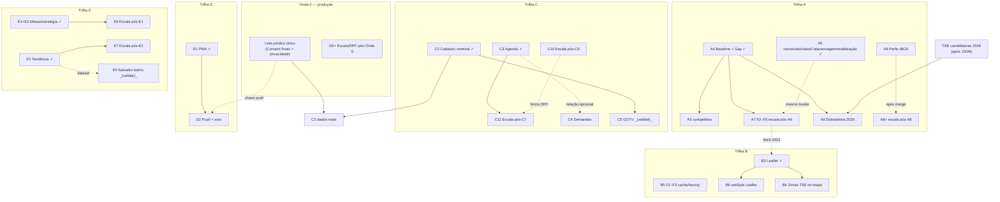

# Roadmap — Teqo

Atualizado em: 2026-07-20 (A8+ fill-in pós-`/simplify`; A8 em implementação)

Registro canônico dos **próximos** planos e débitos. Histórico de entregas: resumo abaixo + planos em [`docs/plans/`](plans/) + notebook [`.cursor/rules/projects/nucleos-eleitorais.mdc`](../.cursor/rules/projects/nucleos-eleitorais.mdc).

## Âncoras do calendário eleitoral 2026 (Res. TSE 23.760/2026)

| Data        | Marco                                           | Consequência para o produto                                                                 |
| ----------- | ----------------------------------------------- | ------------------------------------------------------------------------------------------- |
| 20/07–05/08 | Convenções partidárias                          | Núcleos/coordenadores operando **agora**                                                    |
| 15/08       | Prazo final de registro de candidaturas         | TSE publica candidaturas 2026 → destrava A6 (dobradinha)                                    |
| 16/08       | Início da propaganda eleitoral                  | Base nominal, baseline e agenda em produção **antes** desta data                            |
| 09–23/10    | Propaganda gratuita rádio/TV                    | Congelar mudanças arriscadas                                                                |
| 04/10       | 1º turno                                        | GOTV (C5) — confirmação de comparecimento da base nominal                                   |
| 25/10       | Eventual 2º turno                               | Chapa majoritária; Solla decidido no 1º turno                                               |

## Princípios e decisões travadas

- Ownership de audiência e portabilidade de dados; módulos reutilizáveis em outros contextos políticos.
- Um único app Next.js: site `(frontend)`, admin `(payload)`, `/campanha` `(campaign)`. Sem Rust separado. Vercel por enquanto.
- Doações só via CTA QueroApoiar (`apoiar.me/jorgesolla`). Pessoa = `Contact` + joins — nunca cadastro paralelo.
- Núcleo = unidade operacional; Zona TSE = referência oficial distinta. Sem disparo em massa (Res. TSE 23.610 art. 33 / Meta).

## Onda 0 — caminho crítico para dados reais

Engenharia de núcleos / C2 / C3 / baseline / PWA / Trilha E parcial já em `main`. Textos provisórios de Consent + `/privacidade` auto-provisionados ([onda-0.md](plans/onda-0.md)); **hold de PII real** até o lote jurídico final.

1. **Lote jurídico único** _(externo)_ — textos finais (substituem provisórios) + base LGPD art. 11: `lideranca-autopreenchimento`, `apoiador-cadastro`, `apoiador-intencao-voto`, `campanha-notificacoes-push`, Aviso de Privacidade, avaliação RIPD.
2. **Smoke pós-deploy** — `NEXT_PUBLIC_SITE_URL` HTTPS, login `/campanha`, núcleo de teste; checklist no AGENTS.md.
3. **Ativação com dados reais** assim que (1) liberar — lideranças/apoiadores reais e import em massa.
4. **Onboarding do time** — usuários `geral`/`coordenador`, primeiros núcleos, treino de campo.

**O0+** (escala/DRY pós-Onda 0) não bloqueia jurídico nem smoke fictício — [plano](plans/escala-dry-pos-onda0.md).

## Já entregue (resumo)

- **Núcleos MVP + Ciclo 2** — auth/`campaignUser`, território A1/A2, baseline A3/A4, overview B1, share C1, PWA D1, geometrias B2, Leaflet B3.
- **Operação** — C2 (eng. pronta; prod. ↔ Onda 0), C3 agenda, C6–C9 escala apoiadores/planos.
- **Trilha A (parcial)** — A5 conversão + classificação territorial + alavancagem/virada + mobilização (brancos/nulos); A7 F1 agregação federal no detalhe.
- **Trilha E (parcial)** — E1 metas/prioridade + E3 estratégia manual; E2 série TSE 2014/2018 + tendência; E7 F2 int loader; **E4 import planilha cortado** (decisão de produto: dados via UI manual, sem `pnpm db:seed:mapa`).
- **Fill-ins** — visitados recentemente, reset senha + perfil, Field Desk polish (Impeccable); B5 F1 lazy geometrias (com B3).

## Próximos — Campanha (`/campanha`)

### Por trilha (só abertos)

- **A** — A5 restante: inteligência competitiva ainda sem insight no produto · [competitiva](plans/insight-inteligencia-competitiva.md)
- **A** — A6 dobradinha 2026 automática quando o TSE publicar candidaturas · gatilho externo: pós-15/08 · [plano](plans/insight-dobradinha-2026.md)
- **A** — A7 F2–F5: `cityCode` TSE, Alert/Progress DRY, fetch 2022 único lista+mapa, batch flip na lista · gatilho F4: pós-B3 ✓; F5: pós-A5 · [plano](plans/escala-dry-pos-a4.md)
- **A** — A8 perfil médio do eleitorado (IBGE) na aba Eleitorado sem sobrescrever manuais · [plano](plans/perfil-eleitorado-ibge.md)
- **A** — A8+ escala pós-A8: lazy demographics, cobertura parcial, size budget · gatilho: merge A8 · [plano](plans/escala-dry-pos-a8.md)
- **B** — B4 camada de zonas TSE no mapa coroplético · [mapa](plans/mapa-bahia-geometrias.md)
- **B** — B5 F2–F3: cache CLI compartilhado + factory mun/TI · [plano](plans/escala-dry-pos-b2.md)
- **B** — B6 `BahiaMap` setStyle incremental ao trocar métrica · gatilho: troca frequente no overview · [plano](plans/escala-dry-pos-b3.md)
- **C** — C4 demandas de campanha (CRM de pedidos + custo) · [plano](plans/demandas-campanha.md)
- **C** — C10 lista de apoiadores sem N+1 de access / forms com `errorProps` · gatilho: base nominal crescendo · [plano](plans/escala-dry-pos-c9.md)
- **C** — C11 feed/loaders de planos sem O(n) no detalhe · gatilho: agenda com uso real / volume medido · [plano](plans/escala-dry-pos-c7.md)
- **D** — D2 push + sino in-app · soft: chave `campanha-notificacoes-push` (Onda 0) · [plano](plans/notifications.md)
- **E** — E6 aggregate metas/prioridade + DRY geo/UI na lista · gatilho: muitos núcleos / lista lenta · [plano](plans/escala-dry-pos-e1.md)
- **E** — E7 F1/F3/F4 + extensões F2 pós-A5 (leverage/flip/classification/**mobilization** int, trend VM único, tipos, helpers) · [plano](plans/escala-dry-pos-e2.md)
- **Débitos / fill-ins** — O0+, VR+, RS+, FD+, FD2, listas globais, higiene PascalCase (ver abaixo)

### A validar (assumptions)

- **C5** — operação dia D / GOTV (check-off da base em 04/10) — validar com produto; design [`Dia-D-GOTV`](design-refs/latest/Dia-D-GOTV.png); sem plano ainda
- **E5** — Salvador por bairro (`votacao_secao` + DE-PARA) — valor pós-eleição?
- **FD2** — prioridades de UX pós-critique (bulk fila, glossário, …) — validar com produto · [plano](plans/field-desk-ux-pos-critique.md)
- **Listas globais** — lideranças/atualizações/territórios no raiz — sem plano detalhado

### Referências de design (só itens abertos com ref)

| Item                         | Design                         | Plano                                                                 |
| ---------------------------- | ------------------------------ | --------------------------------------------------------------------- |
| A5 competitiva               | `Baseline-Eleitoral-2022`      | [competitiva](plans/insight-inteligencia-competitiva.md) |
| A6 Dobradinha 2026           | — (encomendar)                 | [insight-dobradinha-2026.md](plans/insight-dobradinha-2026.md)        |
| A8 Perfis eleitorado IBGE    | — (reusa aba Eleitorado)       | [perfil-eleitorado-ibge.md](plans/perfil-eleitorado-ibge.md)          |
| C4 Demandas                  | — (encomendar)                 | [demandas-campanha.md](plans/demandas-campanha.md)                    |
| C5 GOTV _(validar)_          | `Dia-D-GOTV`                   | sem plano ainda                                                       |
| D2 Notificações              | `Notificacoes-PWA`             | [notifications.md](plans/notifications.md)                            |

Paleta dos PNGs UX Pilot é legado — implementação usa tokens `data-theme='campaign'`.

### Grafo de dependências (abertos + predecessores mínimos)

### Sequência por janela (só pendentes)

**Janela 1 — agora → 05/08 (convenções)**

| Ordem | Item                                      | Plano                                              | Depende de              | Paralelizável com   |
| ----- | ----------------------------------------- | -------------------------------------------------- | ----------------------- | ------------------- |
| 1     | Onda 0 (lote jurídico + smoke + onboarding) | [onda-0.md](plans/onda-0.md)                     | engenharia ✓            | tudo                |
| 2     | C2 dados reais (após Consent finais)      | [cadastro-nominal-apoiadores.md](plans/cadastro-nominal-apoiadores.md) | Onda 0 jurídico | A7, E6, C10, C11 |
| 3     | C10 / C11 se base ou agenda crescerem     | [C10](plans/escala-dry-pos-c9.md) · [C11](plans/escala-dry-pos-c7.md) | C9 ✓ / C7 ✓ | E6, A7, O0+ |
| 4     | E6 F1 se lista de núcleos ficar lenta     | [escala-dry-pos-e1.md](plans/escala-dry-pos-e1.md) | E1+E3 ✓                 | E7, A7, C10         |

**Janela 2 — 05/08 → 16/08 (pré-propaganda)**

| Ordem | Item                                      | Plano                                              | Depende de              | Paralelizável com   |
| ----- | ----------------------------------------- | -------------------------------------------------- | ----------------------- | ------------------- |
| 5     | A5 inteligência competitiva               | [competitiva](plans/insight-inteligencia-competitiva.md) | A4 ✓                    | A7, A8, C4, D2      |
| 6     | A7 F2–F5                                  | [escala-dry-pos-a4.md](plans/escala-dry-pos-a4.md) | A4 ✓                    | A5, A8, C4          |
| 7     | A8 perfis IBGE                            | [perfil-eleitorado-ibge.md](plans/perfil-eleitorado-ibge.md) | A1 ✓              | A5, A7              |
| 8     | E7 F1/F3/F4                               | [escala-dry-pos-e2.md](plans/escala-dry-pos-e2.md) | E2 ✓                    | E6, A7              |
| 9     | C4 Demandas                               | [demandas-campanha.md](plans/demandas-campanha.md) | A1 ✓ (suave: C3)        | A5, A7, D2          |
| 10    | D2 Notificações                           | [notifications.md](plans/notifications.md)         | D1 ✓ + chave push       | A5, A7, C4          |
| 11    | B5 F2–F3 / B6                             | [B5](plans/escala-dry-pos-b2.md) · [B6](plans/escala-dry-pos-b3.md) | B2 ✓ / B3 ✓ | A7 |

**Janela 3 — 16/08 → set**

| Ordem | Item                | Plano                                                         | Depende de        | Paralelizável com |
| ----- | ------------------- | ------------------------------------------------------------- | ----------------- | ----------------- |
| 13    | B4 Zonas no mapa    | [mapa-bahia-geometrias.md](plans/mapa-bahia-geometrias.md)  | A2 ✓ + B3 ✓       | A6 prep, C5 prep  |

**Janela 4 — set → 04/10**

| Ordem | Item                                      | Plano / design                                    | Depende de                          |
| ----- | ----------------------------------------- | ------------------------------------------------- | ----------------------------------- |
| 14    | A6 Dobradinha 2026                        | [insight-dobradinha-2026.md](plans/insight-dobradinha-2026.md) | A4 ✓ + TSE pós-15/08     |
| 15    | C5 GOTV _(validar)_                       | design `Dia-D-GOTV`                               | C2 dados reais                      |
| 16    | Congelamento ~20/09                       | —                                                 | só bugfix / dados                 |

### Fill-ins abertos

- **O0+** — revalidate globals, módulo de chaves Consent, testes SQL, DRY Lexical/layout · [plano](plans/escala-dry-pos-onda0.md)
- **A8+** — lazy `bahiaMunicipalityDemographics`, cobertura parcial explícita, size budget int · gatilho: A8 ✓ · [plano](plans/escala-dry-pos-a8.md)
- **VR+** — refresh bfcache/storage do painel recentes + DRY de lista · gatilho F1: painel stale · [plano](plans/escala-dry-pos-visitados-recentemente.md)
- **RS+** — auth read leve + shells/campos de senha compartilhados · gatilho F1: `/campanha` lento sob carga · [plano](plans/escala-dry-pos-reset-senha-perfil.md)
- **FD+** — shell size / heading / strips Field Desk · gatilho strips: 3ª strip no home ou Fase 3 VoteGoals · [plano](plans/escala-dry-pos-field-desk.md)
- **FD2** _(validar)_ — bulk fila Sem coordenador, glossário, outline, empty coordenador · [plano](plans/field-desk-ux-pos-critique.md)
- **Listas globais** _(validar)_ — lideranças / atualizações / territórios no nível raiz
- **Higiene PascalCase** — varredura de componentes legados

### Itens cortados

| Item | Cortado em | Motivo | Alternativa |
| ---- | ---------- | ------ | ----------- |
| **E4** import único da planilha (`pnpm db:seed:mapa`) | 2026-07-19 | Decisão de produto: não importar automaticamente da planilha de exemplo; preferência por recolocar dados manualmente | Preencher metas, prioridade, dobradinhas e encaminhamentos via UI E1+E3 em `/campanha/nucleos` |

Plano histórico: [mapa-projecao-municipios.md](plans/mapa-projecao-municipios.md) (seção E4 marcada como cortada).

### Cortes seguros / não cortáveis

**Não cortáveis:** Onda 0 (jurídico/Consent), C2 dados reais, C3 agenda (já ✓), A4 baseline (já ✓), E1+E3 paridade mínima com a planilha (já ✓) — risco legal, base nominal, operação e instrumento de alocação.

**Cortes seguros** (se o prazo apertar): E5; B4; B6; B5 F2–F3; A8; **A8+**; E7 F1/F3/F4; E6 F2–F4 (preferir F1 se lista lenta); A7 F2–F5 (F4 vale mais com mapa na lista; F5 se filtros ≤10 núcleos); A5 competitiva; C4; D2 push (manter sino); C10/C11 se base/agenda pequenas; O0+/VR+/RS+/FD+ fases cosméticas; FD2 Fase 5 motion; fill-ins.

## Bloqueadores atuais

| Item                                                                                         | Status                               | Fonte                          |
| -------------------------------------------------------------------------------------------- | ------------------------------------ | ------------------------------ |
| Lote jurídico final LGPD (Consent + privacidade + RIPD) — PII real em hold                   | **caminho crítico para dados reais** | notebook; onda-0; AGENTS       |
| RBAC em `users` (admin Payload) antes de abrir `/admin` a equipe maior                       | pendente                             | AGENTS Known Gap #1            |
| Consent público ainda por ID numérico (`submitWhatsapp.ts` etc.)                             | pendente                             | AGENTS Known Gap #2            |
| Collection `Pages` + hero/copy da home editáveis                                             | pendente (não bloqueia `/campanha`)  | AGENTS Known Gap #3            |

## Site público

**Já entregue:** `post`/`tag`, listagens/artigos, seed, cache `posts`; `/privacidade` (texto provisório Onda 0).

**Próximos:**

- Textos finais de privacidade + polish O0+ (revalidate globals, DRY Lexical)
- `Pages` institucionais (bio, mandato, propostas) + hero/copy editáveis
- Agenda/multimídia via links oficiais; CTA Doar → QueroApoiar
- Migrar Consent dos fluxos públicos para chave estável

## Admin Payload

- `roles` em `users` + access real antes de ampliar `/admin`
- Seed reproduzível de `Consent` por chave (não por ID)

## Plataforma white-label

- Fase 2 do README (multi-tenant / marca por mandato) — **depois da eleição**

## Fora de escopo (por enquanto)

- Serviço Rust separado; self-host/Coolify enquanto Vercel atender; doações in-app
- Núcleo = Zona TSE; PWA do site/`/admin`; PostGIS sem query espacial real
- WhatsApp Business API / disparo em massa; previsão estatística de votos neste ciclo

## Fontes

- [`AGENTS.md`](../AGENTS.md) — decisões travadas, Known Gaps, checklist
- [`.cursor/rules/projects/nucleos-eleitorais.mdc`](../.cursor/rules/projects/nucleos-eleitorais.mdc) — status operacional Núcleos
- [`README.md`](../README.md) — missão
- [`docs/plans/*.md`](plans/) — planos por item
- `docs/sheets/*.xlsx` — planilhas Trilha E (estrutura; dados eleitorais vêm do TSE)
- Res. TSE 23.760/2026 · Res. TSE 23.610/2019 art. 33 · Politipédia AVM
