# Roadmap — Teqo

Atualizado em: 2026-07-26 (**B31 ✓** coluna de dobradinhas na lista de lideranças entregue — chips clicáveis → `/campanha/dobradinhas/<slug>` em `/campanha/liderancas`, edição por Popover+`Command` (mecânica do **B27 ✓**) com escrita por **server action direta do cliente** (`useTransition`, padrão do B19 ✓) em vez do endpoint JSON do B27, porque aqui há derivados a revalidar (`leadershipCount`, a ficha do deputado); `setLeadershipStateDeputyMembership(Record)` em transação + lock `leadership-state-deputies:{id}` + `revalidatePath`; helper puro `nextStateDeputyIdsAfterMembership` espelha `nextAdvisorIdsAfterMembership`; catálogo entregue uma vez por tabela via `leadershipColumns(stateDeputyOptions)` (columns factory, mesmo precedente de `municipalityListColumns`) em vez de Context; é o **2º call site** do padrão Popover+Command+chips — extração para `shared/` continua esperando o 3º (B34/B36/B37, que agora consomem a mutação/lock em vez de correr para desenhá-los); [plano](plans/dobradinhas-lista-liderancas.md); **fill-in ✓** limitar pan/zoom do mapa à Bahia — `BahiaMap` com `maxBounds`/`maxBoundsViscosity: 1` sobre `BAHIA_BOUNDS.pad(0.1)` e `minZoom` via `getBoundsZoom` com o mesmo padding 16px do `fitBounds`, recalculado no `ResizeObserver` existente; único arquivo; [plano](plans/limitar-mapa-a-bahia.md); (**B14 ✓** município mais próximo entregue — card cliente "Onde estou" no Início staff resolvendo **point-in-polygon** sobre o chunk de geometria que o mapa do dashboard já carrega (a premissa "polígonos explodem o bundle" do plano de 24/07 caiu na medição: 41 KB gzip já estão no browser, então o artefato de centroides e seu script saíram de escopo), com fallback nomeando onde o assessor está e o município mais próximo **da carteira** dentro de 150 km; a posição nunca sai do aparelho (sem action, sem `Consent`); First Load JS de `/campanha` 265 → 268 kB depois de mover o href das zonas de Salvador para o servidor (`zoneCityHrefs`) — importar `buildMunicipalityListHref` no cliente custava **21 kB** por um link, porque arrasta `bahiaTerritories` + `municipalityCatalog`; [plano](plans/municipio-mais-proximo.md); ~~**B38**~~ ✓ sidebar recolhido em tablet entregue — offcanvas + trigger md+ + cookie/matchMedia; [plano](plans/sidebar-recolhido-tablet.md); **B33+** novo fill-in de engenharia registrado no fechamento do B33 — `StateDeputyFilters` é o 3º call site do scaffold de navegação/debounce que `TerritoryFilters`/`MunicipalityFilters` já tinham, achado do `/simplify` rodada 2, [plano](plans/escala-dry-pos-b33.md); **B28 ✓** e-mail + celular na lista de lideranças entregue — colunas E-mail/Celular com copy-on-click + coluna de Ações com WhatsApp, no padrão de `/campanha/assessores` (B19 ✓); `shared/CampaignCopyableCell` nasce compartilhado já no 2º call site (`AdvisorsTable` migrado no mesmo PR), `whatsAppHrefForPhone` promovido a `lib/phone.ts`, `loadLeadershipDetail` deduplicado; [plano](plans/email-celular-lista-liderancas.md); **B24 ✓** auto-save + justificativa no popover de Tendência de `/campanha/municipios` — sem botão "Salvar", `POST /campanha/municipios/political-trend`, [plano](plans/autosave-tendencia-lista-municipios.md); **B13 ✓** escala relativa no mapa do Início entregue — quantis como novo default, padrão próprio/LQ nas âncoras do E10 e posição no município a partir do **artefato TSE v3** (`federalRankByIbgeCode`), mais bolhas opcionais por válidos projetados coloridas pela classe; `computeAggregateTerritorialClass` nasce aqui e o **E12** deve herdá-lo em vez de escrever um rollup próprio; `TERRITORIAL_CLASS_ANCHORS` mudou de casa para `src/lib/territorialClassAnchors.ts`; [plano](plans/escala-relativa-mapa.md); **B13+** novo fill-in de engenharia com os quatro débitos do `/simplify` do B13 — teste de concordância entre as duas escritas do LQ (mapa cliente × classificador server-only, a rede de segurança do **E15**), escopo geográfico declarado no readout (posição é da cidade inteira, classe é do escopo do usuário), uma varredura da fatia TSE por ano no script de agregados em vez de três, e a tupla no `competitiveRankByYear` que corta ~metade dos ~63,6 KB somados ao payload RSC · [plano](plans/escala-dry-pos-b13.md); **débito de teste** afinado no ledger ([TECH-DEBT.md](TECH-DEBT.md), P3 → P2): `campaignMunicipalities`/`campaign-pwa` são flaky com 2 workers **em `main`** também — clique no checkbox de consentimento antes da hidratação e regex de fixture em que "Conde" casa com "Condeúba"; **B27 ✓** combobox + chips + auto-save no popover de Assessores de `/campanha/municipios` entregue — a checkbox list + botão "Salvar assessores" virou chips removíveis + `Command` com gravação por delta, `nextAdvisorIdsAfterMembership` movido para `src/lib/`, endpoint `POST /campanha/municipios/advisors` espelho do `expected-votes/`, [plano](plans/combobox-assessores-lista-municipios.md); **B23 ✓** tooltip de conteúdo nas células das listas entregue — a mecânica genérica (`cellTooltip`, `CampaignCellTooltip`, `CampaignHoverTooltip` em `shared/`) já tinha saído de graça no E10 ✓; este item fechou `openOnTouch`/`disabled` no primitivo (mais um terceiro comportamento do `/simplify`: `content` falsy renderiza o trigger sem wrapper) e os dois consumidores de `/campanha/municipios` (nomes de assessores + justificativa da tendência), [plano](plans/tooltip-celulas-listas.md); **B22 ✓** explicação por coluna no header das listas entregue — `description?: ReactNode` em `CampaignTableHead`/`MunicipalitySortableHead` (rename de `tooltip`, sublinhado pontilhado), `campaignConceptOneLiner` como fonte única para colunas cobertas pelo E18 ✓, `municipalityColumnDescriptions` cobrindo as 11 colunas de `/campanha/municipios`; sem migration/action, [plano](plans/explicacao-colunas-header-listas.md); 2026-07-25: **E10 ✓** classificação territorial relativa entregue — Reduto/Expansão/Manutenção/Marginal/Sem base sobre o artefato TSE, coluna+sort+filtro na lista, badge no card do E8 e na capa do dossiê, e o seam genérico `cellTooltip` da `CampaignTable` (núcleo do B23) com `CampaignHoverTooltip` promovido para `shared/`; **B13** liberado; **E10+** novo fill-in de engenharia com os quatro débitos do `/simplify` do E10 — a lista lendo `municipality` duas vezes por request (o que **dispara o "Adiado com gatilho" do A11**: `classe` é o 4º path derivado no loader), memo de processo dos potenciais por município, `TooltipProvider` único no layout e os multi-filtros do mobile saindo das definitions · [plano](plans/escala-dry-pos-e10.md); **C8 F4b** novo fill-in — o guard de `formActions` só vê arquivos chamados exatamente `formActions.ts`, achado do `/simplify` do C13; **B26 ✓** registrar sinal na célula "Último sinal" — [plano](plans/registrar-sinal-lista-municipios.md); **C13 ✓** "Plano de Ação" → **"Atividade"** renomeado em toda a vertical — collection `activity`, rota `/campanha/atividades`, sidebar "Atividades", migration data-preserving escrita à mão (4 tabelas, 3 enums, 2 colunas, 39 índices, 14 FKs, 2 sequences + os 8 índices fósseis `%plaza%` da remodelagem) e guard de vocabulário table-driven varrendo `src`+`tests`+`scripts`; [plano](plans/renomear-plano-acao-para-atividade.md); **B37** chips editáveis de municípios na lista de dobradinhas — coluna "Municípios" de `/campanha/dobradinhas` troca o número morto (`municipalityCount`) por chips com link (município) / território (`MapPinIcon`) e o mesmo Popover+combobox do **B34** (busca por município/TI/ZE, lote de território/zona), mas escrevendo do lado invertido (`municipality.stateDeputies`, sem piso mínimo, lock por município em vez de por dobradinha, sem `assertMunicipalitiesWithinScope` porque `canUpdateMunicipality` já escopa o assessor); reaproveita/promove a mesma lib do B19/B34 (quem chegar primeiro faz a renomeação); mesmo conflito registrado com o pedido literal (toggle "Editar" de tabela inteira) que B28/B31/B32/B34/B36 já resolveram na direção do Popover por célula — decisão marcada como _proposta, a validar com produto_; sem migration, [plano](plans/chips-municipios-lista-dobradinhas.md); **B36** coluna "Lideranças" em `/campanha/dobradinhas` com a mesma UI/mecânica da coluna "Municípios" de `/campanha/assessores` (B19 ✓) — chips + Popover + `Command` + auto-save por delta + "Ver mais…" (clamp de 3 linhas por `ResizeObserver`, necessário aqui porque um deputado popular pode acumular muito mais lideranças do que uma liderança acumula dobradinhas); pedido explícito de não duplicar lógica — reusa **sem alteração** a mutação/schema/lock que o **B31** desenha para o lado inverso da mesma relação `leadership.stateDeputies`, promovendo a célula desse item para um componente compartilhado bidirecional (`LeadershipStateDeputyRelationCell`) em vez de um segundo componente-irmão; corrida de extração com o B31 (quem entrar primeiro paga a peça compartilhada); sem migration, [plano](plans/chips-liderancas-lista-dobradinhas.md); **B34** chips editáveis de municípios na lista de lideranças — coluna "Municípios" de `/campanha/liderancas` ganha chips com link (município) / território (`MapPinIcon`), edição por **Popover disparado por célula** com chips removíveis + combobox `Command` (busca por município/TI/ZE, lote de território/zona), gravação **por delta** direto em `leadership.municipalities` com lock `leadership-municipalities:{id}` (piso de 1 e teto de 30 respeitados) e `revalidatePath` (`liderancas`, `liderancas/[id]`, `municipios/[slug]` dos tocados); promove a lógica pura de `advisorMunicipalityPortfolio.ts`/`loadAdvisorMunicipalityIndex` (**B19 ✓**) para nomes neutros, sem portar a UI com `ResizeObserver`; **conflito registrado com o pedido literal** (pede um toggle "Editar" de tabela inteira, que B28/B31/B32 já travaram como anti-goal nesta mesma tabela — este plano segue o precedente e marca a decisão como _proposta, a validar com produto_); sem migration, [plano](plans/chips-municipios-lista-liderancas.md); ~~**B33**~~ ✓ ordenação e filtro no header da lista de dobradinhas (entregue 2026-07-26) — `?sort=`/`?dir=` por Nome/Partido + Popover multi-seleção de Partido com "Sem partido", consumindo o chrome compartilhado do **B21 ✓** (a corrida de ordem de chegada com B29 foi encerrada); paridade mobile (`StateDeputyFilters`) entrou por decisão desta sessão; ordem dos nulos de `party` pinada por int test; contagens derivadas (`municipalityCount`/`leadershipCount`) seguem sem sort/filtro, como travado, [plano](plans/ordenacao-filtros-lista-dobradinhas.md); **B32** editar Status de apoio na célula da lista de lideranças — clicar na célula abre um Popover com select de `supportStatus`, gravando sozinho por endpoint JSON dedicado (`POST /campanha/liderancas/support-status`, espelho do `expected-votes/`), **sem** o toggle "Editar" de tabela inteira (pedido explícito de produto, mesmo anti-goal do B28/B31); fecha o "Adiado com gatilho" que o próprio B29 já havia registrado para este caso; extrai `isSameOriginRequest` (2º endpoint) e as mensagens seguras do form action da ficha para módulos compartilhados; sem migration, [plano](plans/autosave-status-lista-liderancas.md); **B31** coluna de dobradinhas na lista de lideranças — chips com link + adicionar/remover na própria linha, com busca e gravação automática, na paridade pedida com a coluna "Municípios" de `/campanha/assessores` (B19 ✓) — paridade **da coluna**, não do modo "Editar" de tabela inteira (anti-goal do princípio 3 e do B28); escrita **por delta** com lock (`leadership-state-deputies:{id}`) em vez de replace do array, e `revalidatePath` porque `/campanha/dobradinhas` tem contagens derivadas; sem migration, [plano](plans/dobradinhas-lista-liderancas.md); **B30** convite de completar cadastro por WhatsApp na lista de lideranças — ação ao fim de cada linha de `/campanha/liderancas` reusando `createCampaignInvite`/`kind: 'autopreenchimento'` (mesmo fluxo do detalhe), disabled quando `contact.phone` não normaliza (`normalizeBrazilianPhone`); ícone distinto do WhatsApp de contato do B28 (soft, mesma linha); sem migration/action nova, [plano](plans/convite-whatsapp-lista-liderancas.md); **B29** ordenação e filtro no header da lista de lideranças — leva B15 ✓/B16 ✓ para `/campanha/liderancas` (sort/filtro na URL, popover no header, colunas "Setor" e "Última atualização"), ordenação por nome via join `contact.name` (sem desnormalizar), e é o **3º call site** que dispara a extração do par head/filtro para `shared/` (municípios migrado junto; B21 fecha seu adiado), [plano](plans/ordenacao-filtros-lista-liderancas.md); ~~**B28**~~ ✓ e-mail + celular na lista de `/campanha/liderancas` (entregue 2026-07-26) — colunas E-mail/Celular com copy-on-click + coluna de Ações com WhatsApp como em `/campanha/assessores` (B19 ✓); `CampaignCopyableCell` nasce compartilhado já no 2º call site (`AdvisorsTable` migrado no mesmo PR), `whatsAppHrefForPhone` promovido a `lib/phone.ts`; edição in-list adiada; sem migration, [plano](plans/email-celular-lista-liderancas.md); ~~**B27**~~ ✓ combobox + chips + auto-save no popover de Assessores de `/campanha/municipios` (entregue 2026-07-26), [plano](plans/combobox-assessores-lista-municipios.md); ~~**B26**~~ ✓ registrar sinal na célula "Último sinal" (entregue 2026-07-25), [plano](plans/registrar-sinal-lista-municipios.md); **fill-in** renomear coluna "Cobertura da meta" → "Cobertura" em `/campanha/municipios` — header curto (padrão A11); glossário/KPI strips intactos; B16 ✓ liberou o nome ao remover "Assessoria", [plano](plans/renomear-coluna-cobertura-meta.md); ~~**B25**~~ ✓ link do território na lista de municípios (entregue 2026-07-26) — coluna "Território" + card mobile → `/campanha/territorios#ti-<slug>`; `territoryAnchor.ts` + `TerritoryLink`; seam `rowId` em `CampaignTable`; [plano](plans/link-territorio-lista-municipios.md); ~~**B24**~~ ✓ auto-save + justificativa editável no popover de Tendência de `/campanha/municipios` (entregue 2026-07-26), [plano](plans/autosave-tendencia-lista-municipios.md); **fill-in** remover coluna "Tipo" de `/campanha/municipios` — município e ZE tratados iguais na coordenação; filtro por Salvador cobre as zonas; drop também do filtro/sort/`?kind=` na URL da lista, schema `kind` intacto, [plano](plans/remover-coluna-tipo-municipios.md); ~~**B23**~~ ✓ tooltip de conteúdo nas células das listas (entregue 2026-07-26), [plano](plans/tooltip-celulas-listas.md); **fill-in** opções selecionadas no topo nos Popovers de filtro do header — helper puro reutilizável pelas demais listas, [plano](plans/selecionados-no-topo-filtros-header.md); ~~**B22**~~ ✓ explicação por coluna no header das listas (entregue 2026-07-26), [plano](plans/explicacao-colunas-header-listas.md); **B21** página própria dos Territórios de Identidade — rota `/campanha/territorios` com overview + tabela no sistema de listas (sort/filtro no header), sem migration, [plano](plans/pagina-territorios-identidade.md); **B20 ✓** Municípios prioritários no Início entregue 2026-07-25 — atalho ranqueado por déficit + markup sem bullets, [plano](plans/municipios-prioritarios-inicio.md); **Pass 2 ✓** consolidação de engenharia — listas genéricas/B16+ absorvido/B17-B18 triviais/E10 limpo/C8 F4 ✓/D3 consent WhatsApp; **B16 ✓**; **E16 ✓**; **E9 ✓**; **E18 ✓**; **B19 ✓**; **E8 ✓**; C12 ✓; B18; B17; A11 ✓; B15 ✓; E4R ✓; E17 ✓; B14 ✓; janela 1: smoke, R6)
Registro canônico dos **próximos** planos e débitos. Histórico de entregas: resumo abaixo + planos em [`docs/plans/`](plans/) + notebook [`.cursor/rules/projects/nucleos-eleitorais.mdc`](../.cursor/rules/projects/nucleos-eleitorais.mdc).

## Âncoras do calendário eleitoral 2026 (Res. TSE 23.760/2026)

| Data        | Marco                                   | Consequência para o produto                                                                   |
| ----------- | --------------------------------------- | --------------------------------------------------------------------------------------------- |
| 20/07–05/08 | Convenções partidárias                  | Vertical remodelada já em produção; smoke + onboarding do time no modelo novo                 |
| 15/08       | Prazo final de registro de candidaturas | TSE publica candidaturas 2026 → destrava A6 (dobradinha)                                      |
| 16/08       | Início da propaganda eleitoral          | Base nominal com dados reais + inteligência mínima (E8–E9, C12) operando **antes** desta data |
| 09–23/10    | Propaganda gratuita rádio/TV            | Congelar mudanças arriscadas (~20/09)                                                         |
| 04/10       | 1º turno                                | GOTV (C5) — confirmação de comparecimento da base nominal                                     |
| 25/10       | Eventual 2º turno                       | Chapa majoritária; Solla decidido no 1º turno                                                 |

## Princípios e decisões travadas

- Ownership de audiência e portabilidade de dados; módulos reutilizáveis em outros contextos políticos.
- Um único app Next.js: site `(frontend)`, admin `(payload)`, `/campanha` `(campaign)`. Sem Rust separado. Vercel por enquanto.
- Doações só via CTA QueroApoiar (`apoiar.me/jorgesolla`). Pessoa = `Contact` + joins — nunca cadastro paralelo.
- **Município = unidade operacional pré-definida** (remodelagem 2026-07-23, **em produção**): 435 entradas — um por município da Bahia, exceto Salvador (19 Municípios-zona, ZE 1–19); Camaçari é município inteiro (ZE 170/171 agregadas); geografia seedada e read-only. Substitui Praça/Núcleo Eleitoral — plano-mestre [remodelagem-municipios.md](plans/remodelagem-municipios.md).
- Roles: `coordinator` ("Coordenador Geral"), `advisor` ("Assessor"), `leader` ("Liderança") e `candidate` ("Candidato", visão irrestrita); assessor vê só os municípios que administra; liderança em lockdown (só a ferramenta de contatos de apoiadores). Assimetria de votos: staff registra `declaredVotes` e estima em 3 cenários (A10); liderança nunca vê estimativas. Sem disparo em massa (Res. TSE 23.610 art. 33 / Meta). Comunicação **1:1 interna** staff↔lideranças via bridge WhatsApp não oficial = programa **D3–D5** (não é Business API nem blast).
- Padrões de engenharia vigentes (hardening 2026-07-23): access explícito em toda collection, zero lint warnings, ban `as never`, knip no CI, caching ladder — regra `.cursor/rules/engineering-standards.mdc`; débitos no ledger [TECH-DEBT.md](TECH-DEBT.md).

## Onda 0 — caminho crítico para dados reais

Textos provisórios de Consent + `/privacidade` auto-provisionados ([onda-0.md](plans/onda-0.md)); **hold de PII real** até o lote jurídico final. Inalterada pela remodelagem (mesmas chaves `Consent`).

1. **Lote jurídico único** _(externo)_ — textos finais (substituem provisórios) + base LGPD art. 11: `lideranca-autopreenchimento`, `apoiador-cadastro`, `apoiador-intencao-voto`, `campanha-notificacoes-push`, **`campanha-whatsapp-canal`** (D3 — armazenamento/processamento do canal interno staff↔lideranças; se o lote já tiver fechado sem esta chave, entra no próximo passe com a assessoria — não abrir rodada jurídica só por ela), Aviso de Privacidade, avaliação RIPD.
2. **Smoke pós-deploy** _(desbloqueado — deploy da remodelagem aplicado em produção em 2026-07-23)_ — `NEXT_PUBLIC_SITE_URL` HTTPS, login `/campanha`, município de teste; checklist no AGENTS.md.
3. **Ativação com dados reais** assim que (1) liberar — lideranças/apoiadores reais e import em massa.
4. **Onboarding do time** — usuários `coordinator`/`advisor`, primeiros municípios assumidos, treino de campo; ~~**B19** `/campanha/assessores`~~ (**entregue 2026-07-24** — CG/candidato sem `/admin`); **seed da planilha de prioridades via E4R** (engenharia pronta — `pnpm db:seed:projecao`; aplicar em produção após smoke — [plano](plans/import-planilha-projecao.md)); rede/lideranças (nomes) só após o lote jurídico.

**O0+** (escala/DRY pós-Onda 0) não bloqueia jurídico nem smoke fictício — [plano](plans/escala-dry-pos-onda0.md).

## Já entregue (resumo)

- **Era Núcleos (2026-07-15 → 2026-07-20)** — MVP + Ciclo 2 (auth `campaignUser`, território A1/A2, baseline TSE A3/A4, overview B1, share C1, PWA D1, geometrias B2, Leaflet B3), C2 apoiadores (eng.), C3 agenda, C6–C11 escala, E1+E3 metas/estratégia, E2 série TSE 2014/2018/2022, A5 conversão/classificação/alavancagem/mobilização, A7 F1–F2, A8 perfis IBGE, fill-ins (reset senha/perfil, visitados recentes, Field Desk polish). Infra e padrões (locks, transações, consent por chave, shells, mapa, dados eleitorais) reaproveitados pela remodelagem; superfícies e modelo de Núcleo substituídos.
- **Plataforma** — local Postgres + guards, migrations baselined, posts/tags do site público com cache `posts`, Onda 0 textos provisórios + `/privacidade`; toolchain TS6 (tooling) + TS7 (typecheck).
- **Site público (2026-07-21)** — Pixel do Meta nos abaixo-assinados ([plano](plans/pixel-meta-abaixo-assinado.md)).
- **Remodelagem Praças → Municípios (R0–R5 2026-07-21; M1–M5 2026-07-23; em produção 2026-07-23)** — modelo Município (435 entradas; Salvador 19 zonas; Camaçari inteira), role `candidate`, demandas staff-only, lockdown da liderança (ferramenta de contatos, `source: lideranca`), dobradinhas `stateDeputy` + `/campanha/dobradinhas`, mapa no Início; migrações destrutivas da vertical aplicadas em produção via build Vercel. Planos: [remodelagem-pracas.md](plans/remodelagem-pracas.md) → [remodelagem-municipios.md](plans/remodelagem-municipios.md).
- **Mapa e lista (2026-07-21, na era Praças; identificadores renomeados na M1)** — A9 total esperado ([plano](plans/estimativa-votos-praca.md)) + A9+ loader compartilhado ([plano](plans/escala-dry-pos-a9.md)); B6 setStyle incremental ([plano](plans/escala-dry-pos-b3.md)); B7 mapa filtrado ([plano](plans/mapa-pracas-filtrado.md)); B9 edição rápida ([plano](plans/edicao-rapida-lista-pracas.md)); B10 hover/tap ([plano](plans/hover-mapa-pracas.md)); B11 escala % dos válidos ([plano](plans/escala-percentual-mapa-pracas.md)); B12 fit ao footprint filtrado ([plano](plans/aproximar-mapa-pracas.md)); B8 F1 catálogo bairros das zonas ([plano](plans/poligonos-pracas-zona.md) — hoje Salvador-only, entradas de Camaçari removidas na M1); fill-ins filtros-auto ([plano](plans/filtros-auto-pracas.md)) e C8 F4 ([plano](plans/escala-dry-pos-c6.md)).
- **A10 (2026-07-23)** — cenários pessimista/média/otimista em `votePledge.estimatedVotes` e `municipality.expectedVotes`; agregação por cenário (default média); seletor no mapa/overview; liderança segue com um `declaredVotes` ([plano](plans/cenarios-estimativa-votos.md)). Desbloqueou **E8**.
- **Admin Payload (2026-07-23)** — export CSV de assinaturas e contatos ([plano](plans/exportar-csv-assinaturas.md)).
- **Hardening de engenharia (2026-07-23, Fases 0–6)** — access lockdown (PII/CMS admin-only + gates de rota do leader), tooling gate (knip no CI, `--max-warnings=0`, ban `as never`), artefato TSE commitado + cache (`bahiaElectionAggregates`, `election-tse`, `loadMunicipalityScope`), pending honesto + Suspense streaming, state scoping, splits (`src/utilities/access/*`, `supporterImport.ts`, shells DRY). Tracker: [IMPROVE-CODE-QUALITY-PLAN.md](IMPROVE-CODE-QUALITY-PLAN.md) · ledger: [TECH-DEBT.md](TECH-DEBT.md) · mapa de testes: [TESTING.md](TESTING.md).
- **Consolidação de engenharia Pass 2 (2026-07-25, W0–W5 + D3)** — sistema de listas da campanha (colunas como dado em `CampaignTable`, URL state compartilhado, 8 superfícies migradas, B16+ absorvido; **B17/B18 ficaram triviais** — só falta a UI de toggle/salvar), split do `municipalityUi`, fronteiras lib/utilities zeradas + `server-only` em 21 loaders + `components/campaign` em 15 domínios (decisão: sem `src/domains/`), `electionInsights` deletado (**E10 nasce limpo**), knip `exports` em ERROR no CI (0 mortos), tabs de detalhe extraídas, `runCampaignFormAction` fecha C8 F4, copy Praça→Município varrida, consent do WhatsApp por chave estável (D3). Tracker: [IMPROVE-CODE-QUALITY-PLAN.md](IMPROVE-CODE-QUALITY-PLAN.md) § Pass 2 · arquitetura: [ARCHITECTURE.md](ARCHITECTURE.md).
- **E4R (2026-07-24)** — import único da planilha de projeção → `municipality.expectedVotes` (Bom→otimista, Regular→média, Mínimo→pessimista) + `priority` (`pnpm db:seed:projecao`, always-overwrite, dry-run + runbook; Salvador pulado; zero PII). No mesmo dia o grupo duplicado `voteGoals` ("Meta Bom/Regular/Mínimo") foi **removido do app** (migration `20260724_133600` com backfill metas→estimativas) — a única série por cenário é `expectedVotes`. Plano: [import-planilha-projecao.md](plans/import-planilha-projecao.md). Seed local verificado (189 estimativas / 50 alta); produção após smoke.
- **E17 (2026-07-24)** — tabela comparativa dos 27 Territórios de Identidade no Início staff (`/campanha`): `territoryOverview.ts` (rollup puro client-safe: `computeTerritoryRollup` + `sortTerritoryRows`) + `loadTerritoryOverview.ts` (loader server-only, `overrideAccess: true`) + `TerritoryOverviewTable.tsx` (tabela densa, ordenação client-side default `% da própria votação desc`, Metropolitano decomposto em Salvador 19 zonas × Demais RMS, linha→`/campanha/municipios?region=<TI>`). Somas/razões apenas (salvaguarda MAUP); sem migration/collection. Primeira fatia de E12. Plano: [tabela-ti-inicio.md](plans/tabela-ti-inicio.md).
- **C12 (2026-07-24)** — registro-fundação: versions nativas em `votePledge` com baseline; sinais tipados em `municipalityUpdate`; origem do `actionPlan`; demandas vinculadas com custo derivado e criação múltipla atômica; `allocationDecision` ex-ante imutável. Migration `20260724_180000_add_campaign_foundation_records`; testes int + E2E. Plano: [registro-fundacao.md](plans/registro-fundacao.md).
- **E8 (2026-07-24)** — conta da cadeira: artefato TSE commitado estendido para v2 (`campoFederalVotesByYear`, `federalTallyByYear`, `majoritarian2022` presidente/governador T1, via `pnpm build:election-aggregates`); curadoria `src/lib/campoParties.ts` (ano→siglas do campo, validada contra `electionPartySpectrum`); global `campaignGoals` (meta estadual 150 mil + margem, access staff-read/coordinator-write, migration `20260724_180000_add_campaign_goals_global`); `municipalityPotential.ts` (válidos projetados, teto do campo, captura, share intracampo, roll-off 2022-only, meta sugerida + sanity por TI) e `goalCoverage.ts` (`meta = expectedVotes[cenário] ?? suggestedGoal`; `comprometido = Σ pledges`, nunca a expectativa da mesa); encaixado no dashboard, na visão geral e na lista de municípios (nova coluna "Cobertura da meta"), e num novo card "Conta da cadeira" no detalhe. Plano: [conta-da-cadeira.md](plans/conta-da-cadeira.md). Desbloqueia **E9**, **E10**, **E12**, **E13** (e melhora **B13**/**E16**). _(A fórmula da meta sugerida foi revista no mesmo dia, durante o E9 — ver abaixo.)_
- **B19 (2026-07-24)** — gerenciar assessores em `/campanha/assessores` (lista + novo + detalhe): criar/editar contas `advisor`, carteira de municípios (auto-save por delta), reenviar link de senha; só CG/candidato (`isCampaignUnrestricted`); access de update/phone e atribuição `municipality.advisors` alinhados ao `candidate`; leitura privilegiada de e-mail no loader (`reloadUnrestrictedActor`); sem migration. Plano: [gerenciar-assessores.md](plans/gerenciar-assessores.md).
- **E9 (2026-07-24)** — fila de alocação na própria lista de municípios (sem rota nova, sem coluna nova, sem migration). Corrigiu antes a meta sintética do E8, que repartia os 150 mil proporcionalmente **só ao teto do campo** e por isso dava meta 2.911 a Vitória da Conquista (5.005 votos em 2022) e 813 a Campo Formoso (47) — ordenar por déficit sobre ela colocaria desertos no topo. `deriveSuggestedGoalsByScenario` (substitui `decomposeStateGoal`) ancora a meta na votação própria de 2022 por cenário: pessimista = base×(1−`margin`), central = base, otimista = base×(`stateGoal` ÷ Σ base), com clamp; `goalCoverage` passou a receber `SuggestedGoalByScenario`. Na fila: `lastPledgeAt` no agregado de pledges, `lastSignalAt` = máx(`lastUpdateAt`, pledge) no view model, sort keys `deficit` (**novo default do staff**) e `frescor` (cenário `central` fixo), frescor dobrado na coluna "Última atualização" (frio ≥ 21 dias), badge "sem responsável" em prioridade alta sem assessor, "coluna da vergonha" no detalhe da métrica de assessoria (`?priority=alta&coverage=sem_assessor`) e copy Praças→Municípios. Cortes: votos em jogo → **B13**, LQ/captura → **E10**, coluna dedicada de déficit → desnecessária. Plano: [fila-de-alocacao.md](plans/fila-de-alocacao.md). Desbloqueia **E11**.
- **E16 (2026-07-25)** — dossiê do município (pré-agenda, pedido O6): aba `?tab=dossie` staff-only no detalhe compondo os loaders existentes (`municipalityDossierData.ts` + `MunicipalityDossier.tsx`) — capa com data de geração, série TSE/rank (A11), conta da cadeira (E8), rede de lideranças com frescor, conjuntura/dobradinhas/encaminhamentos, agenda (`actionPlan`), sinais recentes (C12), perfil IBGE (A8 — reentrada do artefato, caveat para zonas); caps 8/5/3+2 com "ver tudo"; campo staff-only `municipality.budgetNotes` ("Emendas aportadas", G11 manual-first, migration `20260725_022155`); **visão print** via CSS (chrome oculto, shells destravados, tipografia A4 — 1–2 páginas). Plano: [dossie-municipio.md](plans/dossie-municipio.md).
- **B26 (2026-07-25)** — registrar sinal na célula "Último sinal" de `/campanha/municipios`: Popover (desktop) / Drawer (mobile) cria `municipalityUpdate` `kind: 'sinal'` sem sair da fila; submit explícito; `revalidateMunicipalityListPaths`; sem migration. Plano: [registrar-sinal-lista-municipios.md](plans/registrar-sinal-lista-municipios.md).
- **E10 (2026-07-25)** — classificação territorial relativa: `municipalityTerritorialClass.ts`, função **pura sobre o artefato TSE commitado** (sem query, sem `campaignGoals`, sem `user`, sem migration), classificando os 435 municípios em **Reduto · Expansão · Manutenção · Marginal · Sem base** — vocabulário do research, que substitui o `Defesa/Ataque/Indecisa/Perdida` herdado do A5-2. Eixos: LQ contra o padrão estadual do próprio candidato (`strongLq` 2 / `weakLq` 0,5), importância na própria votação, teto do campo não capturado contra a **mediana do catálogo** e pertencimento ao bloco que soma 50% da votação (impede que um município grande com baixa penetração leia como "Marginal"). `getStatewideFederalTotals` foi extraído/memoizado em `bahiaElectionAggregates.ts` (`municipalityVoteRank` passou a reusá-lo). Superfícies: badge + "por quê" no card "Conta da cadeira" (E8), capa do dossiê (E16, com print CSS para o badge não achatar em cinza) e **coluna nova "Classe"** na lista com sort (`?sort=classe`) e filtro multi (`?class=` repetível) — o filtro é derivado, então força o caminho `limit: 0` e se aplica também ao escopo da visão geral e às facetas, senão `totalDocs` mentiria. Dois verbetes novos em `/campanha/conceitos` (E18). Cortes exatos são ilustrativos (calibração = **E15**); NEC/competição ficou fora com gatilho. Plano: [classificacao-territorial-relativa.md](plans/classificacao-territorial-relativa.md). Desbloqueia **B13** e a parte de classes do **E11**.
- **B16 (2026-07-25)** — filtros no header da lista de municípios: `MunicipalityHeaderFilter` (funil + Popover ao lado do sort do B15) com multi-seleção OR em município, território, assessores e tendência, busca acento-insensível e "Limpar"; mobile mantém os selects empilhados; header sticky com a página como scroller e empty state que troca só as linhas, preservando visão geral e filtros; coluna "Assessoria" removida (ordenação foi para "Assessores", com/sem assessor virou opção do popover e o alerta "sem responsável" do E9 passou a morar na célula de assessores). Plano: [filtros-no-header-lista-municipios.md](plans/filtros-no-header-lista-municipios.md).
- **B20 (2026-07-25)** — Municípios prioritários no Início staff: seção deixa de truncar 6 prioritárias sem critério; amostra de 8 ordenada por déficit de cobertura (E9/`central`) via `pickDashboardPriorityMunicipalities`; `highPriorityCount` no Badge; CTA “Ver todas” → `/campanha/municipios?priority=alta`; markup `list-none`. Plano: [municipios-prioritarios-inicio.md](plans/municipios-prioritarios-inicio.md).
- **B38 (2026-07-26)** — sidebar recolhido em tablet: `CampaignSidebar` com `collapsible="offcanvas"`, `SidebarTrigger` no inset `md+`, `defaultOpen` a partir do cookie `sidebar_state`, colapso padrão 768–1023 via `CampaignSidebarViewportDefault` quando não há cookie; mobile Sheet inalterado. Plano: [sidebar-recolhido-tablet.md](plans/sidebar-recolhido-tablet.md).
- **B13 (2026-07-26)** — escala relativa no mapa do Início: o coropleto era quase monocromático porque 0–100% dos válidos comprime uma disputa cujo topo estadual é 4,71%. Três escalas relativas em classes discretas — **quantis** (novo default, degradando para 3 classes com escopo < 10 municípios e declarando isso na legenda), **padrão próprio (LQ)** nas mesmas âncoras do E10 e **posição no município** — mais uma camada opcional de bolhas por válidos projetados, coloridas pela classe do E10. "Posição no município" não existia em lugar nenhum: entrou no **artefato TSE commitado (v3)** como `federalRankByIbgeCode` (colocação entre todos os candidatos com votos na geografia, 2014/2018/2022; 534 → 623 KB, orçamento 700 KB), não em query de request. `computeAggregateTerritorialClass` classifica um grupo de slugs como um território só (o mapa é por `ibgeCode` e Salvador são 19 slugs) somando insumos e rodando o **mesmo** classificador — o E12 herda o helper. As âncoras do E10 saíram para `src/lib/territorialClassAnchors.ts` para não arrastar o artefato ao bundle do cliente; a matemática das escalas vive em `src/lib/mapScaleClasses.ts`. Legenda discreta com faixas reais, readout que nunca mostra a classe sem o porquê, dois conceitos novos em `/campanha/conceitos`. Rank indisponível em 2026 (dado TSE); sem migration; bundle client de `/campanha` inalterado (o payload RSC cresceu ~63,6 KB — **B13+ F4**). Plano: [escala-relativa-mapa.md](plans/escala-relativa-mapa.md); débitos do `/simplify`: [escala-dry-pos-b13.md](plans/escala-dry-pos-b13.md).

## Próximos — Campanha (`/campanha`)

### Programa Inteligência de campanha (E8–E16, B13, C12 · adjacentes A11/E17/E18)

O discovery literatura→persona→entrevista ([relatório aprovado](research/relatorio-entrevista-persona-campanha.md); compêndio com ~67 fontes em [docs/research/](research/)) fixou o kernel: a disputa de DF é conta de quociente fragmentada; o gargalo é converter lealdade de campo em voto nominal município a município via rede; % estadual absoluto é anti-métrica. A **sessão real com o Coordenador Geral (2026-07-23 — [CUSTOMER.md](CUSTOMER.md))** confirmou as apostas centrais (fogo amigo intra-PT como ameaça nº 1; canal = ZAP sem registro datado; "coluna da vergonha" validada — Salvador cobrado 10×) e calibrou as âncoras: a leitura relativa da mesa é **% da própria votação** (concentração da captura própria — critério rígido de prioridade dele), não % do eleitorado local; a restrição dominante é **"perna"/estrutura**, não dinheiro; piso projetado **150 mil** (2022: 129k). O produto deve entregar **inteligência, não planilha chique**: metas derivadas, leitura relativa, fila de decisão priorizada, sugestões dado→decisão com humano no loop, registro ex-ante auditável. Plano-mestre: [inteligencia-campanha.md](plans/inteligencia-campanha.md) (incl. gaps de dados G1–G11 e desenho canônico da fila).

| ID      | Fatia                                  | Plano                                                   | Entrega essencial                                                                                                                                               | Classe | Appetite | Janela    | Depende de           |
| ------- | -------------------------------------- | ------------------------------------------------------- | --------------------------------------------------------------------------------------------------------------------------------------------------------------- | ------ | -------- | --------- | -------------------- |
| ~~E10~~ | ~~Classificação territorial relativa~~ | [detalhes](plans/classificacao-territorial-relativa.md) | **✓ (entregue 2026-07-25)** Reduto/Expansão/Manutenção/Marginal por LQ + importância + teto do campo; coluna, sort e filtro na lista                            | B      | ~1,25d   | 3         | E8 ✓                 |
| ~~B13~~ | ~~Escala relativa no mapa~~            | [detalhes](plans/escala-relativa-mapa.md)               | **✓ (entregue 2026-07-26)** Quantis (default) + LQ nas âncoras do E10 + posição no município (artefato v3); bolhas por válidos projetados coloridas pela classe | B      | ~3d      | 3         | E8 ✓, E10 ✓          |
| E14     | Níveis de envolvimento N0–N4           | [detalhes](plans/niveis-de-envolvimento.md)             | `engagementLevel` com histerese e sinais de reversão; staff-only (vocabulário duplo)                                                                            | B      | ~1d      | 3         | C12                  |
| E11     | Motor de sugestões v1                  | [detalhes](plans/motor-de-sugestoes.md)                 | 8 padrões (P1/P2/P3/P5/P6/P7/K-A/K-B), menu com estatuto, aceitar/descartar → `allocationDecision`, triagem 1–5                                                 | C      | ~3d      | 3         | E8 ✓, E9 ✓, E10, C12 |
| E12     | Camada TI                              | [detalhes](plans/camada-territorios-identidade.md)      | Rollups com salvaguardas MAUP, benchmark intra-TI (gatilhos T no motor = fase 2 de E11)                                                                         | B      | ~1,5d    | 3         | E8 ✓                 |
| E13     | Planejador de presença/giros           | [detalhes](plans/planejador-de-giros.md)                | Elegibilidade (5 condições ✓/—), fases construção/consolidação/ativação, compositor de giro, visita pedida×justificada                                          | C      | ~1,5d    | 3         | E8 ✓, C12            |
| E15     | Backtest pós-eleição                   | [detalhes](plans/backtest-pos-eleicao.md)               | Pledge (trajetória) vs. resultado por zona; calibração de limiares                                                                                              | A      | ~1d      | pós-04/10 | C12, TSE 2026        |

### Demais itens abertos

- ~~**E4R** import único da planilha de projeção~~ — **entregue 2026-07-24** (`pnpm db:seed:projecao`; overwrite-always; [plano](plans/import-planilha-projecao.md))
- ~~**A11** posição em votos do município (rank absoluto + % da própria votação) + ordenação da lista por votação~~ — **entregue 2026-07-24** (helper `municipalityVoteRank`; baseline + coluna lista; default `?sort=votos` desc; header=`2022`; consome contrato B15) · [plano](plans/ranking-votos-municipio.md)
- ~~**E17** tabela comparativa dos Territórios de Identidade no Início (pedido do candidato) · somas/razões apenas, Metropolitano decomposto (salvaguardas MAUP) · ~1d · Janela 1–2 · primeira fatia de E12 · [plano](plans/tabela-ti-inicio.md)~~ — **entregue 2026-07-24** (`territoryOverview.ts` + `loadTerritoryOverview.ts` + `TerritoryOverviewTable.tsx`; rollup puro client-safe, loader `overrideAccess: true`, Metropolitano decomposto, ordenação client-side; sem migration)
- ~~**C12** registro-fundação~~ — **entregue em código 2026-07-24** (versions, sinais, origem/custo derivado, decisões ex-ante; migration + testes) · [plano](plans/registro-fundacao.md)
- ~~**C13** renomear "Plano de Ação" → "Atividade" (entidade, código, banco e rotas)~~ — **entregue 2026-07-25** (collection `activity`, 4 tabelas + 3 enums + 2 colunas + 39 índices + 14 FKs + 2 sequences renomeados por migration data-preserving escrita à mão `20260725_213000_rename_action_plan_to_activity`, que também alinhou os 8 índices fósseis `%plaza%` da remodelagem; rota `/campanha/atividades`, sidebar "Atividades", rótulos de campo "Tipo/Origem/Resultado da atividade"; guard de vocabulário table-driven em `codebaseConventions.unit.spec.ts` varrendo `src`+`tests`+`scripts`) · [plano](plans/renomear-plano-acao-para-atividade.md)
- **A6** dobradinha 2026 automática quando o TSE publicar candidaturas · gatilho externo: pós-15/08 · camada de insight sobre o registro operacional `stateDeputy` (M4) · alimenta **E13** · [plano](plans/insight-dobradinha-2026.md)
- **B5 F2–F3** cache CLI compartilhado + factory mun/TI (scripts continuam) · [plano](plans/escala-dry-pos-b2.md)
- **B8 F2** polígonos dos Municípios-zona de Salvador (ZE 1–19; Camaçari saiu do escopo na M1 — município inteiro): F1 catálogo zona→bairros entregue (hoje Salvador-only); falta prep do catálogo (~½ dia) + dissolve IBGE/malha → TopoJSON no mapa · Janela 3 · cortável · [plano](plans/poligonos-pracas-zona.md)
- **C5** operação dia D / GOTV _(validar com produto)_ · design [`Dia-D-GOTV`](design-refs/latest/Dia-D-GOTV.png) · depende de C2 dados reais
- **D2** push + sino in-app · soft: chave `campanha-notificacoes-push` (Onda 0) · [plano](plans/notifications.md)
- **Programa WhatsApp interno (D3–D5)** · baixa/média prioridade · 1:1 staff↔lideranças via bridge **não oficial** · **número pessoal** de cada assessor/CG (QR no app, parece chat pessoal) · não Business API / não massa / não chip institucional · fecha Little Hire · gatilho honesto (2026-07-24): "ZAP é o campo" é fato confirmado — D3 entra se os deltas do ZAP **não** estiverem sendo absorvidos pelo fluxo sede-digita (C12) após uso real · plano-mestre [whatsapp-interno-campanha.md](plans/whatsapp-interno-campanha.md)
  - **D3** fundação multi-sessão (QR por `campaignUser` + log + Consent `campanha-whatsapp-canal`) · [plano](plans/whatsapp-canal-fundacao.md)
  - **D4** envio 1:1 pela sessão do ator · depende de D3 · [plano](plans/whatsapp-envio-liderancas.md)
  - **D5** inbox da própria sessão → rascunhos (`municipalityUpdate`/demanda) com humano no loop · depende de D3 · [plano](plans/whatsapp-sugestao-atualizacoes.md)
- **R6** critique/polish visual da vertical remodelada (ciclo /impeccable completo por superfície; smoke visual coordenador feito em 2026-07-21) · absorve os débitos de produto/UX remanescentes de FD2 ([field-desk-ux-pos-critique.md](plans/field-desk-ux-pos-critique.md)): glossário inline (O3 — hipótese ainda sem evidência), triagem em lote, empty states de coordenador · gatilho: antes de 16/08
- ~~**B38** sidebar recolhido em tablet~~ — **entregue 2026-07-26** (`collapsible="offcanvas"` no `CampaignSidebar`; `SidebarTrigger` no inset `md+`; `defaultOpen` lê cookie `sidebar_state`; `CampaignSidebarViewportDefault` colapsa uma vez em 768–1023 sem cookie; mobile Sheet inalterado; sem migration) · [plano](plans/sidebar-recolhido-tablet.md)
- ~~**B14**~~ ✓ município mais próximo (geolocalização → card "Onde estou" no Início staff, entregue 2026-07-26) · pede permissão **1× por sessão** se ainda não concedida; matching client-side **por point-in-polygon** sobre o chunk de geometria do mapa (centroides só ordenam o fallback de 150 km na carteira); Salvador multi-zona → lista filtrada até B8 F2 · [plano](plans/municipio-mais-proximo.md)
- ~~**B20** Municípios prioritários no Início~~ — **entregue 2026-07-25** (`pickDashboardPriorityMunicipalities` + amostra 8 por déficit `central`; Badge com total; “Ver todas” → `?priority=alta`; `list-none` na strip) · [plano](plans/municipios-prioritarios-inicio.md)
- ~~**B21** página própria dos Territórios de Identidade~~ — **entregue 2026-07-25** (`/campanha/territorios` staff-only; 27 TIs + decomposição do Metropolitano; sort/filtros/busca canônicos na URL; drill para municípios; chrome extraído em `shared/CampaignSortableHead` + `CampaignHeaderFilterPopover`; painel de TI removido do Início por decisão da sessão) · sem migration/collection/action · [plano](plans/pagina-territorios-identidade.md)
  - **Downstream atualizado:** B25 teve a dependência dura atendida; B29 e B33 não pagam mais a extração do chrome compartilhado e agora implementam apenas política/URL/filtros dos próprios domínios.
- ~~**B15** ordenar lista de municípios pelo header da coluna~~ — **entregue 2026-07-24** (`?sort=`/`?dir=` na URL + clique no header (desktop) / select compacto (mobile); ordenação global no filtrado; **A11** consome o contrato (key `votos`)) · [plano](plans/ordenacao-colunas-lista-municipios.md)
- ~~**B16** filtros no header das colunas da lista de municípios~~ — **entregue 2026-07-24** (funil+Popover no `TableHead` ao lado do sort B15; barra slim busca+resumo+Limpar; mobile selects empilhados; optimistic + busca no Popover de TI) · [plano](plans/filtros-no-header-lista-municipios.md)
- ~~**B22** explicação por coluna no header das listas~~ — **entregue 2026-07-26** (`description?: ReactNode` em `CampaignTableHead` e `MunicipalitySortableHead` — rename de `tooltip`, sublinhado pontilhado no label, mesmo `CampaignHoverTooltip` compartilhado já promovido pelo **E10 ✓**; `campaignConceptOneLiner` em `campaignIntelligenceConcepts.ts` como fonte única para as colunas cobertas pelo **E18 ✓**; `municipalityColumnDescriptions` cobre as 11 colunas de `/campanha/municipios`, staff e leader; sem migration/action) · [plano](plans/explicacao-colunas-header-listas.md)
- ~~**B23** tooltip de conteúdo nas células das listas~~ — **entregue 2026-07-26** (a mecânica genérica — `cellTooltip?: (row) => ReactNode` em `CampaignTableColumn`, `CampaignCellTooltip`, `CampaignHoverTooltip` promovido para `shared/` — já tinha saído de graça no **E10 ✓**; este item fechou o que faltava: `openOnTouch`/`disabled` em `CampaignHoverTooltip` para conviver com Popover sem roubar o tap nem sobreviver atrás dele (mais um terceiro comportamento do `/simplify`: `content` falsy renderiza o trigger sem wrapper), `formatAdvisorNamesTooltip`, e os dois consumidores de `/campanha/municipios` — hover na célula "Assessores" mostra os nomes completos (avatares só levavam iniciais, ambíguas a partir do 3º), hover na célula "Tendência" mostra a justificativa (`politicalTrend.note`, semeada pelo **E4R ✓**, antes só um `<input type="hidden">`); em touch a informação passou a aparecer dentro do próprio Popover de edição (a nota da tendência vira leitura acima do select); sem migration) · [plano](plans/tooltip-celulas-listas.md)
- ~~**B24** auto-save + justificativa no popover de Tendência da lista de municípios~~ — **entregue 2026-07-26** (`MunicipalityListTrendControl` sem "Salvar": status ~150 ms / justificativa 600 ms + flush blur/fechamento; `Textarea` no lugar do hidden/`
` read-only; endpoint `POST /campanha/municipios/political-trend` sem `revalidatePath`; fecha o adiado "nota no popover" do **B9 ✓** e o anti-goal do princípio 4; soft **B23 ✓**/**B27 ✓**) · [plano](plans/autosave-tendencia-lista-municipios.md)
- ~~**B25** link do território na lista de municípios~~ — **entregue 2026-07-26** (`TerritoryLink` na coluna/card de `/campanha/municipios` → `/campanha/territorios#ti-<slug>`; `src/lib/territoryAnchor.ts`; `CampaignTable.rowId` + âncoras em `TerritoryList`; escopo A — só lista) · [plano](plans/link-territorio-lista-municipios.md)
- ~~**B26** registrar sinal a partir da célula "Último sinal"~~ — **entregue 2026-07-25** (Popover desktop / Drawer mobile; `municipalityUpdate` `kind: 'sinal'`; submit explícito; `revalidateMunicipalityListPaths`; sem migration) · [plano](plans/registrar-sinal-lista-municipios.md)
- ~~**B27** combobox + chips + auto-save no popover de Assessores da lista de municípios~~ — **entregue 2026-07-26** (chips removíveis + `Command` de busca acento-insensível + gravação **por delta**, sem botão "Salvar"; `nextAdvisorIdsAfterMembership` subiu para `src/lib/municipalityAdvisorMembership.ts`; endpoint `POST /campanha/municipios/advisors` espelha `expected-votes/`; `assignMunicipalityAdvisorsFormAction`/replace do array sobrevive só para `/editar`) · [plano](plans/combobox-assessores-lista-municipios.md)
- ~~**B28** e-mail + celular na lista de lideranças~~ — **entregue 2026-07-26** (em `/campanha/liderancas`: colunas **E-mail** e **Celular** com o **mesmo funcionamento de leitura** da tabela de assessores — **B19 ✓** — clique copia (toast), "—" se vazio, celular com máscara BR, mais uma coluna de **Ações** com ícone WhatsApp (`wa.me`) por linha quando o número normaliza; `LeadershipRowViewModel.email` populado sem query nova e `loadLeadershipDetail` deduplicado; primitivo de copy extraído para `shared/CampaignCopyableCell.tsx` **já no 2º call site** — `AdvisorsTable` migrado no mesmo PR — e `whatsAppHrefForPhone` promovido a `lib/phone.ts`; `CampaignTable` permanece (sem clonar `AdvisorsTable`). **Fora:** toggle "Editar" / debounce in-list (Contact update + locks = Adiado no plano); sem migration/collection/Consent/action de escrita) · [plano](plans/email-celular-lista-liderancas.md)
- **B30** convidar para completar cadastro por WhatsApp na lista de lideranças — pedido de produto (2026-07-25): ação ao fim de cada linha de `/campanha/liderancas` disparando o **mesmo** fluxo que já existe no detalhe (`/campanha/liderancas/[id]` → `LeadershipInviteButtons`, `kind: 'autopreenchimento'`): gera `campaignInvite` (token único, 7 dias) via `createCampaignInvite` e mostra a âncora `wa.me` com a mensagem pronta, num `Popover` compacto (two-step reveal — sem `window.open` automático, que quebra com popup blocker após o `await`). Botão **disabled** quando `contact.phone` não passa em `normalizeBrazilianPhone` (mesmo critério de `AdvisorsTable`/B19 ✓), com `aria-label` explicando o motivo. Distinto do WhatsApp de contato do **B28** (que é atalho de chat sem token) — ícone diferente para não ambiguar as duas ações na mesma linha; nenhum dos dois bloqueia o outro. Reusa 100% da action/collection/access existentes; sem migration, sem endpoint, sem mudança de access · ~0,25–0,5d · Janela 1 · Impeccable B · soft: B28 (coordenar ícone na mesma linha) · cortável · [plano](plans/convite-whatsapp-lista-liderancas.md)
- **B29** ordenação e filtro no header da lista de lideranças — pedido de produto (2026-07-25): levar para `/campanha/liderancas` o que a lista de municípios ganhou em **B15 ✓** (ordenar clicando no header, `?sort=`/`?dir=` na URL) e **B16 ✓** (filtro multi-seleção em Popover no header, com busca, chips e "Limpar"). Hoje o estado da URL é só `q`+`page` e a ordem é fixa em `-updatedAt` — que, com o seed do **E4R ✓**, é a ordem em que a planilha gravou as fichas. Filtros v1 = **as colunas visíveis** (Status de apoio, Setor, Município com facet no escopo do ator, Acesso ao app), entrando as colunas "Setor" e "Última atualização" (ambas já no view model, hoje não renderizadas) para não haver ordenação invisível; ordenação **no banco**, incluindo nome por join `contact.name` (o adapter resolve caminho pontilhado em `buildOrderBy`) — **sem** desnormalizar nome na `leadership` (segunda fonte de verdade de pessoa é anti-goal do AGENTS; se o join não sair, corta-se o sort por nome, não a normalização). Corrige de passagem o teto mudo de `limit: 200` na pré-resolução de contatos da busca. É o **3º call site** do header rico (municípios ✓ · **B21** · este), o gatilho que o B21 registrou: extrai `CampaignSortableHead` + `CampaignHeaderFilterPopover` para `shared/` (só chrome — estado/optimistic/hrefs ficam nos wrappers de domínio) e migra municípios no mesmo PR; dá a B22/B23 um único lugar onde pousar. Sem migration/collection/Consent/action · ~1,5–2d · Janela 1–2 · Impeccable B · soft: B21 (quem entrar 2º duplica; B29 migra os três), B28 (mesma tabela — colunas de contato ficam sem head rico), B22/B23 (primitivo), B17/B18 (colunas já são dado; URL nasce salvável), E14 (níveis pousam aqui) · cortável · [plano](plans/ordenacao-filtros-lista-liderancas.md)
- ~~**B31** coluna de dobradinhas na lista de lideranças~~ — **entregue 2026-07-26** (coluna **Dobradinhas** entre Organizações e Acesso ao app: chips clicáveis → `/campanha/dobradinhas/<slug>`, edição por Popover+`Command` — mesma mecânica do **B27 ✓**, com escrita por **server action chamada direto do cliente via `useTransition`**, padrão de `AdvisorMunicipalityCell`/**B19 ✓**, não o endpoint JSON do B27, porque aqui há derivados a revalidar; `setLeadershipStateDeputyMembership(Record)` em transação + `acquireTextAdvisoryLocks` + `revalidatePath` em `/campanha/liderancas`, `/campanha/liderancas/<id>` (id concreto — `/simplify` rodada 2 trocou o template dinâmico), `/campanha/dobradinhas` e a ficha do deputado tocado; helper puro `nextStateDeputyIdsAfterMembership` espelha `nextAdvisorIdsAfterMembership`; catálogo (`loadStateDeputyOptions`, agora com `plainName`/`party`/`slug`) entregue uma vez por tabela via `leadershipColumns(stateDeputyOptions)` (columns factory, mesmo precedente de `municipalityListColumns` — `/simplify` rodada 2 substituiu o Context inicial); `MAX_LEADERSHIP_STATE_DEPUTIES` exportado; `loadLeadershipDetail` deduplicado. É o **2º call site** do padrão Popover+Command+chips — extração para `shared/` continua esperando o 3º) · [plano](plans/dobradinhas-lista-liderancas.md)
- **B32** editar Status de apoio na célula da lista de lideranças — pedido de produto (2026-07-25): clicar na célula "Status" de `/campanha/liderancas` abre um Popover com `NativeSelect` de `supportStatus` (as 4 opções, mesmo Badge como trigger), gravando sozinho — **sem** botão "Salvar" e **sem** depender do toggle "Editar" de tabela inteira (`AdvisorsTable`/**B19 ✓**), anti-goal nomeado explicitamente no pedido e já travado no **B28**/**B31 ✓** para esta mesma tabela. O campo já é editável na ficha (`LeadershipInternalForm`) e o schema já trata `supportStatus` como opcional isolado (`leadershipInternalUpdateSchema`) — falta só o atalho pontual. Gravação por **endpoint JSON dedicado** (`POST /campanha/liderancas/support-status`, espelho do `expected-votes/`), reusando `updateLeadershipInternal` (`{ id, supportStatus }`, `overrideAccess: false`), **sem `revalidatePath`** (25 linhas, e um futuro sort/filtro por Status do B29 só reconcilia na próxima navegação, mesma escolha do B24). Fecha o "Adiado com gatilho" que o próprio **B29** já havia registrado para exatamente este caso. É o **2º endpoint JSON** da campanha — extrai `isSameOriginRequest` para `src/utilities/` (compartilhado com o futuro `expected-votes`/B24/B27) e as mensagens seguras do form action de `/liderancas/[id]` para um módulo dedicado. Sem migration/collection/Consent · ~0,4–0,5d · Janela 1 · Impeccable B · soft: B24 (mesma família de decisão — guard CSRF), B29 (gatilho fechado), B31 ✓ (mesma tabela, célula vizinha) · cortável · [plano](plans/autosave-status-lista-liderancas.md)
- ~~**B33** ordenação e filtro no header da lista de dobradinhas~~ — **entregue 2026-07-26** (`?sort=`/`?dir=` por Nome/Partido + Popover multi-seleção de Partido com "Sem partido", consumindo o chrome compartilhado do **B21 ✓** sem extrair de novo; `stateDeputyListUrl.ts`/`stateDeputyListFilters.ts` espelham `municipalityListUrl.ts`/`territoryListUrl.ts`; paridade mobile — `StateDeputyFilters` — entrou por decisão desta sessão; ordem dos nulos de `party` pinada por int test, não assumida; `municipalityCount`/`leadershipCount` seguem sem sort/filtro, como travado) · [plano](plans/ordenacao-filtros-lista-dobradinhas.md)
- **B34** chips editáveis de municípios na lista de lideranças — pedido de produto (2026-07-25): em `/campanha/liderancas`, a coluna "Municípios" (hoje `row.municipalityNames.join(', ')`, texto morto sem link) ganha **chips**: cada município navega para `/campanha/municipios/[slug]`, um chip de território (`MapPinIcon`) aparece quando a liderança cobre o TI inteiro, e um ícone de edição ao fim da célula abre um **Popover** com os chips já atribuídos (removíveis) sobre um combobox `Command` com busca acento-insensível por município/território/ZE — adicionar/remover grava **na hora**, sem "Salvar", incluindo lote de território/ZE inteiro (paridade explicitamente pedida com `/campanha/assessores`, **B19 ✓**). **⚠️ Conflito registrado com o pedido literal:** o pedido pede um **botão de "modo de edição"** de tabela inteira, espelhando o toggle de `AdvisorsTable` — mas essa **mesma tabela** já travou a decisão oposta três vezes no mesmo dia (**B28**, **B31 ✓**, **B32**: "paridade é da coluna, não do modo... toggle Editar de tabela inteira é o anti-goal literal do princípio 3"). Este plano segue o precedente (Popover por célula, não toggle) e marca a decisão como _proposta — validar com produto_ antes de implementar. Diferença estrutural do B19: o vínculo mora no próprio `leadership.municipalities` (`hasMany`, piso de 1 via hook `requireAtLeastOneMunicipality`, teto de 30), não numa reverse relationship que pode ir a zero — mutação por **delta** direto no documento da liderança (não replace via `updateLeadershipInternalRecord`, que validaria o array inteiro contra o escopo do assessor e quebraria lideranças cross-boundary), lock único `leadership-municipalities:{id}` (ao contrário do B19, que trava por município), piso de 1 desabilitado no cliente + recusado no servidor como defesa em profundidade, sugestões de busca restritas ao escopo do assessor enquanto os chips já atribuídos usam o catálogo completo. Promove `advisorMunicipalityPortfolio.ts`/`loadAdvisorMunicipalityIndex` (**B19 ✓**) para nomes neutros (`municipalityPortfolio.ts`/`loadMunicipalityPortfolioIndex`) **sem** portar a UI de `AdvisorMunicipalityCell` (o `ResizeObserver` resolve um problema — empacotar chips numa célula sempre-visível — que não existe dentro de um Popover); catálogo entregue uma vez por tabela via provider cliente. `revalidatePath` (não endpoint JSON como o B27): a lista tem 25 linhas, não 435, e há derivados a jusante (`/campanha/liderancas/[id]`, e `/campanha/municipios/[slug]` via `MunicipalityLeadershipsPanel`/dossiê **E16 ✓**). Sem migration/collection/Consent/mudança de URL · ~1–1,25d · Janela 1–2 · Impeccable B · soft: B19 ✓ (lib de origem), B27 ✓ (mesma peça de célula), B31 ✓ (mesma tabela e mesma decisão de container — extração de editor de chips genérico só no 3º call site), B28/B29/B30/B32 (mesma tabela), B17 (tabela cresce), E16 ✓ (painel do município a revalidar) · cortável · [plano](plans/chips-municipios-lista-liderancas.md)
- **B37** chips editáveis de municípios na lista de dobradinhas — pedido de produto (2026-07-25): em `/campanha/dobradinhas`, a coluna "Municípios" (hoje `row.municipalityCount`, um número sem nome) ganha o **mesmo tratamento** que a coluna homônima de `/campanha/assessores` (**B19 ✓**) e que o **B34** acabou de desenhar para `/campanha/liderancas`: chips com link para o município, chip de território (`MapPinIcon`) quando a dobradinha cobre o TI inteiro, e um ícone de edição na célula abrindo um **Popover** com os chips já atribuídos (removíveis) sobre um combobox `Command` (busca por município/TI/ZE, lote de território/zona) — gravação **na hora**, sem "Salvar". **⚠️ Mesmo conflito com o pedido literal já registrado quatro vezes no mesmo dia** (B28/B31 ✓/B32/B34): o pedido pede o toggle "Editar" de tabela inteira de `AdvisorsTable`; este plano segue o precedente e fica com o Popover por célula, marcado como _proposta — validar com produto_. Diferença estrutural do B34: aqui o vínculo mora do **lado errado** para reaproveitar aquele desenho — `municipality.stateDeputies` (reverse relationship, não `stateDeputy.municipalities`), sem piso mínimo (uma dobradinha pode não cobrir nenhum município ainda) e sem `assertMunicipalitiesWithinScope` (o próprio `canUpdateMunicipality` do Payload já escopa o assessor); escrita por **delta** no município tocado com lock **por município** (`municipality-state-deputies:{id}`, não por dobradinha), mesmo padrão do B19, reaproveitando o teto de 20 já existente em `stateDeputiesArraySchema`. Promove a mesma lib pura do B19/B34 (`advisorMunicipalityPortfolio.ts` → `municipalityPortfolio.ts`) — quem entre B34 e este chegar primeiro faz o `git mv`, o outro só importa; os três (B31 ✓+B34+este) juntos são o gatilho já registrado para extrair um `RelationshipChipEditor` agnóstico — B31 ✓ entregou o 2º call site do padrão sem extrair, então este seria o 3º. `revalidatePath` (dobradinhas, `[slug]`, município tocado) — sem migration/collection/Consent/mudança de URL · ~0,75–1d · Janela 1–2 · Impeccable B · soft: B34 (mesma promoção de lib + mesma decisão de container), B31 ✓ (mesma família de pedido, outra tabela), B19 ✓ (origem da lib e do cálculo de próximo array), B33 ✓ (mesma tabela — ordenação/filtro no header), E4R ✓ (semeou dobradinha só do lado do município — este item é o preenchimento em lote que faltava) · cortável · [plano](plans/chips-municipios-lista-dobradinhas.md)
- **B36** coluna de lideranças na lista de dobradinhas (espelho da coluna Municípios de Assessores) — pedido de produto (2026-07-25): em `/campanha/dobradinhas`, a coluna "Lideranças" (hoje `row.leadershipCount`, uma contagem sem nomes) ganha as **mesmas funcionalidades e UI** da coluna "Municípios" da tabela de assessores (**B19 ✓**): chips nomeados linkando para `/campanha/liderancas/[id]`, adicionar/remover na própria linha via Popover + busca (`Command`) sem botão "Salvar", gravação **por delta** com estado otimista, e clamp de 3 linhas + "Ver mais…" (`ResizeObserver`, portado do `AdvisorMunicipalityCell`) — necessário aqui porque, ao contrário do **B31 ✓** (a mesma relação vista do lado da liderança, onde poucos chips bastam), um deputado popular pode acumular dezenas de lideranças engajadas. É **a mesma aresta `leadership.stateDeputies`** que o B31 ✓ já edita, só do lado oposto: o pedido explícito de **não duplicar lógica** é resolvido reusando **sem alteração** a mutação/schema/lock que o B31 ✓ entregou (`setLeadershipStateDeputyMembership(Record)`, teto `MAX_LEADERSHIP_STATE_DEPUTIES`=20, lock `leadership-state-deputies:{id}`, helper puro `nextStateDeputyIdsAfterMembership`) — **mas B31 não extraiu** um componente compartilhado bidirecional (decisão travada no plano: extração só no 3º call site do padrão Popover+Command+chips), então este item ainda paga a extração de `LeadershipStateDeputyRelationCell` (`direction: 'fromStateDeputy' | 'fromLeadership'`) a partir de `LeadershipStateDeputiesCell`, não a herda de graça. Catálogo de busca novo (`loadLeadershipOptions`, espelha `loadStateDeputyOptions`) via `overrideAccess: false` (escopo do assessor já resolvido pelo access de `leadership`); `stateDeputyData.ts` troca `leadershipCount` por `leaderships: {id,name}[]` na mesma query batch já existente (mais `select`, não uma segunda consulta). Sem migration/collection/Consent/mudança de URL · ~0,75–1d (mutação/schema já prontos; só direção nova + loader + extração da célula compartilhada) · Janela 1–2 · Impeccable B · soft: B31 ✓ (mutação/schema/lock reusados sem alteração), B19 ✓ (padrão de origem), E4R ✓ (fichas vazias dos dois lados), B33 ✓ (mesma tabela) · cortável · [plano](plans/chips-liderancas-lista-dobradinhas.md)
- **B17** seletor de colunas (mostrar/ocultar) na lista de municípios — Popover “Colunas” + `localStorage`; desktop only; `name` obrigatória; **Pass 2 W1 deixou trivial:** colunas já são dado (`CampaignTableColumn.id`/`mandatory`/`defaultVisible`); soft: B15 ✓ (ids) / B16 ✓ (barra slim); prepara viewport para **E9** · ~0,5–1d · Janela 1–2 · cortável · [plano](plans/seletor-colunas-lista-municipios.md)
- **B18** filtros salvos na lista de municípios — nomear o estado URL atual (`localStorage`); **Pass 2 W1 deixou trivial:** serialização canônica pronta e congelada em `municipalityListUrl.ts`; acesso rápido de 2º nível sob Municípios no sidebar (hover desktop / expand mobile; sticky só no filtro salvo ativo) · ~1–1,5d · Janela 1–2 · soft: B16/B17 (barra) · cortável · [plano](plans/filtros-salvos-municipios.md)
- ~~**B19** gerenciar assessores — `/campanha/assessores` (lista + novo + detalhe): criar/editar contas `advisor`, ver/atribuir municípios, reenviar link de senha; **só Coordenador Geral e Candidato** (`isCampaignUnrestricted`); alinha access de update/phone do `candidate`~~ — **entregue 2026-07-24** (também alinha atribuição `municipality.advisors` a unrestricted; e-mail na lista via leitura privilegiada; auto-save da carteira) · [plano](plans/gerenciar-assessores.md)
- ~~**E18** documentação de conceitos de inteligência de campanha~~ — **entregue 2026-07-24** (`/campanha/conceitos` staff-only; 7 conceitos de E8 em `src/lib/campaignIntelligenceConcepts.ts` agrupados em base/diagnóstico/meta; "Saiba mais" por métrica nos tooltips + link de teclado no Popover do card; `formatElectionNumber` passou a arredondar votos) · cada fatia futura (E9/E10/B13/E11/E12/E13/E14) acrescenta sua seção ao array como parte da própria entrega · [plano](plans/documentacao-conceitos-campanha.md)

### Fill-ins abertos

- ~~**Limitar o mapa da Bahia a pan/zoom dentro do estado**~~ — **✓ (entregue 2026-07-26)** `BahiaMap` trava pan com `maxBounds` (`BAHIA_BOUNDS.pad(0.1)`) + `maxBoundsViscosity: 1` e zoom-out com `minZoom` via `getBoundsZoom(BAHIA_BOUNDS, false, L.point(16, 16))` recalculado no `ResizeObserver` existente; único arquivo tocado; sem migration/props · [plano](plans/limitar-mapa-a-bahia.md)
- **Renomear coluna Cobertura da meta → Cobertura** em `/campanha/municipios` — pedido de produto (2026-07-25): header curto na fila (padrão A11 `2022`); definição no hover (**B22**) / glossário (**E18 ✓**). Só lista (header + card mobile + label de sort `deficit`); strips/card/conceitos mantêm o nome longo da métrica. Soft: **B16 ✓** (saiu "Assessoria", liberou o nome) · ~0,25d · Impeccable B · cortável · [plano](plans/renomear-coluna-cobertura-meta.md)
- **Remover coluna Tipo** em `/campanha/municipios` — pedido de produto (2026-07-25): a coluna "Tipo" (Município × Zona eleitoral) não informa a coordenação (ambos tratados iguais); filtrar ZE = filtrar Salvador (19 slugs). Remove coluna + filtro/sort UI + param `?kind=` do contrato URL da lista; **schema/catálogo `kind` intacto** (mapa, B8, dossiê) · ~0,25–0,5d · Impeccable B · soft: B15 ✓/B16 ✓ (header); B17 ganha uma coluna a menos · cortável · [plano](plans/remover-coluna-tipo-municipios.md)
- **Ícone de prioridade na lista** em `/campanha/municipios` — trocar Badge “Prioritária” por ícone Flag + tooltip “Município prioritário” (hover) na coluna do nome · ~0,25d · Impeccable B · [plano](plans/icone-prioridade-lista-municipios.md)
- **Selecionados no topo nos filtros do header** em `/campanha/municipios` — nos Popovers de filtro (B16 ✓) as opções já marcadas sobem para o topo (ordem congelada enquanto o Popover está aberto; divisor de hairline), para desmarcar sem caçar a checkbox entre 27 territórios / 435 municípios; a regra sai como **helper puro em `src/lib/`** (`orderFilterOptionsSelectedFirst`), consumido pelo Popover desktop e pelo select mobile e pronto para **B21**/E12 — sem extrair o head genérico (gatilho do B21 segue sendo o 3º call site; **B22** promove o tooltip pelo mesmo critério de "peça compartilhada sem head genérico") · ~0,25–0,5d · Impeccable B · soft: B16 ✓ / B21 / B22 · [plano](plans/selecionados-no-topo-filtros-header.md)
- **Cenário junto aos filtros** em `/campanha/municipios` — mover `VoteEstimateScenarioField` para a fileira/barra slim de `MunicipalityFilters` (com **B16**, a barra deixa de carregar os selects de coluna); overview só consome o contexto · ~0,25–0,5d · Impeccable B · soft: B16 · [plano](plans/cenario-junto-filtros-municipios.md)
- ~~**B16+** escala/DRY pós-B16~~ — **absorvido pelo Pass 2 W1-D1 (2026-07-25)**: `useOptimistic`, facet por slugs, hrefs via serializador canônico, facets no mesmo `Promise.all` · [plano](plans/escala-dry-pos-b16.md)
- **E10+** escala/DRY pós-E10 — quatro fases do `/simplify` da classificação territorial: **F1** a lista lê `municipality` 2× por request (`listQuery` + `loadMunicipalityScope`, mesmo `where`, select superset) — **fecha o "Adiado com gatilho" do A11**, cujo gatilho ("3º path derivado no loader") disparou com `classe` sendo o 4º (`votos`, `deficit`, `frescor`); **F2** `computeAllMunicipalityPotentials()` recomputa 435 linhas puras do artefato por request (memo de processo, como `bahiaElectionAggregates`/`municipalityVoteRank`); **F3** um `TooltipProvider` por tooltip (~30 na lista) anula o agrupamento de delay do Radix — hoist para o layout de `(app)`; **F4** os 4 multi-filtros do mobile saem da mesma `municipalityFilterDefinitions` que os single-select vizinhos já usam · ~0,75–1d eng · Impeccable A · sem migration · cortável · [plano](plans/escala-dry-pos-e10.md)
- **B13+** escala/DRY pós-B13 — quatro fases do `/simplify` da escala relativa no mapa, as duas primeiras de **coerência** e não de custo: **F1** a razão do LQ é escrita duas vezes (painel cliente `:210` × classificador `server-only` `:108`, separação **deliberada** — o classificador arrasta o artefato de 600 KB) sem nenhum teste travando a concordância, que é a rede de segurança do **E15**; **F2** no readout do mapa a posição vale para a cidade inteira enquanto a classe é calculada sobre o escopo do usuário, então dois assessores veem classes diferentes para o mesmo polígono de Salvador — declarar a geografia, sem mudar o cálculo; **F3** `pnpm build:election-aggregates` varre a mesma fatia estadual do TSE 3× por ano (~225k docs extras) porque `loadFederalVotesByCityZoneAndCandidate` só precisa de `party` no `select` para ser superconjunto estrito dos outros dois; **F4** `competitiveRankByYear` soma ~57 dos ~63,6 KB que o B13 pôs no payload RSC, pagos mesmo por quem nunca abre a escala — tupla `[rank, candidates]` corta ~metade e responde ao "profiling antes de agir" que o ledger pediu em 2026-07-23 · ~0,5–0,75d eng · Impeccable A · sem migration · cortável · [plano](plans/escala-dry-pos-b13.md)
- **O0+** escala/DRY pós-Onda 0 · [plano](plans/escala-dry-pos-onda0.md)
- **RS+** auth read leve + shells de senha · [plano](plans/escala-dry-pos-reset-senha-perfil.md)
- **C10 / C11** escala apoiadores/planos · C11 absorveu a extensão pós-C12 para picker de planos e paginação das demandas vinculadas (Fase 6 condicional; ≥100 planos ou ≥50 demandas/plano) · gatilhos: base nominal crescendo ([plano](plans/escala-dry-pos-c9.md)) / volume de planos medido ([plano](plans/escala-dry-pos-c7.md))
- **C8 F1–F2 restantes** perf de import/lista (F3 parsers fechou no Pass 2 W1-D2) · gatilho: import em volume real pós-Onda 0 · [plano](plans/escala-dry-pos-c6.md)
- **C8 F4b** o guard de `formActions` só inspeciona arquivos chamados exatamente `formActions.ts`, então os irmãos que cada rota escreveu depois (`lifecycleFormActions.ts`, `resultFormActions.ts`, `updateFormActions.ts`, `taskActions.ts`) ficaram sem verificação — ampliar o filtro e migrar o que `runCampaignRedirectFormAction` cobrir · achado do `/simplify` do C13 · ~2h eng · [plano](plans/escala-dry-pos-c6.md)
- **B33+** escala/DRY pós-B33 — `StateDeputyFilters` é o **3º call site** do mesmo scaffold de navegação (`SEARCH_DEBOUNCE_MS`, debounce/cleanup, `navigateTo`/`scheduleSearch`) que `TerritoryFilters` (B21 ✓) e `MunicipalityFilters` (B16 ✓) já tinham, achado do `/simplify` do B33 — extrai `useCampaignListFilterNavigation` em `shared/`, sem tocar o JSX/markup de cada filtro nem o contrato de URL · ~0,5d eng · Impeccable A · sem migration · cortável · [plano](plans/escala-dry-pos-b33.md)
- Higiene PascalCase de componentes legados

### A validar (assumptions)

- **C5** GOTV — validar com produto antes de planejar (hoje só design-ref; depende de C2 dados reais).
- **O8** "ilhas isoladas" — fluxo de informação entre política/comunicação/território (pedido de ajuda direto na sessão 2026-07-23; adjacente ao produto) · discovery antes de qualquer build; candidato natural se virar build: D2 sino/resumo semanal.
- **O3** jargão — resgatar o Bloco B (uso observado) das notas dos entrevistadores e/ou 2ª sessão observada antes de investir em glossário além do R6; parcialmente endereçado por evidência datada: **E18 ✓** (página de conceitos, pedido de 2026-07-24) e **B22** (explicação por coluna no header, pedido de 2026-07-25) — o que continua sem evidência é glossário em badges/estimativas (FD2) ([IMPROVE-APP-PLAN.md](IMPROVE-APP-PLAN.md)).

### Grafo de dependências (abertos + predecessores mínimos)

```mermaid
flowchart TD
    JUR["Lote jurídico único<br/>(Consent finais + privacidade)"]
    JUR --> C2prod["C2 dados reais<br/>(base nominal)"]
    C2prod --> C5["C5 GOTV (validar)"]
    TSE2026["TSE candidaturas 2026<br/>(após 15/08)"] --> A6["A6 Dobradinha 2026"]
    JUR -.chave push.-> D2["D2 Push + sino"]
    JUR -.chave WA canal.-> D3["D3 WA canal fundação"]
    C2prod -.telefones reais.-> D3
    D3 --> D4["D4 WA envio 1:1"]
    D3 --> D5["D5 WA → rascunhos"]
    D4 -.thread.-> D5
    B8F2["B8 F2 Polígonos<br/>zonas de Salvador"]
    B14n["B14 ✓ Município mais próximo"]
    B38n["B38 ✓ Sidebar recolhido<br/>em tablet"]
    B15n["B15 ✓ Ordenar lista<br/>por coluna"]
    B16n["B16 ✓ Filtros no header<br/>da lista"]
    B17n["B17 Seletor de colunas<br/>da lista"]
    B18n["B18 Filtros salvos<br/>+ atalho sidebar"]
    B19n["B19 ✓ Gerenciar assessores"]
    B20n["B20 ✓ Municípios prioritários<br/>no Início"]
    B21n["B21 ✓ Página dos<br/>Territórios de Identidade"]
    B22n["B22 Explicação por coluna<br/>no header das listas"]
    B23n["B23 Tooltip nas células<br/>das listas"]
    B24n["B24 ✓ Auto-save + justificativa<br/>no popover de Tendência"]
    B25n["B25 ✓ Link do território<br/>na lista de municípios"]
    B26n["B26 ✓ Registrar sinal<br/>na célula Último sinal"]
    B27n["B27 ✓ Combobox + chips<br/>no popover de Assessores"]
    B28n["B28 ✓ E-mail + celular<br/>na lista de lideranças"]
    B30n["B30 Convite WhatsApp<br/>na lista de lideranças"]
    B31n["B31 ✓ Coluna de dobradinhas<br/>na lista de lideranças"]
    B32n["B32 Editar Status de apoio<br/>na célula da lista"]
    B33n["B33 ✓ Sort + filtro no header<br/>da lista de dobradinhas"]
    B34n["B34 Chips editáveis de município<br/>na lista de lideranças"]
    B37n["B37 Chips editáveis de município<br/>na lista de dobradinhas"]
    B36n["B36 Chips de lideranças<br/>na lista de dobradinhas"]
    B29n["B29 Sort + filtro no header<br/>da lista de lideranças"]
    C13n["C13 ✓ Plano de Ação → Atividade<br/>(rename + guard de vocabulário)"]
    E4R["E4R ✓ Import planilha<br/>(seed estratégia)"]
    A11n["A11 ✓ Posição em votos"]
    E17n["E17 ✓ Tabela TI no Início"]
    E18n["E18 ✓ Documentação<br/>de conceitos"]

    subgraph Intel["Inteligência de campanha"]
        E8i["E8 ✓ Conta da cadeira"]
        E9i["E9 ✓ Fila de alocação"]
        C12i["C12 ✓ Registro-fundação"]
        E16i["E16 ✓ Dossiê do município"]
        E10i["E10 ✓ Classificação relativa"]
        B13i["B13 ✓ Escala relativa no mapa"]
        E14i["E14 Níveis N0–N4"]
        E11i["E11 Motor de sugestões v1"]
        E12i["E12 Camada TI"]
        E13i["E13 Planejador de giros"]
        E15i["E15 Backtest pós-eleição"]
    end

    E4R -.metas seedadas.-> E8i
    E4R -.priority alta.-> B20n
    E8i -.conceitos a documentar.-> E18n
    E8i -.cobertura.-> B20n
    E9i -.critério déficit.-> B20n
    E9i -.célula de frescor.-> B26n
    C12i -.sinal tipado.-> B26n
    B15n -.contrato sort/dir.-> A11n
    B15n -.header sort.-> B16n
    B15n -.ids de coluna.-> B17n
    B16n -.barra slim.-> B17n
    B16n -.barra slim.-> B18n
    B17n -.vizinho barra.-> B18n
    B38n -.rail aberto p/ submenu.-> B18n
    B16n -.densidade do th.-> B22n
    E18n -.oneLiner dos conceitos.-> B22n
    B22n -.colunas se explicam.-> B17n
    B22n -.header compartilhado.-> B21n
    B22n -.primitivo compartilhado.-> B23n
    B19n -.carteira de assessores.-> B23n
    E4R -.notas de tendência.-> B23n
    E4R -.notas a corrigir.-> B24n
    B23n -.nota no Popover vira campo.-> B24n
    B23n -.células se explicam.-> B21n
    A11n -.coluna/ordenação.-> E9i
    B16n -.pattern header.-> E9i
    B17n -.viewport colunas.-> E9i
    E17n -.rollup + tabela.-> B21n
    B15n -.header sort.-> B21n
    B16n -.header filtro.-> B21n
    B17n -.colunas como dado.-> B21n
    B21n --> B25n
    B17n -.coluna ocultável.-> B25n
    B24n -.contrato do popover na linha.-> B26n
    B23n -.tap na mesma célula.-> B26n
    B19n -.delta + lock + chips.-> B27n
    B24n -.endpoint JSON sem revalidar.-> B27n
    B23n -.tooltip no mesmo gatilho.-> B27n
    B16n -.busca em Popover.-> B27n
    B26n -.contratos vizinhos na mesma linha.-> B27n
    E9i -.badge sem responsável.-> B27n
    E4R -.contas de assessor.-> B27n
    B19n -.copy + WhatsApp na lista.-> B28n
    B28n -.ícone na mesma linha.-> B30n
    B19n -.chips + busca + delta.-> B31n
    B27n -.mesma peça de célula.-> B31n
    B29n -.colunas da mesma tabela.-> B31n
    B28n -.mesma tabela.-> B31n
    B30n -.mesma tabela.-> B31n
    B17n -.coluna ocultável.-> B31n
    E4R -.dobradinha só no município.-> B31n
    B31n -.rede vinculada por dobradinha.-> E13i
    B24n -.mesma família de decisão.-> B32n
    B29n -.gatilho fechado.-> B32n
    B31n -.mesma tabela, célula vizinha.-> B32n
    B29n -.mesma corrida de extração.-> B33n
    B21n -.mesma corrida de extração.-> B33n
    B15n -.contrato a espelhar.-> B33n
    B16n -.contrato a espelhar.-> B33n
    B19n -.lib de origem.-> B34n
    B27n -.mesma peça de célula.-> B34n
    B31n -.mesma tabela + decisão de container.-> B34n
    B28n -.mesma tabela.-> B34n
    B30n -.mesma tabela.-> B34n
    B32n -.mesma tabela.-> B34n
    B17n -.tabela cresce.-> B34n
    E16i -.painel do município a revalidar.-> B34n
    B34n -.mesma promoção de lib + container.-> B37n
    B31n -.mesma família de pedido.-> B37n
    B19n -.lib de origem + cálculo de próximo array.-> B37n
    B33n -.mesma tabela.-> B37n
    E4R -.dobradinha só no município.-> B37n
    B31n -.mutação/schema/lock reusados sem alteração.-> B36n
    B19n -.padrão de origem.-> B36n
    B33n -.mesma tabela.-> B36n
    E4R -.fichas vazias dos dois lados.-> B36n
    B15n -.contrato sort/dir.-> B29n
    B16n -.popover de filtro.-> B29n
    B21n -.3º call site do head.-> B29n
    B28n -.colunas vizinhas na mesma tabela.-> B29n
    B29n -.coluna e filtro de nível.-> E14i
    E4R -.fichas seedadas na lista.-> B29n
    B21n -.superfície regional.-> E12i
    E17n -.primeira fatia.-> E12i
    E8i --> E9i --> E11i
    C12i --> E11i
    C12i --> E14i
    C12i --> E15i
    E8i --> E10i --> B13i
    E10i -.classes.-> E11i
    E8i --> E12i
    E8i -.metas.-> E14i
    E14i -.níveis.-> E11i
    C12i --> E13i
    E8i --> E13i
    E8i -.derivados.-> E16i
    C12i -.sinais.-> E16i
    E16i -.dossiê pré-visita.-> E13i
    A6 -.dobradinha.-> E13i
    C13n -.vocabulário e caminhos da vertical.-> E13i
    C2prod -.dados reais.-> E11i
    E11i -.decisões acumuladas.-> E15i
    B8F2 -.ZE Salvador.-> B14n
```

Paralelizáveis agora: **B13** (E10 ✓ entregou as classes; consome `computeMunicipalityTerritorialClass` como está), **E12** (E8 ✓), **E11** (E9 ✓/E10 ✓ entregues — livre), ~~**B14**~~ ✓ (atalho geo no Início entregue 2026-07-26; B8 F2 segue como gatilho só para desambiguar as ZE de Salvador), ~~**B38**~~ ✓ (sidebar recolhido em tablet entregue 2026-07-26), **B21** (página dos TIs; sem dep dura — E17 ✓/B15 ✓/B16 ✓ já entregues; E12 pousa nela depois; **B25** é o único item que espera B21 — o link do território na lista só existe depois do destino), **B17** (seletor de colunas; soft B15 ✓/B16 ✓ — pousa no header de coluna atual), **B18** (filtros salvos + submenu Municípios; soft B16 ✓/B17 — botão na barra), **B22** (explicação por coluna no header; sem dep dura — B15 ✓/B16 ✓/E18 ✓), **B23** (tooltip nas células; a mecânica genérica e a promoção do primitivo já saíram no E10 ✓ — restam os consumidores Assessores/Tendência e a convivência com o Popover), ~~**B24**~~ ✓ (auto-save + justificativa no popover de Tendência; entregue 2026-07-26), **B26** (registrar sinal na célula "Último sinal"; sem dep dura — E9 ✓/C12 ✓ já entregues; soft B24/B23 só pela coerência de contrato na mesma linha), **B27** (combobox + chips + auto-save no popover de Assessores; sem dep dura — B19 ✓ já deu o delta+lock e o padrão de chips; soft B24 pelo endpoint e B23 pelo gatilho), **B28** (e-mail + celular na lista de lideranças; sem dep dura — B19 ✓ é só o padrão soft de copy/WhatsApp; `phone` já está no view model), **B29** (sort + filtro no header da lista de lideranças; sem dep dura — B15 ✓/B16 ✓ deram o contrato e o popover; soft B21 e B28 só pela ordem de chegada: quem entrar depois herda o head compartilhado / encaixa as colunas do outro), fill-ins (renomear coluna Cobertura → quick win de densidade no header; remover coluna Tipo — quick win de densidade; ícone de prioridade na lista; Cenário junto aos filtros — encaixa na barra slim de B16 ✓ —; selecionados no topo nos filtros do header — helper puro que B21 reusa —; O0+, RS+). **B30** (convite WhatsApp na lista de lideranças; sem dep dura — reusa integralmente a action/collection existentes; soft B28 só pelo ícone na mesma linha, qualquer um pode ir primeiro), **B31** (coluna de dobradinhas na lista de lideranças; sem dep dura — o dado já está no view model e o catálogo já tem loader; soft B27 pela peça de célula, que só vira extração compartilhada no 3º call site, e B28/B29/B30 pela ordem de chegada na mesma tabela), **B32** (editar Status de apoio na célula da lista de lideranças; sem dep dura — o campo já existe e já é opcional no schema de update; soft B24 só pela ordem de extração do guard CSRF compartilhado, e B29/B31 só pela convenção "sem modo Editar" e a mesma tabela), **B33** (sort + filtro no header da lista de dobradinhas; sem dep dura — B15 ✓/B16 ✓ deram o contrato; soft B29/B21 só pela ordem de chegada na mesma corrida de extração do chrome compartilhado, quem entrar primeiro paga a peça e o outro só consome), **B34** (chips editáveis de municípios na lista de lideranças; sem dep dura — B19 ✓ já deu o delta+lock, o padrão de chips e o loader do catálogo a promover; soft B27/B31 pela mesma peça de célula editável — quem chegar depois herda o combobox/Popover em vez de reinventar —, e B28/B30/B32 só pela mesma tabela; _decisão a validar com produto_: Popover por célula em vez do toggle "Editar" pedido literalmente, mesmo precedente do B31/B32), **B37** (chips editáveis de municípios na lista de dobradinhas; sem dep dura — B19 ✓/B34 já dão a lib a promover e o desenho do Popover+combobox; soft B34 só pela ordem de chegada em quem faz a promoção da lib, B31 pela mesma família de pedido em outra tabela, B33 pela mesma tabela; _mesma decisão a validar com produto_ do B31/B32/B34: Popover por célula, não toggle). **B36** (coluna de lideranças na lista de dobradinhas; sem dep dura — reusa integralmente a mutação/schema/lock que o B31 desenha para a mesma relação, do lado oposto; soft B31 pela corrida de extração da célula/action compartilhadas, B19 ✓ pelo padrão de origem, B33 pela mesma tabela), **C13** (renomear Plano de Ação → Atividade; sem dep dura — não toca nenhuma das listas em curso (B26–B37 são municípios/lideranças/dobradinhas), então roda em paralelo a elas; a única ordem que importa é **antes de E13**, que constrói dentro da vertical renomeada, e antes do congelamento ~20/09 por carregar migration; PR mecânico e isolado, não misturar com feature). **D3** só após smoke + folga e só se o fluxo sede-digita (C12 ✓) não absorver os deltas do ZAP (não compete com E9).

### Sequência por janela (só pendentes)

**Janela 1 — agora → 05/08 (convenções):** smoke pós-deploy em produção + onboarding do time (Onda 0 §2/§4); **E4R ✓** em código (aplicar `pnpm db:seed:projecao` em produção após smoke); **E8 ✓** conta da cadeira entregue; **E17 ✓** tabela TI no Início; **B15 ✓** (sort por coluna) e **A11 ✓** (posição em votos + `sort=votos`; o default do staff passou a `deficit` no E9 ✓) entregues 2026-07-24; **E18 ✓** documentação de conceitos (`/campanha/conceitos`, v1 só E8) entregue 2026-07-24; **B19 ✓** gerenciar assessores (caminho do onboarding sem `/admin` — criar/ativar contas e carteiras) entregue 2026-07-24; **B16 ✓** filtros no header entregue 2026-07-25; **B20 ✓** Municípios prioritários no Início entregue 2026-07-25; ~~**B38**~~ ✓ sidebar recolhido em tablet (entregue 2026-07-26 — `offcanvas` + trigger `md+` + cookie/`matchMedia`); **B21** (página dos Territórios de Identidade — a leitura regional sai do painel do Início e ganha tela própria com sort/filtro; útil já no onboarding para dividir carteiras) se folga — e, logo atrás dela, **B25** (link do território na célula da lista: quarto de dia, é o que faz a página nova ser encontrada de dentro do trabalho); **B22** (explicação por coluna no header — a tabela deixa de exigir o autor do E8/E9 ao lado para ser lida; quick win de onboarding, meio dia); **B23** (tooltip nas células — nomes dos assessores no hover da coluna, hoje só iniciais, e a justificativa da tendência, hoje invisível na lista; capacidade genérica da célula, meio dia, casa com B22 pelo mesmo primitivo); ~~**B24**~~ ✓ (auto-save + justificativa no popover de Tendência — entregue 2026-07-26; a mesa corrige em massa as notas semeadas pelo E4R ✓ sem abrir 435 telas de edição); **B26** (registrar sinal na própria célula "Último sinal" — fecha o laço do E9 ✓: hoje a fila diz onde está frio e obriga a sair dela para registrar qualquer coisa; ~0,75 dia, e é o item que mais aumenta a chance do gate de adoção abaixo, porque o registro passa a caber no gesto de varrer a lista, inclusive no celular); **B27** (combobox + chips + auto-save nos Assessores — é literalmente a tela em que o CG divide as carteiras no onboarding: hoje procura o nome numa coluna de checkboxes e confirma num botão; ~0,75 dia, casa com B24 pelo mesmo endpoint e com B23 pelo mesmo gatilho); **B28** (e-mail + celular na lista de lideranças — copy + WhatsApp como em assessores, sem abrir a ficha; ~0,5–0,75 dia, quick win de campo no onboarding da rede); **B30** (convidar para completar cadastro por WhatsApp na mesma lista — reusa o convite que já existe no detalhe, sem abrir a ficha; ~0,25–0,5 dia, o quick win mais barato desta leva porque não toca action/collection nenhuma; casa com B28 pela mesma linha, ícone distinto); **B31** (coluna de dobradinhas na mesma lista — é o preenchimento em lote que o onboarding exige: o E4R ✓ deixou dobradinha só no município e as fichas vazias, e completar uma a uma pelo detalhe é o gesto que trava a mesa; ~1 dia, casa com B27 pela mesma peça de célula — quem for primeiro define o padrão do chip+combobox in-list); **B32** (editar Status de apoio na célula da mesma lista — pedido de produto explícito para não repetir o toggle "Editar" do B19 ✓; fecha o adiado do próprio B29; ~0,4–0,5 dia, o quick win mais barato entre os popovers de célula desta leva, casa com B24 pelo guard CSRF compartilhado); **B34** (chips editáveis de municípios na mesma lista — a coluna "Municípios" ganha o mesmo tratamento da coluna homônima em Assessores (B19 ✓): chips com link + Popover de edição com combobox, em vez do texto morto atual; ~1–1,25 dia, casa com B27/B31 pela mesma peça de célula editável — quem entrar antes define o padrão do combobox+chip in-list que os outros herdam); **B37** (o mesmo tratamento de chips editáveis na coluna "Municípios" de `/campanha/dobradinhas` — hoje um número morto, `municipalityCount`; ~0,75–1 dia, herda a lib promovida pelo B34 se ele já tiver landado, senão promove ela mesma); **B36** (a coluna "Lideranças" da mesma lista ganha o mesmo tratamento — chips nomeados + Popover + busca + auto-save por delta, reusando sem alteração a mutação que o B31 desenha para o lado oposto da mesma relação; ~0,5–1,5 dia dependendo de quem entre B31/B36 chega primeiro na corrida de extração da célula compartilhada); **B33** (sort + filtro no header de `/campanha/dobradinhas` — pedido explícito de reuso: Nome/Partido no header e filtro por Partido, sem duplicar o chrome de `/campanha/municipios`; ~0,5–1,5 dia dependendo de quem chega primeiro na corrida de extração do chrome compartilhado com B29/B21; entra perto de B29 por reusar a mesma peça); **B29** (sort + filtro no header da mesma lista — é a tela onde o assessor recebe a carteira e precisa recortar "quem ainda está a abordar aqui" / "quem ainda não tem acesso ao app" antes de convidar; ~1,5–2 dias porque paga também a extração do head compartilhado, então entra depois dos quick wins — mas antes se B21 for adiado, para o head nascer compartilhado); **B17** (seletor de colunas) / **B18** (filtros salvos + atalho sidebar) se folga de UX da lista no onboarding; fill-in **renomear coluna Cobertura** (header curto na fila — quarto de dia; glossário/KPI intactos); fill-in **remover coluna Tipo** (densidade morta na fila — quarto/meio dia; Salvador via slugs cobre ZE); fill-in **selecionados no topo nos filtros do header** (desmarcar sem caçar checkbox; helper puro que B21 herda — quarto de dia); **C13 ✓** (renomeado "Plano de Ação" → "Atividade" em toda a vertical, incluindo a migration data-preserving — entregue 2026-07-25); gate de adoção: sinal Little Hire — ≥1 update espontâneo até 30/07, cobrança da tabela dispensada (planilhas já em `docs/sheets/`) — acompanhamento em [IMPROVE-APP-PLAN.md](IMPROVE-APP-PLAN.md); **R6** critique/polish; **E9 ✓** entregue no mesmo dia; **B14 ✓** (atalho geo entregue 2026-07-26); Onda 0 jurídica em paralelo (externa).

**Janela 2 — 05/08 → 16/08 (pré-propaganda):** C2 dados reais assim que o jurídico liberar; ~~**E9** fila de alocação~~ (entregue 2026-07-24, antecipada da janela 2); ~~**E16** dossiê do município~~ (entregue 2026-07-25, antecipado da janela 2); D2 se sobrar folga.

**Janela 3 — 16/08 → set:** A6 dobradinha (pós-TSE 15/08); ~~**E10** classificação relativa~~ (entregue 2026-07-25) → **B13** escala relativa no mapa; **E14** níveis N0–N4; **E11** motor de sugestões v1; **E12** camada TI; **E13** planejador de giros; **B8 F2** polígonos das zonas de Salvador; débitos sobreviventes. Se houver folga **e** os deltas do ZAP não estiverem sendo absorvidos pelo fluxo sede-digita (C12): começar **D3**.

**Janela 4 — set → 04/10:** C5 GOTV _(validar)_, congelamento ~20/09 (só bugfix/dados). **D4** envio 1:1 e **D5** inbox→rascunhos só se D3 estiver estável **antes** do congelamento (senão adiar pós-04/10). **E15** backtest pós-eleição (após 04/10).

### Cortes seguros / não cortáveis

**Não cortáveis:** Onda 0 (jurídico/Consent); ~~**E4R** seed da planilha~~ (entregue 2026-07-24 — ainda aplicar em produção após smoke); ~~**E8** conta da cadeira~~ (entregue 2026-07-24); ~~**C12** registro-fundação~~ (entregue 2026-07-24); C2 dados reais; assimetria declarado×estimado (relação de campo); ~~**E9** fila de alocação~~ (entregue 2026-07-24 — era o mínimo de "inteligência, não planilha"); ~~**B19** gerenciar assessores~~ (entregue 2026-07-24 — CG/candidato não entram em `/admin`).

**Cortes seguros** (se o prazo apertar, nesta ordem): **D5** inbox→rascunhos (manter registro manual + `wa.me`); **D4** envio bridge (manter `wa.me`); **D3** fundação do canal (atalho `wa.me` continua); **E12** camada TI (rollup manual por lista; **E17** já dá a leitura regional básica no Início); **E13** planejador de giros (rebaixado na fila de corte em 2026-07-24: "perna"/agenda é a restrição dominante nomeada em campo — cortar só depois de E12; agenda segue manual com J-A/J-B como guia); **E15** backtest (pós-eleição por definição — cortar = perder o aprendizado 2030); **E11** motor v1 (manter a fila E9 ✓ sem sugestões); **B13** símbolo proporcional (manter quantis/LQ como escala); **E14** níveis (manter `priority` alta/normal); **B8 F2** polígonos (mapa continua agregado no município; manter F1 bairros); **D2** push (adiar); **A6**; ~~**B14** município mais próximo~~ (entregue 2026-07-26); ~~**B38** sidebar recolhido em tablet~~ (entregue 2026-07-26); **B18** filtros salvos (lista + filtros manuais continuam; Visitados cobrem “voltar”); **B21** página dos Territórios de Identidade (o painel do E17 ✓ no Início continua entregando a leitura regional) — **B25** cai junto por definição (sem destino, sem link); **B17** seletor de colunas (tabela completa continua; scroll horizontal); ~~**B22** explicação no header~~ (entregue 2026-07-26); ~~**B23** tooltip nas células~~ (entregue 2026-07-26); ~~**B24** auto-save + justificativa na Tendência~~ (entregue 2026-07-26); **B27** combobox + chips nos Assessores (a lista de checkboxes com "Salvar" continua atribuindo — cortar custa a mesma coerência do B24 mais o tempo do CG procurando nomes numa coluna durante o onboarding; corte junto com B24, já que dividem o endpoint); **B28** e-mail + celular na lista de lideranças (a ficha `/liderancas/[id]` continua mostrando o contato — cortar custa o gesto de copiar/abrir ZAP na varredura; quick win barato de cortar e de fazer); **B30** convite de completar cadastro por WhatsApp na lista (o botão do detalhe continua gerando o convite; cortar custa só o atalho sem abrir a ficha — é o corte mais barato desta faixa, porque não toca nenhuma action/collection); **B31** coluna de dobradinhas nas lideranças (o `RelationMultiSelect` da ficha interna continua vinculando — cortar custa o preenchimento em lote do onboarding, uma ficha aberta por liderança, e mantém o vínculo invisível na varredura; corte junto com B27, já que dividem a peça de célula, e antes de B29 só se a mesa já tiver preenchido as dobradinhas à mão); **B32** editar Status de apoio na célula (a ficha `/liderancas/[id]` continua trocando o status pelo `NativeSelect` do formulário — cortar custa só o atalho de um clique a mais por linha; é o corte mais barato desta faixa, junto com B30, porque não toca nenhum contrato de dado); **B34** chips editáveis de municípios na lista de lideranças (o texto simples `row.municipalityNames.join(', ')` continua legível e a ficha `/liderancas/[id]` continua vinculando município via formulário — cortar custa o link direto ao município, a navegação por chip e o atalho de adicionar/remover sem abrir a ficha; corte junto com B31, já que dividem a mesma peça de célula editável, e antes de B29 pelo mesmo motivo de coerência); **B37** chips editáveis de municípios na lista de dobradinhas (o número `municipalityCount` continua legível e a ficha de município continua vinculando dobradinha pelo `MunicipalityStrategyForm` — cortar custa o link direto, a navegação por chip e o atalho de adicionar/remover sem abrir a ficha do município; corte junto com B34, já que dividem a mesma lib e a mesma decisão de container); **B36** coluna de lideranças na lista de dobradinhas (a contagem `leadershipCount` continua legível e a ficha `/liderancas/[id]` continua vinculando dobradinha via formulário — cortar custa o link direto à liderança, a navegação por chip e o atalho de adicionar/remover sem abrir a ficha; corte junto com B31, já que dividem a mesma mutação/schema/lock); ~~**B33** sort + filtro no header das dobradinhas~~ (entregue 2026-07-26); **B29** sort + filtro no header das lideranças (a busca por nome continua funcionando e o escopo do assessor já reduz a lista — cortar custa o recorte por status/setor/município no onboarding da rede e mantém o header rico como cópia única de municípios; por ser o item mais caro desta faixa (~1,5–2 dias com a extração do head), cai **antes** do B26, que é o que sustenta o gate de adoção); **B26** registrar sinal na célula (o formulário completo em `/[slug]?tab=updates` continua sendo o caminho — cortar custa o laço da fila do E9 ✓ e o registro em campo pelo celular, que é justamente onde o gate de adoção se decide; por isso cai **depois** de B22/B23/B24); ~~**C13** renomear Plano de Ação → Atividade~~ (entregue 2026-07-25); **B20** prioritários no Início (lista `?priority=alta` continua; só perde o atalho — mas a seção atual mente, então cortar = conviver com o bug); fill-in **renomear coluna Cobertura** (a lista continua legível com o rótulo longo — corte = header mais largo); fill-in **remover coluna Tipo** (a lista continua completa; só mantém densidade morta — corte = conviver com a coluna); ~~**B16** filtros no header~~ (entregue 2026-07-25); ~~**B15** sort por coluna~~ (entregue 2026-07-24); ~~**A11**/**E17**~~ (entregues 2026-07-24); ~~**E18** documentação de conceitos~~ (entregue 2026-07-24); ~~**E16** dossiê~~ (entregue 2026-07-25); demais débitos/fill-ins.

## Bloqueadores atuais

| Item                                                                                                                            | Status                               | Fonte                          |
| ------------------------------------------------------------------------------------------------------------------------------- | ------------------------------------ | ------------------------------ |
| Lote jurídico final LGPD (Consent + privacidade + RIPD) — PII real em hold                                                      | **caminho crítico para dados reais** | notebook; onda-0; AGENTS       |
| Smoke pós-deploy + onboarding do time (deploy da remodelagem aplicado em produção 2026-07-23)                                   | pendente (operacional)               | Onda 0 §2/§4; checklist AGENTS |
| Campo `roles` em `users` antes de abrir `/admin` a equipe maior (access explícito por collection já shipped — hardening Fase 0) | pendente (migration)                 | AGENTS Known Gap #1; TECH-DEBT |
| Consent público ainda por ID numérico (`submitWhatsapp.ts` etc.)                                                                | pendente                             | AGENTS Known Gap #2            |
| Collection `Pages` + hero/copy da home editáveis                                                                                | pendente (não bloqueia `/campanha`)  | AGENTS Known Gap #3            |

## Site público

**Já entregue:** `post`/`tag`, listagens/artigos, seed, cache `posts`; `/privacidade` (texto provisório Onda 0); Pixel do Meta nos abaixo-assinados ([plano](plans/pixel-meta-abaixo-assinado.md)); export CSV no admin.

**Próximos:**

- Textos finais de privacidade + polish O0+ (revalidate globals, DRY Lexical) — mencionar cookies/Meta com Pixel em uso
- **Build resiliente ao global `metadata` ausente** — `/abaixo-assinado/[id]` faz `stripTrailingSlash(globalMetadata.URL)` no `generateMetadata` e no componente; com o global vazio (banco novo, ou entrada de `unstable_cache` gravada vazia) o `next build` inteiro morre no prerender em vez de degradar. Dar fallback (`NEXT_PUBLIC_SITE_URL`) e omitir canonical/OG quando não houver URL · ~0,25d · _(fonte: simplify B16 2026-07-25 — build local quebrou com `.next/cache` envenenado; `rm -rf .next` contorna)_
- `Pages` institucionais (bio, mandato, propostas) + hero/copy editáveis
- Agenda/multimídia via links oficiais; CTA Doar → QueroApoiar
- Migrar Consent dos fluxos públicos para chave estável

## Admin Payload

- Campo `roles` em `users` (migration) antes de ampliar `/admin` — o access explícito por collection foi shipped em 2026-07-23 (hardening Fase 0: `users`/`signature`/`subscription`/`consent` admin-only; escrita de CMS admin-only)
- Seed reproduzível de `Consent` por chave (não por ID)

## Débitos de engenharia (hardening 2026-07-23)

- Ledger vivo em [`TECH-DEBT.md`](TECH-DEBT.md) (tracker: [`IMPROVE-CODE-QUALITY-PLAN.md`](IMPROVE-CODE-QUALITY-PLAN.md)); itens maiores: migration `users.roles`, dirigir `knip` unused-exports de warn→error após os splits, redesenho do lease da janela de consent ausente nos testes, e2e fino, CI só no mirror GitHub

## Plataforma white-label

- Fase 2 do README (multi-tenant / marca por mandato) — **depois da eleição**

## Fora de escopo (por enquanto)

- Serviço Rust separado; self-host/Coolify enquanto Vercel atender; doações in-app
- Geocodificação de seções eleitorais / unidade = seção (polígonos **aproximados** dos 19 Municípios-zona de Salvador = **B8 F2**, sem seções)
- PWA do site/`/admin`; PostGIS sem query espacial real
- WhatsApp Business API / disparo em massa / blast a apoiadores ou eleitores (Res. TSE 23.610 art. 33; Meta veda WABA político). **Exceto** o programa **D3–D5**: bridge não oficial **1:1 interno** staff↔lideranças já no CRM (ver [whatsapp-interno-campanha.md](plans/whatsapp-interno-campanha.md)) — risco ToS/operacional explícito nos planos; não é substituto de WABA
- Previsão estatística de votos neste ciclo
- Import **automático/recorrente** de planilhas de projeção como feature de produto (atualização contínua segue via UI). O seed **único** E4R foi aprovado em 2026-07-24 (evidência O5 — a planilha é a fonte de verdade da mesa) — [plano](plans/import-planilha-projecao.md)
- **Reordenar colunas** da tabela de `/campanha/municipios` por drag-and-drop — avaliado 2026-07-24: tecnicamente possível (~1–1,5d), mas **não agora**. Distinto de **B17** (mostrar/ocultar colunas — aberto). B15 já reordena **linhas** (sort no header); B16 densifica o mesmo header com filtros; PRODUCT anti spreadsheet/data-grid; preferência de _ordem_ visual ≠ decisão de alocação; sem evidência de campo. Gatilho: ≥2 atores pedirem em sessão/R6 **ou** B16+B17+E9 estáveis com atrito medido de ordem — [plano](plans/reordenar-colunas-lista-municipios.md) _(fonte: avaliação roadmap-item 2026-07-24; rabbit hole B15 / Não escopo B16/B17)_

## Fontes

- [`AGENTS.md`](../AGENTS.md) — decisões travadas, Known Gaps, checklist
- [`.cursor/rules/projects/nucleos-eleitorais.mdc`](../.cursor/rules/projects/nucleos-eleitorais.mdc) — status operacional (era Núcleos → Praças → Municípios)
- [`README.md`](../README.md) — missão
- [`docs/plans/*.md`](plans/) — planos por item ([remodelagem-municipios.md](plans/remodelagem-municipios.md) e [inteligencia-campanha.md](plans/inteligencia-campanha.md) são os planos-mestre vigentes)
- [`docs/research/`](research/) — embasamento de produto/domínio (compêndio de literatura + relatório de discovery aprovado 2026-07-21)
- [`docs/CUSTOMER.md`](CUSTOMER.md) — job, OST e evidência de campo (sessão real do CG em 2026-07-23; O1–O8) · [`docs/IMPROVE-APP-PLAN.md`](IMPROVE-APP-PLAN.md) — journey de discovery/UX (fases, próximas ações)
- Res. TSE 23.760/2026 · Res. TSE 23.610/2019 art. 33 · Politipédia AVM
