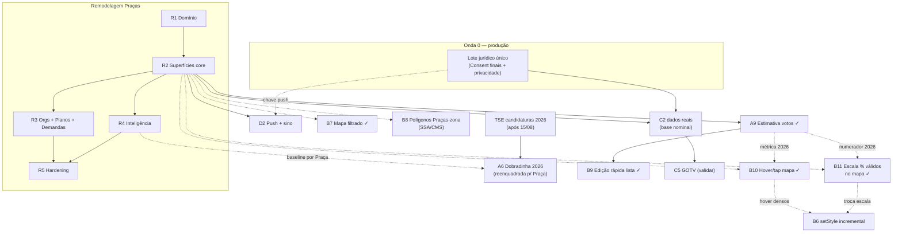

# Roadmap — Teqo

Atualizado em: 2026-07-21 (fill-in filtros-auto + B11 entregues em código; B9 + B10 entregues; débitos B9 → A9+/C8 F4; débitos B10/B11 scale toggle → B6)

Registro canônico dos **próximos** planos e débitos. Histórico de entregas: resumo abaixo + planos em [`docs/plans/`](plans/) + notebook [`.cursor/rules/projects/nucleos-eleitorais.mdc`](../.cursor/rules/projects/nucleos-eleitorais.mdc).

## Âncoras do calendário eleitoral 2026 (Res. TSE 23.760/2026)

| Data        | Marco                                   | Consequência para o produto                                                                   |
| ----------- | --------------------------------------- | --------------------------------------------------------------------------------------------- |
| 20/07–05/08 | Convenções partidárias                  | Remodelagem Praças em curso; assessores operando no modelo novo o quanto antes                |
| 15/08       | Prazo final de registro de candidaturas | TSE publica candidaturas 2026 → destrava A6 (dobradinha)                                      |
| 16/08       | Início da propaganda eleitoral          | Vertical remodelada (Praças, demandas, agenda, base nominal) em produção **antes** desta data |
| 09–23/10    | Propaganda gratuita rádio/TV            | Congelar mudanças arriscadas (~20/09)                                                         |
| 04/10       | 1º turno                                | GOTV (C5) — confirmação de comparecimento da base nominal                                     |
| 25/10       | Eventual 2º turno                       | Chapa majoritária; Solla decidido no 1º turno                                                 |

## Princípios e decisões travadas

- Ownership de audiência e portabilidade de dados; módulos reutilizáveis em outros contextos políticos.
- Um único app Next.js: site `(frontend)`, admin `(payload)`, `/campanha` `(campaign)`. Sem Rust separado. Vercel por enquanto.
- Doações só via CTA QueroApoiar (`apoiar.me/jorgesolla`). Pessoa = `Contact` + joins — nunca cadastro paralelo.
- **Praça = unidade operacional pré-definida** (2026-07-20): município, exceto Salvador (19 Praças-zona) e Camaçari (2 Praças-zona); zonas compartilhadas cortadas na divisa municipal. Ninguém cria/edita geografia no app. Substitui o Núcleo Eleitoral — plano [remodelagem-pracas.md](plans/remodelagem-pracas.md).
- Roles: `coordinator` ("Coordenador Geral"), `advisor` ("Assessor"), `leader` ("Liderança"); assessor vê só as Praças que administra. Sem disparo em massa (Res. TSE 23.610 art. 33 / Meta).

## Onda 0 — caminho crítico para dados reais

Textos provisórios de Consent + `/privacidade` auto-provisionados ([onda-0.md](plans/onda-0.md)); **hold de PII real** até o lote jurídico final. Inalterada pela remodelagem (mesmas chaves `Consent`).

1. **Lote jurídico único** _(externo)_ — textos finais (substituem provisórios) + base LGPD art. 11: `lideranca-autopreenchimento`, `apoiador-cadastro`, `apoiador-intencao-voto`, `campanha-notificacoes-push`, Aviso de Privacidade, avaliação RIPD.
2. **Smoke pós-deploy** — `NEXT_PUBLIC_SITE_URL` HTTPS, login `/campanha`, Praça de teste; checklist no AGENTS.md.
3. **Ativação com dados reais** assim que (1) liberar — lideranças/apoiadores reais e import em massa.
4. **Onboarding do time** — usuários `coordinator`/`advisor`, primeiras Praças assumidas, treino de campo.

**O0+** (escala/DRY pós-Onda 0) não bloqueia jurídico nem smoke fictício — [plano](plans/escala-dry-pos-onda0.md).

## Remodelagem Praças (R0–R5) — caminho crítico de produto ✅ (código pronto; deploy pendente)

Feedback da coordenação (2026-07-20) invalidou o modelo de Núcleo: a campanha se organiza por territórios pré-definidos ("Praças"), jargão é "Assessor", votos são declarados por liderança×Praça e estimados pelo assessor (assimetria), demandas nascem da liderança com workflow de aprovação, tendência é conjuntura política manual, e a análise-chave é comparar candidatos por Praça através dos anos. Reset dos dados de campanha em produção (sem dados reais na vertical). Plano-mestre: [remodelagem-pracas.md](plans/remodelagem-pracas.md).

| Fase | Escopo                                                                                                                                                                                          | Status                                                               |
| ---- | ----------------------------------------------------------------------------------------------------------------------------------------------------------------------------------------------- | -------------------------------------------------------------------- |
| R0   | Documentação (plano-mestre, roadmap, AGENTS/notebook/PRODUCT/CUSTOMER)                                                                                                                          | entregue 2026-07-21                                                  |
| R1   | Domínio: catálogo 436 Praças, collections (`plaza`, `leadership`, `votePledge`, `organization`, `campaignDemand`, `plazaUpdate`), access, migração consolidada `20260721_020109_remodel_plazas` | entregue 2026-07-21                                                  |
| R2   | Superfícies core: `/campanha/pracas` lista+detalhe+mapa (seletor de ano), CRM `/campanha/liderancas` multi-Praça, votos declarados×estimados, dashboard, convites                               | entregue 2026-07-21                                                  |
| R3   | `/campanha/organizacoes`, planos com Praça/orgs/presença/resultado, `/campanha/demandas` com workflow e comprovantes                                                                            | entregue 2026-07-21                                                  |
| R4   | Inteligência: comparativo multi-candidato, mapa divergente (vermelho↔branco↔azul), tendência política manual, rename série E2 → "Evolução"                                                      | entregue 2026-07-21                                                  |
| R5   | Hardening: testes por papel (unit 187 / int 306 / e2e 9 verdes), Aikido, checklist de deploy (migração destrutiva revisada)                                                                     | entregue 2026-07-21 — critique/polish visual fino registrado como R6 |

Paralelizáveis agora: fill-ins da lista (A9+, …). ~~**A9** / **B9** / **B7** / **B10** / **B11** / **filtros-auto**~~ entregues 2026-07-21. **B6** absorve hot path de hover pós-B10 e troca de escala pós-B11 (Janela 3 / gatilho de densidade).

### Sequência por janela

**Janela 1 — agora → 05/08 (convenções):** ~~R0 → R1 → R2~~ entregues; ~~**A9** estimativa de votos~~ / ~~**B9** edição rápida na lista~~ / ~~**B7** mapa filtrado~~ / ~~**B10** hover+click-nav~~ / ~~**B11** escala % dos válidos~~ / ~~**filtros-auto** lista de Praças~~ entregues; **deploy da remodelagem** (revisar SQL destrutivo da migração antes do build) + smoke em produção; R6 critique/polish; Onda 0 jurídica em paralelo.

**Janela 2 — 05/08 → 16/08 (pré-propaganda):** C2 dados reais assim que o jurídico liberar; D2 se sobrar folga.

**Janela 3 — 16/08 → set:** A6 dobradinha (pós-TSE 15/08), B6 `setStyle` incremental (troca de ano/métrica/escala **e** hover denso no mapa de Praças pós-B10/B11), **B8** polígonos das Praças-zona Salvador/Camaçari (F1 catálogo de bairros shipável antes; F2 dissolve), débitos sobreviventes (abaixo).

**Janela 4 — set → 04/10:** C5 GOTV _(validar)_, congelamento ~20/09 (só bugfix/dados).

### Cortes seguros / não cortáveis

**Não cortáveis:** Onda 0 (jurídico/Consent); R1–R2 (sem eles a vertical não reflete a operação real); C2 dados reais; assimetria declarado×estimado (relação de campo); ~~**A9**~~ (total esperado da Praça — entregue 2026-07-21).

**Cortes seguros** (se o prazo apertar, nesta ordem): R4 mapa comparativo (manter tabela comparativa); painel de detalhe por zona no mapa; R3 organizações (manter demandas); resultado de plano com mídia (manter texto); Eleitorado/IBGE na Praça; D2 push (manter sino); A6; B6; **B8** (F2 polígonos; manter F1 bairros na Praça se já entregue — mapa continua agregado no município); débitos/fill-ins. ~~**B9** / **B10** / **B11**~~ (entregues — não cortar).

## Já entregue (resumo)

- **Era Núcleos (2026-07-15 → 2026-07-20)** — MVP + Ciclo 2 (auth `campaignUser`, território A1/A2, baseline TSE A3/A4, overview B1, share C1, PWA D1, geometrias B2, Leaflet B3), C2 apoiadores (eng.), C3 agenda, C6–C11 escala, E1+E3 metas/estratégia, E2 série TSE 2014/2018/2022, A5 conversão/classificação/alavancagem/mobilização, A7 F1–F2, A8 perfis IBGE, fill-ins (reset senha/perfil, visitados recentes, Field Desk polish). Infra e padrões (locks, transações, consent por chave, shells, mapa, dados eleitorais) **são reaproveitados pela remodelagem**; as superfícies e o modelo de Núcleo são substituídos.
- **Plataforma** — local Postgres + guards, migrations baselined, posts/tags do site público com cache `posts`, Onda 0 textos provisórios + `/privacidade`.
- **Site público (2026-07-21)** — **Pixel do Meta nos abaixo-assinados** (`tracking.facebookPixelId` no admin `petition`, `PageView`/`Lead` na página pública via `MetaPixel` + `trackMetaLead`; migration `20260721_133531_add_petition_facebook_pixel_id`) — [plano](plans/pixel-meta-abaixo-assinado.md).
- **A9 (2026-07-21)** — **Estimativa de votos da Praça** (`plaza.expectedVotes` staff-only; fallback `expectedVotes ?? effectiveTotal` em mapa 2026/overview/dashboard; UI `/editar` + leitura lista/detalhe; migration `20260721_133444_add_plaza_expected_votes`) — [plano](plans/estimativa-votos-praca.md). Fill-in pós-`/simplify`: **A9+** [escala-dry-pos-a9.md](plans/escala-dry-pos-a9.md) (loader compartilhado + revalidate escopada pós-B9).
- **B7 (2026-07-21)** — **Mapa das Praças filtrado pela lista** (`buildPlazaListWhere` em `loadPlazaMapBundle`; `rawSearchParams` na página; empty → omitir painel; int `plazaMapData.int.spec.ts`) — [plano](plans/mapa-pracas-filtrado.md).
- **B9 (2026-07-21)** — **Edição rápida na lista de Praças** (Assessores / Tendência / `expectedVotes` via Popovers em `PlazaList*Control`; `listFormActions`; sem migration) — [plano](plans/edicao-rapida-lista-pracas.md). Débitos `/simplify`: **A9+** F2 (revalidate) + **C8** F4 (DRY formActions).
- **B10 (2026-07-21)** — **Hover/tap no Mapa das Praças** (destaque + `MapFeatureReadout`; desktop click navega; mobile 2º tap; SSA/CMS N>1 → `zoneBreakdown`; `plazasByIbgeCode` / `resolvePlazaMapNavigation`) — [plano](plans/hover-mapa-pracas.md). Débito perf hover O(n) → **B6** [escala-dry-pos-b3.md](plans/escala-dry-pos-b3.md).
- **B11 (2026-07-21)** — **Escala % dos válidos no Mapa das Praças** (`validVotesByYear` no bundle; seletor `Total (votos)` / `% dos válidos`; domínio fixo 0–100%; 2026 usa válidos 2022; compare desliga %; readout em %) — [plano](plans/escala-percentual-mapa-pracas.md). Débito perf troca `scaleMode` → **B6** [escala-dry-pos-b3.md](plans/escala-dry-pos-b3.md).
- **Fill-in filtros-auto (2026-07-21)** — **Filtros auto-aplicados na lista de Praças** (`PlazaFilters`: debounce 1s no `q`, Enter imediato, selects imediatos, remove Buscar; `useTransition` + pending a11y; `shouldUpdatePlazaSearchUrl` + no-op via `buildPlazaFiltersKey`; sem migration) — [plano](plans/filtros-auto-pracas.md). Débitos pós-`/simplify`: sync back/forward `search`↔`state.q` e shell pending compartilhado — gatilhos no plano.

## Supersedidos pela remodelagem (2026-07-20)

| Item antigo                              | Destino                                                                                                                        |
| ---------------------------------------- | ------------------------------------------------------------------------------------------------------------------------------ |
| A5 competitiva (parte aberta)            | Absorvido por **R4** (comparativo multi-candidato por Praça é a versão pedida pela coordenação)                                |
| A7 F3–F5 (escala pós-A4)                 | Morre com os loaders de núcleo; fetch único lista+mapa vira requisito nativo do mapa de Praças (R2)                            |
| A8+ (escala pós-A8)                      | Reavaliar pós-R2 se o Eleitorado IBGE for portado ao detalhe da Praça                                                          |
| B4 zonas TSE no mapa                     | Rabbit hole documentado no plano-mestre; **B8** reabre só Praças-zona SSA/CMS (dissolve por bairro — não o B4 multi-município) |
| C4 demandas                              | Absorvido por **R3** (agora nascem da liderança, com workflow assessor→coordenador geral e comprovantes staff-only)            |
| C10 / C11 (escala apoiadores/planos)     | Reavaliar pós-R2/R3 nas superfícies adaptadas; gatilhos originais (base nominal crescendo / volume medido) continuam valendo   |
| E5 Salvador por bairro                   | Praças-zona de Salvador cobrem a granularidade; bairro só com pedido real pós-eleição                                          |
| E6 (escala pós-E1) / E7 (escala pós-E2)  | Overview de núcleos e trend VM morrem; débitos int reavaliar pós-R4                                                            |
| FD+ / FD2 (Field Desk pós-critique)      | Superfícies redesenhadas em R2; princípios (glossário inline, filas, bulk) entram no critique de R5                            |
| VR+ (visitados recentemente)             | Painel portado para Praças em R2; débito de refresh mantém gatilho original                                                    |
| Listas globais (lideranças/atualizações) | CRM de liderança já nasce global em R2 (liderança é 1 registro por pessoa)                                                     |

## Próximos — sobreviventes e pós-remodelagem

- **A6** dobradinha 2026 automática quando o TSE publicar candidaturas · gatilho externo: pós-15/08 · reenquadrar para Praça · [plano](plans/insight-dobradinha-2026.md)
- **B5 F2–F3** cache CLI compartilhado + factory mun/TI (scripts continuam) · [plano](plans/escala-dry-pos-b2.md)
- **B6** `BahiaMap` setStyle incremental (métrica/ano/escala pós-B11 + hover/select pós-B10 ✓) · gatilho: troca frequente de ano/métrica/escala ou hover denso no mapa de Praças · appetite ~1–1,5 dia · [plano](plans/escala-dry-pos-b3.md)
- **B8** Polígonos das Praças-zona (Salvador ZE 1–19 / Camaçari ZE 170–171): F1 catálogo zona→bairros + UI na Praça; F2 dissolve IBGE/malha → TopoJSON no mapa · Janela 3 · cortável (F2) · [plano](plans/poligonos-pracas-zona.md)
- **C5** operação dia D / GOTV _(validar com produto)_ · design [`Dia-D-GOTV`](design-refs/latest/Dia-D-GOTV.png) · depende de C2 dados reais
- **D2** push + sino in-app · soft: chave `campanha-notificacoes-push` (Onda 0) · [plano](plans/notifications.md)
- **R6** critique/polish visual da vertical remodelada (ciclo /impeccable completo por superfície; smoke visual coordenador feito em 2026-07-21) · gatilho: antes de 16/08 · (opcional: mover filtros acima do mapa)
- **Fill-ins:** **A9+** loader compartilhado lista/mapa + revalidate escopada pós-B9 ([plano](plans/escala-dry-pos-a9.md)) · **C8** F4 DRY `listFormActions`↔`/editar` ([plano](plans/escala-dry-pos-c6.md)) · O0+ ([plano](plans/escala-dry-pos-onda0.md)) · RS+ auth read leve + shells de senha ([plano](plans/escala-dry-pos-reset-senha-perfil.md)) · higiene PascalCase

## Bloqueadores atuais

| Item                                                                                             | Status                               | Fonte                                                |
| ------------------------------------------------------------------------------------------------ | ------------------------------------ | ---------------------------------------------------- |
| Lote jurídico final LGPD (Consent + privacidade + RIPD) — PII real em hold                       | **caminho crítico para dados reais** | notebook; onda-0; AGENTS                             |
| Deploy da remodelagem Praças (migração destrutiva `remodel_plazas` — revisar SQL antes do build) | **pronto para deploy**               | [remodelagem-pracas.md](plans/remodelagem-pracas.md) |
| RBAC em `users` (admin Payload) antes de abrir `/admin` a equipe maior                           | pendente                             | AGENTS Known Gap #1                                  |
| Consent público ainda por ID numérico (`submitWhatsapp.ts` etc.)                                 | pendente                             | AGENTS Known Gap #2                                  |
| Collection `Pages` + hero/copy da home editáveis                                                 | pendente (não bloqueia `/campanha`)  | AGENTS Known Gap #3                                  |

## Site público

**Já entregue:** `post`/`tag`, listagens/artigos, seed, cache `posts`; `/privacidade` (texto provisório Onda 0); **Pixel do Meta nos abaixo-assinados** ([plano](plans/pixel-meta-abaixo-assinado.md)).

**Próximos:**

- Textos finais de privacidade + polish O0+ (revalidate globals, DRY Lexical) — mencionar cookies/Meta com Pixel em uso _(suave; ver roadmap Site público)_
- `Pages` institucionais (bio, mandato, propostas) + hero/copy editáveis
- Agenda/multimídia via links oficiais; CTA Doar → QueroApoiar
- Migrar Consent dos fluxos públicos para chave estável

## Admin Payload

- `roles` em `users` + access real antes de ampliar `/admin`
- Seed reproduzível de `Consent` por chave (não por ID)

## Plataforma white-label

- Fase 2 do README (multi-tenant / marca por mandato) — **depois da eleição**

## Fora de escopo (por enquanto)

- Serviço Rust separado; self-host/Coolify enquanto Vercel atender; doações in-app
- Geocodificação de seções eleitorais / Praça = seção (polígonos **aproximados** das 21 Praças-zona SSA/CMS = **B8**, sem seções)
- PWA do site/`/admin`; PostGIS sem query espacial real
- WhatsApp Business API / disparo em massa; previsão estatística de votos neste ciclo
- Import automático de planilhas de projeção (decisão E4 mantida: dados estratégicos via UI)

## Fontes

- [`AGENTS.md`](../AGENTS.md) — decisões travadas, Known Gaps, checklist
- [`.cursor/rules/projects/nucleos-eleitorais.mdc`](../.cursor/rules/projects/nucleos-eleitorais.mdc) — status operacional (era Núcleos → Praças)
- [`README.md`](../README.md) — missão
- [`docs/plans/*.md`](plans/) — planos por item ([remodelagem-pracas.md](plans/remodelagem-pracas.md) é o plano-mestre vigente)
- Res. TSE 23.760/2026 · Res. TSE 23.610/2019 art. 33 · Politipédia AVM
