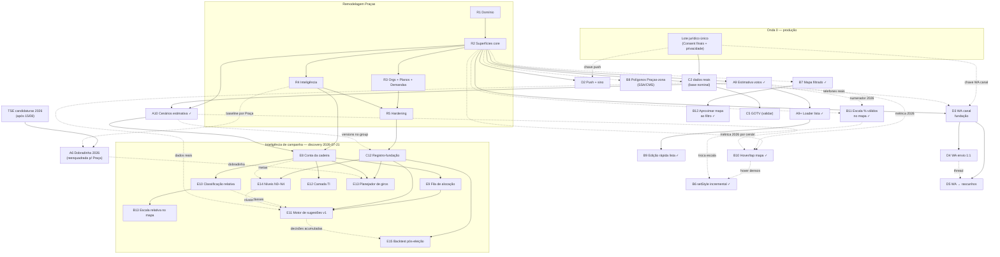

# Roadmap — Teqo

Atualizado em: 2026-07-23 (A10 cenários entregue — [plano](plans/cenarios-estimativa-votos.md); D3–D5 WhatsApp; export CSV admin entregue)

Registro canônico dos **próximos** planos e débitos. Histórico de entregas: resumo abaixo + planos em [`docs/plans/`](plans/) + notebook [`.cursor/rules/projects/nucleos-eleitorais.mdc`](../.cursor/rules/projects/nucleos-eleitorais.mdc).

## Âncoras do calendário eleitoral 2026 (Res. TSE 23.760/2026)

| Data        | Marco                                   | Consequência para o produto                                                                   |
| ----------- | --------------------------------------- | --------------------------------------------------------------------------------------------- |
| 20/07–05/08 | Convenções partidárias                  | Remodelagem Praças em curso; assessores operando no modelo novo o quanto antes                |
| 15/08       | Prazo final de registro de candidaturas | TSE publica candidaturas 2026 → destrava A6 (dobradinha)                                      |
| 16/08       | Início da propaganda eleitoral          | Vertical remodelada (Praças, demandas, agenda, base nominal) em produção **antes** desta data |
| 09–23/10    | Propaganda gratuita rádio/TV            | Congelar mudanças arriscadas (~20/09)                                                         |
| 04/10       | 1º turno                                | GOTV (C5) — confirmação de comparecimento da base nominal                                     |
| 25/10       | Eventual 2º turno                       | Chapa majoritária; Solla decidido no 1º turno                                                 |

## Princípios e decisões travadas

- Ownership de audiência e portabilidade de dados; módulos reutilizáveis em outros contextos políticos.
- Um único app Next.js: site `(frontend)`, admin `(payload)`, `/campanha` `(campaign)`. Sem Rust separado. Vercel por enquanto.
- Doações só via CTA QueroApoiar (`apoiar.me/jorgesolla`). Pessoa = `Contact` + joins — nunca cadastro paralelo.
- **Praça = unidade operacional pré-definida** (2026-07-20): município, exceto Salvador (19 Praças-zona) e Camaçari (2 Praças-zona); zonas compartilhadas cortadas na divisa municipal. Ninguém cria/edita geografia no app. Substitui o Núcleo Eleitoral — plano [remodelagem-pracas.md](plans/remodelagem-pracas.md).
- Roles: `coordinator` ("Coordenador Geral"), `advisor` ("Assessor"), `leader` ("Liderança"); assessor vê só as Praças que administra. Sem disparo em massa (Res. TSE 23.610 art. 33 / Meta). Comunicação **1:1 interna** staff↔lideranças via bridge WhatsApp não oficial = programa **D3–D5** (não é Business API nem blast).

## Onda 0 — caminho crítico para dados reais

Textos provisórios de Consent + `/privacidade` auto-provisionados ([onda-0.md](plans/onda-0.md)); **hold de PII real** até o lote jurídico final. Inalterada pela remodelagem (mesmas chaves `Consent`).

1. **Lote jurídico único** _(externo)_ — textos finais (substituem provisórios) + base LGPD art. 11: `lideranca-autopreenchimento`, `apoiador-cadastro`, `apoiador-intencao-voto`, `campanha-notificacoes-push`, **`campanha-whatsapp-canal`** (D3 — armazenamento/processamento do canal interno staff↔lideranças; se o lote já tiver fechado sem esta chave, entra no próximo passe com a assessoria — não abrir rodada jurídica só por ela), Aviso de Privacidade, avaliação RIPD.
2. **Smoke pós-deploy** — `NEXT_PUBLIC_SITE_URL` HTTPS, login `/campanha`, Praça de teste; checklist no AGENTS.md.
3. **Ativação com dados reais** assim que (1) liberar — lideranças/apoiadores reais e import em massa.
4. **Onboarding do time** — usuários `coordinator`/`advisor`, primeiras Praças assumidas, treino de campo.

**O0+** (escala/DRY pós-Onda 0) não bloqueia jurídico nem smoke fictício — [plano](plans/escala-dry-pos-onda0.md).

## Remodelagem Praças (R0–R5) — caminho crítico de produto ✅ (código pronto; deploy pendente)

Feedback da coordenação (2026-07-20) invalidou o modelo de Núcleo: a campanha se organiza por territórios pré-definidos ("Praças"), jargão é "Assessor", votos são declarados por liderança×Praça e estimados pelo assessor (assimetria), demandas nascem da liderança com workflow de aprovação, tendência é conjuntura política manual, e a análise-chave é comparar candidatos por Praça através dos anos. Reset dos dados de campanha em produção (sem dados reais na vertical). Plano-mestre: [remodelagem-pracas.md](plans/remodelagem-pracas.md).

| Fase | Escopo                                                                                                                                                                                                                | Status                                                               |
| ---- | --------------------------------------------------------------------------------------------------------------------------------------------------------------------------------------------------------------------- | -------------------------------------------------------------------- |
| R0   | Documentação (plano-mestre, roadmap, AGENTS/notebook/PRODUCT/CUSTOMER)                                                                                                                                                | entregue 2026-07-21                                                  |
| R1   | Domínio: catálogo 436 Praças, collections (`municipality`, `leadership`, `votePledge`, `organization`, `campaignDemand`, `municipalityUpdate`), access, migração consolidada `20260721_020109_remodel_municipalities` | entregue 2026-07-21                                                  |
| R2   | Superfícies core: `/campanha/municipios` lista+detalhe+mapa (seletor de ano), CRM `/campanha/liderancas` multi-Praça, votos declarados×estimados, dashboard, convites                                                 | entregue 2026-07-21                                                  |
| R3   | `/campanha/organizacoes`, planos com Praça/orgs/presença/resultado, `/campanha/demandas` com workflow e comprovantes                                                                                                  | entregue 2026-07-21                                                  |
| R4   | Inteligência: comparativo multi-candidato, mapa divergente (vermelho↔branco↔azul), tendência política manual, rename série E2 → "Evolução"                                                                            | entregue 2026-07-21                                                  |
| R5   | Hardening: testes por papel (unit 187 / int 306 / e2e 9 verdes), Aikido, checklist de deploy (migração destrutiva revisada)                                                                                           | entregue 2026-07-21 — critique/polish visual fino registrado como R6 |

## Remodelagem Municípios (M1–M5) — mudanças de rumo 2026-07-23

Reunião com coordenador geral + deputado (2026-07-23) definiu 7 mudanças **antes** do deploy da remodelagem Praças: rename completo Praça→Município (`municipality`, URLs `/campanha/municipios`), Camaçari inteira (435 entradas), role `candidate`, demandas staff-only, lockdown da liderança (só ferramenta de contatos), dobradinhas estruturadas (`stateDeputy`) e mapa analítico na aba Início. Plano-mestre: [remodelagem-municipios.md](plans/remodelagem-municipios.md).

| Fase | Escopo                                                                                                                                                                                                             | Status              |
| ---- | ------------------------------------------------------------------------------------------------------------------------------------------------------------------------------------------------------------------ | ------------------- |
| M1   | Schema + rename mecânico: catálogo 435, collections `municipality`/`municipalityUpdate`, migration `remodel_municipalities` + `reconcile_municipality_remodel`, sweep `plaza*`→`municipality*`, rota `municipios/` | entregue 2026-07-23 |
| M2   | Roles: `candidate` (`isCampaignUnrestricted`), lockdown leader, demandas staff-only, staff edita `declaredVotes`, int specs por papel                                                                              | entregue 2026-07-23 |
| M3   | Ferramenta de contatos do leader (phone-first, `source: lideranca`, lê só `createdBy`)                                                                                                                             | entregue 2026-07-23 |
| M4   | Vertical `/campanha/dobradinhas` + seletores município/liderança                                                                                                                                                   | entregue 2026-07-23 |
| M5   | Mapa no Início; lista de municípios sem mapa                                                                                                                                                                       | entregue 2026-07-23 |

**Notas:** B8 polígonos passa a escopo **Salvador-only** (Camaçari não é mais Praça-zona). A6 insight TSE alimenta sugestão futura sobre o registro operacional `stateDeputy`. Deploy único substitui o deploy pendente de `remodel_municipalities` — revisar SQL destrutivo `remodel_municipalities` antes do build.

## Inteligência de campanha (discovery 2026-07-21)

O discovery literatura→persona→entrevista ([relatório aprovado](research/relatorio-entrevista-persona-campanha.md); compêndio com ~67 fontes em [docs/research/](research/)) fixou o kernel: a disputa de DF é conta de quociente fragmentada; o gargalo é converter lealdade de campo em voto nominal praça a praça via rede; % estadual absoluto é anti-métrica. O produto deve entregar **inteligência, não planilha chique**: metas derivadas, leitura relativa, fila de decisão priorizada, sugestões dado→decisão com humano no loop, registro ex-ante auditável. Plano-mestre: [inteligencia-campanha.md](plans/inteligencia-campanha.md) (incl. gaps de dados G1–G10 e desenho canônico da fila).

| ID  | Fatia                              | Plano                                                   | Entrega essencial                                                                                                                                                                  | Classe | Appetite | Janela    | Depende de                                     |
| --- | ---------------------------------- | ------------------------------------------------------- | ---------------------------------------------------------------------------------------------------------------------------------------------------------------------------------- | ------ | -------- | --------- | ---------------------------------------------- |
| E8  | Conta da cadeira                   | [detalhes](plans/conta-da-cadeira.md)                   | Global `campaignGoals`; potencial por praça (válidos projetados, captura do campo, roll-off, headroom); decomposição meta→praça; cobertura Σpledges÷meta (cenário default = média) | B      | ~2d      | 2         | deploy remodelagem                             |
| E9  | Fila de alocação                   | [detalhes](plans/fila-de-alocacao.md)                   | Lista de decisão (7 colunas), ordenação por déficit descoberto + risco por frescor, "coluna da vergonha"                                                                           | B      | ~1,5d    | 2         | E8                                             |
| C12 | Registro-fundação                  | [detalhes](plans/registro-fundacao.md)                  | Versions em `votePledge`; sinais tipados no `municipalityUpdate`; `actionPlan.origin`+custo; collection `allocationDecision`                                                       | B      | ~2d      | 2         | deploy remodelagem (paralelo a E8; suave: A10) |
| E10 | Classificação territorial relativa | [detalhes](plans/classificacao-territorial-relativa.md) | Âncoras relativas (LQ / share da cadeira marginal), multi-eixo; substitui 35/20/10 para DF                                                                                         | B      | ~1d      | 3         | E8                                             |
| B13 | Escala relativa no mapa            | [detalhes](plans/escala-relativa-mapa.md)               | Quantis do candidato (default) + LQ + rank; símbolo proporcional por votos em jogo; % válidos mantido                                                                              | B      | ~2d      | 3         | E8, E10                                        |
| E14 | Níveis de envolvimento N0–N4       | [detalhes](plans/niveis-de-envolvimento.md)             | `engagementLevel` com histerese e sinais de reversão; staff-only (vocabulário duplo)                                                                                               | B      | ~1d      | 3         | C12                                            |
| E11 | Motor de sugestões v1              | [detalhes](plans/motor-de-sugestoes.md)                 | 8 padrões (P1/P2/P3/P5/P6/P7/K-A/K-B), menu com estatuto, aceitar/descartar → `allocationDecision`, triagem 1–5                                                                    | C      | ~3d      | 3         | E8, E9, E10, C12                               |
| E12 | Camada TI                          | [detalhes](plans/camada-territorios-identidade.md)      | Rollups com salvaguardas MAUP, benchmark intra-TI (gatilhos T no motor = fase 2 de E11)                                                                                            | B      | ~1,5d    | 3         | E8                                             |
| E13 | Planejador de presença/giros       | [detalhes](plans/planejador-de-giros.md)                | Elegibilidade (5 condições ✓/—), fases construção/consolidação/ativação, compositor de giro, visita pedida×justificada                                                             | C      | ~1,5d    | 3         | E8, C12                                        |
| E15 | Backtest pós-eleição               | [detalhes](plans/backtest-pos-eleicao.md)               | Pledge (trajetória) vs. resultado por zona; calibração de limiares                                                                                                                 | A      | ~1d      | pós-04/10 | C12, TSE 2026                                  |

Paralelizáveis agora: **E8** (pós-A10), fill-ins (O0+, RS+, …). **D3** (baixa/média prioridade; após remodelagem em prod + folga — não bloqueia E8/E9). ~~**A9** / **A9+** / **A10** / **B9** / **B7** / **B10** / **B11** / **B6** / **B12** / **filtros-auto** / **C8** F4~~ entregues 2026-07-21–23.

### Sequência por janela

**Janela 1 — agora → 05/08 (convenções):** ~~R0 → R1 → R2~~ entregues; ~~**A9** estimativa de votos~~ / ~~**A10** cenários pessimista/média/otimista~~ / ~~**B9** edição rápida na lista~~ / ~~**B7** mapa filtrado~~ / ~~**B10** hover+click-nav~~ / ~~**B11** escala % dos válidos~~ / ~~**B12** aproximar mapa ao footprint filtrado~~ / ~~**filtros-auto** lista de Praças~~ entregues; **deploy da remodelagem** (revisar SQL destrutivo da migração antes do build) + smoke em produção; R6 critique/polish; Onda 0 jurídica em paralelo.

**Janela 2 — 05/08 → 16/08 (pré-propaganda):** C2 dados reais assim que o jurídico liberar; **E8** conta da cadeira → **E9** fila de alocação, com **C12** registro-fundação em paralelo (migrations cedo, longe do congelamento); D2 se sobrar folga.

**Janela 3 — 16/08 → set:** A6 dobradinha (pós-TSE 15/08), **E10** classificação relativa → **B13** escala relativa no mapa, **E14** níveis N0–N4, **E11** motor de sugestões v1, **E12** camada TI, **E13** planejador de giros; **B8** polígonos das Praças-zona Salvador/Camaçari (F1 catálogo de bairros shipável antes; F2 dissolve), débitos sobreviventes (abaixo). Se houver folga **e** Little Hire ainda vazar para o ZAP: começar **D3** (fundação do canal) — não compete com E8/E9 na Janela 2.

**Janela 4 — set → 04/10:** C5 GOTV _(validar)_, congelamento ~20/09 (só bugfix/dados). **D4** envio 1:1 e **D5** inbox→rascunhos só se D3 estiver estável **antes** do congelamento (senão Adiar pós-04/10). **E15** backtest pós-eleição (após 04/10).

### Cortes seguros / não cortáveis

**Não cortáveis:** Onda 0 (jurídico/Consent); R1–R2 (sem eles a vertical não reflete a operação real); C2 dados reais; assimetria declarado×estimado (relação de campo); ~~**A9**~~ (total esperado da Praça — entregue 2026-07-21); ~~**A10**~~ (faixa pessimista/média/otimista — entregue 2026-07-23); **E8**+**E9**+**C12** (a conta da cadeira, a fila e o registro ex-ante são o mínimo de "inteligência, não planilha" — e C12 é irrecuperável se não registrar durante a campanha).

**Cortes seguros** (se o prazo apertar, nesta ordem): **D5** inbox→rascunhos (manter registro manual + `wa.me`); **D4** envio bridge (manter `wa.me`); **D3** fundação do canal (atalho `wa.me` continua); **E13** planejador de giros (agenda segue manual com J-A/J-B como guia); **E12** camada TI (rollup manual por lista); **E15** (pós-eleição por definição — cortar = perder o aprendizado 2030); **E11** motor v1 (manter fila E9 sem sugestões); **B13** símbolo proporcional (manter quantis/LQ como escala); **E14** (manter `priority` alta/normal); R4 mapa comparativo (manter tabela comparativa); painel de detalhe por zona no mapa; R3 organizações (manter demandas); resultado de plano com mídia (manter texto); Eleitorado/IBGE na Praça; D2 push (manter sino); A6; **B8** (F2 polígonos; manter F1 bairros na Praça se já entregue — mapa continua agregado no município); débitos/fill-ins. ~~**B9** / **B10** / **B11** / **B6** / **B12**~~ / ~~**export CSV de assinaturas/contatos**~~ (entregues — não cortar).

## Já entregue (resumo)

- **Era Núcleos (2026-07-15 → 2026-07-20)** — MVP + Ciclo 2 (auth `campaignUser`, território A1/A2, baseline TSE A3/A4, overview B1, share C1, PWA D1, geometrias B2, Leaflet B3), C2 apoiadores (eng.), C3 agenda, C6–C11 escala, E1+E3 metas/estratégia, E2 série TSE 2014/2018/2022, A5 conversão/classificação/alavancagem/mobilização, A7 F1–F2, A8 perfis IBGE, fill-ins (reset senha/perfil, visitados recentes, Field Desk polish). Infra e padrões (locks, transações, consent por chave, shells, mapa, dados eleitorais) **são reaproveitados pela remodelagem**; as superfícies e o modelo de Núcleo são substituídos.
- **Plataforma** — local Postgres + guards, migrations baselined, posts/tags do site público com cache `posts`, Onda 0 textos provisórios + `/privacidade`.
- **Site público (2026-07-21)** — **Pixel do Meta nos abaixo-assinados** (`tracking.facebookPixelId` no admin `petition`, `PageView`/`Lead` na página pública via `MetaPixel` + `trackMetaLead`; migration `20260721_133531_add_petition_facebook_pixel_id`) — [plano](plans/pixel-meta-abaixo-assinado.md).
- **A9 (2026-07-21)** — **Estimativa de votos da Praça** (`municipality.expectedVotes` staff-only; fallback `expectedVotes ?? effectiveTotal` em mapa 2026/overview/dashboard; UI `/editar` + leitura lista/detalhe; migration `20260721_133444_add_municipality_expected_votes`) — [plano](plans/estimativa-votos-praca.md).
- **A9+ (2026-07-21)** — **Loader compartilhado da lista de Praças** (`loadMunicipalityListPageBundle`: 1× `aggregatePledgesByMunicipality` + `buildMunicipalityMapBundleFromMunicipalities`; `municipalityRevalidation.ts` + `municipalitySlug` para revalidate estreita no detalhe; int `municipalityPageData.int.spec.ts`; sem migration) — [plano](plans/escala-dry-pos-a9.md).
- **B7 (2026-07-21)** — **Mapa das Praças filtrado pela lista** (`buildMunicipalityListWhere` em `loadMunicipalityMapBundle`; `rawSearchParams` na página; empty → omitir painel; int `municipalityMapData.int.spec.ts`) — [plano](plans/mapa-pracas-filtrado.md).
- **B9 (2026-07-21)** — **Edição rápida na lista de Praças** (Assessores / Tendência / `expectedVotes` via Popovers em `MunicipalityList*Control`; `municipalityStaffFormActions`; sem migration) — [plano](plans/edicao-rapida-lista-pracas.md).
- **B10 (2026-07-21)** — **Hover/tap no Mapa das Praças** (destaque + `MapFeatureReadout`; desktop click navega; mobile 2º tap; SSA/CMS N>1 → `zoneBreakdown`; `municipalitiesByIbgeCode` / `resolveMunicipalityMapNavigation`) — [plano](plans/hover-mapa-pracas.md).
- **B11 (2026-07-21)** — **Escala % dos válidos no Mapa das Praças** (`validVotesByYear` no bundle; seletor `Total (votos)` / `% dos válidos`; domínio fixo 0–100%; 2026 usa válidos 2022; compare desliga %; readout em %) — [plano](plans/escala-percentual-mapa-pracas.md).
- **B12 (2026-07-21)** — **Aproximar mapa ao footprint filtrado + correção hover** (`fitToKeys` + `interactiveKeys` em `BahiaMap` a partir de `municipalitiesByIbgeCode`; `canonicalMapKeysKey`; hover stroke-only sem alterar fill; clear síncrono no mouseout; fit só quando footprint muda — sem re-zoom em Ano/Escala) — [plano](plans/aproximar-mapa-pracas.md).
- **B6 (2026-07-21)** — **`BahiaMap` setStyle incremental** (layer GeoJSON estável entre troca de ano/métrica/escala; `pathByKeyRef` + restyle O(2) no hover/select; `fitBounds` só em `mode`/`highlightKeys`; helpers em `bahiaMapStyle.ts`) — [plano](plans/escala-dry-pos-b3.md).
- **B8 F1 (2026-07-21)** — **Catálogo bairros das Praças-zona** (`municipalityZoneNeighborhoods`: Salvador TRE-BA RA 02/2017 + Camaçari curado; fixture+int; card **Bairros desta Praça** no overview de Praças `kind=zona`; sem migration) — [plano](plans/poligonos-pracas-zona.md). **F2 pendente** (F2 prep catálogo ~½ dia + TopoJSON + mapa). Débitos pós-`/simplify`: hidratação via `municipalityCatalog`, canônico JSON→TS, teste ordem slugs → F2 prep no plano (S6 CSS compartilhado adiado até F2/R6).
- **Fill-in filtros-auto (2026-07-21)** — **Filtros auto-aplicados na lista de Praças** (`MunicipalityFilters`: debounce 1s no `q`, Enter imediato, selects imediatos, remove Buscar; `useTransition` + pending a11y; `shouldUpdateMunicipalitySearchUrl` + no-op via `buildMunicipalityFiltersKey`; sem migration) — [plano](plans/filtros-auto-pracas.md). Débitos pós-`/simplify`: sync back/forward `search`↔`state.q` e shell pending compartilhado — gatilhos no plano.
- **Fill-in C8 F4 (2026-07-21)** — **DRY municipality staff form actions** (`municipalityStaffFormActions.ts`: votos estimados, tendência e assessores compartilhados entre lista e `/editar`; `editar/formActions.ts` mantém só `updateMunicipalityStrategy`; sem migration) — [plano](plans/escala-dry-pos-c6.md).
- **Admin Payload (2026-07-23)** — **Export CSV de assinaturas e contatos** (`@payloadcms/plugin-import-export@3.82.0` em `signature` + `contact`; export CSV síncrono; flatten de `contact`/`petition` via `toCSV` em assinaturas; campos nativos em contatos; `consent` excluído; access `exports`/`imports` restrito a `users`; migration `20260723_025513_add_import_export_plugin`) — [plano](plans/exportar-csv-assinaturas.md).

## Supersedidos pela remodelagem (2026-07-20)

| Item antigo                              | Destino                                                                                                                        |
| ---------------------------------------- | ------------------------------------------------------------------------------------------------------------------------------ |
| A5 competitiva (parte aberta)            | Absorvido por **R4** (comparativo multi-candidato por Praça é a versão pedida pela coordenação)                                |
| A7 F3–F5 (escala pós-A4)                 | Morre com os loaders de núcleo; fetch único lista+mapa vira requisito nativo do mapa de Praças (R2)                            |
| A8+ (escala pós-A8)                      | Reavaliar pós-R2 se o Eleitorado IBGE for portado ao detalhe da Praça                                                          |
| B4 zonas TSE no mapa                     | Rabbit hole documentado no plano-mestre; **B8** reabre só Praças-zona SSA/CMS (dissolve por bairro — não o B4 multi-município) |
| C4 demandas                              | Absorvido por **R3** (agora nascem da liderança, com workflow assessor→coordenador geral e comprovantes staff-only)            |
| C10 / C11 (escala apoiadores/planos)     | Reavaliar pós-R2/R3 nas superfícies adaptadas; gatilhos originais (base nominal crescendo / volume medido) continuam valendo   |
| E5 Salvador por bairro                   | Praças-zona de Salvador cobrem a granularidade; bairro só com pedido real pós-eleição                                          |
| E6 (escala pós-E1) / E7 (escala pós-E2)  | Overview de núcleos e trend VM morrem; débitos int reavaliar pós-R4                                                            |
| FD+ / FD2 (Field Desk pós-critique)      | Superfícies redesenhadas em R2; princípios (glossário inline, filas, bulk) entram no critique de R5                            |
| VR+ (visitados recentemente)             | Painel portado para Praças em R2; débito de refresh mantém gatilho original                                                    |
| Listas globais (lideranças/atualizações) | CRM de liderança já nasce global em R2 (liderança é 1 registro por pessoa)                                                     |

## Próximos — sobreviventes e pós-remodelagem

- **Programa Inteligência de campanha** (E8–E15, B13, C12) · fatias, gaps de dados e fila canônica no [plano-mestre](plans/inteligencia-campanha.md) · embasamento: [docs/research/](research/) (relatório aprovado 2026-07-21) · **E8** desbloqueado por A10 ✓
- **A6** dobradinha 2026 automática quando o TSE publicar candidaturas · gatilho externo: pós-15/08 · reenquadrar para Praça · alimenta **E13** · [plano](plans/insight-dobradinha-2026.md)
- **B5 F2–F3** cache CLI compartilhado + factory mun/TI (scripts continuam) · [plano](plans/escala-dry-pos-b2.md)
- **B8** Polígonos das Praças-zona (Salvador ZE 1–19 / Camaçari ZE 170–171): ~~F1 catálogo zona→bairros + UI na Praça~~ (entregue 2026-07-21); F2 prep catálogo (~½ dia) + dissolve IBGE/malha → TopoJSON no mapa · Janela 3 · cortável (F2) · [plano](plans/poligonos-pracas-zona.md)
- **C5** operação dia D / GOTV _(validar com produto)_ · design [`Dia-D-GOTV`](design-refs/latest/Dia-D-GOTV.png) · depende de C2 dados reais
- **D2** push + sino in-app · soft: chave `campanha-notificacoes-push` (Onda 0) · [plano](plans/notifications.md)
- **Programa WhatsApp interno (D3–D5)** · baixa/média prioridade · 1:1 staff↔lideranças via bridge **não oficial** · **número pessoal** de cada assessor/CG (QR no app, parece chat pessoal) · não Business API / não massa / não chip institucional · fecha Little Hire · plano-mestre [whatsapp-interno-campanha.md](plans/whatsapp-interno-campanha.md)
  - **D3** fundação multi-sessão (QR por `campaignUser` + log + Consent `campanha-whatsapp-canal`) · [plano](plans/whatsapp-canal-fundacao.md)
  - **D4** envio 1:1 pela sessão do ator · depende de D3 · [plano](plans/whatsapp-envio-liderancas.md)
  - **D5** inbox da própria sessão → rascunhos (`municipalityUpdate`/demanda) com humano no loop · depende de D3 · [plano](plans/whatsapp-sugestao-atualizacoes.md)
- **R6** critique/polish visual da vertical remodelada (ciclo /impeccable completo por superfície; smoke visual coordenador feito em 2026-07-21) · gatilho: antes de 16/08 · (opcional: mover filtros acima do mapa)
- **Fill-ins:** O0+ ([plano](plans/escala-dry-pos-onda0.md)) · RS+ auth read leve + shells de senha ([plano](plans/escala-dry-pos-reset-senha-perfil.md)) · higiene PascalCase

## Bloqueadores atuais

| Item                                                                                                     | Status                               | Fonte                                                |
| -------------------------------------------------------------------------------------------------------- | ------------------------------------ | ---------------------------------------------------- |
| Lote jurídico final LGPD (Consent + privacidade + RIPD) — PII real em hold                               | **caminho crítico para dados reais** | notebook; onda-0; AGENTS                             |
| Deploy da remodelagem Praças (migração destrutiva `remodel_municipalities` — revisar SQL antes do build) | **pronto para deploy**               | [remodelagem-pracas.md](plans/remodelagem-pracas.md) |
| RBAC em `users` (admin Payload) antes de abrir `/admin` a equipe maior                                   | pendente                             | AGENTS Known Gap #1                                  |
| Consent público ainda por ID numérico (`submitWhatsapp.ts` etc.)                                         | pendente                             | AGENTS Known Gap #2                                  |
| Collection `Pages` + hero/copy da home editáveis                                                         | pendente (não bloqueia `/campanha`)  | AGENTS Known Gap #3                                  |

## Site público

**Já entregue:** `post`/`tag`, listagens/artigos, seed, cache `posts`; `/privacidade` (texto provisório Onda 0); **Pixel do Meta nos abaixo-assinados** ([plano](plans/pixel-meta-abaixo-assinado.md)).

**Próximos:**

- Textos finais de privacidade + polish O0+ (revalidate globals, DRY Lexical) — mencionar cookies/Meta com Pixel em uso _(suave; ver roadmap Site público)_
- `Pages` institucionais (bio, mandato, propostas) + hero/copy editáveis
- Agenda/multimídia via links oficiais; CTA Doar → QueroApoiar
- Migrar Consent dos fluxos públicos para chave estável

## Admin Payload

- `roles` em `users` + access real antes de ampliar `/admin` — access explícito por collection SHIPPED 2026-07-23 (hardening Fase 0); falta apenas o campo `roles` (migration)
- Seed reproduzível de `Consent` por chave (não por ID)

## Débitos de engenharia (hardening 2026-07-23)

- Ledger vivo em [`TECH-DEBT.md`](TECH-DEBT.md) (tracker: [`IMPROVE-CODE-QUALITY-PLAN.md`](IMPROVE-CODE-QUALITY-PLAN.md)); itens maiores: dirigir `knip` unused-exports de warn→error após os splits, redesenho do lease da janela de consent ausente nos testes, e2e fino, CI só no mirror GitHub

## Plataforma white-label

- Fase 2 do README (multi-tenant / marca por mandato) — **depois da eleição**

## Fora de escopo (por enquanto)

- Serviço Rust separado; self-host/Coolify enquanto Vercel atender; doações in-app
- Geocodificação de seções eleitorais / Praça = seção (polígonos **aproximados** das 21 Praças-zona SSA/CMS = **B8**, sem seções)
- PWA do site/`/admin`; PostGIS sem query espacial real
- WhatsApp Business API / disparo em massa / blast a apoiadores ou eleitores (Res. TSE 23.610 art. 33; Meta veda WABA político). **Exceto** o programa **D3–D5**: bridge não oficial **1:1 interno** staff↔lideranças já no CRM (ver [whatsapp-interno-campanha.md](plans/whatsapp-interno-campanha.md)) — risco ToS/operacional explícito nos planos; não é substituto de WABA
- Previsão estatística de votos neste ciclo
- Import automático de planilhas de projeção (decisão E4 mantida: dados estratégicos via UI)

## Fontes

- [`AGENTS.md`](../AGENTS.md) — decisões travadas, Known Gaps, checklist
- [`.cursor/rules/projects/nucleos-eleitorais.mdc`](../.cursor/rules/projects/nucleos-eleitorais.mdc) — status operacional (era Núcleos → Praças)
- [`README.md`](../README.md) — missão
- [`docs/plans/*.md`](plans/) — planos por item ([remodelagem-pracas.md](plans/remodelagem-pracas.md) e [inteligencia-campanha.md](plans/inteligencia-campanha.md) são os planos-mestre vigentes)
- [`docs/research/`](research/) — embasamento de produto/domínio (compêndio de literatura + relatório de discovery aprovado 2026-07-21)
- Res. TSE 23.760/2026 · Res. TSE 23.610/2019 art. 33 · Politipédia AVM
