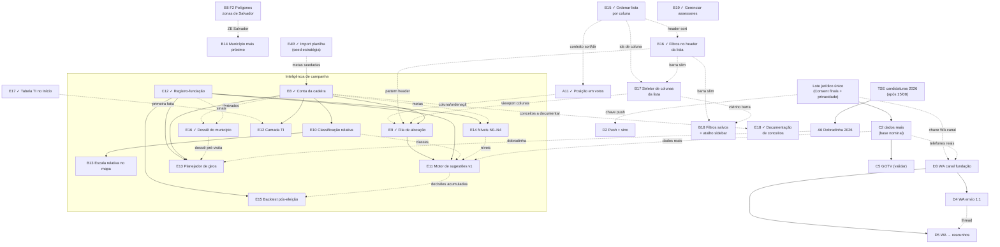

# Roadmap — Teqo

Atualizado em: 2026-07-25 (**Pass 2 ✓** consolidação de engenharia — listas genéricas/B16+ absorvido/B17-B18 triviais/E10 limpo/C8 F4 ✓/D3 consent WhatsApp; **B16+** débitos de escala/DRY pós-simplify do B16 registrados como fill-in; resiliência do build ao global `metadata` ausente no site público; **B16 ✓** filtros no header da lista; **E16 ✓** dossiê do município — aba + print + `budgetNotes` G11; **E9 ✓** fila de alocação — desbloqueia E11, e revisou a fórmula da meta sugerida do E8; **E18 ✓** documentação de conceitos (`/campanha/conceitos`); **B19 ✓** gerenciar assessores; **E8 ✓** conta da cadeira — desbloqueou E9/E10/E12/E13; C12 ✓; C11 absorve escala plano↔demandas; B18; B17; reorder DnD fora de escopo; A11 ✓; B15 ✓; E4R ✓; E17 ✓; B14; janela 1: smoke, R6)
Registro canônico dos **próximos** planos e débitos. Histórico de entregas: resumo abaixo + planos em [`docs/plans/`](plans/) + notebook [`.cursor/rules/projects/nucleos-eleitorais.mdc`](../.cursor/rules/projects/nucleos-eleitorais.mdc).

## Âncoras do calendário eleitoral 2026 (Res. TSE 23.760/2026)

| Data        | Marco                                   | Consequência para o produto                                                                   |
| ----------- | --------------------------------------- | --------------------------------------------------------------------------------------------- |
| 20/07–05/08 | Convenções partidárias                  | Vertical remodelada já em produção; smoke + onboarding do time no modelo novo                 |
| 15/08       | Prazo final de registro de candidaturas | TSE publica candidaturas 2026 → destrava A6 (dobradinha)                                      |
| 16/08       | Início da propaganda eleitoral          | Base nominal com dados reais + inteligência mínima (E8–E9, C12) operando **antes** desta data |
| 09–23/10    | Propaganda gratuita rádio/TV            | Congelar mudanças arriscadas (~20/09)                                                         |
| 04/10       | 1º turno                                | GOTV (C5) — confirmação de comparecimento da base nominal                                     |
| 25/10       | Eventual 2º turno                       | Chapa majoritária; Solla decidido no 1º turno                                                 |

## Princípios e decisões travadas

- Ownership de audiência e portabilidade de dados; módulos reutilizáveis em outros contextos políticos.
- Um único app Next.js: site `(frontend)`, admin `(payload)`, `/campanha` `(campaign)`. Sem Rust separado. Vercel por enquanto.
- Doações só via CTA QueroApoiar (`apoiar.me/jorgesolla`). Pessoa = `Contact` + joins — nunca cadastro paralelo.
- **Município = unidade operacional pré-definida** (remodelagem 2026-07-23, **em produção**): 435 entradas — um por município da Bahia, exceto Salvador (19 Municípios-zona, ZE 1–19); Camaçari é município inteiro (ZE 170/171 agregadas); geografia seedada e read-only. Substitui Praça/Núcleo Eleitoral — plano-mestre [remodelagem-municipios.md](plans/remodelagem-municipios.md).
- Roles: `coordinator` ("Coordenador Geral"), `advisor` ("Assessor"), `leader` ("Liderança") e `candidate` ("Candidato", visão irrestrita); assessor vê só os municípios que administra; liderança em lockdown (só a ferramenta de contatos de apoiadores). Assimetria de votos: staff registra `declaredVotes` e estima em 3 cenários (A10); liderança nunca vê estimativas. Sem disparo em massa (Res. TSE 23.610 art. 33 / Meta). Comunicação **1:1 interna** staff↔lideranças via bridge WhatsApp não oficial = programa **D3–D5** (não é Business API nem blast).
- Padrões de engenharia vigentes (hardening 2026-07-23): access explícito em toda collection, zero lint warnings, ban `as never`, knip no CI, caching ladder — regra `.cursor/rules/engineering-standards.mdc`; débitos no ledger [TECH-DEBT.md](TECH-DEBT.md).

## Onda 0 — caminho crítico para dados reais

Textos provisórios de Consent + `/privacidade` auto-provisionados ([onda-0.md](plans/onda-0.md)); **hold de PII real** até o lote jurídico final. Inalterada pela remodelagem (mesmas chaves `Consent`).

1. **Lote jurídico único** _(externo)_ — textos finais (substituem provisórios) + base LGPD art. 11: `lideranca-autopreenchimento`, `apoiador-cadastro`, `apoiador-intencao-voto`, `campanha-notificacoes-push`, **`campanha-whatsapp-canal`** (D3 — armazenamento/processamento do canal interno staff↔lideranças; se o lote já tiver fechado sem esta chave, entra no próximo passe com a assessoria — não abrir rodada jurídica só por ela), Aviso de Privacidade, avaliação RIPD.
2. **Smoke pós-deploy** _(desbloqueado — deploy da remodelagem aplicado em produção em 2026-07-23)_ — `NEXT_PUBLIC_SITE_URL` HTTPS, login `/campanha`, município de teste; checklist no AGENTS.md.
3. **Ativação com dados reais** assim que (1) liberar — lideranças/apoiadores reais e import em massa.
4. **Onboarding do time** — usuários `coordinator`/`advisor`, primeiros municípios assumidos, treino de campo; ~~**B19** `/campanha/assessores`~~ (**entregue 2026-07-24** — CG/candidato sem `/admin`); **seed da planilha de prioridades via E4R** (engenharia pronta — `pnpm db:seed:projecao`; aplicar em produção após smoke — [plano](plans/import-planilha-projecao.md)); rede/lideranças (nomes) só após o lote jurídico.

**O0+** (escala/DRY pós-Onda 0) não bloqueia jurídico nem smoke fictício — [plano](plans/escala-dry-pos-onda0.md).

## Já entregue (resumo)

- **Era Núcleos (2026-07-15 → 2026-07-20)** — MVP + Ciclo 2 (auth `campaignUser`, território A1/A2, baseline TSE A3/A4, overview B1, share C1, PWA D1, geometrias B2, Leaflet B3), C2 apoiadores (eng.), C3 agenda, C6–C11 escala, E1+E3 metas/estratégia, E2 série TSE 2014/2018/2022, A5 conversão/classificação/alavancagem/mobilização, A7 F1–F2, A8 perfis IBGE, fill-ins (reset senha/perfil, visitados recentes, Field Desk polish). Infra e padrões (locks, transações, consent por chave, shells, mapa, dados eleitorais) reaproveitados pela remodelagem; superfícies e modelo de Núcleo substituídos.
- **Plataforma** — local Postgres + guards, migrations baselined, posts/tags do site público com cache `posts`, Onda 0 textos provisórios + `/privacidade`; toolchain TS6 (tooling) + TS7 (typecheck).
- **Site público (2026-07-21)** — Pixel do Meta nos abaixo-assinados ([plano](plans/pixel-meta-abaixo-assinado.md)).
- **Remodelagem Praças → Municípios (R0–R5 2026-07-21; M1–M5 2026-07-23; em produção 2026-07-23)** — modelo Município (435 entradas; Salvador 19 zonas; Camaçari inteira), role `candidate`, demandas staff-only, lockdown da liderança (ferramenta de contatos, `source: lideranca`), dobradinhas `stateDeputy` + `/campanha/dobradinhas`, mapa no Início; migrações destrutivas da vertical aplicadas em produção via build Vercel. Planos: [remodelagem-pracas.md](plans/remodelagem-pracas.md) → [remodelagem-municipios.md](plans/remodelagem-municipios.md).
- **Mapa e lista (2026-07-21, na era Praças; identificadores renomeados na M1)** — A9 total esperado ([plano](plans/estimativa-votos-praca.md)) + A9+ loader compartilhado ([plano](plans/escala-dry-pos-a9.md)); B6 setStyle incremental ([plano](plans/escala-dry-pos-b3.md)); B7 mapa filtrado ([plano](plans/mapa-pracas-filtrado.md)); B9 edição rápida ([plano](plans/edicao-rapida-lista-pracas.md)); B10 hover/tap ([plano](plans/hover-mapa-pracas.md)); B11 escala % dos válidos ([plano](plans/escala-percentual-mapa-pracas.md)); B12 fit ao footprint filtrado ([plano](plans/aproximar-mapa-pracas.md)); B8 F1 catálogo bairros das zonas ([plano](plans/poligonos-pracas-zona.md) — hoje Salvador-only, entradas de Camaçari removidas na M1); fill-ins filtros-auto ([plano](plans/filtros-auto-pracas.md)) e C8 F4 ([plano](plans/escala-dry-pos-c6.md)).
- **A10 (2026-07-23)** — cenários pessimista/média/otimista em `votePledge.estimatedVotes` e `municipality.expectedVotes`; agregação por cenário (default média); seletor no mapa/overview; liderança segue com um `declaredVotes` ([plano](plans/cenarios-estimativa-votos.md)). Desbloqueou **E8**.
- **Admin Payload (2026-07-23)** — export CSV de assinaturas e contatos ([plano](plans/exportar-csv-assinaturas.md)).
- **Hardening de engenharia (2026-07-23, Fases 0–6)** — access lockdown (PII/CMS admin-only + gates de rota do leader), tooling gate (knip no CI, `--max-warnings=0`, ban `as never`), artefato TSE commitado + cache (`bahiaElectionAggregates`, `election-tse`, `loadMunicipalityScope`), pending honesto + Suspense streaming, state scoping, splits (`src/utilities/access/*`, `supporterImport.ts`, shells DRY). Tracker: [IMPROVE-CODE-QUALITY-PLAN.md](IMPROVE-CODE-QUALITY-PLAN.md) · ledger: [TECH-DEBT.md](TECH-DEBT.md) · mapa de testes: [TESTING.md](TESTING.md).
- **Consolidação de engenharia Pass 2 (2026-07-25, W0–W5 + D3)** — sistema de listas da campanha (colunas como dado em `CampaignTable`, URL state compartilhado, 8 superfícies migradas, B16+ absorvido; **B17/B18 ficaram triviais** — só falta a UI de toggle/salvar), split do `municipalityUi`, fronteiras lib/utilities zeradas + `server-only` em 21 loaders + `components/campaign` em 15 domínios (decisão: sem `src/domains/`), `electionInsights` deletado (**E10 nasce limpo**), knip `exports` em ERROR no CI (0 mortos), tabs de detalhe extraídas, `runCampaignFormAction` fecha C8 F4, copy Praça→Município varrida, consent do WhatsApp por chave estável (D3). Tracker: [IMPROVE-CODE-QUALITY-PLAN.md](IMPROVE-CODE-QUALITY-PLAN.md) § Pass 2 · arquitetura: [ARCHITECTURE.md](ARCHITECTURE.md).
- **E4R (2026-07-24)** — import único da planilha de projeção → `municipality.expectedVotes` (Bom→otimista, Regular→média, Mínimo→pessimista) + `priority` (`pnpm db:seed:projecao`, always-overwrite, dry-run + runbook; Salvador pulado; zero PII). No mesmo dia o grupo duplicado `voteGoals` ("Meta Bom/Regular/Mínimo") foi **removido do app** (migration `20260724_133600` com backfill metas→estimativas) — a única série por cenário é `expectedVotes`. Plano: [import-planilha-projecao.md](plans/import-planilha-projecao.md). Seed local verificado (189 estimativas / 50 alta); produção após smoke.
- **E17 (2026-07-24)** — tabela comparativa dos 27 Territórios de Identidade no Início staff (`/campanha`): `territoryOverview.ts` (rollup puro client-safe: `computeTerritoryRollup` + `sortTerritoryRows`) + `loadTerritoryOverview.ts` (loader server-only, `overrideAccess: true`) + `TerritoryOverviewTable.tsx` (tabela densa, ordenação client-side default `% da própria votação desc`, Metropolitano decomposto em Salvador 19 zonas × Demais RMS, linha→`/campanha/municipios?region=<TI>`). Somas/razões apenas (salvaguarda MAUP); sem migration/collection. Primeira fatia de E12. Plano: [tabela-ti-inicio.md](plans/tabela-ti-inicio.md).
- **C12 (2026-07-24)** — registro-fundação: versions nativas em `votePledge` com baseline; sinais tipados em `municipalityUpdate`; origem do `actionPlan`; demandas vinculadas com custo derivado e criação múltipla atômica; `allocationDecision` ex-ante imutável. Migration `20260724_180000_add_campaign_foundation_records`; testes int + E2E. Plano: [registro-fundacao.md](plans/registro-fundacao.md).
- **E8 (2026-07-24)** — conta da cadeira: artefato TSE commitado estendido para v2 (`campoFederalVotesByYear`, `federalTallyByYear`, `majoritarian2022` presidente/governador T1, via `pnpm build:election-aggregates`); curadoria `src/lib/campoParties.ts` (ano→siglas do campo, validada contra `electionPartySpectrum`); global `campaignGoals` (meta estadual 150 mil + margem, access staff-read/coordinator-write, migration `20260724_180000_add_campaign_goals_global`); `municipalityPotential.ts` (válidos projetados, teto do campo, captura, share intracampo, roll-off 2022-only, meta sugerida + sanity por TI) e `goalCoverage.ts` (`meta = expectedVotes[cenário] ?? suggestedGoal`; `comprometido = Σ pledges`, nunca a expectativa da mesa); encaixado no dashboard, na visão geral e na lista de municípios (nova coluna "Cobertura da meta"), e num novo card "Conta da cadeira" no detalhe. Plano: [conta-da-cadeira.md](plans/conta-da-cadeira.md). Desbloqueia **E9**, **E10**, **E12**, **E13** (e melhora **B13**/**E16**). _(A fórmula da meta sugerida foi revista no mesmo dia, durante o E9 — ver abaixo.)_
- **B19 (2026-07-24)** — gerenciar assessores em `/campanha/assessores` (lista + novo + detalhe): criar/editar contas `advisor`, carteira de municípios (auto-save por delta), reenviar link de senha; só CG/candidato (`isCampaignUnrestricted`); access de update/phone e atribuição `municipality.advisors` alinhados ao `candidate`; leitura privilegiada de e-mail no loader (`reloadUnrestrictedActor`); sem migration. Plano: [gerenciar-assessores.md](plans/gerenciar-assessores.md).
- **E9 (2026-07-24)** — fila de alocação na própria lista de municípios (sem rota nova, sem coluna nova, sem migration). Corrigiu antes a meta sintética do E8, que repartia os 150 mil proporcionalmente **só ao teto do campo** e por isso dava meta 2.911 a Vitória da Conquista (5.005 votos em 2022) e 813 a Campo Formoso (47) — ordenar por déficit sobre ela colocaria desertos no topo. `deriveSuggestedGoalsByScenario` (substitui `decomposeStateGoal`) ancora a meta na votação própria de 2022 por cenário: pessimista = base×(1−`margin`), central = base, otimista = base×(`stateGoal` ÷ Σ base), com clamp; `goalCoverage` passou a receber `SuggestedGoalByScenario`. Na fila: `lastPledgeAt` no agregado de pledges, `lastSignalAt` = máx(`lastUpdateAt`, pledge) no view model, sort keys `deficit` (**novo default do staff**) e `frescor` (cenário `central` fixo), frescor dobrado na coluna "Última atualização" (frio ≥ 21 dias), badge "sem responsável" em prioridade alta sem assessor, "coluna da vergonha" no detalhe da métrica de assessoria (`?priority=alta&coverage=sem_assessor`) e copy Praças→Municípios. Cortes: votos em jogo → **B13**, LQ/captura → **E10**, coluna dedicada de déficit → desnecessária. Plano: [fila-de-alocacao.md](plans/fila-de-alocacao.md). Desbloqueia **E11**.
- **E16 (2026-07-25)** — dossiê do município (pré-agenda, pedido O6): aba `?tab=dossie` staff-only no detalhe compondo os loaders existentes (`municipalityDossierData.ts` + `MunicipalityDossier.tsx`) — capa com data de geração, série TSE/rank (A11), conta da cadeira (E8), rede de lideranças com frescor, conjuntura/dobradinhas/encaminhamentos, agenda (`actionPlan`), sinais recentes (C12), perfil IBGE (A8 — reentrada do artefato, caveat para zonas); caps 8/5/3+2 com "ver tudo"; campo staff-only `municipality.budgetNotes` ("Emendas aportadas", G11 manual-first, migration `20260725_022155`); **visão print** via CSS (chrome oculto, shells destravados, tipografia A4 — 1–2 páginas). Plano: [dossie-municipio.md](plans/dossie-municipio.md).
- **B16 (2026-07-25)** — filtros no header da lista de municípios: `MunicipalityHeaderFilter` (funil + Popover ao lado do sort do B15) com multi-seleção OR em município, território, assessores e tendência, busca acento-insensível e "Limpar"; mobile mantém os selects empilhados; header sticky com a página como scroller e empty state que troca só as linhas, preservando visão geral e filtros; coluna "Assessoria" removida (ordenação foi para "Assessores", com/sem assessor virou opção do popover e o alerta "sem responsável" do E9 passou a morar na célula de assessores). Plano: [filtros-no-header-lista-municipios.md](plans/filtros-no-header-lista-municipios.md).

## Próximos — Campanha (`/campanha`)

### Programa Inteligência de campanha (E8–E16, B13, C12 · adjacentes A11/E17/E18)

O discovery literatura→persona→entrevista ([relatório aprovado](research/relatorio-entrevista-persona-campanha.md); compêndio com ~67 fontes em [docs/research/](research/)) fixou o kernel: a disputa de DF é conta de quociente fragmentada; o gargalo é converter lealdade de campo em voto nominal município a município via rede; % estadual absoluto é anti-métrica. A **sessão real com o Coordenador Geral (2026-07-23 — [CUSTOMER.md](CUSTOMER.md))** confirmou as apostas centrais (fogo amigo intra-PT como ameaça nº 1; canal = ZAP sem registro datado; "coluna da vergonha" validada — Salvador cobrado 10×) e calibrou as âncoras: a leitura relativa da mesa é **% da própria votação** (concentração da captura própria — critério rígido de prioridade dele), não % do eleitorado local; a restrição dominante é **"perna"/estrutura**, não dinheiro; piso projetado **150 mil** (2022: 129k). O produto deve entregar **inteligência, não planilha chique**: metas derivadas, leitura relativa, fila de decisão priorizada, sugestões dado→decisão com humano no loop, registro ex-ante auditável. Plano-mestre: [inteligencia-campanha.md](plans/inteligencia-campanha.md) (incl. gaps de dados G1–G11 e desenho canônico da fila).

| ID  | Fatia                              | Plano                                                   | Entrega essencial                                                                                                      | Classe | Appetite | Janela    | Depende de           |
| --- | ---------------------------------- | ------------------------------------------------------- | ---------------------------------------------------------------------------------------------------------------------- | ------ | -------- | --------- | -------------------- |
| E10 | Classificação territorial relativa | [detalhes](plans/classificacao-territorial-relativa.md) | Âncoras relativas (LQ / share da cadeira marginal), multi-eixo; substitui 35/20/10 para DF                             | B      | ~1d      | 3         | E8 ✓                 |
| B13 | Escala relativa no mapa            | [detalhes](plans/escala-relativa-mapa.md)               | Quantis do candidato (default) + LQ + rank; símbolo proporcional por votos em jogo; % válidos mantido                  | B      | ~2d      | 3         | E8 ✓, E10            |
| E14 | Níveis de envolvimento N0–N4       | [detalhes](plans/niveis-de-envolvimento.md)             | `engagementLevel` com histerese e sinais de reversão; staff-only (vocabulário duplo)                                   | B      | ~1d      | 3         | C12                  |
| E11 | Motor de sugestões v1              | [detalhes](plans/motor-de-sugestoes.md)                 | 8 padrões (P1/P2/P3/P5/P6/P7/K-A/K-B), menu com estatuto, aceitar/descartar → `allocationDecision`, triagem 1–5        | C      | ~3d      | 3         | E8 ✓, E9 ✓, E10, C12 |
| E12 | Camada TI                          | [detalhes](plans/camada-territorios-identidade.md)      | Rollups com salvaguardas MAUP, benchmark intra-TI (gatilhos T no motor = fase 2 de E11)                                | B      | ~1,5d    | 3         | E8 ✓                 |
| E13 | Planejador de presença/giros       | [detalhes](plans/planejador-de-giros.md)                | Elegibilidade (5 condições ✓/—), fases construção/consolidação/ativação, compositor de giro, visita pedida×justificada | C      | ~1,5d    | 3         | E8 ✓, C12            |
| E15 | Backtest pós-eleição               | [detalhes](plans/backtest-pos-eleicao.md)               | Pledge (trajetória) vs. resultado por zona; calibração de limiares                                                     | A      | ~1d      | pós-04/10 | C12, TSE 2026        |

### Demais itens abertos

- ~~**E4R** import único da planilha de projeção~~ — **entregue 2026-07-24** (`pnpm db:seed:projecao`; overwrite-always; [plano](plans/import-planilha-projecao.md))
- ~~**A11** posição em votos do município (rank absoluto + % da própria votação) + ordenação da lista por votação~~ — **entregue 2026-07-24** (helper `municipalityVoteRank`; baseline + coluna lista; default `?sort=votos` desc; header=`2022`; consome contrato B15) · [plano](plans/ranking-votos-municipio.md)
- ~~**E17** tabela comparativa dos Territórios de Identidade no Início (pedido do candidato) · somas/razões apenas, Metropolitano decomposto (salvaguardas MAUP) · ~1d · Janela 1–2 · primeira fatia de E12 · [plano](plans/tabela-ti-inicio.md)~~ — **entregue 2026-07-24** (`territoryOverview.ts` + `loadTerritoryOverview.ts` + `TerritoryOverviewTable.tsx`; rollup puro client-safe, loader `overrideAccess: true`, Metropolitano decomposto, ordenação client-side; sem migration)
- ~~**C12** registro-fundação~~ — **entregue em código 2026-07-24** (versions, sinais, origem/custo derivado, decisões ex-ante; migration + testes) · [plano](plans/registro-fundacao.md)
- **A6** dobradinha 2026 automática quando o TSE publicar candidaturas · gatilho externo: pós-15/08 · camada de insight sobre o registro operacional `stateDeputy` (M4) · alimenta **E13** · [plano](plans/insight-dobradinha-2026.md)
- **B5 F2–F3** cache CLI compartilhado + factory mun/TI (scripts continuam) · [plano](plans/escala-dry-pos-b2.md)
- **B8 F2** polígonos dos Municípios-zona de Salvador (ZE 1–19; Camaçari saiu do escopo na M1 — município inteiro): F1 catálogo zona→bairros entregue (hoje Salvador-only); falta prep do catálogo (~½ dia) + dissolve IBGE/malha → TopoJSON no mapa · Janela 3 · cortável · [plano](plans/poligonos-pracas-zona.md)
- **C5** operação dia D / GOTV _(validar com produto)_ · design [`Dia-D-GOTV`](design-refs/latest/Dia-D-GOTV.png) · depende de C2 dados reais
- **D2** push + sino in-app · soft: chave `campanha-notificacoes-push` (Onda 0) · [plano](plans/notifications.md)
- **Programa WhatsApp interno (D3–D5)** · baixa/média prioridade · 1:1 staff↔lideranças via bridge **não oficial** · **número pessoal** de cada assessor/CG (QR no app, parece chat pessoal) · não Business API / não massa / não chip institucional · fecha Little Hire · gatilho honesto (2026-07-24): "ZAP é o campo" é fato confirmado — D3 entra se os deltas do ZAP **não** estiverem sendo absorvidos pelo fluxo sede-digita (C12) após uso real · plano-mestre [whatsapp-interno-campanha.md](plans/whatsapp-interno-campanha.md)
  - **D3** fundação multi-sessão (QR por `campaignUser` + log + Consent `campanha-whatsapp-canal`) · [plano](plans/whatsapp-canal-fundacao.md)
  - **D4** envio 1:1 pela sessão do ator · depende de D3 · [plano](plans/whatsapp-envio-liderancas.md)
  - **D5** inbox da própria sessão → rascunhos (`municipalityUpdate`/demanda) com humano no loop · depende de D3 · [plano](plans/whatsapp-sugestao-atualizacoes.md)
- **R6** critique/polish visual da vertical remodelada (ciclo /impeccable completo por superfície; smoke visual coordenador feito em 2026-07-21) · absorve os débitos de produto/UX remanescentes de FD2 ([field-desk-ux-pos-critique.md](plans/field-desk-ux-pos-critique.md)): glossário inline (O3 — hipótese ainda sem evidência), triagem em lote, empty states de coordenador · gatilho: antes de 16/08
- **B14** município mais próximo (geolocalização → atalho no Início staff) · pede permissão **1× por sessão** se ainda não concedida; matching client-side sobre centroides IBGE; Salvador multi-zona → lista filtrada até B8 F2 · ~1d · Janela 1–2 · sem deps duras · cortável · [plano](plans/municipio-mais-proximo.md)
- ~~**B15** ordenar lista de municípios pelo header da coluna~~ — **entregue 2026-07-24** (`?sort=`/`?dir=` na URL + clique no header (desktop) / select compacto (mobile); ordenação global no filtrado; **A11** consome o contrato (key `votos`)) · [plano](plans/ordenacao-colunas-lista-municipios.md)
- ~~**B16** filtros no header das colunas da lista de municípios~~ — **entregue 2026-07-24** (funil+Popover no `TableHead` ao lado do sort B15; barra slim busca+resumo+Limpar; mobile selects empilhados; optimistic + busca no Popover de TI) · [plano](plans/filtros-no-header-lista-municipios.md)
- **B17** seletor de colunas (mostrar/ocultar) na lista de municípios — Popover “Colunas” + `localStorage`; desktop only; `name` obrigatória; **Pass 2 W1 deixou trivial:** colunas já são dado (`CampaignTableColumn.id`/`mandatory`/`defaultVisible`); soft: B15 ✓ (ids) / B16 ✓ (barra slim); prepara viewport para **E9** · ~0,5–1d · Janela 1–2 · cortável · [plano](plans/seletor-colunas-lista-municipios.md)
- **B18** filtros salvos na lista de municípios — nomear o estado URL atual (`localStorage`); **Pass 2 W1 deixou trivial:** serialização canônica pronta e congelada em `municipalityListUrl.ts`; acesso rápido de 2º nível sob Municípios no sidebar (hover desktop / expand mobile; sticky só no filtro salvo ativo) · ~1–1,5d · Janela 1–2 · soft: B16/B17 (barra) · cortável · [plano](plans/filtros-salvos-municipios.md)
- ~~**B19** gerenciar assessores — `/campanha/assessores` (lista + novo + detalhe): criar/editar contas `advisor`, ver/atribuir municípios, reenviar link de senha; **só Coordenador Geral e Candidato** (`isCampaignUnrestricted`); alinha access de update/phone do `candidate`~~ — **entregue 2026-07-24** (também alinha atribuição `municipality.advisors` a unrestricted; e-mail na lista via leitura privilegiada; auto-save da carteira) · [plano](plans/gerenciar-assessores.md)
- ~~**E18** documentação de conceitos de inteligência de campanha~~ — **entregue 2026-07-24** (`/campanha/conceitos` staff-only; 7 conceitos de E8 em `src/lib/campaignIntelligenceConcepts.ts` agrupados em base/diagnóstico/meta; "Saiba mais" por métrica nos tooltips + link de teclado no Popover do card; `formatElectionNumber` passou a arredondar votos) · cada fatia futura (E9/E10/B13/E11/E12/E13/E14) acrescenta sua seção ao array como parte da própria entrega · [plano](plans/documentacao-conceitos-campanha.md)

### Fill-ins abertos

- **Ícone de prioridade na lista** em `/campanha/municipios` — trocar Badge “Prioritária” por ícone Flag + tooltip “Município prioritário” (hover) na coluna do nome · ~0,25d · Impeccable B · [plano](plans/icone-prioridade-lista-municipios.md)
- **Cenário junto aos filtros** em `/campanha/municipios` — mover `VoteEstimateScenarioField` para a fileira/barra slim de `MunicipalityFilters` (com **B16**, a barra deixa de carregar os selects de coluna); overview só consome o contexto · ~0,25–0,5d · Impeccable B · soft: B16 · [plano](plans/cenario-junto-filtros-municipios.md)
- ~~**B16+** escala/DRY pós-B16~~ — **absorvido pelo Pass 2 W1-D1 (2026-07-25)**: `useOptimistic`, facet por slugs, hrefs via serializador canônico, facets no mesmo `Promise.all` · [plano](plans/escala-dry-pos-b16.md)
- **O0+** escala/DRY pós-Onda 0 · [plano](plans/escala-dry-pos-onda0.md)
- **RS+** auth read leve + shells de senha · [plano](plans/escala-dry-pos-reset-senha-perfil.md)
- **C10 / C11** escala apoiadores/planos · C11 absorveu a extensão pós-C12 para picker de planos e paginação das demandas vinculadas (Fase 6 condicional; ≥100 planos ou ≥50 demandas/plano) · gatilhos: base nominal crescendo ([plano](plans/escala-dry-pos-c9.md)) / volume de planos medido ([plano](plans/escala-dry-pos-c7.md))
- **C8 F1–F2 restantes** perf de import/lista (F4 DRY de forms fechou de vez no Pass 2 W4d; F3 parsers fechou no Pass 2 W1-D2) · gatilho: import em volume real pós-Onda 0 · [plano](plans/escala-dry-pos-c6.md)
- Higiene PascalCase de componentes legados

### A validar (assumptions)

- **C5** GOTV — validar com produto antes de planejar (hoje só design-ref; depende de C2 dados reais).
- **O8** "ilhas isoladas" — fluxo de informação entre política/comunicação/território (pedido de ajuda direto na sessão 2026-07-23; adjacente ao produto) · discovery antes de qualquer build; candidato natural se virar build: D2 sino/resumo semanal.
- **O3** jargão — resgatar o Bloco B (uso observado) das notas dos entrevistadores e/ou 2ª sessão observada antes de investir em glossário além do R6 ([IMPROVE-APP-PLAN.md](IMPROVE-APP-PLAN.md)).

### Grafo de dependências (abertos + predecessores mínimos)

Paralelizáveis agora: **E10**/**E12** (E8 ✓ desbloqueou ambos), **E11** (E9 ✓ entregue; ainda espera E10), **B14** (atalho geo no Início; soft B8 F2 só para ZE Salvador), **B17** (seletor de colunas; soft B15 ✓/B16 ✓ — pousa no header de coluna atual), **B18** (filtros salvos + submenu Municípios; soft B16 ✓/B17 — botão na barra), fill-ins (ícone de prioridade na lista, Cenário junto aos filtros — encaixa na barra slim de B16 ✓ —, O0+, RS+). **D3** só após smoke + folga e só se o fluxo sede-digita (C12 ✓) não absorver os deltas do ZAP (não compete com E9).

### Sequência por janela (só pendentes)

**Janela 1 — agora → 05/08 (convenções):** smoke pós-deploy em produção + onboarding do time (Onda 0 §2/§4); **E4R ✓** em código (aplicar `pnpm db:seed:projecao` em produção após smoke); **E8 ✓** conta da cadeira entregue; **E17 ✓** tabela TI no Início; **B15 ✓** (sort por coluna) e **A11 ✓** (posição em votos + `sort=votos`; o default do staff passou a `deficit` no E9 ✓) entregues 2026-07-24; **E18 ✓** documentação de conceitos (`/campanha/conceitos`, v1 só E8) entregue 2026-07-24; **B19 ✓** gerenciar assessores (caminho do onboarding sem `/admin` — criar/ativar contas e carteiras) entregue 2026-07-24; **B16 ✓** filtros no header entregue 2026-07-25; **B17** (seletor de colunas) / **B18** (filtros salvos + atalho sidebar) se folga de UX da lista no onboarding; gate de adoção: sinal Little Hire — ≥1 update espontâneo até 30/07, cobrança da tabela dispensada (planilhas já em `docs/sheets/`) — acompanhamento em [IMPROVE-APP-PLAN.md](IMPROVE-APP-PLAN.md); **R6** critique/polish; **E9 ✓** entregue no mesmo dia; **B14** (atalho geo) se sobrar folga de campo no onboarding; Onda 0 jurídica em paralelo (externa).

**Janela 2 — 05/08 → 16/08 (pré-propaganda):** C2 dados reais assim que o jurídico liberar; ~~**E9** fila de alocação~~ (entregue 2026-07-24, antecipada da janela 2); ~~**E16** dossiê do município~~ (entregue 2026-07-25, antecipado da janela 2); D2 se sobrar folga.

**Janela 3 — 16/08 → set:** A6 dobradinha (pós-TSE 15/08); **E10** classificação relativa → **B13** escala relativa no mapa; **E14** níveis N0–N4; **E11** motor de sugestões v1; **E12** camada TI; **E13** planejador de giros; **B8 F2** polígonos das zonas de Salvador; débitos sobreviventes. Se houver folga **e** os deltas do ZAP não estiverem sendo absorvidos pelo fluxo sede-digita (C12): começar **D3**.

**Janela 4 — set → 04/10:** C5 GOTV _(validar)_, congelamento ~20/09 (só bugfix/dados). **D4** envio 1:1 e **D5** inbox→rascunhos só se D3 estiver estável **antes** do congelamento (senão adiar pós-04/10). **E15** backtest pós-eleição (após 04/10).

### Cortes seguros / não cortáveis

**Não cortáveis:** Onda 0 (jurídico/Consent); ~~**E4R** seed da planilha~~ (entregue 2026-07-24 — ainda aplicar em produção após smoke); ~~**E8** conta da cadeira~~ (entregue 2026-07-24); ~~**C12** registro-fundação~~ (entregue 2026-07-24); C2 dados reais; assimetria declarado×estimado (relação de campo); ~~**E9** fila de alocação~~ (entregue 2026-07-24 — era o mínimo de "inteligência, não planilha"); ~~**B19** gerenciar assessores~~ (entregue 2026-07-24 — CG/candidato não entram em `/admin`).

**Cortes seguros** (se o prazo apertar, nesta ordem): **D5** inbox→rascunhos (manter registro manual + `wa.me`); **D4** envio bridge (manter `wa.me`); **D3** fundação do canal (atalho `wa.me` continua); **E12** camada TI (rollup manual por lista; **E17** já dá a leitura regional básica no Início); **E13** planejador de giros (rebaixado na fila de corte em 2026-07-24: "perna"/agenda é a restrição dominante nomeada em campo — cortar só depois de E12; agenda segue manual com J-A/J-B como guia); **E15** backtest (pós-eleição por definição — cortar = perder o aprendizado 2030); **E11** motor v1 (manter a fila E9 ✓ sem sugestões); **B13** símbolo proporcional (manter quantis/LQ como escala); **E14** níveis (manter `priority` alta/normal); **B8 F2** polígonos (mapa continua agregado no município; manter F1 bairros); **D2** push (adiar); **A6**; **B14** município mais próximo (lista/busca e Recentes continuam); **B18** filtros salvos (lista + filtros manuais continuam; Visitados cobrem “voltar”); **B17** seletor de colunas (tabela completa continua; scroll horizontal); ~~**B16** filtros no header~~ (entregue 2026-07-25); ~~**B15** sort por coluna~~ (entregue 2026-07-24); ~~**A11**/**E17**~~ (entregues 2026-07-24); ~~**E18** documentação de conceitos~~ (entregue 2026-07-24); ~~**E16** dossiê~~ (entregue 2026-07-25); débitos/fill-ins.

## Bloqueadores atuais

| Item                                                                                                                            | Status                               | Fonte                          |
| ------------------------------------------------------------------------------------------------------------------------------- | ------------------------------------ | ------------------------------ |
| Lote jurídico final LGPD (Consent + privacidade + RIPD) — PII real em hold                                                      | **caminho crítico para dados reais** | notebook; onda-0; AGENTS       |
| Smoke pós-deploy + onboarding do time (deploy da remodelagem aplicado em produção 2026-07-23)                                   | pendente (operacional)               | Onda 0 §2/§4; checklist AGENTS |
| Campo `roles` em `users` antes de abrir `/admin` a equipe maior (access explícito por collection já shipped — hardening Fase 0) | pendente (migration)                 | AGENTS Known Gap #1; TECH-DEBT |
| Consent público ainda por ID numérico (`submitWhatsapp.ts` etc.)                                                                | pendente                             | AGENTS Known Gap #2            |
| Collection `Pages` + hero/copy da home editáveis                                                                                | pendente (não bloqueia `/campanha`)  | AGENTS Known Gap #3            |

## Site público

**Já entregue:** `post`/`tag`, listagens/artigos, seed, cache `posts`; `/privacidade` (texto provisório Onda 0); Pixel do Meta nos abaixo-assinados ([plano](plans/pixel-meta-abaixo-assinado.md)); export CSV no admin.

**Próximos:**

- Textos finais de privacidade + polish O0+ (revalidate globals, DRY Lexical) — mencionar cookies/Meta com Pixel em uso
- **Build resiliente ao global `metadata` ausente** — `/abaixo-assinado/[id]` faz `stripTrailingSlash(globalMetadata.URL)` no `generateMetadata` e no componente; com o global vazio (banco novo, ou entrada de `unstable_cache` gravada vazia) o `next build` inteiro morre no prerender em vez de degradar. Dar fallback (`NEXT_PUBLIC_SITE_URL`) e omitir canonical/OG quando não houver URL · ~0,25d · _(fonte: simplify B16 2026-07-25 — build local quebrou com `.next/cache` envenenado; `rm -rf .next` contorna)_
- `Pages` institucionais (bio, mandato, propostas) + hero/copy editáveis
- Agenda/multimídia via links oficiais; CTA Doar → QueroApoiar
- Migrar Consent dos fluxos públicos para chave estável

## Admin Payload

- Campo `roles` em `users` (migration) antes de ampliar `/admin` — o access explícito por collection foi shipped em 2026-07-23 (hardening Fase 0: `users`/`signature`/`subscription`/`consent` admin-only; escrita de CMS admin-only)
- Seed reproduzível de `Consent` por chave (não por ID)

## Débitos de engenharia (hardening 2026-07-23)

- Ledger vivo em [`TECH-DEBT.md`](TECH-DEBT.md) (tracker: [`IMPROVE-CODE-QUALITY-PLAN.md`](IMPROVE-CODE-QUALITY-PLAN.md)); itens maiores: migration `users.roles`, dirigir `knip` unused-exports de warn→error após os splits, redesenho do lease da janela de consent ausente nos testes, e2e fino, CI só no mirror GitHub

## Plataforma white-label

- Fase 2 do README (multi-tenant / marca por mandato) — **depois da eleição**

## Fora de escopo (por enquanto)

- Serviço Rust separado; self-host/Coolify enquanto Vercel atender; doações in-app
- Geocodificação de seções eleitorais / unidade = seção (polígonos **aproximados** dos 19 Municípios-zona de Salvador = **B8 F2**, sem seções)
- PWA do site/`/admin`; PostGIS sem query espacial real
- WhatsApp Business API / disparo em massa / blast a apoiadores ou eleitores (Res. TSE 23.610 art. 33; Meta veda WABA político). **Exceto** o programa **D3–D5**: bridge não oficial **1:1 interno** staff↔lideranças já no CRM (ver [whatsapp-interno-campanha.md](plans/whatsapp-interno-campanha.md)) — risco ToS/operacional explícito nos planos; não é substituto de WABA
- Previsão estatística de votos neste ciclo
- Import **automático/recorrente** de planilhas de projeção como feature de produto (atualização contínua segue via UI). O seed **único** E4R foi aprovado em 2026-07-24 (evidência O5 — a planilha é a fonte de verdade da mesa) — [plano](plans/import-planilha-projecao.md)
- **Reordenar colunas** da tabela de `/campanha/municipios` por drag-and-drop — avaliado 2026-07-24: tecnicamente possível (~1–1,5d), mas **não agora**. Distinto de **B17** (mostrar/ocultar colunas — aberto). B15 já reordena **linhas** (sort no header); B16 densifica o mesmo header com filtros; PRODUCT anti spreadsheet/data-grid; preferência de _ordem_ visual ≠ decisão de alocação; sem evidência de campo. Gatilho: ≥2 atores pedirem em sessão/R6 **ou** B16+B17+E9 estáveis com atrito medido de ordem — [plano](plans/reordenar-colunas-lista-municipios.md) _(fonte: avaliação roadmap-item 2026-07-24; rabbit hole B15 / Não escopo B16/B17)_

## Fontes

- [`AGENTS.md`](../AGENTS.md) — decisões travadas, Known Gaps, checklist
- [`.cursor/rules/projects/nucleos-eleitorais.mdc`](../.cursor/rules/projects/nucleos-eleitorais.mdc) — status operacional (era Núcleos → Praças → Municípios)
- [`README.md`](../README.md) — missão
- [`docs/plans/*.md`](plans/) — planos por item ([remodelagem-municipios.md](plans/remodelagem-municipios.md) e [inteligencia-campanha.md](plans/inteligencia-campanha.md) são os planos-mestre vigentes)
- [`docs/research/`](research/) — embasamento de produto/domínio (compêndio de literatura + relatório de discovery aprovado 2026-07-21)
- [`docs/CUSTOMER.md`](CUSTOMER.md) — job, OST e evidência de campo (sessão real do CG em 2026-07-23; O1–O8) · [`docs/IMPROVE-APP-PLAN.md`](IMPROVE-APP-PLAN.md) — journey de discovery/UX (fases, próximas ações)
- Res. TSE 23.760/2026 · Res. TSE 23.610/2019 art. 33 · Politipédia AVM
