# Roadmap — Teqo

Atualizado em: 2026-07-19 (MVP + Ciclo 2 deployados; A2 entregue; A4 Baseline no produto + Gap vs 2022 implementado e mesclado em `main` (Fases 2–4 + simplify); A7 registrado — escala/DRY pós-A4 do `/simplify`; C2 engenharia pronta e mesclada em `main`; C3 Planos de Ação implementado e mesclado em `main`; C6 Escala e DRY pós-C2 implementado e mesclado em `main` (Fases 1–5 + simplify); C7 Escala e DRY pós-C3 implementado (Fases 1–5; feed O(n) condicional fora de escopo); C8 Escala e DRY pós-C6 implementado e mesclado em `main` (Fases 1–4 + duas passagens `/simplify`); C9 Escala e DRY pós-C8 implementado e mesclado em `main` (Fases 1–4 + simplify); C10 registrado — escala/DRY pós-C9 do `/simplify`; **C11 registrado** — escala/DRY pós-C7 do `/simplify` — [plano](plans/escala-dry-pos-c7.md); B2 fundação de geometrias do mapa entregue; B5 registrado — escala/DRY pós-B2 do `/simplify`; **Trilha E registrada — E1–E5 mapa de projeção por município**, equiparar/superar as planilhas "Mapa de projeção de votos 2026" — [plano](plans/mapa-projecao-municipios.md); **E6 registrado** — escala/DRY pós-E1+E3 do `/simplify` (aggregate lista/overview, geografia baseline, DRY formatação) — [plano](plans/escala-dry-pos-e1.md); **Onda 0 MVP** — Consent/privacidade provisórios auto-provisionados (migrations) + `/privacidade`; hold de PII real até jurídico — [plano](plans/onda-0.md); **O0+ registrado** — escala/DRY pós-Onda 0 do `/simplify` — [plano](plans/escala-dry-pos-onda0.md); **Visitados recentemente MVP** implementado (fill-in, client-side `localStorage`) — [plano](plans/visitados-recentemente.md); **VR+ registrado** — escala/DRY pós-visitados recentemente do `/simplify` — [plano](plans/escala-dry-pos-visitados-recentemente.md); **A5 alavancagem da chapa expandido** — Fase 2 “oportunidade de virada” (majoritários esquerda + federal direita por vencedor **ou** por participação proporcional alta) absorvida em [insight-alavancagem-chapa.md](plans/insight-alavancagem-chapa.md), sem item paralelo; **A8 registrado** — perfil médio do eleitorado via IBGE (Censo) + manuais na aba Eleitorado — [plano](plans/perfil-eleitorado-ibge.md))

Registro canônico no repositório dos planos futuros e débitos conhecidos. Status operacional do ciclo atual de Núcleos fica em [`.cursor/rules/projects/nucleos-eleitorais.mdc`](../.cursor/rules/projects/nucleos-eleitorais.mdc); este arquivo lista o que ainda é futuro ou bloqueador, **em ordem de execução**, com dependências e paralelismo explícitos.

## Âncoras do calendário eleitoral 2026 (Res. TSE 23.760/2026)

| Data        | Marco                                           | Consequência para o produto                                                                                                                                                  |
| ----------- | ----------------------------------------------- | ---------------------------------------------------------------------------------------------------------------------------------------------------------------------------- |
| 20/07–05/08 | Convenções partidárias                          | Estrutura de núcleos/coordenadores deve estar operando **agora**                                                                                                             |
| 15/08       | Prazo final de registro de candidaturas         | TSE publica candidaturas 2026 na sequência → destrava o insight de dobradinha                                                                                                |
| 16/08       | Início da propaganda eleitoral (rua e internet) | "Quem chega em 16/08 com base de dados estruturada tem vantagem operacional" (Politipédia) — base nominal, baseline e agenda precisam estar em produção **antes** desta data |
| 09–23/10    | Propaganda gratuita rádio/TV                    | Reta final; congelar mudanças arriscadas no app                                                                                                                              |
| 04/10       | 1º turno                                        | Operação do dia D (GOTV) — confirmação de comparecimento da base nominal                                                                                                     |
| 25/10       | Eventual 2º turno                               | Chapa majoritária (Lula/Jerônimo); Solla decidido no 1º turno                                                                                                                |

## Princípios e decisões travadas

- Priorizar ownership de audiência e portabilidade de dados. _(README)_
- Manter módulos genéricos o bastante para reuso em outros contextos políticos. _(README)_
- Default seguro e com controle de acesso para equipes de campanha e institucionais. _(README)_
- Um único app Next.js com três áreas: site público `(frontend)`, admin Payload `(payload)`, ferramenta interna `(campaign)` em `/campanha`. Sem serviço Rust separado. _(AGENTS.md)_
- Hospedagem na Vercel por enquanto; sem migração self-host/Coolify em andamento. _(AGENTS.md)_
- Doações **não** entram neste app — só CTA/link para QueroApoiar (`apoiar.me/jorgesolla`, homologado TSE). _(AGENTS.md)_
- Pessoa = `Contact` + collections de junção; nunca criar cadastro paralelo de "apoiador/pessoa". _(AGENTS.md)_
- Núcleo Eleitoral é unidade operacional da campanha; Zona TSE é referência oficial distinta. _(notebook Núcleos)_
- Sem disparo em massa por WhatsApp: vedado pela Res. TSE 23.610 (art. 33) e pela política da Meta; mobilização é orgânica (kits de compartilhamento individuais). _(plano cadastro-nominal, pesquisa 2026-07-17)_

## Onda 0 — Caminho crítico para `/campanha` em produção

O MVP de Núcleos está **entregue e deployado** (ondas 1–8 + refactors; 2026-07-18), junto com A1 (território multi-município/bairro), A2 (zonas TSE + sugestões cruzadas — sem migration), A3 (baseline TSE 2022 — modelo + import), A4 (baseline no produto + Gap vs 2022 — mesclado em `main`), B1 (overview da lista), C1 (compartilhar página), C3 (planos de ação / agenda) e D1 (PWA). C2 (cadastro nominal de apoiadores) tem a engenharia pronta e mesclada em `main`, mas segue bloqueada em produção pelo lote jurídico (Consent keys). As migrations (`20260718_010733_consolidate_campaign_schema`, `20260718_190559_territorio_multi_municipio_bairro`, `20260718_195854_add_election_results`, `20260718_222656_add_supporter`, `20260718_222832_add_action_plan`, `20260719_011015_add_supporter_import_batch`) aplicam automaticamente no `pnpm build` da Vercel. O que ainda separa a vertical de uso operacional com dados reais é jurídico + smoke pós-deploy:

1. **Lote jurídico único de LGPD/Consent** _(externo — assessoria jurídica eleitoral; textos finais substituem os provisórios do [Onda 0 MVP](plans/onda-0.md); PII real de lideranças/apoiadores permanece em hold até lá)_. Uma única rodada cobrindo:
   - Base do art. 11 da LGPD + texto versionado de `Consent.key = 'lideranca-autopreenchimento'` (bloqueador do MVP de Núcleos; o app falha fechado sem a chave).
   - Textos de `apoiador-cadastro` e `apoiador-intencao-voto` (bloqueadores do cadastro nominal — [detalhes](plans/cadastro-nominal-apoiadores.md)).
   - Texto de `campanha-notificacoes-push` (opt-in de push — [detalhes](plans/notifications.md)).
   - **Aviso de Privacidade / política de privacidade institucional** (obrigação do controlador antes de coleta em massa; também é item do site público).
   - Avaliação de necessidade de RIPD (tratamento em larga escala + dado sensível).
   - Racional: fatiar em rodadas separadas multiplica o lead time externo; quatro textos + aviso numa rodada só.
2. **Smoke pós-deploy** _(após o build Vercel aplicar a migration)_: conferir `NEXT_PUBLIC_SITE_URL` HTTPS exato, login `/campanha`, criar núcleo de teste, e só então cadastrar o Consent de liderança. Checklist completo no AGENTS.md.
3. **Ativação com dados reais assim que (1) liberar a chave de liderança.** (A decisão de 2026-07-17 de não esperar a migração multi-município ficou superada: A1 foi entregue e deployado antes da ativação — coordenadores já estruturam núcleos reais durante as convenções, 20/07–05/08, com o território definitivo.)
4. **Onboarding do time real** (usuários `geral`/`coordenador`, primeiros núcleos, treinamento básico de campo).

**O0+ Escala e DRY pós-Onda 0 registrado (2026-07-19)** — débitos do `/simplify` que não entraram no cleanup: revalidate de globals pós-migration/seed, módulo único de chaves `Consent`, testes do caminho SQL, DRY Lexical/layout no site público (adiar até `Pages`), link condicional no Footer. Não bloqueia lote jurídico nem smoke com dados fictícios. [Plano](plans/escala-dry-pos-onda0.md).

## Campanha (`/campanha`)

### Ciclo 1 — Núcleos (entregue)

MVP de território + reporte implementado e enviado (ondas 1–8 + refactors de composição/infra/fixtures): auth isolada `campaignUser` (`geral` / `coordenador` / `lideranca`), núcleos com slug canônico, designação de coordenador, lideranças, estimativas sugerir/confirmar com versão UUID, atualizações semanais, convites WhatsApp (`wa.me`, hash, uso único), dashboard e hardening. Detalhes: [`.cursor/rules/projects/nucleos-eleitorais.mdc`](../.cursor/rules/projects/nucleos-eleitorais.mdc).

### Ciclo 2 — entregues em 2026-07-18 (mesclados e deployados)

- **A1 Território multi-município/bairro** — `regions`/`cities`/`neighborhoods` viram arrays `hasMany` com backfill (`20260718_190559_territorio_multi_municipio_bairro`); bairros exigem município único; regiões derivadas no servidor. [Plano](plans/territorio-multi-municipio-bairro.md).
- **A3 Baseline TSE 2022 — Fase 1** — collections `electionTally`/`electionCandidateVote`/`electionCandidate` (grupo admin `Dados Eleitorais`), migration `20260718_195854_add_election_results`, import local `pnpm db:seed:tse` idempotente por escopo (year, office, turn). Sem UI ainda — a UI é A4. [Plano](plans/baseline-eleitoral-tse.md).
- **B1 Overview da lista de núcleos** — painel agregado (estimativa de votos, cobertura, últimas atualizações) entre filtros e lista, reagindo aos mesmos filtros da URL, com escopo por papel. [Plano](plans/overview-lista-nucleos.md).
- **C1 Compartilhar página** — diálogo no detalhe do núcleo com destinatários WhatsApp (coordenação geral, coordenadores, lideranças engajadas) + copiar link; envia só o link, não concede acesso. [Plano](plans/compartilhar-pagina.md).
- **D1 PWA `/campanha`** — manifest + service worker escopados em `/campanha`, shell offline, toast de instalação (Android/iOS) e limpeza de cache no logout; fundação do push (D2). [Plano](plans/pwa-campanha.md).

### Ciclo 2+ — A2 entregue e mesclado em `main` (2026-07-18)

- **A2 Zonas TSE + sugestões cruzadas** — cadastro estático `bahiaTseZones` (TSE 2024 `detalhe_votacao_munzona` BA, 417 municípios), motor puro `territorySuggestions` (inclui `outsideZones`), coordenador `NucleusTerritoryAndZonesFields` com chips `{rótulo} +` opt-in (município/TI → ZEs; irmãos do TI e cidades da ZE → Municípios), `TseZoneInput` controlado. Sem migration, sem igualdade forçada no save. [Plano](plans/zonas-por-municipio.md).

### Ciclo 2+ — A4 implementado e mesclado em `main` (2026-07-18)

- **A4 Baseline no produto + Gap vs 2022** — agregação `getNucleusElectoralBaseline` / `loadNucleusBaseline2022Overview` + `computeGapVs2022`; bloco "Baseline eleitoral 2022" e insight Gap na aba Visão geral do núcleo; card "Baseline 2022" no overview da lista filtrada. Chapa tipada via `BASELINE_TICKET_2022` (papéis `candidate` / `president` / `governor`). Sem migration, sem Consent (dado público TSE). Três passagens `/simplify` no PR; débitos maiores → A7. [Plano](plans/baseline-eleitoral-tse.md).
- **A7 Escala e DRY pós-A4 registrado (2026-07-19)** — débitos do `/simplify` que não entraram no cleanup: agregar ranking federal do detalhe (não puxar todas as rows nominais), filtro geográfico por `cityCode` TSE, variant Alert `confirmed` + `Progress` no card. [Plano](plans/escala-dry-pos-a4.md).
- **A8 Perfis do eleitorado IBGE registrado (2026-07-19)** — perfil médio/comum do território derivado de indicadores municipais do Censo IBGE (artefato estático + ponderação por `cities[]`), exibido na aba Eleitorado junto com `voterProfiles` manuais já existentes; sem migration, sem Consent. [Plano](plans/perfil-eleitorado-ibge.md).

### Ciclo 2+ — B2 fundação de geometrias do mapa (2026-07-18)

- **B2 Mapa Fase 1 (geometrias)** — TopoJSON estático de municípios IBGE (`bahia-municipalities.topo.json`) + Territórios de Identidade por dissolução (`bahia-identity-territories.topo.json`), tabela `bahiaMunicipalityCodes` (nome canônico → `codarea`), helpers `bahiaGeometries` (`getMunicipalityFeature` / `getTerritoryFeature`), script re-executável `pnpm build:geometries`. Sem migration, sem UI (Leaflet = B3). [Plano](plans/mapa-bahia-geometrias.md).
- **B5 Escala e DRY pós-B2 registrado (2026-07-18)** — débitos do `/simplify` que não entraram no cleanup: lazy load de geometrias (split mun/TI + dynamic import, preferencialmente com B3) e helper compartilhado de cache CLI (`ensureCachedDownload` para `build:geometries` / `db:seed:tse`). [Plano](plans/escala-dry-pos-b2.md).

### Ciclo 2+ — C2 e C3 mesclados em `main` (2026-07-18)

- **C2 Cadastro nominal de apoiadores** — collection `supporter` (join `Contact`↔campanha, núcleo opcional), migration `20260718_222656_add_supporter` com `UNIQUE NULLS NOT DISTINCT (contact_id, nucleus_id)`, consent por chaves estáveis `apoiador-cadastro` / `apoiador-intencao-voto` via `campaignConsent.ts` genérico (`getConsentByKey` / `requireConsentByKey`, falha fechada), actions (create / intenção de voto / import CSV só `geral` / `removeSupporterData`), UI `/campanha/apoiadores` (lista+KPIs, ficha, wizard de import, kit mínimo `wa.me`). Telefone obrigatório no v1; `lideranca` sem acesso à área. Engenharia pronta e mesclada — produção com dados reais espera deploy (build Vercel aplica a migration) + Consent keys + aprovação jurídica (Onda 0). [Plano](plans/cadastro-nominal-apoiadores.md).
- **C3 Eventos / agenda de mobilização** — collection `actionPlan` + vertical `/campanha/planos` (lista com tabs Próximos/Todos/Realizados/Rascunhos, detalhe com tabs Visão geral/Tarefas/Atualizações, forms novo/editar), blocos "Próximos eventos" no overview de núcleos e no dashboard; `startAt` opcional só em rascunho (obrigatório ao sair de `rascunho`); access por `coordinators`/`leadership` (escopo `lideranca` só toggle `tasks.done` + append `updates`); transações via `withPayloadTransaction`; migration `20260718_222832_add_action_plan`. Sem `Consent` (dado interno de staff). [Plano](plans/eventos-agenda-mobilizacao.md).
- **C7 Escala e DRY pós-C3 — entregue (2026-07-19)** — composição territorial (`useCampaignTerritoryFieldsState` + `CampaignTerritoryCoreFields`), `AsyncSearchCombobox`, leituras por aba + `taskProgress` + typeahead de liderança, short-circuit de hooks em toggle/append; primeira fatia anterior: FormData território, contadores lista, locks, `contactSearchQuery`. Débitos pós-`/simplify` → C11. [Plano](plans/escala-dry-pos-c3.md).
- **C6 Escala e DRY pós-C2 — implementado e mesclado em `main` (2026-07-19)** — import bulk drizzle, token HMAC + `supporterImportBatch`, KPI aggregate, shells compartilhados (`campaignListUrl`, `CampaignListPagination`, `campaignFormFields`, `mapCampaignFormActionError`). Duas passagens `/simplify`; débitos maiores → C8. [Plano](plans/escala-dry-pos-c2.md).
- **C8 Escala e DRY pós-C6 — implementado e mesclado em `main` (2026-07-19)** — locks advisory em 1 RT, bulk com `.returning()` + leituras drizzle na txn, overview sem `COUNT(*)` redundante, migration `pg_trgm` em `contact`, `drizzleBulk.ts`, `getCoordinatorNucleusIds`, migração da maioria dos `formActions` para `mapCampaignFormActionError`. Duas passagens `/simplify` (pré- e pós-rebase com C7); débitos maiores → C9. [Plano](plans/escala-dry-pos-c6.md).
- **C9 Escala e DRY pós-C8 — implementado (2026-07-19)** — filtro unificado Payload↔SQL (`supporterListFilters`), `contactSearchQuery` no aggregate/lista, `loadSupportersPageData` (1× núcleos do coordenador), `apoiadores/[id]/formActions` no mapper compartilhado, `fieldError` nos componentes de form restantes. Passagem `/simplify`; débitos maiores → C10. [Plano](plans/escala-dry-pos-c8.md).
- **C10 Escala e DRY pós-C9 registrado (2026-07-19)** — dedup de access na lista de apoiadores (`req.context`), query única de núcleos do coordenador (`loadCoordinatorNucleusScope`), `errorProps` nos forms grandes, prefetch opcional na criação. [Plano](plans/escala-dry-pos-c9.md).
- **C11 Escala e DRY pós-C7 registrado (2026-07-19)** — feed de atualizações O(n) (paginação / `actionPlanUpdate` condicional), loaders do detalhe + `loadCampaignUserNamesById`, selects por aba, hot paths de mutação/form (`serializeTasks`, `mutationKind` tipado), utilities de busca/label. [Plano](plans/escala-dry-pos-c7.md).

### Ciclo 3 — Trilha E: mapa de projeção por município (registrado 2026-07-19)

Objetivo: equiparar e superar as planilhas "Mapa de projeção de votos Solla 2026" (`docs/sheets/`) dentro do produto — metas em cenários, prioridade, série histórica com tendência, dobradinhas/encaminhamentos manuais e import único da planilha. Decisões de produto (2026-07-19): **sem entidade nova por município** (`electoralNucleus` absorve a camada estratégica) e **série 2014/2018 vem do TSE oficial** (estende o seed A3), não dos números da planilha. [Plano único](plans/mapa-projecao-municipios.md) para os cinco itens:

- **E1 Metas em cenários + prioridade** — grupo `voteGoals` (`good`/`regular`/`minimum`) + `priority` (`alta|normal`) em `electoralNucleus` (migration compartilhada com E3); card "Metas 2026" no detalhe, filtro na lista, somas no overview B1 e no dashboard (meta estadual derivada). Passagem `/simplify` no branch; débitos maiores → E6.
- **E6 Escala e DRY pós-E1+E3 registrado (2026-07-19)** — débitos do `/simplify` que não entraram no cleanup: query duplicada lista+overview, re-resolve de geografia no baseline do overview, aggregate SQL de metas/prioridade (padrão C6), DRY `formatElectionNumber`/`campaignPercentage`/`voteGoalScenarioLabels`, tipos do dashboard por papel. [Plano](plans/escala-dry-pos-e1.md).
- **E2 Série histórica TSE 2014/2018 + tendência** — seed `db:seed:tse` parametrizado por ano (só dep. federal, turno 1, BA); `computeVoteTrend` → `queda|mantem|aumento|semBaseline` derivado em leitura (sem migration); série + badge no baseline card e distribuição no overview.
- **E3 Dobradinhas + encaminhamentos manuais** — `dobradinhaNotes` e `nextSteps` staff-only na inteligência do núcleo (excluídos dos view models de `lideranca`); versão manual imediata que A6/C4 complementam depois.
- **E4 Import único da planilha** — `pnpm db:seed:mapa` idempotente por slug, município canônico via `canonicalizeMunicipalityName`; lideranças/assessores da planilha entram como **texto staff-only, nunca `Contact`/`leadership`** (sem telefone/consent).
- **E5 Salvador por bairro** — registrado como futuro (exigiria `votacao_secao` + DE-PARA local↔bairro versionado); a visão por zona já é coberta pelo baseline município×zona.

### Referências de design (UX Pilot, 2026-07-18)

Os designs gerados pelo UX Pilot para os próximos ciclos estão em [`docs/design-refs/latest/`](design-refs/latest/) (pares `.png` + `.html` com o mesmo nome). **A UX/estrutura é a referência a seguir; a paleta não é** — os arquivos usam a paleta antiga (vermelho escuro `#8E0E23`, navy `#1B2B4B`, dourado `#C8874B`); toda implementação usa os tokens claros do tema `data-theme='campaign'` (`src/app/(frontend)/styles.css`: fundo branco, primário `#C51414`, superfícies neutras). Cada plano detalha o uso na sua seção "Referência visual (UX Pilot)".

| Item do roadmap                          | Design                                                                           | Plano com instruções                                                                                                                                                                                                                                                                                                                                                   |
| ---------------------------------------- | -------------------------------------------------------------------------------- | ---------------------------------------------------------------------------------------------------------------------------------------------------------------------------------------------------------------------------------------------------------------------------------------------------------------------------------------------------------------------- |
| B1 Overview da lista de núcleos          | `Lista-Nucleos-Overview`                                                         | [overview-lista-nucleos.md](plans/overview-lista-nucleos.md)                                                                                                                                                                                                                                                                                                           |
| C1 Compartilhar página                   | `Compartilhar-Nucleo`                                                            | [compartilhar-pagina.md](plans/compartilhar-pagina.md)                                                                                                                                                                                                                                                                                                                 |
| A1 Território multi-município/bairro     | `Formulario-Territorio` (bloco Território)                                       | [territorio-multi-municipio-bairro.md](plans/territorio-multi-municipio-bairro.md)                                                                                                                                                                                                                                                                                     |
| A2 Zonas TSE + sugestões cruzadas        | `Formulario-Territorio` (seção Zonas TSE + chips `{rótulo} +`)                   | [zonas-por-municipio.md](plans/zonas-por-municipio.md)                                                                                                                                                                                                                                                                                                                 |
| A3/A4 Baseline TSE 2022 + Gap vs 2022    | `Baseline-Eleitoral-2022` (+ bloco "Baseline 2022" em `Lista-Nucleos-Overview`)  | [baseline-eleitoral-tse.md](plans/baseline-eleitoral-tse.md)                                                                                                                                                                                                                                                                                                           |
| A5 Insights (5 planos)                   | `Baseline-Eleitoral-2022` (card "Insights do território", uma linha por insight) | [conversão](plans/insight-taxa-conversao.md) · [classificação](plans/insight-classificacao-territorial.md) · [alavancagem](plans/insight-alavancagem-chapa.md) (Fase 1 conversão da base + Fase 2 virada: vencedor dir. **ou** share dir. alto) · [mobilização](plans/insight-mobilizacao-brancos-nulos.md) · [competitiva](plans/insight-inteligencia-competitiva.md) |
| A7 Escala e DRY pós-A4                   | — (sem design novo; reusa baseline A4 + Alert/Progress)                          | [escala-dry-pos-a4.md](plans/escala-dry-pos-a4.md)                                                                                                                                                                                                                                                                                                                     |
| A8 Perfis do eleitorado (IBGE + manuais) | — (sem design nesta leva; reusa aba Eleitorado + `NucleusIntelligenceDialog`)    | [perfil-eleitorado-ibge.md](plans/perfil-eleitorado-ibge.md)                                                                                                                                                                                                                                                                                                           |
| C2 Cadastro nominal de apoiadores        | `Apoiadores-Lista`, `Apoiador-Ficha`, `Importar-CSV-Apoiadores`                  | [cadastro-nominal-apoiadores.md](plans/cadastro-nominal-apoiadores.md)                                                                                                                                                                                                                                                                                                 |
| C6 Escala e DRY pós-C2                   | — (sem design novo; reusa os de C2 + padrões de núcleos)                         | [escala-dry-pos-c2.md](plans/escala-dry-pos-c2.md)                                                                                                                                                                                                                                                                                                                     |
| C3 Eventos / agenda de mobilização       | `Planos-de-Acao`, `Novo-Plano-de-Acao`                                           | [eventos-agenda-mobilizacao.md](plans/eventos-agenda-mobilizacao.md)                                                                                                                                                                                                                                                                                                   |
| C7 Escala e DRY pós-C3                   | — (sem design novo; reusa os de C3 + padrões de núcleos/C6)                      | [escala-dry-pos-c3.md](plans/escala-dry-pos-c3.md)                                                                                                                                                                                                                                                                                                                     |
| C8 Escala e DRY pós-C6                   | — (sem design novo; reusa os de C2/C6)                                           | [escala-dry-pos-c6.md](plans/escala-dry-pos-c6.md)                                                                                                                                                                                                                                                                                                                     |
| C9 Escala e DRY pós-C8                   | — (sem design novo; reusa os de C2/C6/C8)                                        | [escala-dry-pos-c8.md](plans/escala-dry-pos-c8.md)                                                                                                                                                                                                                                                                                                                     |
| C10 Escala e DRY pós-C9                  | — (sem design novo; reusa os de C2/C6/C8/C9)                                     | [escala-dry-pos-c9.md](plans/escala-dry-pos-c9.md)                                                                                                                                                                                                                                                                                                                     |
| C11 Escala e DRY pós-C7                  | — (sem design novo; reusa os de C3 + padrões de núcleos/C6/C9)                   | [escala-dry-pos-c7.md](plans/escala-dry-pos-c7.md)                                                                                                                                                                                                                                                                                                                     |
| O0+ Escala e DRY pós-Onda 0              | — (sem design novo; reusa `/privacidade` + padrão revalidate `posts`)            | [escala-dry-pos-onda0.md](plans/escala-dry-pos-onda0.md)                                                                                                                                                                                                                                                                                                               |
| VR+ Escala e DRY pós-visitados           | — (sem design novo; reusa dashboard + padrões de lista de núcleos)               | [escala-dry-pos-visitados-recentemente.md](plans/escala-dry-pos-visitados-recentemente.md)                                                                                                                                                                                                                                                                             |
| B5 Escala e DRY pós-B2                   | — (sem design novo; reusa geometrias B2 + padrões de scripts CLI)                | [escala-dry-pos-b2.md](plans/escala-dry-pos-b2.md)                                                                                                                                                                                                                                                                                                                     |
| E6 Escala e DRY pós-E1+E3                | — (sem design novo; reusa Metas 2026 + overview B1)                              | [escala-dry-pos-e1.md](plans/escala-dry-pos-e1.md)                                                                                                                                                                                                                                                                                                                     |
| D2 Notificações (sino)                   | `Notificacoes-PWA` (central de notificações)                                     | [notifications.md](plans/notifications.md)                                                                                                                                                                                                                                                                                                                             |
| D1 PWA `/campanha`                       | `Notificacoes-PWA` (banner "Instale o app da campanha")                          | [pwa-campanha.md](plans/pwa-campanha.md)                                                                                                                                                                                                                                                                                                                               |
| C5 Operação dia D / GOTV                 | `Dia-D-GOTV`                                                                     | sem plano ainda — o design é a primeira materialização do item (check-off de apoiadores por seção/zona, progresso "62% da base", filtro "Ainda não confirmados", estado "Sincronizado" offline-tolerante)                                                                                                                                                              |

**Sem design nesta leva** (encomendar na próxima rodada ou desenhar na implementação): A6 dobradinha 2026, A8 perfis do eleitorado IBGE (seguir aba Eleitorado + card de baseline), B2/B3/B4 mapa da Bahia, C4 demandas, E1–E4 mapa de projeção por município (seguir os padrões de `Baseline-Eleitoral-2022` e `Lista-Nucleos-Overview`), fill-ins (listas globais, reset de senha). O detalhe do plano de ação (tabs Visão geral/Tarefas/Atualizações) e a tela de opt-in de push também não vieram — os planos correspondentes indicam o padrão a seguir.

### Grafo de dependências

Setas cheias = dependência dura; tracejadas = dependência suave (melhora, não bloqueia).

```mermaid
flowchart TD
    subgraph Onda0["Onda 0 — produção"]
        JUR["Lote jurídico único<br/>(4 Consent keys + aviso privacidade)"]
        DEPLOY["Checklist deploy + lançamento MVP"]
        O0DRY["O0+ Escala e DRY pós-Onda 0<br/>(cache / chaves / testes SQL)"]
    end

    subgraph TrilhaA["Trilha A — dados eleitorais e território"]
        A1["A1 Território multi-município/bairro<br/>(migration) ✓"]
        A2["A2 Zonas TSE + sugestões cruzadas<br/>(chips opt-in território↔ZE) ✓"]
        A3["A3 Baseline TSE 2022 — Fase 1<br/>(import, collections) ✓"]
        A4["A4 Baseline no produto + Gap vs 2022<br/>(detalhe, overview) ✓"]
        A7["A7 Escala e DRY pós-A4<br/>(agregar federal / cityCode / Alert)"]
        A5["A5 Insights: conversão, classificação,<br/>alavancagem (+virada), mobilização, competitiva"]
        A6["A6 Dobradinha 2026"]
        A8["A8 Perfis eleitorado IBGE<br/>(médio calculado + manuais)"]
    end

    subgraph TrilhaB["Trilha B — superfícies de coordenação"]
        B1["B1 Overview da lista de núcleos ✓"]
        B2["B2 Mapa Fase 1 (geometrias) ✓"]
        B5["B5 Escala e DRY pós-B2<br/>(lazy geometrias / cache CLI)"]
        B3["B3 Mapa Fase 2 (Leaflet nas superfícies)"]
        B4["B4 Camada de zonas TSE no mapa"]
    end

    subgraph TrilhaC["Trilha C — operação de campo"]
        C1["C1 Compartilhar página ✓"]
        C2["C2 Cadastro nominal de apoiadores ✓"]
        C6["C6 Escala e DRY pós-C2<br/>(import/listas/forms) ✓"]
        C3["C3 Eventos / agenda de mobilização ✓"]
        C7["C7 Escala e DRY pós-C3<br/>(território/contato/leituras/hooks) ✓"]
        C8["C8 Escala e DRY pós-C6<br/>(locks bulk / leituras / forms DRY) ✓"]
        C9["C9 Escala e DRY pós-C8<br/>(filtros unificados / loader / forms) ✓"]
        C10["C10 Escala e DRY pós-C9<br/>(access dedup / scope / errorProps)"]
        C11["C11 Escala e DRY pós-C7<br/>(feed escala / loaders / hot paths)"]
        C4["C4 Demandas"]
        C5["C5 Operação dia D / GOTV<br/>(proposto, a validar)"]
    end

    subgraph TrilhaD["Trilha D — plataforma e engajamento"]
        D1["D1 PWA /campanha ✓"]
        D2["D2 Notificações (push + sino)"]
    end

    subgraph TrilhaE["Trilha E — mapa de projeção por município"]
        E1["E1 Metas em cenários + prioridade<br/>(migration c/ E3)"]
        E2["E2 Série TSE 2014/2018<br/>+ tendência"]
        E3["E3 Dobradinhas + encaminhamentos<br/>manuais (staff-only)"]
        E4["E4 Import único da planilha<br/>(pnpm db:seed:mapa)"]
        E5["E5 Salvador por bairro<br/>(futuro; validar valor)"]
        E6["E6 Escala e DRY pós-E1+E3<br/>(aggregate / geo / DRY UI)"]
    end

    A1 --> A2
    A1 --> A8
    A3 --> A4
    B1 --> A4
    A2 -.qualidade de tseZones.-> A4
    A4 --> A7
    A4 --> A5
    A4 --> A6
    A7 -.mesmo loader.-> A5
    B2 -.codarea IBGE.-> A8
    TSE2026["TSE publica candidaturas 2026<br/>(externo, após 15/08)"] --> A6
    B1 --> B3
    B2 --> B3
    B2 --> B5
    B5 -.lazy geometrias.-> B3
    A4 -.métricas do coroplético.-> B3
    A2 --> B4
    B3 --> B4
    A1 --> C3
    A1 --> C4
    C3 --> C7
    C3 -.relação actionPlan opcional.-> C4
    C6 -.campaignListUrl.-> C7
    JUR --> C2prod["C2 em produção<br/>(dados reais)"]
    C2 --> C2prod
    C2 --> C6
    C2 --> C5
    C6 -.escala da base.-> C5
    C6 --> C8
    C8 --> C9
    C9 --> C10
    C7 --> C11
    C10 -.forms DRY.-> C11
    D1 --> D2
    JUR -.chave de push.-> D2
    DEPLOY -.engenharia entregue.-> O0DRY
    A4 --> E2
    E1 --> E6
    E6 -.perf lista/overview.-> E4
    E1 --> E4
    E3 --> E4
    E2 -.tendência no import.-> E4
    E1 -.metas no coroplético.-> B3
    E2 -.classe por cor.-> B3
    E2 -.dataset votacao_secao.-> E5
    A7 -.mesmo loader do baseline.-> E2
```

Itens sem seta de entrada (**paralelizáveis a qualquer momento**): E1, E3, **O0+** (após engenharia Onda 0 ✓), **VR+** (após Visitados recentemente ✓) e fill-ins (listas globais, reset de senha, higiene PascalCase). **Entregues e mesclados em `main` em 2026-07-18/19** (✓ no grafo): A1, A2, A3, A4, B1, B2, C1, C2, C3, C6, C7, C8, C9 e D1 — ver "Ciclo 2" e "Ciclo 2+" acima. C2 segue com produção bloqueada pelo lote jurídico (Onda 0: Consent keys `apoiador-cadastro` / `apoiador-intencao-voto` + aprovação). Destravados por eles: A5/A6 (após A4 ✓), A7 (após A4 ✓; preferencialmente antes ou com A5/B3/E2), **A8** (após A1 ✓; suave B2 ✓ para `codarea` — paralelizável agora), E2 (após A4 ✓), **E6 (após merge E1+E3 em `main`)**, B3 (B1 ✓ + B2 ✓; suave: A4 ✓ para coroplético e B5 F1 para lazy load), B5 (após B2; preferencialmente com B3), C4 (A1 + C3 prontos), C10 (após C9 ✓; cortável se a base nominal permanecer pequena), C11 (após C7 ✓; cortável se a agenda permanecer pequena; Fase 1 feed condicional) e D2 push (D1 pronto; falta a chave jurídica). E4 destravará após E1+E3 (campos precisam existir antes do import; suave: E6 F1 reduz custo da lista antes do import em massa).

### Sequência de execução por janela do calendário

**Janela 1 — agora → 05/08 (convenções): colocar a vertical em produção e consertar a fundação de dados.**

| Ordem | Item                                                                                     | Plano                                                  | Depende de                            | Paralelizável com |
| ----- | ---------------------------------------------------------------------------------------- | ------------------------------------------------------ | ------------------------------------- | ----------------- |
| 1     | Onda 0 (textos MVP auto + deploy + hold PII real)                                        | [detalhes](plans/onda-0.md)                            | engenharia entregue; jurídico final   | tudo              |
| 2     | A1 Território multi-município/bairro **(entregue 2026-07-18)**                           | [detalhes](plans/territorio-multi-municipio-bairro.md) | —                                     | B1, C1, A3        |
| 3     | A2 Zonas TSE + sugestões cruzadas (chips opt-in território↔ZE) **(entregue 2026-07-18)** | [detalhes](plans/zonas-por-municipio.md)               | A1 (nasce contra `cities[]`)          | B1 ✓, C1 ✓, A3 ✓  |
| 4     | B1 Overview da lista de núcleos **(entregue 2026-07-18)**                                | [detalhes](plans/overview-lista-nucleos.md)            | —                                     | A1, A2, C1        |
| 5     | C1 Compartilhar página **(entregue 2026-07-18)**                                         | [detalhes](plans/compartilhar-pagina.md)               | —                                     | tudo              |
| 6     | A3 Baseline TSE 2022 — Fase 1 (import) **(entregue 2026-07-18)**                         | [detalhes](plans/baseline-eleitoral-tse.md)            | — (dado público; sem bloqueador LGPD) | tudo              |

**Janela 2 — 05/08 → 16/08 (pré-propaganda): base nominal + inteligência + agenda prontas para o arranque.**

| Ordem | Item                                                                                                                                                                                                                                                              | Plano                                            | Depende de                         | Paralelizável com               |
| ----- | ----------------------------------------------------------------------------------------------------------------------------------------------------------------------------------------------------------------------------------------------------------------- | ------------------------------------------------ | ---------------------------------- | ------------------------------- |
| 7     | C2 Cadastro nominal de apoiadores _(engenharia pronta e mesclada em `main` 2026-07-18 — deploy + Consent keys ainda pendentes)_                                                                                                                                   | [detalhes](plans/cadastro-nominal-apoiadores.md) | produção: lote jurídico (Onda 0)   | A4, C3, C6, C7                  |
| 8     | C6 Escala e DRY pós-C2 (import em massa, KPI, shells compartilhados com núcleos) **(implementado e mesclado em `main` 2026-07-19 — Fases 1–5 + simplify)**                                                                                                        | [detalhes](plans/escala-dry-pos-c2.md)           | C2 (merge)                         | A4, C3, C7, C8                  |
| 9     | A4 Baseline no produto + insight Gap vs 2022 **(implementado e mesclado em `main` 2026-07-18 — Fases 2–4 + simplify)**                                                                                                                                            | [detalhes](plans/baseline-eleitoral-tse.md)      | A3 + B1 (suave: A2)                | C2, C3, C6, C7, C8              |
| 10    | C3 Eventos / agenda de mobilização (`actionPlan`) **(implementado e mesclado em `main` 2026-07-18)**                                                                                                                                                              | [detalhes](plans/eventos-agenda-mobilizacao.md)  | A1                                 | C2, A4, C6, C7, C8              |
| 11    | C7 Escala e DRY pós-C3 **(entregue 2026-07-19 — Fases 1–5; feed O(n) condicional fora de escopo)**                                                                                                                                                                | [detalhes](plans/escala-dry-pos-c3.md)           | C3 (suave: C6 F2)                  | A4, C6, C8, E1+E3, E2           |
| 12    | C8 Escala e DRY pós-C6 (locks bulk em 1 RT, leituras/`pg_trgm`, helpers drizzle, forms DRY) **(implementado e mesclado em `main` 2026-07-19 — Fases 1–4 + simplify)** _(cortável se a base nominal permanecer pequena)_                                           | [detalhes](plans/escala-dry-pos-c6.md)           | C6 (merge)                         | A4, C3, C7, E1+E3, E2, C9       |
| 13    | C9 Escala e DRY pós-C8 (filtro unificado Payload↔SQL, `contactSearchQuery` no aggregate, loader único `/apoiadores`, forms restantes) **(implementado e mesclado em `main` 2026-07-19 — Fases 1–4 + simplify)** _(cortável se a base nominal permanecer pequena)_ | [detalhes](plans/escala-dry-pos-c8.md)           | C8 (merge)                         | A4, C3, C7, E1+E3, E2, C10      |
| 14    | C10 Escala e DRY pós-C9 (dedup access lista, scope único de núcleos do coordenador, `errorProps` nos forms) _(cortável se a base nominal permanecer pequena; Fase 3 DRY pode entrar isolada)_                                                                     | [detalhes](plans/escala-dry-pos-c9.md)           | C9 (merge)                         | A4, C3, C7, E1+E3, E2, C11      |
| 15    | C11 Escala e DRY pós-C7 (feed O(n) condicional, loaders do detalhe, selects por aba, hot paths mutação/form, utilities de busca) _(cortável se a agenda permanecer pequena; Fase 1 migration só com volume medido)_                                               | [detalhes](plans/escala-dry-pos-c7.md)           | C7 (merge)                         | A4, C3, C10, E1+E3, E2          |
| 16    | E1 Metas em cenários + prioridade + E3 dobradinhas/encaminhamentos manuais (migration compartilhada em `electoralNucleus`; `/simplify` → E6)                                                                                                                      | [detalhes](plans/mapa-projecao-municipios.md)    | —                                  | tudo da janela                  |
| 17    | E6 Escala e DRY pós-E1+E3 (aggregate SQL metas/prioridade, geografia baseline, DRY formatação) _(cortável se poucos núcleos ativos)_                                                                                                                              | [detalhes](plans/escala-dry-pos-e1.md)           | E1+E3 merge em `main`              | E2, C10, A7                     |
| 18    | E2 Série histórica TSE 2014/2018 + tendência automática (seed por ano; sem migration)                                                                                                                                                                             | [detalhes](plans/mapa-projecao-municipios.md)    | A4 ✓ (suave: A7 F1 — mesmo loader) | E1+E3, E6, C7, C8, C9, C10, C11 |

**Janela 3 — 16/08 → set (campanha de rua): inteligência ampliada, visualização e engajamento.**

| Ordem | Item                                                                                                                                                                                              | Plano                                                                                                                                                                                                                                                                                 | Depende de                                                                      | Paralelizável com          |
| ----- | ------------------------------------------------------------------------------------------------------------------------------------------------------------------------------------------------- | ------------------------------------------------------------------------------------------------------------------------------------------------------------------------------------------------------------------------------------------------------------------------------------- | ------------------------------------------------------------------------------- | -------------------------- |
| 18    | E4 Import único da planilha (`pnpm db:seed:mapa`; sem criar `Contact`/`leadership`)                                                                                                               | [detalhes](plans/mapa-projecao-municipios.md)                                                                                                                                                                                                                                         | E1 + E3 (suave: E2 — tendência visível na revisão; E6 F1 — perf da lista)       | A5, A7, A8, B3, B5, C4, D2 |
| 19    | A5 Insights derivados do baseline (5 itens, paralelizáveis entre si; conversão e classificação exigem limiares de produto; alavancagem inclui Fase 2 virada por vencedor **ou** share da direita) | [conversão](plans/insight-taxa-conversao.md) · [classificação](plans/insight-classificacao-territorial.md) · [alavancagem](plans/insight-alavancagem-chapa.md) · [mobilização](plans/insight-mobilizacao-brancos-nulos.md) · [competitiva](plans/insight-inteligencia-competitiva.md) | A4                                                                              | A7, A8, B3, B5, C4, E4, D1 |
| 20    | A8 Perfis do eleitorado — perfil médio IBGE (Censo) + manuais na aba Eleitorado _(cortável: manuais já existem)_                                                                                  | [detalhes](plans/perfil-eleitorado-ibge.md)                                                                                                                                                                                                                                           | A1 ✓ (suave: B2 ✓ — `codarea`)                                                  | A5, A7, B3, B5, C4, E4, D1 |
| 21    | A7 Escala e DRY pós-A4 (agregar federal no detalhe, `cityCode` TSE, Alert `confirmed` + Progress)                                                                                                 | [detalhes](plans/escala-dry-pos-a4.md)                                                                                                                                                                                                                                                | A4 ✓ (suave: A5/B3/E2 amplificam o custo)                                       | A5, A8, B3, B5, C4, E4, D1 |
| 22    | B2 Mapa Fase 1 (geometrias) **(entregue 2026-07-18)** + B3 Leaflet nas superfícies                                                                                                                | [detalhes](plans/mapa-bahia-geometrias.md)                                                                                                                                                                                                                                            | B3 ← B1 ✓ + B2 ✓ (suave: A4 coroplético; E1/E2 métricas; B5 F1 lazy geometrias) | A5, A7, A8, B5, C4, E4, D1 |
| 23    | B5 Escala e DRY pós-B2 (lazy geometrias + cache CLI)                                                                                                                                              | [detalhes](plans/escala-dry-pos-b2.md)                                                                                                                                                                                                                                                | B2 ✓ (F1 preferencialmente com B3)                                              | A5, A7, A8, B3, C4, E4, D1 |
| 24    | C4 Demandas                                                                                                                                                                                       | [detalhes](plans/demandas-campanha.md)                                                                                                                                                                                                                                                | A1 (suave: C3 para a relação `actionPlan`)                                      | A5, A7, A8, B3, B5, E4, D1 |
| 25    | D1 PWA `/campanha` **(entregue antecipado em 2026-07-18)**                                                                                                                                        | [detalhes](plans/pwa-campanha.md)                                                                                                                                                                                                                                                     | —                                                                               | tudo                       |
| 26    | D2 Notificações (push + sino) — sino não depende do PWA; push sim                                                                                                                                 | [detalhes](plans/notifications.md)                                                                                                                                                                                                                                                    | D1 ✓ (push) + chave `campanha-notificacoes-push` do lote jurídico               | A5, A7, A8, B3, B5, C4, E4 |

**Janela 4 — set → 04/10 (reta final): dobradinha, dia D e estabilização.**

| Ordem | Item                                                                                                                                                                                                                                                                                                                                                                                                                          | Plano                                                             | Depende de                                                                                     |
| ----- | ----------------------------------------------------------------------------------------------------------------------------------------------------------------------------------------------------------------------------------------------------------------------------------------------------------------------------------------------------------------------------------------------------------------------------- | ----------------------------------------------------------------- | ---------------------------------------------------------------------------------------------- |
| 27    | A6 Insight dobradinha 2026                                                                                                                                                                                                                                                                                                                                                                                                    | [detalhes](plans/insight-dobradinha-2026.md)                      | A4 + TSE publicar candidaturas 2026 (externo, após 15/08) + taxonomia de alinhamento (produto) |
| 28    | B4 Camada de zonas TSE no mapa                                                                                                                                                                                                                                                                                                                                                                                                | ciclo seguinte do [plano do mapa](plans/mapa-bahia-geometrias.md) | A2 + B3                                                                                        |
| 29    | C5 **Operação dia D / GOTV** _(item proposto nesta revisão — validar com produto)_: confirmação de comparecimento da base nominal em 04/10 (lista de apoiadores por núcleo/zona com marcação "confirmou que vai votar / votou", visão de cobertura para a coordenação). É o uso final da base construída em C2; a literatura de campanha trata a mobilização do dia como onde eleições apertadas se decidem. Sem plano ainda. | design: [`Dia-D-GOTV`](design-refs/latest/Dia-D-GOTV.png)         | C2 (suave: C6 para escala da base)                                                             |
| 30    | Congelamento: a partir de ~20/09, só correção de bug e dados; nada de migration arriscada perto do dia D. E5 (Salvador por bairro) fica registrado para depois da eleição, condicionado a decisão de produto.                                                                                                                                                                                                                 | —                                                                 | —                                                                                              |

**Fill-ins (qualquer janela, quando houver folga; nenhum bloqueia nada):**

- **O0+ Escala e DRY pós-Onda 0** (revalidate globals, chaves Consent, testes SQL provision, DRY Lexical/layout) — engenharia pós-MVP; paralelizável com smoke Onda 0. → [detalhes](plans/escala-dry-pos-onda0.md)
- **Visitados recentemente** ✓ (client-side, `localStorage`; MVP entregue 2026-07-19). → [detalhes](plans/visitados-recentemente.md)
- **VR+ Escala e DRY pós-visitados recentemente** (refresh bfcache/storage, DRY tempo relativo, `CampaignLinkListRow`, shell do dashboard) — engenharia pós-MVP; paralelizável com qualquer janela. → [detalhes](plans/escala-dry-pos-visitados-recentemente.md)
- **Listas globais** (lideranças, atualizações, territórios no nível raiz). _(plano MVP; sem plano detalhado ainda)_
- **Reset de senha self-service + foto de perfil** (UX adiada do ciclo 1). _(plano MVP)_
- **Higiene de código:** varredura PascalCase dos componentes legados. _(notebook Núcleos)_

**Cortes seguros se o prazo apertar** (nesta ordem): E5 Salvador por bairro (já registrado como futuro), B4 camada de zonas, B5 F2 (cache CLI — duplicação pequena), E4 import da planilha (os campos E1/E3 podem ser preenchidos à mão pela coordenação; o import só acelera), **A8 perfis IBGE** (a aba Eleitorado e `voterProfiles` manuais já existem; o calculado só acelera o ponto de partida), **E6 F2–F4** (geografia baseline / DRY UI / tipos dashboard — Fase 1 aggregate só se poucos núcleos; preferir E6 F1 antes de E4 ou B3 se a lista ficar lenta), A7 F2–F3 (`cityCode` / Alert DRY — só se a geografia real dos núcleos permanecer 1–2 municípios), E2 série 2014/2018 (reduzível a só 2018 se o formato TSE de 2014 atrasar; a tendência vira 2 pontos), B3 mapa Leaflet (preferir levar B5 F1 lazy load junto se B3 entrar), C4 demandas, D2 push (mantendo o sino), C6 fases 3–5 (import bulk / preview token / KPI — só se a base nominal permanecer pequena), C8 (escala/DRY pós-C6 — só se a base nominal permanecer pequena; Fases 3–4 DRY podem entrar isoladas), C9 (escala/DRY pós-C8 — só se a base nominal permanecer pequena; Fases 3–4 DRY de forms podem entrar isoladas), C10 (escala/DRY pós-C9 — só se a base nominal permanecer pequena; Fase 3 `errorProps` pode entrar isolada; Fase 1 access dedup é a mais valiosa se coordenadores usarem `/apoiadores` com frequência), C11 (escala/DRY pós-C7 — só se a agenda permanecer pequena; Fase 1 migration `actionPlanUpdate` só com volume medido; Fases 2–3 loaders/selects são as mais valiosas se `/campanha/planos` tiver uso real), **O0+ Fase 4–5** (Lexical/layout shell e Footer condicional — Fases 1–3 preferíveis antes de tráfego real em `/privacidade`), **VR+ Fases 3–5** (row shell, layout wrapper, micro-perf — Fase 1 refresh bfcache é a mais valiosa se usuários reclamarem de painel stale), fill-ins (D1 PWA já entregue, saiu da lista de cortes). Preferir manter C6 fases 1–2, C7 (entregue), C8 fases 1–2 (perf import/lista), C9 Fase 1 (filtro unificado — evita drift KPI/lista), C10 Fase 1 (access dedup na lista), C11 Fases 2–3 (loaders/selects por aba) se a agenda for usada antes de 16/08, **O0+ Fase 1** (revalidate globals pós-migration), **E6 Fase 1** (aggregate metas/prioridade — evita dupla query na lista antes de E4/B3) e **A7 F1** (agregar federal no detalhe) se A5/B3/E2 forem entrar — o custo de I/O do loader do A4 é herdado por eles. **Não cortáveis:** Onda 0 (jurídico/Consent), C2 cadastro de apoiadores, C3 eventos/agenda, A4 baseline + gap, **E1+E3 metas/prioridade/estratégia manual** — são respectivamente o risco legal, a base de dados, a operação da propaganda, o instrumento de alocação de esforço e a paridade mínima com a planilha que a campanha já usa.

### Itens consolidados/removidos nesta revisão (2026-07-17)

- **"Insight: oportunidade de virada pela chapa"** _(2026-07-19)_ — não virou item paralelo na trilha A: absorvido como **Fase 2** de [alavancagem da chapa](plans/insight-alavancagem-chapa.md). Gatilhos: (A) dep. federal mais votado de direita **ou** (B) participação proporcional da direita nos nominais federais ≥ limiar — ambos com pré-condição de majoritários locais de esquerda; discurso de completar a chapa.
- **"Insight: Gap vs 2022" como item separado** — removido: é a Fase 4 do plano de [baseline TSE 2022](plans/baseline-eleitoral-tse.md) (item A4), não um item próprio.
- **"Import do cadastro oficial de zonas TSE e/ou polígonos GeoJSON"** — absorvido: o cadastro tabular é o plano [zonas-por-municipio](plans/zonas-por-municipio.md) (A2); os polígonos são a camada de zonas do [plano do mapa](plans/mapa-bahia-geometrias.md) (B4).
- **"Sugestões cruzadas no formulário de território"** (chips `{Município} +` / `{TI} +` em ZEs; irmãos do TI e cidades da ZE em Municípios) — absorvido em A2 na revisão 2026-07-18; substitui o auto-preenchimento forçado + read-only da versão 2026-07-17 do mesmo plano.
- **"Notificações WhatsApp Business API"** — movido para fora de escopo: a Meta veda o WhatsApp Business API para campanhas políticas no Brasil e a Res. TSE 23.610 (art. 33) veda disparo em massa (pesquisa em [cadastro-nominal-apoiadores.md](plans/cadastro-nominal-apoiadores.md)). Push + sino ([notifications.md](plans/notifications.md)) cobrem a necessidade.
- **"Previsão estatística de votos"** — mantido, mas explicitamente **fora do horizonte deste ciclo eleitoral**: sem dado acumulado suficiente antes de 04/10; o baseline TSE + estimativa manual + insights são o "mínimo honesto" (design-ux §4.5). Reavaliar pós-eleição.
- **Dependência baseline → zonas-por-municipio** — rebaixada de dura para suave: `citiesForTerritory` já existe e as rows de `electionTally` resolvem cidade↔zona (ver revisão nos planos).

## Bloqueadores atuais

| Item                                                                                                                                                                                                                                                  | Status                               | Fonte                                                                               |
| ----------------------------------------------------------------------------------------------------------------------------------------------------------------------------------------------------------------------------------------------------- | ------------------------------------ | ----------------------------------------------------------------------------------- |
| Lote jurídico único LGPD (4 textos de `Consent` + Aviso de Privacidade + avaliação de RIPD) — textos **provisórios MVP** já provisionados por migration ([onda-0.md](plans/onda-0.md)); substituição final + liberação de PII real aguarda assessoria | **caminho crítico para dados reais** | notebook Núcleos; AGENTS checklist; planos cadastro-nominal, notifications e onda-0 |
| RBAC em `users` — todo usuário do admin Payload tem acesso total; necessário antes de abrir `/admin` a equipe maior. Nota: o import de apoiadores foi desenhado no `/campanha` justamente para não depender disso                                     | pendente                             | AGENTS Known Gap #1                                                                 |
| Fluxos públicos ainda hardcodam ID de Consent (ex. `consent: 2` em `submitWhatsapp.ts`); migrar para chave estável como na campanha                                                                                                                   | pendente                             | AGENTS Known Gap #2; plano-arquitetura                                              |
| Collection `Pages` inexistente; hero/copy da home ainda hardcoded — bio, propostas e páginas institucionais                                                                                                                                           | pendente (não bloqueia `/campanha`)  | AGENTS Known Gap #3                                                                 |

## Site público

**Já entregue:** sistema de notícias/publicações (`post`/`tag`), listagens e artigos, seed a partir de jorgesolla.com.br, cache com tag `posts`; **página `/privacidade`** via global `privacy-policy` (texto provisório Onda 0 — revisão jurídica pendente).

**Próximos** (não bloqueiam `/campanha`, exceto a política de privacidade, que entra no lote jurídico da Onda 0):

- Página de política de privacidade institucional (LGPD) — **MVP entregue** (`/privacidade`); textos finais e polish pós-simplify (revalidate globals, DRY Lexical) em [escala-dry-pos-onda0.md](plans/escala-dry-pos-onda0.md). _(plano-arquitetura §3.1)_
- Modelar e popular `Pages` para conteúdo institucional (biografia, mandato, propostas). _(AGENTS Known Gap #3; plano-arquitetura §3)_
- Tornar editáveis título/subtítulo (e demais textos) da home via global/`Pages`. _(AGENTS Known Gap #3)_
- Agenda pública e multimídia: preferir links oficiais (Câmara, YouTube, Flickr). _(plano-arquitetura §3.1)_
- Garantir superfície clara de CTA "Doar" → QueroApoiar. _(AGENTS.md; plano-arquitetura)_
- Migrar Consent dos fluxos públicos (WhatsApp, petições) para resolução por chave estável. _(AGENTS Known Gap #2)_

## Admin Payload

- Introduzir `roles` em `users` e access control real antes de ampliar quem entra em `/admin`. _(AGENTS Known Gap #1)_
- Seed reproduzível de documentos `Consent` resolvidos por chave (não por ID numérico). _(plano-arquitetura §2.3)_

## Plataforma white-label

- Fase 2 do README: multi-tenant, customização de marca/conteúdo por mandato, módulos compartilhados de comunicação e engajamento.
- **Depois da eleição** — monorepo e white-label deliberadamente fora de escopo até lá. _(README Phase 2; plano-arquitetura §6)_

## Fora de escopo (por enquanto)

- Serviço Rust (ou outro backend) separado para `/campanha`. _(AGENTS.md; plano-arquitetura)_
- Migração self-host / Coolify enquanto a Vercel atender. _(AGENTS.md)_
- Processamento de pagamentos ou doações dentro deste app. _(AGENTS.md)_
- Tratar Núcleo Eleitoral como sinônimo de Zona Eleitoral do TSE. _(notebook; plano MVP)_
- PWA do site público ou do `/admin` — só a vertical `/campanha` será instalável. _(decisão de produto 2026-07-17)_
- **PostGIS** até surgir necessidade de query espacial real; v1 do mapa usa TopoJSON estático versionado no repo. _(decisão de produto 2026-07-17)_
- **WhatsApp Business API** — vedado para campanhas políticas pela Meta e sem caminho legal para disparo em massa (Res. TSE 23.610 art. 33); superado por push + sino. _(revisão 2026-07-17)_
- **Disparo em massa de mensagens** em qualquer canal — mobilização é orgânica (kits de compartilhamento individuais, art. 33 §2º). _(plano cadastro-nominal)_
- Previsão estatística de votos neste ciclo eleitoral. _(revisão 2026-07-17; reavaliar pós-eleição)_

## Fontes

- [`AGENTS.md`](../AGENTS.md) — decisões travadas, Known Gaps, checklist de campanha
- [`.cursor/rules/projects/nucleos-eleitorais.mdc`](../.cursor/rules/projects/nucleos-eleitorais.mdc) — status e decisões do MVP de Núcleos
- [`README.md`](../README.md) — missão e direção de produto
- [`docs/plans/*.md`](plans/) — planos detalhados por item
- `docs/sheets/*.xlsx` — planilhas "Mapa de projeção de votos Solla 2026" (fonte da Trilha E; estrutura de referência da campanha, não fonte de dados eleitorais — estes vêm do TSE)
- Plano Cursor `núcleos_eleitorais_mvp_*.plan.md` (fora do repo; workspace local)
- `plano-arquitetura-campanha-2026.md` e `design-ux-campanha.md` (Cowork / pasta irmã; fora do repo)
- Res. TSE 23.760/2026 (calendário eleitoral) — https://www.tse.jus.br/legislacao/compilada/res/2026/resolucao-no-23-760-de-2-de-marco-de-2026
- Res. TSE 23.610/2019 (propaganda; art. 33 — disparo em massa) e Lei 9.504/1997
- Politipédia AVM — planejamento de campanha, base de dados, territorialização, operação do dia da eleição — https://politipedia.wiki.br
